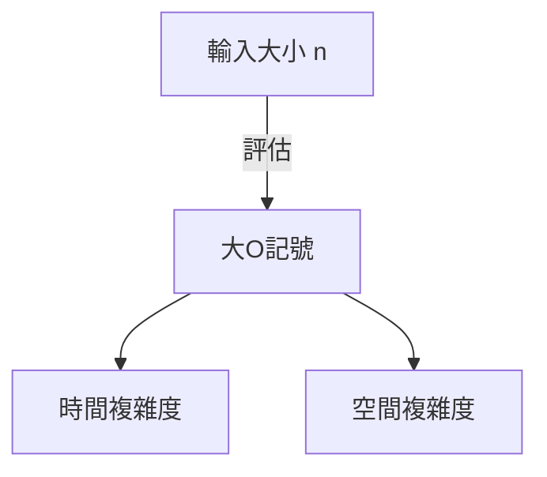

# 簡介

在學習程式設計時，理解演算法的效率是非常重要的。此時必然會出現的概念就是 **複雜度** （Complexity）。本文將從時間複雜度與空間複雜度的基礎開始，詳細解說大O記號（Big O Notation），並結合實例進行深入探討，以約兩萬字的篇幅進行徹底解說。

# 什麼是複雜度

用於評估演算法效能的指標就是複雜度。複雜度主要可以分為以下兩種：

1. **時間複雜度** (Time Complexity)
2. **空間複雜度** (Space Complexity)

## 1. 時間複雜度

時間複雜度是指演算法完成執行所需的「時間」或「步驟數」的指標。

## 2. 空間複雜度

空間複雜度是指演算法完成執行所需的「記憶體空間」的指標。

# 什麼是大O記號（Big O Notation）

大O記號（Big O Notation）是一種數學記號，用於表示當輸入大小 $n$ 變得足夠大時，複雜度增加比例的上限。

$$
O(f(n)) = \{ g(n) \mid \text{存在某個正常數 } c, n_0 \text{，對於所有 } n \ge n_0 \text{ 均滿足 } 0 \le g(n) \le c f(n) \}
$$

## 大O記號的基本規則

1. **忽略常數項** ：$O(2n)$ 會變成 $O(n)$。
2. **只保留影響最大的項** ：$O(n^2 + n)$ 會變成 $O(n^2)$。



# 具代表性的時間複雜度與 Python 實例

從這裡開始，我們將針對具代表性的大O記號類別，觀看詳細的解說與 Python 程式碼範例。

## 1. O(1) : 常數時間 (Constant Time)

無論輸入大小 $n$ 為何，總是能在固定的步驟數內完成處理的演算法。

```python
def get_first_element(arr):
    # 因為只是取得陣列的第一個元素，所以是 O(1)
    return arr[0] if arr else None
```

## 2. O(log n) : 對數時間 (Logarithmic Time)

隨著輸入大小 $n$ 的增加，執行時間也會增加，但增加的速度非常緩慢。具代表性的例子是二分搜尋法。

```python
def binary_search(arr, target):
    left, right = 0, len(arr) - 1
    while left <= right:
        mid = (left + right) // 2
        if arr[mid] == target:
            return mid
        elif arr[mid] < target:
            left = mid + 1
        else:
            right = mid - 1
    return -1
```

## 3. O(n) : 線性時間 (Linear Time)

執行時間與輸入大小 $n$ 成正比增加的演算法。

```python
def linear_search(arr, target):
    for i in range(len(arr)):
        if arr[i] == target:
            return i
    return -1
```

## 4. O(n log n) : 準線性時間 (Linearithmic Time)

O(n) 與 O(log n) 的乘積。許多有效率的比較排序演算法（合併排序、快速排序、堆積排序等）都具有這種複雜度。

```python
def merge_sort(arr):
    if len(arr) <= 1:
        return arr
    mid = len(arr) // 2
    left = merge_sort(arr[:mid])
    right = merge_sort(arr[mid:])
    return merge(left, right)

def merge(left, right):
    result = []
    i = j = 0
    while i < len(left) and j < len(right):
        if left[i] < right[j]:
            result.append(left[i])
            i += 1
        else:
            result.append(right[j])
            j += 1
    result.extend(left[i:])
    result.extend(right[j:])
    return result
```

## 5. O(n^2) : 二次時間 (Quadratic Time)

執行時間與輸入大小 $n$ 的平方成正比增加。氣泡排序或插入排序等簡單的排序演算法屬於此類。

```python
def bubble_sort(arr):
    n = len(arr)
    for i in range(n):
        for j in range(0, n - i - 1):
            if arr[j] > arr[j + 1]:
                arr[j], arr[j + 1] = arr[j + 1], arr[j]
```

## 6. O(2^n) : 指數時間 (Exponential Time)

輸入大小 $n$ 每增加 1，執行時間就會加倍。費氏數列的簡單遞迴實作等屬於此類。

```python
def fibonacci_recursive(n):
    if n <= 1:
        return n
    return fibonacci_recursive(n - 1) + fibonacci_recursive(n - 2)
```

## 7. O(n!) : 階乘時間 (Factorial Time)

執行時間與輸入大小的階乘成正比增加。旅行推銷員問題的全搜尋（暴力破解法）等屬於此類。

```python
import itertools

def traveling_salesperson_brute_force(distances):
    n = len(distances)
    cities = list(range(n))
    min_path = float('inf')
    
    for perm in itertools.permutations(cities):
        current_path = 0
        for i in range(n - 1):
            current_path += distances[perm[i]][perm[i+1]]
        current_path += distances[perm[-1]][perm[0]] # 返回
        if current_path < min_path:
            min_path = current_path
            
    return min_path
```

# 資料結構與複雜度

| 資料結構 | 存取 | 搜尋 | 插入 | 刪除 | 空間複雜度 |
|---|---|---|---|---|---|
| Array | $O(1)$ | $O(n)$ | $O(n)$ | $O(n)$ | $O(n)$ |
| Linked List | $O(n)$ | $O(n)$ | $O(1)$ | $O(1)$ | $O(n)$ |
| [Hash Table](https://kenji.blog/zh-tw/p/search-algorithms-linear-binary-hash-table-principles/) | - | $O(1)$ | $O(1)$ | $O(1)$ | $O(n)$ |
| BST | $O(\log n)$ | $O(\log n)$ | $O(\log n)$ | $O(\log n)$ | $O(n)$ |

# 排序演算法與複雜度

| 演算法 | 最佳 | 平均 | 最差 | 空間複雜度 |
|---|---|---|---|---|
| Bubble Sort | $O(n)$ | $O(n^2)$ | $O(n^2)$ | $O(1)$ |
| Merge Sort | $O(n \log n)$ | $O(n \log n)$ | $O(n \log n)$ | $O(n)$ |
| Quick Sort | $O(n \log n)$ | $O(n \log n)$ | $O(n^2)$ | $O(\log n)$ |


# 簡介

在學習程式設計時，理解演算法的效率是非常重要的。此時必然會出現的概念就是 **複雜度** （Complexity）。本文將從時間複雜度與空間複雜度的基礎開始，詳細解說大O記號（Big O Notation），並結合實例進行深入探討，以約兩萬字的篇幅進行徹底解說。

# 什麼是複雜度

用於評估演算法效能的指標就是複雜度。複雜度主要可以分為以下兩種：

1. **時間複雜度** (Time Complexity)
2. **空間複雜度** (Space Complexity)

## 1. 時間複雜度

時間複雜度是指演算法完成執行所需的「時間」或「步驟數」的指標。

## 1. 時間複雜度

時間複雜度是指演算法完成執行所需的「時間」或「步驟數」的指標。

## 1. 時間複雜度

時間複雜度是指演算法完成執行所需的「時間」或「步驟數」的指標。

## 1. 時間複雜度

時間複雜度是指演算法完成執行所需的「時間」或「步驟數」的指標。

## 1. 時間複雜度

時間複雜度是指演算法完成執行所需的「時間」或「步驟數」的指標。

## 1. 時間複雜度

時間複雜度是指演算法完成執行所需的「時間」或「步驟數」的指標。

## 1. 時間複雜度

時間複雜度是指演算法完成執行所需的「時間」或「步驟數」的指標。

## 7. O(n!) : 階乘時間 (Factorial Time)

執行時間與輸入大小的階乘成正比增加。旅行推銷員問題的全搜尋（暴力破解法）等屬於此類。

```python
import itertools

def traveling_salesperson_brute_force(distances):
    n = len(distances)
    cities = list(range(n))
    min_path = float('inf')
    
    for perm in itertools.permutations(cities):
        current_path = 0
        for i in range(n - 1):
            current_path += distances[perm[i]][perm[i+1]]
        current_path += distances[perm[-1]][perm[0]] # 返回
        if current_path < min_path:
            min_path = current_path
            
    return min_path
```

# 資料結構與複雜度

| 資料結構 | 存取 | 搜尋 | 插入 | 刪除 | 空間複雜度 |
|---|---|---|---|---|---|
| Array | $O(1)$ | $O(n)$ | $O(n)$ | $O(n)$ | $O(n)$ |
| Linked List | $O(n)$ | $O(n)$ | $O(1)$ | $O(1)$ | $O(n)$ |
| [Hash Table](https://kenji.blog/zh-tw/p/search-algorithms-linear-binary-hash-table-principles/) | - | $O(1)$ | $O(1)$ | $O(1)$ | $O(n)$ |
| BST | $O(\log n)$ | $O(\log n)$ | $O(\log n)$ | $O(\log n)$ | $O(n)$ |

# 排序演算法與複雜度

| 演算法 | 最佳 | 平均 | 最差 | 空間複雜度 |
|---|---|---|---|---|
| Bubble Sort | $O(n)$ | $O(n^2)$ | $O(n^2)$ | $O(1)$ |
| Merge Sort | $O(n \log n)$ | $O(n \log n)$ | $O(n \log n)$ | $O(n)$ |
| Quick Sort | $O(n \log n)$ | $O(n \log n)$ | $O(n^2)$ | $O(\log n)$ |

