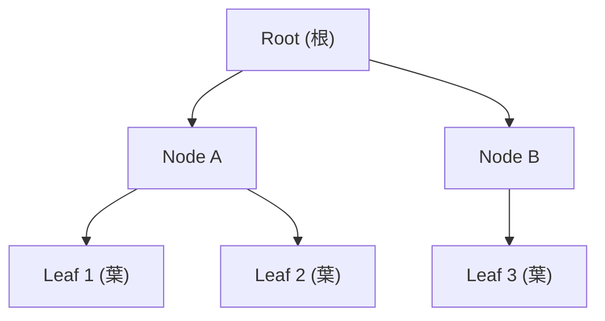

# 木構造とグラフ構造の探索（DFS, BFS, ダイクストラ法）完全ガイド

プログラミングやコンピュータサイエンスを学ぶ上で、データ構造とアルゴリズムの理解は避けて通れない非常に重要なテーマです。その中でも「木構造（Tree）」と「グラフ構造（Graph）」は、複雑なデータ間の関係性を表現するための強力なツールです。ファイルシステムやSNSのネットワーク、インターネットのルーティング、カーナビの経路探索など、我々の身の回りにある多くのシステムがこれらのデータ構造の上に成り立っています。

本記事では、木構造とグラフ構造の基本的な概念から出発し、その上を探索するための代表的なアルゴリズムである「深さ優先探索（DFS）」、「幅優先探索（BFS）」、そして最短経路問題の強力な解法である「ダイクストラ法（Dijkstra's Algorithm）」まで、Pythonのコード例を交えながらプロフェッショナルな視点で徹底的に解説します。

---

## 1. データ構造の基本：木構造とグラフ構造

まずは、探索の対象となるデータ構造そのものについて理解を深めましょう。

### 1.1 木構造（Tree Structure）
木構造は、データが階層状に配置されたデータ構造です。自然界の木を逆さまにしたような形をしているためこのように呼ばれます。

- **ノード（Node）**: 個々のデータを持つ要素です。
- **エッジ（Edge）**: ノードとノードを結ぶ「枝」です。関係性を示します。
- **根ノード（Root Node）**: ツリーの一番上に位置する、親を持たない唯一のノードです。
- **葉ノード（Leaf Node）**: 子を持たない、末端のノードです。

木構造は、フォルダの階層（ディレクトリ構造）やHTMLのDOMツリーなど、親子の包含関係があるデータを表現するのに最適です。すべての木は「閉路（ループ）を持たない無向グラフ、または有向グラフ」の一種とみなすこともできます。



### 1.2 グラフ構造（Graph Structure）
グラフ構造は、木構造をさらに一般化したものです。木構造のような「親から子へ」という厳密な階層ルールはなく、ノード同士が自由に結びつくことができます。これにより、より複雑で網目状のネットワークを表現できます。

- **無向グラフ（Undirected Graph）**: エッジに方向がなく、双方向に移動可能な関係です。（例：Facebookの友達関係）
- **有向グラフ（Directed Graph）**: エッジに方向がある関係です。（例：Twitterのフォロー関係やWebページのリンク）
- **重み付きグラフ（Weighted Graph）**: エッジに「重み（コストや距離）」が付与されたグラフです。（例：都市間の距離、道路の移動時間）

---

## 2. グラフ探索の基礎：DFS と BFS

グラフや木の中を探索し、目的のノードを見つけたり、全体を巡回したりする基本的なアルゴリズムとして、**深さ優先探索（DFS）**と**幅優先探索（BFS）**があります。

### 2.1 深さ優先探索（DFS: Depth-First Search）

深さ優先探索は、迷路を解くときの「とにかく行けるところまで深く進み、行き止まりにぶつかったら一つ戻って別の道を探す」というアプローチです。

**特徴と実装のポイント**
- データ構造として **スタック（Stack）** を使用します（後入れ先出し：LIFO）。
- プログラムの実装上は、スタックを明示的に使う代わりに、関数の **再帰呼び出し（Recursion）** を使うのが最もシンプルで直感的です。
- 全ての経路を探索したい場合や、バックトラッキング（条件を満たす解を探しつつ、ダメなら戻る処理）が必要な問題で威力を発揮します。

**Pythonによる実装例（再帰を用いたDFS）**
```python
def dfs(graph, start, visited=None):
    if visited is None:
        visited = set()
        
    # 現在のノードを訪問済みにする
    visited.add(start)
    print(f"Visited: {start}")
    
    # 隣接するノードを再帰的に探索
    for neighbor in graph[start]:
        if neighbor not in visited:
            dfs(graph, neighbor, visited)
            
    return visited

# グラフを隣接リストとして定義
adj_list = {
    'A': ['B', 'C'],
    'B': ['A', 'D', 'E'],
    'C': ['A', 'F'],
    'D': ['B'],
    'E': ['B', 'F'],
    'F': ['C', 'E']
}

print("=== DFSの実行結果 ===")
dfs(adj_list, 'A')
```
*解説*: 上記の実装では、隣接リストを用いてグラフを表現しています。再帰を用いることで、深いノードへ一気に潜り込む動きが実現されています。

### 2.2 幅優先探索（BFS: Breadth-First Search）

幅優先探索は、出発点から近いノードを円心状に、同じ深さのノードをすべて探索し終えてから、次の深さへと進むアプローチです。

**特徴と実装のポイント**
- データ構造として **キュー（Queue）** を使用します（先入れ先出し：FIFO）。
- 出発点からノードまでの「経由するエッジの数」が最小となる経路、すなわち **重みのないグラフにおける最短経路** を求めるのに非常に適しています。
- SNSでの「友達の友達」を探すような、階層順に検索したいケースに最適です。

**Pythonによる実装例**
```python
from collections import deque

def bfs(graph, start):
    visited = set([start])
    queue = deque([start])
    
    while queue:
        # キューの先頭からノードを取り出す
        current = queue.popleft()
        print(f"Visited: {current}")
        
        # 隣接する未訪問ノードをキューに追加
        for neighbor in graph[current]:
            if neighbor not in visited:
                visited.add(neighbor)
                queue.append(neighbor)

print("=== BFSの実行結果 ===")
bfs(adj_list, 'A')
```
*解説*: Pythonではリストをキューとして使うと先頭要素の取り出し(`pop(0)`)が O(N) と遅くなるため、標準ライブラリの `collections.deque` を使用します。これにより O(1) での要素取り出しが可能になります。

---

## 3. 最短経路問題：ダイクストラ法（Dijkstra's Algorithm）

BFSは「エッジの数が最も少ない経路」を見つけることはできますが、現実世界のカーナビゲーションのように、「道ごとに距離や移動時間（＝エッジの重み）が異なる」場合には対応できません。
ここで登場するのが、エドガー・ダイクストラによって考案された **ダイクストラ法** です。

### 3.1 ダイクストラ法のアルゴリズム
ダイクストラ法は、**「重みが非負（0以上）」**のグラフにおいて、単一の始点から他のすべての頂点への最短経路を求めるアルゴリズムです。

基本的なアイデアは以下の通りです。
1. 始点から各ノードへの「現時点で分かっている最短距離」を記録する表を用意し、始点を0、それ以外を無限大（∞）で初期化します。
2. 未確定のノードの中から、現在最も距離が短いノードを選び、「最短距離確定」とします。
3. 確定したノードから直接繋がっている隣接ノードへの距離を計算し、「現在の記録より短ければ更新（緩和 / Relaxation）」します。
4. 全てのノードが確定するまで、2〜3を繰り返します。

### 3.2 優先度付きキュー（Priority Queue）による最適化
「未確定のノードから最も距離が短いものを選ぶ」という処理を効率化するためには、**優先度付きキュー（ヒープ）** を用いるのが一般的です。これにより、毎回全ノードを走査することなく、高速に最小コストのノードを取り出すことができます。

**Pythonによるダイクストラ法の実装例**
```python
import heapq

def dijkstra(graph, start):
    # 各ノードへの最短距離を保存する辞書。初期値は無限大
    distances = {node: float('inf') for node in graph}
    distances[start] = 0
    
    # 優先度付きキュー [(距離, ノード)]
    priority_queue = [(0, start)]
    
    while priority_queue:
        # 最も距離が短いノードを取り出す
        current_distance, current_node = heapq.heappop(priority_queue)
        
        # 既により短い経路が見つかって処理済みの場合はスキップ
        if current_distance > distances[current_node]:
            continue
            
        # 隣接ノードを探索
        for neighbor, weight in graph[current_node].items():
            distance = current_distance + weight
            
            # 記録されている距離より短ければ更新
            if distance < distances[neighbor]:
                distances[neighbor] = distance
                heapq.heappush(priority_queue, (distance, neighbor))
                
    return distances

# 重み付き有向グラフの定義（隣接リストとエッジの重み）
weighted_graph = {
    'S': {'A': 5, 'B': 2},
    'A': {'C': 4, 'D': 2},
    'B': {'A': 8, 'D': 7},
    'C': {'D': 6, 'G': 3},
    'D': {'G': 1},
    'G': {}
}

print("=== ダイクストラ法の実行結果 ===")
shortest_paths = dijkstra(weighted_graph, 'S')
for node, distance in shortest_paths.items():
    print(f"始点Sから {node} への最短距離: {distance}")
```

*解説*: `heapq` モジュールを利用することで、優先度付きキューを簡単に実装できます。計算量は O((V + E) log V) （V: 頂点数, E: エッジ数）となり、大規模なグラフでも現実的な時間で計算が可能です。ただし、負の重みを持つエッジが存在する場合は、正しく計算できない（その場合はベルマン・フォード法などを利用する）点に注意してください。

---

## 4. 各アルゴリズムの比較と使い分け

これまでに紹介した3つのアルゴリズムの使い分けをまとめます。

| アルゴリズム | 探索の優先度 | 適切なデータ構造 | 主な用途・特徴 |
| --- | --- | --- | --- |
| **DFS** | 深さ優先 | スタック（または再帰） | 全探索、迷路の解法、パズル、トポロジカルソート。メモリ使用量がBFSより少ない場合が多い。 |
| **BFS** | 幅優先 | キュー | 階層的な探索、**重みなし**グラフの最短経路、SNSの友達のつながり範囲。 |
| **ダイクストラ法** | コスト（距離）優先 | 優先度付きキュー（ヒープ）| **重み付き**グラフの最短経路探索（※負の重みがない場合）。カーナビやネットワークルーティング。 |

現実のアプリケーション開発では、これらのアルゴリズムを基礎として、さらに発展させたもの（例えば、目的地の方向を考慮して探索を賢く絞り込む「A*（エースター）アルゴリズム」など）が使われることも多くあります。

## 5. おわりに

木構造やグラフ構造に対する探索アルゴリズムは、一見すると抽象的で難解に思えるかもしれません。しかし、DFS、BFS、ダイクストラ法という基本的なパーツをしっかりと理解し、自分の手で実装してみることで、世界中の複雑な情報網をプログラムで解き明かす感覚を掴むことができるはずです。

アルゴリズムの知識は特定の言語やフレームワークに依存しない、一生モノのスキルです。この記事が、あなたのコンピュータサイエンスへの理解を一段深くし、日々の開発や問題解決の強力な武器となることを願っています。ぜひお手元の環境でコードを動かし、独自のグラフを与えて挙動を確認してみてください！