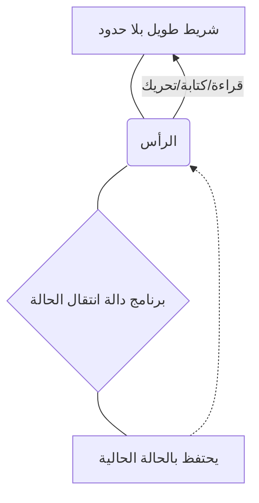
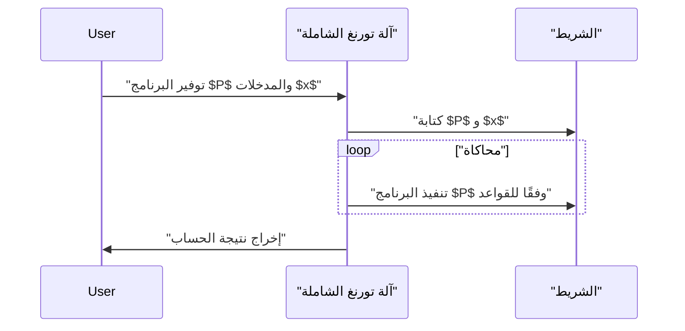

## 1. مقدمة: استكشاف حدود الحساب

تمتلك أجهزة الكمبيوتر التي نستخدمها يوميًا، من الهواتف الذكية إلى أجهزة الكمبيوتر العملاقة، قوة معالجة مذهلة. ومع ذلك، كيف تجيب على السؤال الأساسي: **"هل هناك أشياء لا يمكن للكمبيوتر القيام بها؟"**

من قدم إجابة رياضية كاملة على هذا السؤال هو عالم الرياضيات البريطاني وأبو علوم الكمبيوتر، **آلان تورنغ** (Alan Turing). في ورقة بحثية نُشرت عام 1936، ابتكر نموذجًا حسابيًا افتراضيًا يُعرف باسم **آلة تورنغ**، وأثبت وجود "مشاكل لا يمكن حلها من حيث المبدأ باستخدام أي كمبيوتر" في هذا العالم.

في هذا المقال، سنشرح بالتفصيل كيف تعمل آلة تورنغ، وما هي **"[مشكلة التوقف](/ar/p/halting-problem/)"**، التي تعتبر ذات أهمية قصوى في نظرية القابلية للحساب.

## 2. ما هي آلة تورنغ؟

آلة تورنغ هي نموذج رياضي يبسط مبادئ تشغيل أجهزة الكمبيوتر الحديثة إلى أقصى حد. إنها ليست آلة مادية، بل نتاج **تجربة فكرية**، ولكن جميع أجهزة الكمبيوتر الحديثة (أجهزة الكمبيوتر الكلاسيكية باستثناء أجهزة الكمبيوتر الكمومية) تمتلك أساسًا قوة حسابية تعادل آلة تورنغ هذه.

### 2.1 مكونات آلة تورنغ

تتكون آلة تورنغ من العناصر التالية:

1.  **شريط طويل بلا حدود**: مقسم إلى خلايا، وفي كل خلية يُكتب رمز (على سبيل المثال `0`، `1`، مسافة فارغة، إلخ). وهذا يعادل الذاكرة في أجهزة الكمبيوتر الحديثة.
2.  **الرأس**: جهاز يمكنه قراءة وكتابة خلايا معينة على الشريط والتحرك يسارًا ويمينًا.
3.  **سجل الحالة**: يتذكر **الحالة** ([State](https://kenji.blog/ar/p/iac-infrastructure-as-code-terraform/)) الحالية التي توجد عليها الآلة.
4.  **دالة انتقال الحالة**: قاعدة (برنامج) تحدد الرمز التالي المراد كتابته، واتجاه حركة الرأس (يمينًا أو يسارًا)، والحالة التالية بناءً على "الحالة" الحالية و "الرمز" الذي قرأه الرأس.

يوضح مخطط Mermaid التالي المفهوم التشغيلي لآلة تورنغ.



### 2.2 التعريف الرياضي لانتقال الحالة

تُعرّف آلة تورنغ $M$ رياضيًا على أنها مجموعة سباعية على النحو التالي:

$$
M = (Q, \Gamma, b, \Sigma, \delta, q_0, F)
$$

هنا، يمثل كل رمز ما يلي:
- $Q$ : مجموعة محدودة من الحالات
- $\Gamma$ : مجموعة محدودة من رموز الشريط
- $b \in \Gamma$ : رمز الفراغ (Blank)
- $\Sigma \subseteq \Gamma \setminus \{b\}$ : مجموعة رموز الإدخال
- $\delta : Q \times \Gamma \rightarrow Q \times \Gamma \times \{L, R\}$ : دالة انتقال الحالة
- $q_0 \in Q$ : الحالة الأولية
- $F \subseteq Q$ : مجموعة حالات التوقف (القبول)

كمثال لدالة الانتقال $\delta$، عندما تكون الحالة الحالية $q_1$ والرمز المقروء هو `0`، تتم كتابة الرمز `1`، ويتحرك الرأس إلى اليمين (Right)، وتتغير الحالة إلى $q_2$، يتم تمثيل ذلك على النحو التالي:

$$
\delta(q_1, 0) = (q_2, 1, R)
$$

### 2.3 محاكاة آلة تورنغ باستخدام Python

لفهم المفهوم بشكل أعمق، دعنا ننفذ آلة تورنغ بسيطة باستخدام Python. الكود التالي عبارة عن آلة تورنغ بسيطة تقوم بعكس الـ `0` الأخير في السلسلة الثنائية المدخلة إلى `1`.

```python
class TuringMachine:
    def __init__(self, tape, blank_symbol="B", initial_state="q0"):
        self.tape = list(tape)
        self.blank_symbol = blank_symbol
        self.head_position = 0
        self.current_state = initial_state
        self.transition_function = {}

    def add_transition(self, state, read_symbol, new_state, write_symbol, direction):
        self.transition_function[(state, read_symbol)] = (new_state, write_symbol, direction)

    def step(self):
        if self.head_position < 0:
            self.tape.insert(0, self.blank_symbol)
            self.head_position = 0
        if self.head_position >= len(self.tape):
            self.tape.append(self.blank_symbol)
            
        read_symbol = self.tape[self.head_position]
        action = self.transition_function.get((self.current_state, read_symbol))
        
        if action is None:
            return False # حالة التوقف

        new_state, write_symbol, direction = action
        self.tape[self.head_position] = write_symbol
        self.current_state = new_state
        
        if direction == 'R':
            self.head_position += 1
        elif direction == 'L':
            self.head_position -= 1
            
        return True

    def run(self):
        while self.step():
            pass
        return "".join(self.tape).replace(self.blank_symbol, "")

# إعداد الآلة
tm = TuringMachine("1010")
# الحالة q0: تحرك دائمًا لليمين، وإذا وجدت فراغًا انتقل إلى q1
tm.add_transition("q0", "0", "q0", "0", "R")
tm.add_transition("q0", "1", "q0", "1", "R")
tm.add_transition("q0", "B", "q1", "B", "L")
# الحالة q1: عد لليسار، غير أول 0 إلى 1 وتوقف (q_halt)
tm.add_transition("q1", "0", "q_halt", "1", "S") # S هو اتجاه وهمي يعني التوقف

print("الشريط الأولي:", "1010")
result = tm.run()
print("الشريط النهائي:", result)
```

بهذه الطريقة، من خلال مجموعة بسيطة جدًا من القواعد، يمكن إجراء عمليات السلاسل النصية والعمليات الحسابية.

## 3. آلة تورنغ الشاملة والقابلية للحساب

يتمثل أعظم إنجاز لآلة تورنغ في أنها أوجدت مفهوم **آلة تورنغ الشاملة** (Universal Turing Machine).

آلة تورنغ العادية لديها دوال انتقال حالة مبرمجة مسبقًا مخصصة لمهمة معينة (مثل الجمع، أو فرز السلاسل النصية). ومع ذلك، يمكن لآلة تورنغ الشاملة **"قراءة مخطط التصميم (البرنامج) لآلة تورنغ أخرى، وبيانات الإدخال الخاصة بها، في شريطها الخاص، ومحاكاة تلك الآلة"**.



هذه الفكرة بالضبط هي أساس **أجهزة الكمبيوتر الحديثة ذات البرنامج المخزن (هندسة فون نيومان)**. السبب وراء قدرتنا على أداء عمليات معالجة مختلفة ببساطة عن طريق تثبيت البرنامج دون تغيير الأجهزة ماديًا، هو أن أجهزة الكمبيوتر الحديثة تعمل كآلات تورنغ شاملة.

المهم هنا هو **القابلية للحساب** (Computability). وفقًا لتعريف تورنغ، "الدالة القابلة للحساب هي دالة يمكن حسابها بواسطة آلة تورنغ معينة" (وهذا ما يسمى بـ **أطروحة تشيرش-تورنغ**).

## 4. مشكلة التوقف (The Halting Problem)

مع وجود آلة تورنغ الشاملة، كان يُؤمل أن "أية عملية حسابية قد تصبح ممكنة اعتمادًا على البرنامج". ومع ذلك، أثبت تورنغ رياضيًا باستخدام نموذجه الخاص أن هناك **"مشاكل لا يمكن حسابها"**. المثال النموذجي على ذلك هو **[مشكلة التوقف](/ar/p/halting-problem/)**.

### 4.1 ما هي مشكلة التوقف؟

[مشكلة التوقف](/ar/p/halting-problem/) هي السؤال التالي:

> بالنظر إلى أي برنامج عشوائي $P$ والمدخلات $x$ لهذا البرنامج، عند تنفيذ البرنامج $P$ مع المدخلات $x$، **هل توجد خوارزمية (برنامج) تحدد قبل التنفيذ ما إذا كانت العملية الحسابية ستنتهي وتتوقف في غضون فترة زمنية محدودة، أو ستقع في حلقة لا نهائية ولن تتوقف أبدًا؟**

للوهلة الأولى، يبدو أنه يمكننا معرفة ذلك من خلال التحليل الثابت للكود. ومع ذلك، أثبت تورنغ أنه **"من المستحيل تمامًا وجود مثل هذا البرنامج الشامل للتحقق"**، باستخدام البرهان بالتناقض.

### 4.2 ملخص إثبات مشكلة التوقف

لنفترض وجود دالة خارقة `halts(program, input)` يمكنها تحديد تمامًا ما إذا كان البرنامج سيتوقف أم لا. بافتراض أن هذه الدالة تُرجع `True` إذا توقف البرنامج، و `False` إذا دخل في حلقة لا نهائية.

هنا، ننشئ برنامجًا خبيثًا `paradox(program)` على النحو التالي:

```python
def halts(program_code, input_data):
    # نفترض أن هذه الدالة موجودة (دالة سحرية)
    # تُرجع True إذا توقف، و False إذا لم يتوقف
    pass

def paradox(program_code):
    # تمرير نفسها إلى أداة التحقق
    if halts(program_code, program_code) == True:
        # إذا تم التحديد بأنه سيتوقف، ادخل عمدًا في حلقة لا نهائية
        while True:
            pass
    else:
        # إذا تم التحديد بأنه لن يتوقف، توقف فورًا
        return
```

الآن، ماذا سيحدث إذا أعطينا الكود الخاص بها `paradox` كمدخل لهذه الدالة `paradox` وقمنا بتشغيلها؟

```python
paradox(paradox)
```

1.  إذا حددت `halts(paradox, paradox)` بأن النتيجة `True` (سيتوقف):
    تدخل الدالة `paradox` في كتلة `if`، وتدخل في **حلقة لا نهائية**. أي أنها لن تتوقف. هذا يتناقض مع نتيجة التحقق.
2.  إذا حددت `halts(paradox, paradox)` بأن النتيجة `False` (حلقة لا نهائية):
    تدخل الدالة `paradox` في كتلة `else`، و **تتوقف فورًا**. هذا أيضًا يتناقض مع نتيجة التحقق.

نظرًا لأن التناقض ينشأ في كلتا الحالتين، فإن الافتراض الأولي بأن **"هناك دالة `halts` مثالية" كان خاطئًا**. وبالتالي، لا توجد خوارزمية لحل [مشكلة التوقف](/ar/p/halting-problem/).

### 4.3 التمثيل بالصيغ الرياضية

إذا عبرنا عن هذا الإثبات بترميز رياضي، فسيكون على النحو التالي.
لنفترض أن الدالة $h(p, i)$ هي دالة تُرجع $1$ إذا توقف البرنامج $p$ عند الإدخال $i$، و $0$ إذا لم يتوقف.

$$
h(p, i) = \begin{cases}
1 & \text{إذا توقف } p(i) \\
0 & \text{إذا استمر } p(i) \text{ في حلقة لا نهائية}
\end{cases}
$$

بعد ذلك، نحدد دالة $g$ على النحو التالي:

$$
g(p) = \begin{cases}
\text{حلقة لا نهائية} & \text{إذا كان } h(p, p) = 1 \\
0 & \text{إذا كان } h(p, p) = 0
\end{cases}
$$

الآن دعونا نفكر في $g(g)$ حيث يتم إعطاء $g$ لنفسها كمدخل لـ $g$.
- إذا كان $h(g, g) = 1$، فإن $g(g)$ تصبح حلقة لا نهائية (لا تتوقف)، مما يتناقض مع تعريف $h$.
- إذا كان $h(g, g) = 0$، فإن $g(g) = 0$ وتتوقف، مما يتناقض مع تعريف $h$.

يثبت هذا أن الدالة $h$ غير قابلة للحساب (Uncomputable).

## 5. تأثير نظرية القابلية للحساب

حقيقة أن [مشكلة التوقف](/ar/p/halting-problem/) "لا يمكن حلها" كان لها تأثير مباشر على تطوير البرمجيات الحديثة.

على سبيل المثال، تقوم المترجمات وأدوات تحليل الكود الثابت بالتحقق مما إذا كان هناك أخطاء في الكود أو إذا كان يقع في حلقة لا نهائية، لكنها تعمل تحت قيد أنه **"من المستحيل مبدئيًا اكتشاف الحلقات اللانهائية بدقة 100٪ لجميع البرامج"**. لذلك، تتبنى أدوات التحليل العملي حلولًا وسطية باستخدام الاستدلال (heuristics) والمهل الزمنية.

بالإضافة إلى ذلك، هناك علاقة عميقة مع **مبرهنة عدم الاكتمال لغودل**. في أنظمة المسلمات الرياضية، كانت حقيقة "وجود قضايا صحيحة ولكن لا يمكن إثباتها" و "وجود مشاكل قابلة للحساب ولكن لا يمكن تحديدها"، اكتشافات وجهين لعملة واحدة في المنطق وعلوم الكمبيوتر.

## 6. الخلاصة

آلة تورنغ هي نموذج رياضي جميل يجسد جوهر عملية الحساب بشكل مثالي على الرغم من بنيتها البسيطة جدًا.

-   تتكون **آلة تورنغ** فقط من شريط لا نهائي وقواعد انتقال الحالة، وتتمتع بنفس القدرة الحسابية مثل أجهزة الكمبيوتر الحديثة.
-   أوجدت **آلة تورنغ الشاملة** مفهوم البرمجيات (البرامج)، وأصبحت حجر الزاوية لأجهزة الكمبيوتر الحديثة.
-   أثبتت **[مشكلة التوقف](/ar/p/halting-problem/)** أنه "لا توجد خوارزمية عالمية يمكنها تحليل أي برنامج دائمًا"، وأوضحت حدود الحساب بشكل جلي.

في مناقشة تحديات البرمجة التي نواجهها يوميًا وإلى أين يمكن أن يصل تطور الذكاء الاصطناعي، فإن معرفة **"خط حدود الحساب"** الذي رسمه آلان تورنغ، يعتبر ثقافة عامة في غاية الأهمية.

(※ هذا المقال يهدف إلى شرح الخطوط العريضة لنظرية القابلية للحساب، وللحصول على أدلة رياضية دقيقة، يرجى الرجوع إلى الكتب المتخصصة.)
