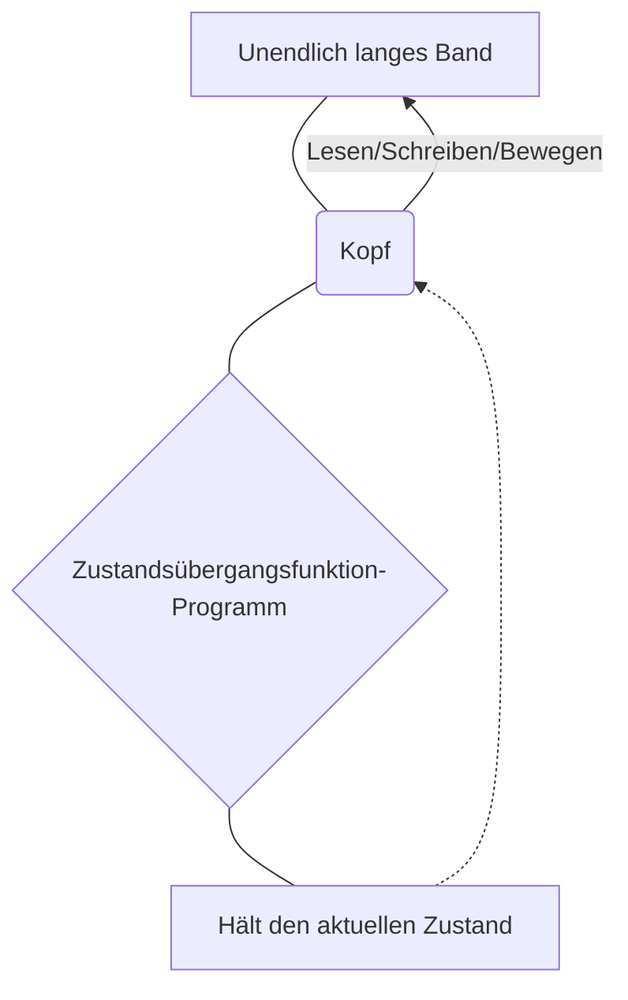
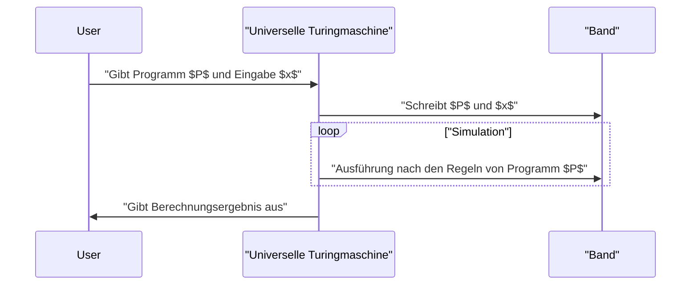

## 1. Einführung: Erkundung der Grenzen der Berechnung

Die Computer, die wir täglich nutzen, vom Smartphone bis zum Supercomputer, verfügen über eine erstaunliche Verarbeitungsleistung. Aber wie würden Sie auf die grundlegende Frage antworten: **„Gibt es Dinge, die Computer nicht tun können?“** 

Eine vollständige mathematische Antwort auf diese Frage gab der britische Mathematiker und Vater der Informatik, **Alan Turing**. In einer 1936 veröffentlichten Arbeit entwickelte er ein hypothetisches Berechnungsmodell namens **Turingmaschine** und bewies, dass es in dieser Welt „Probleme gibt, die prinzipiell von keinem Computer gelöst werden können“.

In diesem Artikel werden wir im Detail erklären, wie eine Turingmaschine funktioniert und was das **„Halteproblem“** ist, das in der Berechenbarkeitstheorie von außerordentlicher Bedeutung ist.

## 2. Was ist eine Turingmaschine?

Eine Turingmaschine ist ein mathematisches Modell, das die Funktionsprinzipien moderner Computer auf das Äußerste vereinfacht. Sie ist keine physische Maschine, sondern das Produkt eines **Gedankenexperiments** , aber alle modernen Computer (klassische Computer, Quantencomputer ausgenommen) haben im Wesentlichen die gleiche Rechenleistung wie diese Turingmaschine.

### 2.1 Komponenten einer Turingmaschine

Eine Turingmaschine besteht aus den folgenden Elementen:

1. **Unendlich langes Band** : Es ist in Zellen unterteilt, in die jeweils Symbole (z.B. `0`, `1`, Leerzeichen usw.) geschrieben werden. Dies entspricht dem Speicher in modernen Computern.
2. **Kopf** : Ein Gerät, das bestimmte Zellen auf dem Band lesen und schreiben und sich nach links und rechts bewegen kann.
3. **Zustandsregister** : Speichert den **Zustand** (State), in dem sich die Maschine derzeit befindet.
4. **Zustandsübergangsfunktion** : Eine Regel (Programm), die auf der Grundlage des aktuellen „Zustands“ und des vom Kopf gelesenen „Symbols“ das nächste zu schreibende Symbol, die Bewegungsrichtung des Kopfes (rechts oder links) und den nächsten Zustand bestimmt.

Das Folgende ist ein Mermaid-Diagramm, das das Betriebskonzept einer Turingmaschine zeigt.



### 2.2 Mathematische Definition von Zustandsübergängen

Eine Turingmaschine $M$ wird mathematisch als das folgende 7-Tupel definiert.

$$
M = (Q, \Gamma, b, \Sigma, \delta, q_0, F)
$$

Hier stellt jedes Symbol Folgendes dar:
- $Q$ : Endliche Menge von Zuständen
- $\Gamma$ : Endliche Menge von Bandsymbolen
- $b \in \Gamma$ : Leerzeichen-Symbol (Blank)
- $\Sigma \subseteq \Gamma \setminus \{b\}$ : Menge von Eingabesymbolen
- $\delta : Q \times \Gamma \rightarrow Q \times \Gamma \times \{L, R\}$ : Zustandsübergangsfunktion
- $q_0 \in Q$ : Anfangszustand
- $F \subseteq Q$ : Menge der Halte- (Akzeptanz-) Zustände

Als Beispiel für die Übergangsfunktion $\delta$, wenn der aktuelle Zustand $q_1$ ist und das gelesene Symbol `0` ist, das Symbol `1` geschrieben wird, der Kopf sich nach rechts (Right) bewegt und der Zustand in $q_2$ geändert wird, wird dies wie folgt ausgedrückt.

$$
\delta(q_1, 0) = (q_2, 1, R)
$$

### 2.3 Simulation einer Turingmaschine mit Python

Um das Konzept tiefer zu verstehen, lassen Sie uns eine einfache Turingmaschine in Python implementieren. Der folgende Code ist eine einfache Turingmaschine, die die angehängte `0` einer eingegebenen binären Zeichenfolge in eine `1` umwandelt.

```python
class TuringMachine:
    def __init__(self, tape, blank_symbol="B", initial_state="q0"):
        self.tape = list(tape)
        self.blank_symbol = blank_symbol
        self.head_position = 0
        self.current_state = initial_state
        self.transition_function = {}

    def add_transition(self, state, read_symbol, new_state, write_symbol, direction):
        self.transition_function[(state, read_symbol)] = (new_state, write_symbol, direction)

    def step(self):
        if self.head_position < 0:
            self.tape.insert(0, self.blank_symbol)
            self.head_position = 0
        if self.head_position >= len(self.tape):
            self.tape.append(self.blank_symbol)
            
        read_symbol = self.tape[self.head_position]
        action = self.transition_function.get((self.current_state, read_symbol))
        
        if action is None:
            return False # Haltezustand

        new_state, write_symbol, direction = action
        self.tape[self.head_position] = write_symbol
        self.current_state = new_state
        
        if direction == 'R':
            self.head_position += 1
        elif direction == 'L':
            self.head_position -= 1
            
        return True

    def run(self):
        while self.step():
            pass
        return "".join(self.tape).replace(self.blank_symbol, "")

# Setup der Maschine
tm = TuringMachine("1010")
# Zustand q0: Geht immer nach rechts, bei Leerzeichen zu q1 wechseln
tm.add_transition("q0", "0", "q0", "0", "R")
tm.add_transition("q0", "1", "q0", "1", "R")
tm.add_transition("q0", "B", "q1", "B", "L")
# Zustand q1: Geht nach links, ändert die erste 0 in 1 und hält an (q_halt)
tm.add_transition("q1", "0", "q_halt", "1", "S") # S ist eine Dummy-Richtung, die Halt bedeutet

print("Anfangsband:", "1010")
result = tm.run()
print("Endband:", result)
```

Auf diese Weise können Sie durch Kombination sehr einfacher Regeln Zeichenfolgen manipulieren und Berechnungen durchführen.

## 3. Die universelle Turingmaschine und Berechenbarkeit

Die größte Errungenschaft der Turingmaschine war die Schaffung des Konzepts der **Universellen Turingmaschine** (Universal Turing Machine).

Bei normalen Turingmaschinen ist die Zustandsübergangsfunktion fest codiert und auf eine bestimmte Aufgabe spezialisiert (z.B. Addition, Sortieren von Zeichenfolgen usw.). Eine universelle Turingmaschine kann jedoch **„den Bauplan (Programm) einer anderen Turingmaschine und deren Eingabedaten auf ihr eigenes Band lesen und diese Maschine simulieren“** .



Dies ist genau die Idee, die dem **modernen speicherprogrammierbaren Computer (Von-Neumann-Architektur)** zugrunde liegt. Der Grund, warum wir verschiedene Aufgaben ausführen können, indem wir einfach Software installieren, ohne die Hardware physisch zu ändern, ist, dass moderne PCs als universelle Turingmaschinen fungieren.

Wichtig hierbei ist die **Berechenbarkeit** (Computability). Laut Turings Definition gilt: „Eine berechenbare Funktion ist eine Funktion, die von einer Turingmaschine berechnet werden kann“ (dies wird als **Church-Turing-These** bezeichnet).

## 4. Das Halteproblem (The Halting Problem)

Mit der universellen Turingmaschine erwartete man: „Könnte nicht jede Berechnung durch ein Programm möglich gemacht werden?“. Turing nutzte jedoch sein eigenes Modell, um mathematisch zu beweisen, dass es **„unberechenbare Probleme“** gibt. Das prominenteste Beispiel ist das **Halteproblem**.

### 4.1 Was ist das Halteproblem?

Das Halteproblem ist folgende Frage:

> Gegeben sei ein beliebiges Programm $P$ und seine Eingabe $x$. Gibt es einen Algorithmus (Programm), der vor der Ausführung bestimmen kann, ob das Programm $P$ bei Eingabe $x$ **die Berechnung innerhalb einer endlichen Zeit beendet und hält, oder in eine Endlosschleife gerät und niemals hält?** 

Auf den ersten Blick scheint es, als könnte man das durch statische Code-Analyse herausfinden. Turing bewies jedoch durch einen Widerspruchsbeweis, dass **„ein solch allmächtiges Bestimmungsprogramm absolut nicht existiert“** .

### 4.2 Überblick über den Beweis des Halteproblems

Angenommen, es gibt eine gottähnliche Funktion `halts(program, input)`, die perfekt bestimmen kann, ob ein Programm hält oder nicht. Diese Funktion gibt `True` zurück, wenn das Programm hält, und `False`, wenn es in eine Endlosschleife gerät.

Hier erstellen wir folgendes bösartiges Programm `paradox(program)`.

```python
def halts(program_code, input_data):
    # Wir nehmen an, dass diese Funktion existiert (magische Funktion)
    # Gibt True zurück, wenn es hält, False, wenn es nicht hält
    pass

def paradox(program_code):
    # Übergibt sich selbst an den Prüfer
    if halts(program_code, program_code) == True:
        # Wenn festgestellt wird, dass es hält, absichtlich in eine Endlosschleife gehen
        while True:
            pass
    else:
        # Wenn festgestellt wird, dass es nicht hält, sofort anhalten
        return
```

Was passiert nun, wenn wir diese `paradox`-Funktion ausführen, indem wir ihren eigenen Code `paradox` als Eingabe übergeben?

```python
paradox(paradox)
```

1. Wenn `halts(paradox, paradox)` als `True` (hält) bestimmt wird:
   Die `paradox`-Funktion betritt den `if`-Block und gerät in eine **Endlosschleife**. Das heißt, sie hält nicht an. Dies widerspricht dem Bestimmungsergebnis.
2. Wenn `halts(paradox, paradox)` als `False` (Endlosschleife) bestimmt wird:
   Die `paradox`-Funktion betritt den `else`-Block und **hält sofort an**. Auch das widerspricht dem Bestimmungsergebnis.

Da in beiden Fällen ein Widerspruch entsteht, war die anfängliche Annahme, **„dass eine perfekte `halts`-Funktion existiert“, falsch**. Daher gibt es keinen Algorithmus, der das Halteproblem löst.

### 4.3 Mathematische Darstellung

Wenn dieser Beweis in mathematischer Notation ausgedrückt wird, sieht er wie folgt aus.
Sei die Funktion $h(p, i)$ eine Funktion, die $1$ zurückgibt, wenn das Programm $p$ bei der Eingabe $i$ hält, und $0$, wenn es nicht hält.

$$
h(p, i) = \begin{cases}
1 & \text{wenn } p(i) \text{ hält} \\\\
0 & \text{wenn } p(i) \text{ in einer Endlosschleife läuft}
\end{cases}
$$

Als nächstes definieren wir eine Funktion $g$ wie folgt:

$$
g(p) = \begin{cases}
\text{Endlosschleife} & \text{wenn } h(p, p) = 1 \\\\
0 & \text{wenn } h(p, p) = 0
\end{cases}
$$

Hier betrachten wir $g(g)$, bei dem wir $g$ sich selbst als Eingabe geben.
- Wenn $h(g, g) = 1$, gerät $g(g)$ in eine Endlosschleife (hält nicht), was der Definition von $h$ widerspricht.
- Wenn $h(g, g) = 0$, wird $g(g) = 0$ und hält, was der Definition von $h$ widerspricht.

Dadurch wird bewiesen, dass die Funktion $h$ unberechenbar (Uncomputable) ist.

## 5. Auswirkungen der Berechenbarkeitstheorie

Die Tatsache, dass das Halteproblem „ungelöst“ ist, hat direkte Auswirkungen auf die moderne Softwareentwicklung.

Beispielsweise prüfen Compiler und statische Code-Analyse-Tools, ob Code Fehler aufweist oder in Endlosschleifen gerät, aber diese arbeiten unter der Einschränkung, dass **„es prinzipiell unmöglich ist, Endlosschleifen für alle Programme 100% genau zu erkennen“** . Aus diesem Grund verwenden praktische Analyse-Tools Heuristiken und Timeouts als Kompromisslösung.

Es besteht auch eine tiefe Verbindung zu **Gödels Unvollständigkeitssatz**. Die Tatsache, dass in einem mathematischen Axiomensystem „Aussagen existieren, die wahr sind, aber nicht bewiesen werden können“, und dass „Probleme existieren, die berechenbar, aber nicht entscheidbar sind“, waren zwei Seiten derselben Medaille in der Entdeckung von Logik und Informatik.

## 6. Zusammenfassung

Obwohl die Turingmaschine eine sehr einfache Struktur hat, ist sie ein schönes mathematisches Modell, das das Wesen des Rechnens perfekt einfängt.

- Die **Turingmaschine** besteht nur aus einem unendlichen Band und Zustandsübergangsregeln und verfügt über die gleiche Rechenleistung wie moderne Computer.
- Die **Universelle Turingmaschine** schuf das Konzept der Software (Programme) und wurde zur Grundlage moderner Computer.
- Das **Halteproblem** bewies, dass „es keinen universellen Algorithmus gibt, der jedes Programm zuverlässig analysieren kann“, was die Grenzen der Berechnung klar aufzeigte.

Zu wissen, wo Alan Turing die **„Grenze der Berechnung“** gezogen hat, ist eine äußerst wichtige Bildung, wenn es um Programmierherausforderungen geht, denen wir täglich gegenüberstehen, oder um Diskussionen darüber, wie weit sich die KI entwickeln kann.

(*Dieser Artikel soll einen Überblick über die Berechenbarkeitstheorie geben. Für strenge mathematische Beweise ziehen Sie bitte Fachbücher zu Rate.*)
