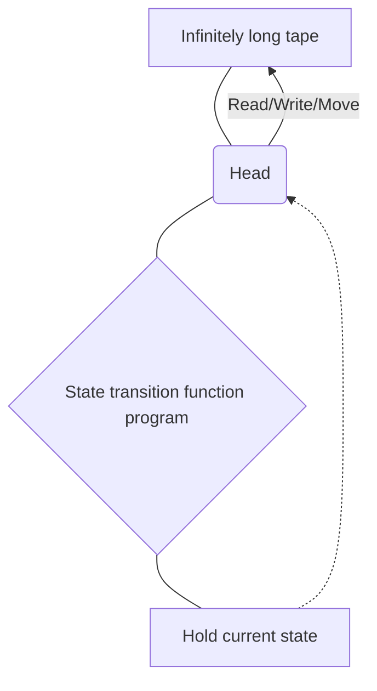
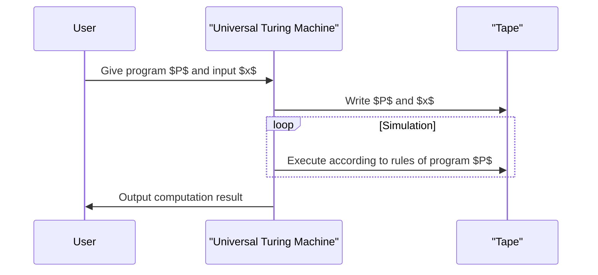

## 1. Introduction: Exploring the Limits of Computation

The computers we use on a daily basis, from smartphones to supercomputers, possess astonishing processing power. However, how would you answer the fundamental question: **"Are there things a computer cannot do?"**

A mathematically complete answer to this question was provided by the British mathematician and father of computer science, **Alan Turing**. In a paper published in 1936, he conceived a hypothetical computational model called the **Turing machine**, and proved that there are problems in this world that "cannot be solved in principle, no matter what kind of computer is used."

In this article, we will explain in detail how a Turing machine works and what the **"halting problem"**—which is extremely important in computability theory—actually is.

## 2. What is a Turing Machine?

A Turing machine is a mathematical model that simplifies the operating principles of modern computers to their absolute limits. It is not a physical machine, but rather the product of a **thought experiment**. However, all modern computers (classical computers, excluding quantum computers) possess computational capabilities that are inherently equivalent to this Turing machine.

### 2.1 Components of a Turing Machine

A Turing machine consists of the following elements:

1. **Infinitely long tape**: Divided into cells, where symbols (e.g., `0`, `1`, blank, etc.) are written in each cell. This corresponds to memory in a modern computer.
2. **Head**: A device that can read and write to a specific cell on the tape and move left or right.
3. **State register**: Remembers the current **state** of the machine.
4. **State transition function**: A rule (program) that determines the next symbol to write, the direction the head should move (right or left), and the next state, based on the current "state" and the "symbol" read by the head.

Below is a Mermaid diagram illustrating the conceptual operation of a Turing machine.



### 2.2 Mathematical Definition of State Transitions

A Turing machine $M$ is mathematically defined as the following 7-tuple:

$$
M = (Q, \Gamma, b, \Sigma, \delta, q_0, F)
$$

Here, each symbol represents the following:
- $Q$: A finite set of states
- $\Gamma$: A finite set of tape symbols
- $b \in \Gamma$: The blank symbol
- $\Sigma \subseteq \Gamma \setminus \{b\}$: The set of input symbols
- $\delta : Q \times \Gamma \rightarrow Q \times \Gamma \times \{L, R\}$: The state transition function
- $q_0 \in Q$: The initial state
- $F \subseteq Q$: The set of halting (accepting) states

As an example of the transition function $\delta$, if the current state is $q_1$, the read symbol is `0`, and we want to write the symbol `1`, move the head to the Right ($R$), and change the state to $q_2$, it would be represented as follows:

$$
\delta(q_1, 0) = (q_2, 1, R)
$$

### 2.3 Simulating a Turing Machine with Python

To gain a deeper understanding of the concept, let's implement a simple Turing machine in Python. The following code is a simple Turing machine that flips the trailing `0` of an input binary string to `1`.

```python
class TuringMachine:
    def __init__(self, tape, blank_symbol="B", initial_state="q0"):
        self.tape = list(tape)
        self.blank_symbol = blank_symbol
        self.head_position = 0
        self.current_state = initial_state
        self.transition_function = {}

    def add_transition(self, state, read_symbol, new_state, write_symbol, direction):
        self.transition_function[(state, read_symbol)] = (new_state, write_symbol, direction)

    def step(self):
        if self.head_position < 0:
            self.tape.insert(0, self.blank_symbol)
            self.head_position = 0
        if self.head_position >= len(self.tape):
            self.tape.append(self.blank_symbol)
            
        read_symbol = self.tape[self.head_position]
        action = self.transition_function.get((self.current_state, read_symbol))
        
        if action is None:
            return False # Halt state

        new_state, write_symbol, direction = action
        self.tape[self.head_position] = write_symbol
        self.current_state = new_state
        
        if direction == 'R':
            self.head_position += 1
        elif direction == 'L':
            self.head_position -= 1
            
        return True

    def run(self):
        while self.step():
            pass
        return "".join(self.tape).replace(self.blank_symbol, "")

# Machine setup
tm = TuringMachine("1010")
# State q0: Always move right, go to q1 if blank is found
tm.add_transition("q0", "0", "q0", "0", "R")
tm.add_transition("q0", "1", "q0", "1", "R")
tm.add_transition("q0", "B", "q1", "B", "L")
# State q1: Move left, change first 0 to 1 and halt (q_halt)
tm.add_transition("q1", "0", "q_halt", "1", "S") # S is a dummy direction meaning halt

print("Initial tape:", "1010")
result = tm.run()
print("Final tape:", result)
```

In this way, string manipulation and computation can be performed using combinations of very simple rules.

## 3. The Universal Turing Machine and Computability

The greatest achievement of the Turing machine is that it gave rise to the concept of the **Universal Turing Machine**.

A normal Turing machine has state transition functions hardcoded for specific tasks (like addition, sorting strings, etc.). However, a Universal Turing Machine can **"read the blueprint (program) of another Turing machine and its input data onto its own tape, and simulate that machine."**



This is precisely the foundational idea for **modern stored-program computers (von Neumann architecture)**. The reason we can perform various processes simply by installing software, without physically altering the hardware, is because modern PCs function as Universal Turing Machines.

What is important here is **computability**. According to Turing's definition, "A computable function is one that can be computed by some Turing machine" (this is called the **Church-Turing thesis**).

## 4. The Halting Problem

With the Universal Turing Machine, it was anticipated that "any computation might be possible depending on the program." However, Turing mathematically proved using his own model that **"uncomputable problems"** exist. The prime example of this is the **halting problem**.

### 4.1 What is the Halting Problem?

The halting problem asks the following question:

> Given an arbitrary program $P$ and an input $x$ for that program, **does there exist an algorithm (program) that can determine before execution whether running $P$ with input $x$ will finish computing and halt in finite time, or if it will fall into an infinite loop and never halt?**

At first glance, it seems like we might be able to figure this out by statically analyzing the code. However, Turing proved using proof by contradiction that **"such a universal decision program absolutely cannot exist."**

### 4.2 Overview of the Proof of the Halting Problem

Assume that there is a god-like function `halts(program, input)` that can perfectly determine whether a program halts or not. Suppose this function returns `True` if the program halts, and `False` if it loops infinitely.

Now, we create the following malicious program `paradox(program)`:

```python
def halts(program_code, input_data):
    # Assume this function exists (magic function)
    # Returns True if it halts, False if it doesn't
    pass

def paradox(program_code):
    # Put itself into the evaluator
    if halts(program_code, program_code) == True:
        # If it is evaluated to halt, intentionally loop infinitely
        while True:
            pass
    else:
        # If it is evaluated not to halt, halt immediately
        return
```

Now, what happens if we execute this `paradox` function, passing its own code `paradox` as input?

```python
paradox(paradox)
```

1. If `halts(paradox, paradox)` determines `True` (it halts):
   The `paradox` function enters the `if` block and falls into an **infinite loop**. Thus, it does not halt. This contradicts the evaluation result.
2. If `halts(paradox, paradox)` determines `False` (it infinitely loops):
   The `paradox` function enters the `else` block and **halts immediately**. This also contradicts the evaluation result.

Since a contradiction arises in either case, our initial assumption that **"a perfect `halts` function exists" must be incorrect**. Therefore, there is no algorithm to solve the halting problem.

### 4.3 Representation by Mathematical Formulas

Expressing this proof with mathematical notation yields the following.
Let function $h(p, i)$ be a function that returns $1$ if program $p$ halts with input $i$, and $0$ if it does not halt.

$$
h(p, i) = \begin{cases}
1 & \text{if } p(i) \text{ halts} \\\\
0 & \text{if } p(i) \text{ loops forever}
\end{cases}
$$

Next, we define a function $g$ as follows:

$$
g(p) = \begin{cases}
\text{loop forever} & \text{if } h(p, p) = 1 \\\\
0 & \text{if } h(p, p) = 0
\end{cases}
$$

Now, consider $g(g)$, which is giving $g$ itself as the input to $g$.
- If $h(g, g) = 1$, then $g(g)$ results in an infinite loop (does not halt), contradicting the definition of $h$.
- If $h(g, g) = 0$, then $g(g) = 0$ and it halts, contradicting the definition of $h$.

This proves that the function $h$ is uncomputable.

## 5. The Impact of Computability Theory

The fact that the halting problem is "unsolvable" has a direct impact on modern software development.

For example, compilers and static code analysis tools check for bugs or infinite loops in code, but these operate under the constraint that **"it is theoretically impossible to perfectly detect infinite loops for all programs with 100% accuracy."** Because of this, practical analysis tools compromise by using heuristics and timeouts.

There is also a deep connection with **Gödel's incompleteness theorems**. The discovery that "there are propositions that are true but unprovable" in an axiomatic system of mathematics, and that "there are problems that are computable but undecidable," were two sides of the same coin in logic and computer science.

## 6. Conclusion

The Turing machine is a beautifully mathematical model that, despite its very simple structure, perfectly captures the essence of the act of computation.

- The **Turing machine** consists only of an infinite tape and state transition rules, yet possesses computational power equivalent to a modern computer.
- The **Universal Turing Machine** gave rise to the concept of software (programs) and became the cornerstone of modern computers.
- The **halting problem** proved that "there is no universal algorithm capable of analyzing every program," clearly showing the limits of computation.

In discussing the programming challenges we face every day or how far the evolution of AI can reach, knowing the **"limits of computation"** drawn by Alan Turing is an extremely important piece of knowledge.

(*This article is intended to provide an overview of computability theory; for rigorous mathematical proofs, please refer to specialized books.*)
