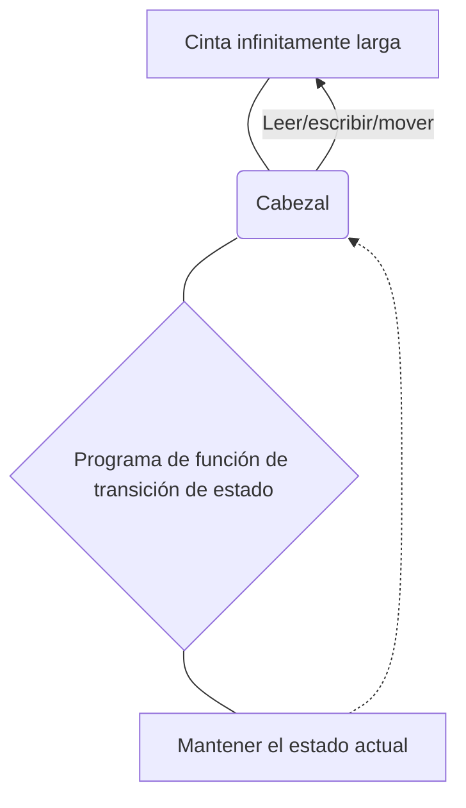
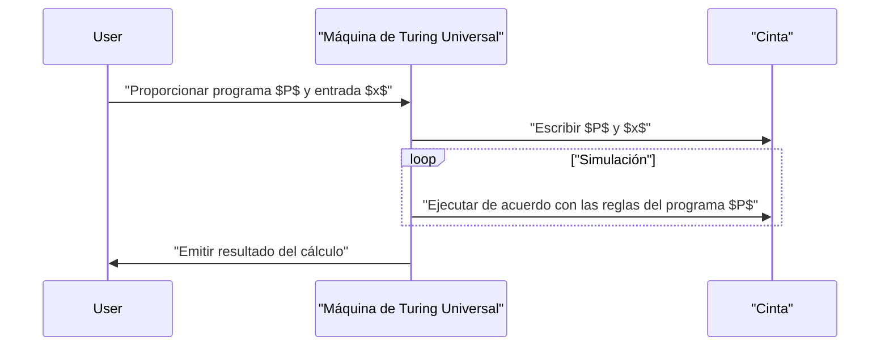

## 1. Introducción: Explorando los límites de la computación

Las computadoras que usamos a diario, desde los teléfonos inteligentes hasta las supercomputadoras, tienen una potencia de procesamiento asombrosa. Sin embargo, ¿cómo responderías a la pregunta fundamental: **"¿Hay cosas que las computadoras no pueden hacer?"**?

Quien proporcionó una respuesta matemáticamente completa a esta pregunta fue el matemático británico y padre de la informática, **Alan Turing**. En un artículo publicado en 1936, ideó un modelo computacional virtual llamado **máquina de Turing** y demostró que existen "problemas que, en principio, no pueden resolverse con ninguna computadora" en este mundo.

En este artículo, explicaremos en detalle cómo funciona la máquina de Turing y qué es el **"problema de la parada"** (Halting problem), el cual es extremadamente importante en la teoría de la computabilidad.

## 2. ¿Qué es una máquina de Turing?

Una máquina de Turing es un modelo matemático que simplifica los principios de funcionamiento de las computadoras modernas al límite. No es una máquina física, sino un producto de un **experimento mental**, pero todas las computadoras modernas (computadoras clásicas, excluyendo las computadoras cuánticas) tienen esencialmente el mismo poder de cálculo que esta máquina de Turing.

### 2.1 Componentes de una máquina de Turing

Una máquina de Turing consta de los siguientes elementos:

1.  **Cinta infinitamente larga** : Está dividida en celdas, y en cada celda se escribe un símbolo (por ejemplo, `0`, `1`, espacio en blanco, etc.). Esto equivale a la memoria en una computadora moderna.
2.  **Cabezal** : Es un dispositivo que puede leer y escribir celdas específicas en la cinta y moverse hacia la izquierda y hacia la derecha.
3.  **Registro de estado** : Recuerda el **estado** (State) actual en el que se encuentra la máquina.
4.  **Función de transición de estado** : Son reglas (programa) que determinan el siguiente símbolo a escribir, la dirección de movimiento del cabezal (derecha o izquierda) y el siguiente estado en función del "estado" actual y el "símbolo" leído por el cabezal.

A continuación, se muestra un diagrama Mermaid que ilustra el concepto operativo de una máquina de Turing.



### 2.2 Definición matemática de la transición de estado

Una máquina de Turing $M$ se define matemáticamente como una tupla de 7 elementos:

$$
M = (Q, \Gamma, b, \Sigma, \delta, q_0, F)
$$

Aquí, cada símbolo representa lo siguiente:
- $Q$ : Conjunto finito de estados
- $\Gamma$ : Conjunto finito de símbolos de la cinta
- $b \in \Gamma$ : Símbolo en blanco (Blank)
- $\Sigma \subseteq \Gamma \setminus \{b\}$ : Conjunto de símbolos de entrada
- $\delta : Q \times \Gamma \rightarrow Q \times \Gamma \times \{L, R\}$ : Función de transición de estado
- $q_0 \in Q$ : Estado inicial
- $F \subseteq Q$ : Conjunto de estados de parada (aceptación)

Como ejemplo de la función de transición $\delta$, si el estado actual es $q_1$ y el símbolo leído es `0`, y se quiere escribir el símbolo `1`, mover el cabezal hacia la derecha (Right) y cambiar el estado a $q_2$, se expresaría de la siguiente manera:

$$
\delta(q_1, 0) = (q_2, 1, R)
$$

### 2.3 Simulación de una máquina de Turing en Python

Para comprender el concepto más profundamente, implementemos una máquina de Turing simple en Python. El siguiente código es una máquina de Turing sencilla que invierte el `0` al final de una cadena binaria de entrada a `1`.

```python
class TuringMachine:
    def __init__(self, tape, blank_symbol="B", initial_state="q0"):
        self.tape = list(tape)
        self.blank_symbol = blank_symbol
        self.head_position = 0
        self.current_state = initial_state
        self.transition_function = {}

    def add_transition(self, state, read_symbol, new_state, write_symbol, direction):
        self.transition_function[(state, read_symbol)] = (new_state, write_symbol, direction)

    def step(self):
        if self.head_position < 0:
            self.tape.insert(0, self.blank_symbol)
            self.head_position = 0
        if self.head_position >= len(self.tape):
            self.tape.append(self.blank_symbol)
            
        read_symbol = self.tape[self.head_position]
        action = self.transition_function.get((self.current_state, read_symbol))
        
        if action is None:
            return False # Estado de detención

        new_state, write_symbol, direction = action
        self.tape[self.head_position] = write_symbol
        self.current_state = new_state
        
        if direction == 'R':
            self.head_position += 1
        elif direction == 'L':
            self.head_position -= 1
            
        return True

    def run(self):
        while self.step():
            pass
        return "".join(self.tape).replace(self.blank_symbol, "")

# Configuración de la máquina
tm = TuringMachine("1010")
# Estado q0: siempre avanza a la derecha, si encuentra un espacio en blanco pasa a q1
tm.add_transition("q0", "0", "q0", "0", "R")
tm.add_transition("q0", "1", "q0", "1", "R")
tm.add_transition("q0", "B", "q1", "B", "L")
# Estado q1: vuelve a la izquierda, cambia el primer 0 a 1 y se detiene (q_halt)
tm.add_transition("q1", "0", "q_halt", "1", "S") # S es una dirección ficticia que significa detenerse

print("Cinta inicial:", "1010")
result = tm.run()
print("Cinta final:", result)
```

De esta manera, se pueden realizar manipulaciones y cálculos de cadenas combinando reglas muy simples.

## 3. Máquina de Turing Universal y computabilidad

El mayor logro de la máquina de Turing es haber creado el concepto de la **máquina de Turing Universal** (Universal Turing Machine).

Una máquina de Turing normal tiene su función de transición de estado programada (hardcoded) para especializarse en una tarea específica (como sumar o clasificar cadenas). Sin embargo, una máquina de Turing universal puede **"leer el plano (programa) de otra máquina de Turing y sus datos de entrada en su propia cinta y simular esa máquina"**.



Esta es exactamente la idea base de las **computadoras modernas de programa almacenado (arquitectura de von Neumann)**. La razón por la que podemos realizar diversas tareas simplemente instalando software sin modificar físicamente el hardware es porque las PC modernas funcionan como máquinas de Turing universales.

Lo importante aquí es la **computabilidad** (Computability). Según la definición de Turing, "una función computable es una función que puede ser calculada por alguna máquina de Turing" (a esto se le llama la **tesis de Church-Turing**).

## 4. El problema de la parada (The Halting Problem)

Con la máquina de Turing universal, se esperaba que "¿no sería posible cualquier cálculo si depende del programa?". Sin embargo, utilizando su propio modelo, Turing demostró matemáticamente que existen **"problemas incomputables"**. El ejemplo más representativo es el **problema de la parada**.

### 4.1 ¿Qué es el problema de la parada?

El problema de la parada es la siguiente pregunta:

> Dada cualquier programa $P$ y su entrada $x$, cuando el programa $P$ se ejecuta con la entrada $x$, **¿existe un algoritmo (programa) que pueda determinar antes de la ejecución si terminará y se detendrá en un tiempo finito, o si caerá en un bucle infinito y nunca se detendrá?**

A primera vista, parece que podríamos saberlo realizando un análisis estático del código. Sin embargo, Turing demostró por reducción al absurdo que **"tal programa de evaluación universal absolutamente no existe"**.

### 4.2 Resumen de la demostración del problema de la parada

Supongamos que existe una función divina `halts(program, input)` que puede determinar perfectamente si un programa se detendrá o no. Supongamos que esta función devuelve `True` si el programa se detiene, y `False` si entra en un bucle infinito.

Aquí, creamos el siguiente programa malicioso `paradox(program)`:

```python
def halts(program_code, input_data):
    # Se asume que esta función existe (función mágica)
    # Devuelve True si se detiene, False si no se detiene
    pass

def paradox(program_code):
    # Pasa a sí mismo por el evaluador
    if halts(program_code, program_code) == True:
        # Si se determina que se detiene, entra en un bucle infinito a propósito
        while True:
            pass
    else:
        # Si se determina que no se detiene, se detiene de inmediato
        return
```

Ahora, ¿qué sucederá si le damos a esta función `paradox` su propio código `paradox` como entrada y la ejecutamos?

```python
paradox(paradox)
```

1.  Si `halts(paradox, paradox)` evalúa a `True` (se detiene):
    La función `paradox` entra en el bloque `if` y entra en un **bucle infinito**. Es decir, no se detiene. Esto contradice el resultado de la evaluación.
2.  Si `halts(paradox, paradox)` evalúa a `False` (bucle infinito):
    La función `paradox` entra en el bloque `else` y **se detiene de inmediato**. Esto también contradice el resultado de la evaluación.

Pase lo que pase, surge una contradicción, lo que significa que la suposición inicial de que **"existe una función `halts` perfecta" era incorrecta**. Por lo tanto, no existe un algoritmo que resuelva el problema de la parada.

### 4.3 Expresión mediante fórmulas matemáticas

Al expresar esta demostración en notación matemática, se obtiene lo siguiente.
Sea $h(p, i)$ una función que devuelve $1$ si el programa $p$ se detiene con la entrada $i$, y $0$ si no se detiene.

$$
h(p, i) = \begin{cases}
1 & \text{si } p(i) \text{ se detiene} \\\\
0 & \text{si } p(i) \text{ entra en un bucle infinito}
\end{cases}
$$

A continuación, definimos la función $g$ de la siguiente manera:

$$
g(p) = \begin{cases}
\text{entra en un bucle infinito} & \text{si } h(p, p) = 1 \\\\
0 & \text{si } h(p, p) = 0
\end{cases}
$$

Ahora consideramos $g(g)$, donde pasamos $g$ a sí mismo como entrada a $g$.
- Si $h(g, g) = 1$, entonces $g(g)$ se convierte en un bucle infinito (no se detiene), lo que contradice la definición de $h$.
- Si $h(g, g) = 0$, entonces $g(g) = 0$ y se detiene, lo que contradice la definición de $h$.

A través de esto, se demuestra que la función $h$ es incomputable (Uncomputable).

## 5. El impacto de la teoría de la computabilidad

El hecho de que el problema de la parada sea "irresoluble" tiene un impacto directo en el desarrollo de software moderno.

Por ejemplo, los compiladores y las herramientas de análisis de código estático verifican si hay errores en el código o si caen en bucles infinitos, pero operan bajo la restricción de que **"es en principio imposible detectar bucles infinitos con 100% de precisión para todos los programas"**. Por lo tanto, las herramientas de análisis prácticas adoptan compromisos utilizando heurísticas y tiempos de espera (timeouts).

Además, existe una profunda relación con los **teoremas de incompletitud de Gödel**. En el sistema de axiomas de las matemáticas, el hecho de que "existan proposiciones que son verdaderas pero no demostrables" y que "existan problemas que son computables pero indecidibles" son descubrimientos que representan dos caras de la misma moneda en la lógica y la informática.

## 6. Conclusión

A pesar de su estructura extremadamente simple, la máquina de Turing es un hermoso modelo matemático que captura a la perfección la esencia del acto de computar.

-   La **máquina de Turing** consiste únicamente en una cinta infinita y reglas de transición de estado, y tiene una potencia de cálculo equivalente a la de las computadoras modernas.
-   La **máquina de Turing Universal** dio origen al concepto de software (programa) y se convirtió en la piedra angular de las computadoras modernas.
-   El **problema de la parada** demostró que "no existe un algoritmo universal que siempre pueda analizar cualquier programa", mostrando claramente los límites de la computación.

Al enfrentarnos a los desafíos de programación diarios y en las discusiones sobre hasta dónde puede llegar la evolución de la IA, conocer la **"línea límite de la computación"** trazada por Alan Turing puede considerarse una cultura general extremadamente importante.

(*Este artículo explica una descripción general de la teoría de la computabilidad; para demostraciones matemáticas rigurosas, consulte literatura especializada.)
