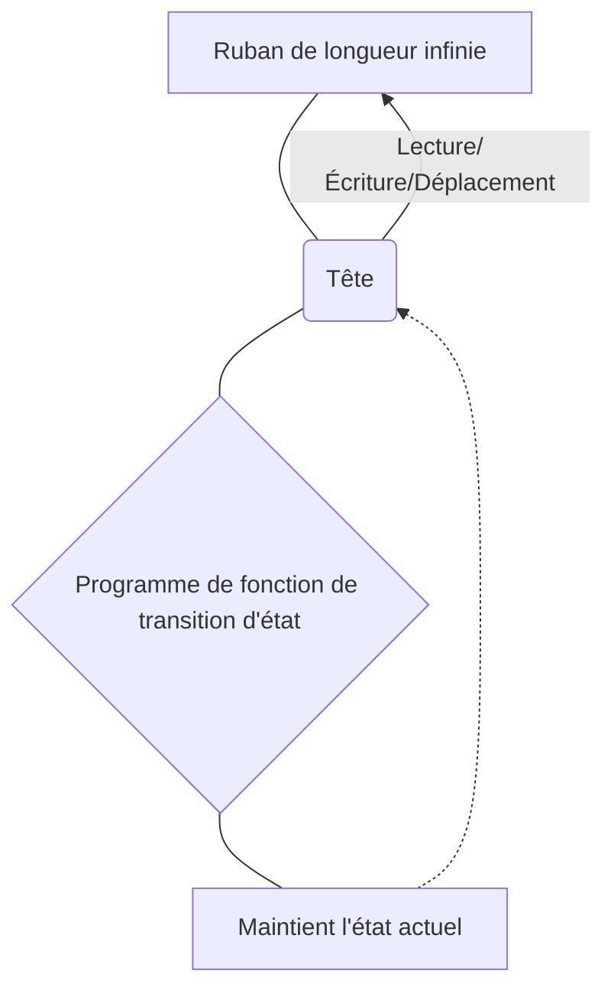
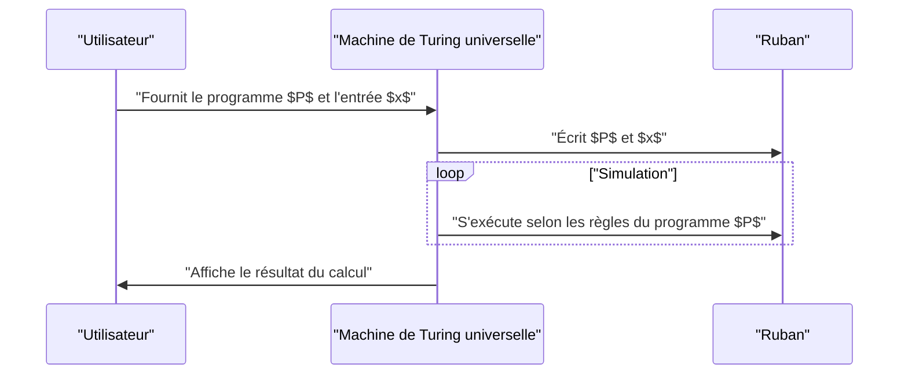

## 1. Introduction : Explorer les limites du calcul

Les ordinateurs que nous utilisons quotidiennement, des smartphones aux supercalculateurs, possèdent une puissance de traitement incroyable. Cependant, comment répondriez-vous à cette question fondamentale : **« Y a-t-il des choses qu'un ordinateur ne peut pas faire ? »**

C'est le mathématicien britannique et père de l'informatique, **Alan Turing**, qui a apporté une réponse mathématique complète à cette question. Dans un article publié en 1936, il a inventé un modèle de calcul virtuel appelé la **machine de Turing** et a prouvé qu'il existe dans ce monde des « problèmes qui ne peuvent en principe être résolus par aucun ordinateur ».

Dans cet article, nous expliquerons en détail le fonctionnement de la machine de Turing et ce qu'est le **« problème de l'arrêt »**, qui est extrêmement important dans la théorie de la calculabilité.

## 2. Qu'est-ce qu'une machine de Turing ?

La machine de Turing est un modèle mathématique qui simplifie à l'extrême les principes de fonctionnement des ordinateurs modernes. Il ne s'agit pas d'une machine physique, mais d'un produit d'une **expérience de pensée**, mais tous les ordinateurs modernes (les ordinateurs classiques à l'exception des ordinateurs quantiques) ont essentiellement la même capacité de calcul que cette machine de Turing.

### 2.1 Composants d'une machine de Turing

Une machine de Turing se compose des éléments suivants :

1.  **Ruban de longueur infinie** : Divisé en cellules, et chaque cellule est inscrite avec un symbole (par exemple, `0`, `1`, espace, etc.). Cela correspond à la mémoire des ordinateurs modernes.
2.  **Tête** : Un appareil qui peut lire et écrire sur des cellules spécifiques du ruban et se déplacer vers la gauche et la droite.
3.  **Registre d'état** : Mémorise l'**état** ([State](https://kenji.blog/fr/p/iac-infrastructure-as-code-terraform/)) actuel dans lequel se trouve la machine.
4.  **Fonction de transition d'état** : Une règle (programme) qui détermine le prochain symbole à écrire, la direction du mouvement de la tête (droite ou gauche), et l'état suivant, en fonction de l'« état » actuel et du « symbole » lu par la tête.

Voici un diagramme Mermaid montrant le concept de fonctionnement de la machine de Turing :



### 2.2 Définition mathématique de la transition d'état

La machine de Turing $M$ est mathématiquement définie par le tuple de 7 éléments suivant :

$$
M = (Q, \Gamma, b, \Sigma, \delta, q_0, F)
$$

Où chaque symbole représente ce qui suit :
- $Q$ : Ensemble fini d'états
- $\Gamma$ : Ensemble fini de symboles du ruban
- $b \in \Gamma$ : Symbole d'espace (Blank)
- $\Sigma \subseteq \Gamma \setminus \{b\}$ : Ensemble de symboles d'entrée
- $\delta : Q \times \Gamma \rightarrow Q \times \Gamma \times \{L, R\}$ : Fonction de transition d'état
- $q_0 \in Q$ : État initial
- $F \subseteq Q$ : Ensemble d'états d'arrêt (acceptation)

Comme exemple de la fonction de transition $\delta$, lorsque l'état actuel est $q_1$ et le symbole lu est `0`, pour écrire le symbole `1`, déplacer la tête vers la droite (Right), et changer l'état en $q_2$, cela s'exprime comme suit :

$$
\delta(q_1, 0) = (q_2, 1, R)
$$

### 2.3 Simulation d'une machine de Turing en Python

Pour comprendre le concept plus en profondeur, implémentons une machine de Turing simple en Python. Le code suivant est une machine de Turing simple qui inverse le `0` à la fin d'une chaîne binaire entrée en `1`.

```python
class TuringMachine:
    def __init__(self, tape, blank_symbol="B", initial_state="q0"):
        self.tape = list(tape)
        self.blank_symbol = blank_symbol
        self.head_position = 0
        self.current_state = initial_state
        self.transition_function = {}

    def add_transition(self, state, read_symbol, new_state, write_symbol, direction):
        self.transition_function[(state, read_symbol)] = (new_state, write_symbol, direction)

    def step(self):
        if self.head_position < 0:
            self.tape.insert(0, self.blank_symbol)
            self.head_position = 0
        if self.head_position >= len(self.tape):
            self.tape.append(self.blank_symbol)
            
        read_symbol = self.tape[self.head_position]
        action = self.transition_function.get((self.current_state, read_symbol))
        
        if action is None:
            return False # État d'arrêt

        new_state, write_symbol, direction = action
        self.tape[self.head_position] = write_symbol
        self.current_state = new_state
        
        if direction == 'R':
            self.head_position += 1
        elif direction == 'L':
            self.head_position -= 1
            
        return True

    def run(self):
        while self.step():
            pass
        return "".join(self.tape).replace(self.blank_symbol, "")

# Configuration de la machine
tm = TuringMachine("1010")
# État q0 : Toujours avancer vers la droite, et aller à q1 si un espace est trouvé
tm.add_transition("q0", "0", "q0", "0", "R")
tm.add_transition("q0", "1", "q0", "1", "R")
tm.add_transition("q0", "B", "q1", "B", "L")
# État q1 : Retourner à gauche, changer le premier 0 en 1 et s'arrêter (q_halt)
tm.add_transition("q1", "0", "q_halt", "1", "S") # S est une direction factice signifiant l'arrêt

print("Ruban initial :", "1010")
result = tm.run()
print("Ruban final :", result)
```

Ainsi, par la combinaison de règles très simples, il est possible d'effectuer des manipulations de chaînes et des calculs.

## 3. Machine de Turing universelle et calculabilité

La plus grande réalisation de la machine de Turing est d'avoir donné naissance au concept de la **machine de Turing universelle** (Universal Turing Machine).

Une machine de Turing normale a une fonction de transition d'état codée en dur (hardcodée) spécialisée pour une tâche spécifique (faire des additions, trier des chaînes de caractères, etc.). Cependant, une machine de Turing universelle peut **« lire le plan de conception (programme) d'une autre machine de Turing et ses données d'entrée sur son propre ruban, et simuler cette machine »**.



C'est précisément l'idée fondamentale de l'**ordinateur à architecture de programme enregistré moderne (architecture de von Neumann)**. Si nous pouvons effectuer divers traitements simplement en installant un logiciel sans modifier physiquement le matériel, c'est parce que les PC modernes fonctionnent comme des machines de Turing universelles.

Ce qui est important ici est la **calculabilité** (Computability). Selon la définition de Turing, « une fonction calculable est une fonction qui peut être calculée par une machine de Turing » (cela s'appelle la **thèse de Church-Turing**).

## 4. Le problème de l'arrêt (The Halting Problem)

Avec la machine de Turing universelle, on s'attendait à ce que « n'importe quel calcul devienne possible selon le programme ». Cependant, Turing, en utilisant son propre modèle, a prouvé mathématiquement qu'il existe des **« problèmes non calculables »**. L'exemple le plus représentatif est le **problème de l'arrêt**.

### 4.1 Qu'est-ce que le problème de l'arrêt ?

Le problème de l'arrêt est la question suivante :

> Étant donné un programme arbitraire $P$ et son entrée $x$, si le programme $P$ est exécuté avec l'entrée $x$, **existe-t-il un algorithme (programme) qui détermine avant l'exécution si le calcul se terminera et s'arrêtera dans un temps fini, ou s'il tombera dans une boucle infinie et ne s'arrêtera jamais ?**

À première vue, il semble que cela pourrait être compris par une analyse statique du code. Cependant, Turing a prouvé par l'absurde qu'**« un tel programme de jugement universel n'existe absolument pas »**.

### 4.2 Aperçu de la preuve du problème de l'arrêt

Supposons qu'il existe une fonction divine `halts(program, input)` qui peut déterminer de manière exhaustive si un programme s'arrête ou non. Supposons que cette fonction renvoie `True` si le programme s'arrête, et `False` s'il boucle indéfiniment.

Ici, nous créons un programme malveillant `paradox(program)` comme suit.

```python
def halts(program_code, input_data):
    # Nous supposons que cette fonction existe (fonction magique)
    # Renvoie True si ça s'arrête, False si ça ne s'arrête pas
    pass

def paradox(program_code):
    # Se soumettre soi-même à l'évaluateur
    if halts(program_code, program_code) == True:
        # S'il est déterminé que cela s'arrête, faire exprès une boucle infinie
        while True:
            pass
    else:
        # S'il est déterminé que cela ne s'arrête pas, s'arrêter immédiatement
        return
```

Maintenant, que se passe-t-il si nous donnons à cette fonction `paradox` son propre code `paradox` comme entrée et l'exécutons ?

```python
paradox(paradox)
```

1.  Si `halts(paradox, paradox)` évalue à `True` (s'arrête) :
    La fonction `paradox` entre dans le bloc `if` et effectue une **boucle infinie**. C'est-à-dire qu'elle ne s'arrête pas. Cela contredit le résultat de l'évaluation.
2.  Si `halts(paradox, paradox)` évalue à `False` (boucle infinie) :
    La fonction `paradox` entre dans le bloc `else` et **s'arrête immédiatement**. Cela contredit également le résultat de l'évaluation.

Puisqu'une contradiction survient dans les deux cas, la prémisse initiale **« il existe une fonction `halts` parfaite » était fausse**. Par conséquent, il n'existe pas d'algorithme pour résoudre le problème de l'arrêt.

### 4.3 Expression par formule mathématique

Si cette preuve est exprimée en notation mathématique, elle devient la suivante.
Soit la fonction $h(p, i)$ une fonction qui renvoie $1$ si le programme $p$ s'arrête avec l'entrée $i$, et $0$ s'il ne s'arrête pas.

$$
h(p, i) = \begin{cases}
1 & \text{si } p(i) \text{ s'arrête} \\\\
0 & \text{si } p(i) \text{ boucle à l'infini}
\end{cases}
$$

Ensuite, nous définissons une fonction $g$ comme suit :

$$
g(p) = \begin{cases}
\text{boucle à l'infini} & \text{si } h(p, p) = 1 \\\\
0 & \text{si } h(p, p) = 0
\end{cases}
$$

Ici, nous considérons $g(g)$ où $g$ est donné comme entrée à lui-même.
- Si $h(g, g) = 1$, alors $g(g)$ devient une boucle infinie (ne s'arrête pas), ce qui contredit la définition de $h$.
- Si $h(g, g) = 0$, alors $g(g) = 0$ et s'arrête, ce qui contredit la définition de $h$.

Ainsi, il est prouvé que la fonction $h$ est non calculable (Uncomputable).

## 5. L'impact de la théorie de la calculabilité

Le fait que le problème de l'arrêt soit « insoluble » a également un impact direct sur le développement de logiciels modernes.

Par exemple, les compilateurs et les outils d'analyse statique de code vérifient s'il y a des bogues dans le code ou s'il tombe dans une boucle infinie, mais ils fonctionnent sous la contrainte qu'**« il est en principe impossible de détecter les boucles infinies avec une précision de 100 % pour tous les programmes »**. Par conséquent, les outils d'analyse pratiques adoptent des compromis en utilisant des heuristiques et des délais d'attente (timeouts).

De plus, il existe une relation profonde avec le **théorème d'incomplétude de Gödel**. Le fait qu'« il existe des propositions qui sont vraies mais ne peuvent pas être prouvées » dans un système axiomatique mathématique et le fait qu'« il existe des problèmes qui sont calculables mais ne peuvent pas être décidés » étaient des découvertes indissociables en logique et en informatique.

## 6. Conclusion

La machine de Turing, bien que de structure très simple, est un beau modèle mathématique qui capture parfaitement l'essence de l'acte de calcul.

-   La **machine de Turing** se compose uniquement d'un ruban infini et de règles de transition d'état, et possède la même puissance de calcul que les ordinateurs modernes.
-   La **machine de Turing universelle** a donné naissance au concept de logiciel (programme) et est devenue la pierre angulaire des ordinateurs modernes.
-   Le **problème de l'arrêt** a prouvé qu'« il n'y a pas d'algorithme universel qui puisse toujours analyser n'importe quel programme », et a clairement montré les limites du calcul.

Dans les défis de programmation auxquels nous sommes confrontés quotidiennement, ou dans les discussions sur jusqu'où l'évolution de l'IA peut aller, connaître la **« ligne de limite du calcul »** tracée par Alan Turing peut être considéré comme une culture générale extrêmement importante.

(* Cet article se veut être un aperçu de la théorie de la calculabilité ; pour des preuves mathématiques rigoureuses, veuillez vous référer à des ouvrages spécialisés.)
