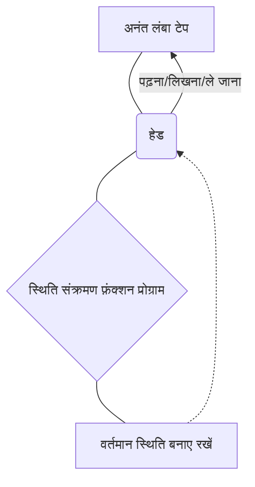
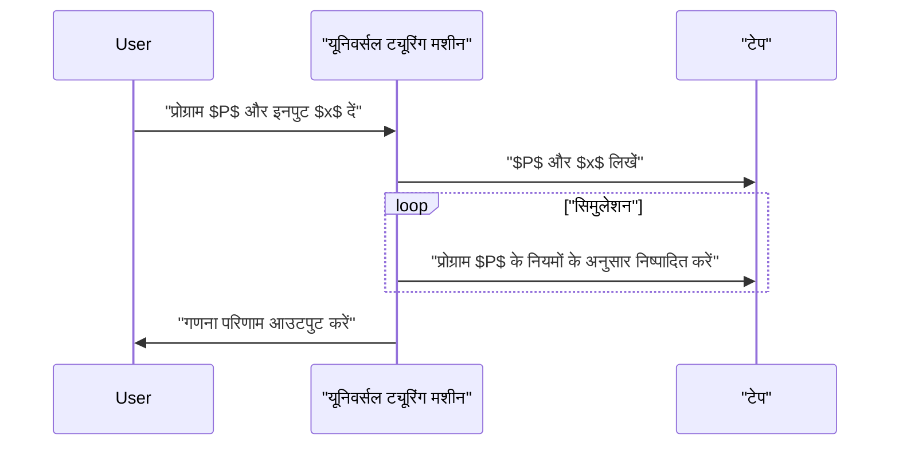

## 1. परिचय: गणना की सीमाओं की खोज

हम अपने दैनिक जीवन में जिन कंप्यूटरों का उपयोग करते हैं, स्मार्टफोन से लेकर सुपर कंप्यूटर तक, उनमें अद्भुत प्रसंस्करण क्षमता होती है। लेकिन, **"क्या कुछ ऐसा है जो कंप्यूटर नहीं कर सकता?"** इस मूलभूत प्रश्न का आप क्या उत्तर देंगे?

इस प्रश्न का गणितीय रूप से पूर्ण उत्तर एक ब्रिटिश गणितज्ञ और [कंप्यूटर विज्ञान के पिता](/hi/p/biography-donald-knuth/), **एलन ट्यूरिंग** (Alan Turing) द्वारा दिया गया था। 1936 में प्रकाशित अपने पेपर में, उन्होंने **ट्यूरिंग मशीन** (Turing Machine) नामक एक आभासी गणना मॉडल का आविष्कार किया और साबित किया कि दुनिया में ऐसी "समस्याएँ हैं जिन्हें किसी भी कंप्यूटर का उपयोग करके सैद्धांतिक रूप से हल नहीं किया जा सकता है"।

इस लेख में, हम विस्तार से बताएंगे कि ट्यूरिंग मशीन कैसे काम करती है, और कंप्यूटिबिलिटी थ्योरी (Computability Theory) में अत्यंत महत्वपूर्ण **"[हाल्टिंग प्रॉब्लम](/hi/p/halting-problem/)"** ([Halting Problem](/hi/p/halting-problem/)) क्या है।

## 2. ट्यूरिंग मशीन क्या है?

ट्यूरिंग मशीन एक गणितीय मॉडल है जो आधुनिक कंप्यूटरों के संचालन सिद्धांतों को उनकी चरम सीमा तक सरल बनाता है। यह कोई भौतिक मशीन नहीं है, बल्कि एक **विचार प्रयोग** (Thought Experiment) का उत्पाद है, लेकिन सभी आधुनिक कंप्यूटर (क्वांटम कंप्यूटर को छोड़कर क्लासिकल कंप्यूटर) अनिवार्य रूप से इस ट्यूरिंग मशीन के बराबर गणना शक्ति रखते हैं।

### 2.1 ट्यूरिंग मशीन के घटक

एक ट्यूरिंग मशीन में निम्नलिखित तत्व होते हैं:

1.  **अनंत लंबा टेप** : इसे कोशिकाओं (cells) में विभाजित किया गया है, और प्रत्येक कोशिका में एक प्रतीक (जैसे `0`, `1`, रिक्त स्थान आदि) लिखा होता है। यह आधुनिक कंप्यूटर में मेमोरी के बराबर है।
2.  **हेड** : एक उपकरण जो टेप पर एक विशिष्ट कोशिका को पढ़ और लिख सकता है और बाएँ और दाएँ जा सकता है।
3.  **स्थिति रजिस्टर** : यह याद रखता है कि मशीन वर्तमान में किस **स्थिति** ([State](https://kenji.blog/hi/p/iac-infrastructure-as-code-terraform/)) में है।
4.  **स्थिति संक्रमण फ़ंक्शन** : नियम (प्रोग्राम) जो यह निर्धारित करता है कि आगे कौन सा प्रतीक लिखना है, हेड को किस दिशा में (दाएँ या बाएँ) ले जाना है, और वर्तमान "स्थिति" और हेड द्वारा पढ़े गए "प्रतीक" के आधार पर अगली स्थिति क्या होगी।

नीचे एक Mermaid आरेख है जो ट्यूरिंग मशीन की संचालन अवधारणा को दर्शाता है।



### 2.2 स्थिति संक्रमण की गणितीय परिभाषा

एक ट्यूरिंग मशीन $M$ को गणितीय रूप से निम्नलिखित 7-ट्यूपल (7-tuple) के रूप में परिभाषित किया गया है:

$$
M = (Q, \Gamma, b, \Sigma, \delta, q_0, F)
$$

यहाँ, प्रत्येक प्रतीक निम्नलिखित का प्रतिनिधित्व करता है:
- $Q$ : स्थितियों का एक सीमित सेट
- $\Gamma$ : टेप प्रतीकों का एक सीमित सेट
- $b \in \Gamma$ : रिक्त प्रतीक (Blank)
- $\Sigma \subseteq \Gamma \setminus \{b\}$ : इनपुट प्रतीकों का सेट
- $\delta : Q \times \Gamma \rightarrow Q \times \Gamma \times \{L, R\}$ : स्थिति संक्रमण फ़ंक्शन
- $q_0 \in Q$ : प्रारंभिक स्थिति
- $F \subseteq Q$ : रुकने (स्वीकार करने) की स्थितियों का सेट

संक्रमण फ़ंक्शन $\delta$ के उदाहरण के रूप में, यदि वर्तमान स्थिति $q_1$ है और पढ़ा गया प्रतीक `0` है, और हम प्रतीक `1` लिखना चाहते हैं, हेड को दाएँ (Right) ले जाना चाहते हैं, और स्थिति को $q_2$ में बदलना चाहते हैं, तो इसे इस प्रकार दर्शाया जाता है:

$$
\delta(q_1, 0) = (q_2, 1, R)
$$

### 2.3 Python का उपयोग करके ट्यूरिंग मशीन सिमुलेशन

अवधारणा को गहराई से समझने के लिए, आइए Python में एक सरल ट्यूरिंग मशीन लागू करें। निम्नलिखित कोड एक सरल ट्यूरिंग मशीन है जो इनपुट बाइनरी स्ट्रिंग के अंत में `0` को `1` में उलट देता है।

```python
class TuringMachine:
    def __init__(self, tape, blank_symbol="B", initial_state="q0"):
        self.tape = list(tape)
        self.blank_symbol = blank_symbol
        self.head_position = 0
        self.current_state = initial_state
        self.transition_function = {}

    def add_transition(self, state, read_symbol, new_state, write_symbol, direction):
        self.transition_function[(state, read_symbol)] = (new_state, write_symbol, direction)

    def step(self):
        if self.head_position < 0:
            self.tape.insert(0, self.blank_symbol)
            self.head_position = 0
        if self.head_position >= len(self.tape):
            self.tape.append(self.blank_symbol)
            
        read_symbol = self.tape[self.head_position]
        action = self.transition_function.get((self.current_state, read_symbol))
        
        if action is None:
            return False # रुकने की स्थिति

        new_state, write_symbol, direction = action
        self.tape[self.head_position] = write_symbol
        self.current_state = new_state
        
        if direction == 'R':
            self.head_position += 1
        elif direction == 'L':
            self.head_position -= 1
            
        return True

    def run(self):
        while self.step():
            pass
        return "".join(self.tape).replace(self.blank_symbol, "")

# मशीन सेटअप
tm = TuringMachine("1010")
# स्थिति q0: हमेशा दाएँ जाएँ, यदि रिक्त स्थान मिले तो q1 पर जाएँ
tm.add_transition("q0", "0", "q0", "0", "R")
tm.add_transition("q0", "1", "q0", "1", "R")
tm.add_transition("q0", "B", "q1", "B", "L")
# स्थिति q1: बाएँ लौटें, पहले 0 को 1 में बदलें और रुकें (q_halt)
tm.add_transition("q1", "0", "q_halt", "1", "S") # S एक डमी दिशा है जिसका अर्थ रुकना है

print("प्रारंभिक टेप:", "1010")
result = tm.run()
print("अंतिम टेप:", result)
```

इस तरह, बहुत सरल नियमों के संयोजन से, स्ट्रिंग हेरफेर और गणना की जा सकती है।

## 3. यूनिवर्सल ट्यूरिंग मशीन और कंप्यूटिबिलिटी

ट्यूरिंग मशीन की सबसे बड़ी उपलब्धि **यूनिवर्सल ट्यूरिंग मशीन** (Universal Turing Machine) की अवधारणा का निर्माण था।

एक सामान्य ट्यूरिंग मशीन में विशिष्ट कार्यों (जैसे जोड़ना, स्ट्रिंग को छांटना, आदि) के लिए हार्ड-कोडेड स्थिति संक्रमण फ़ंक्शन होते हैं। हालाँकि, एक यूनिवर्सल ट्यूरिंग मशीन **"किसी अन्य ट्यूरिंग मशीन के ब्लूप्रिंट (प्रोग्राम) और उसके इनपुट डेटा को अपने स्वयं के टेप पर पढ़ सकती है, और उस मशीन का अनुकरण (simulate) कर सकती है"** ।



यह ठीक वही विचार है जो **आधुनिक संग्रहीत-प्रोग्राम कंप्यूटर (वॉन न्यूमैन आर्किटेक्चर)** का आधार है। हम हार्डवेयर को भौतिक रूप से बदले बिना केवल सॉफ़्टवेयर स्थापित करके विभिन्न प्रक्रियाएँ कर सकते हैं, क्योंकि आधुनिक पीसी यूनिवर्सल ट्यूरिंग मशीन के रूप में कार्य करते हैं।

यहाँ जो महत्वपूर्ण है वह है **कंप्यूटिबिलिटी** (Computability)। ट्यूरिंग की परिभाषा के अनुसार, "एक गणना योग्य फ़ंक्शन वह है जिसकी गणना ट्यूरिंग मशीन द्वारा की जा सकती है" (इसे **चर्च-ट्यूरिंग थीसिस** कहा जाता है)।

## 4. हाल्टिंग प्रॉब्लम (The Halting Problem)

यूनिवर्सल ट्यूरिंग मशीन के साथ, यह उम्मीद की गई थी कि "प्रोग्राम के आधार पर कोई भी गणना संभव हो सकती है"। हालाँकि, ट्यूरिंग ने अपने स्वयं के मॉडल का उपयोग करके गणितीय रूप से साबित कर दिया कि **"अगणनीय समस्याएँ"** (Uncomputable Problems) मौजूद हैं। इसका सबसे प्रमुख उदाहरण **[हाल्टिंग प्रॉब्लम](/hi/p/halting-problem/)** है।

### 4.1 हाल्टिंग प्रॉब्लम क्या है?

[हाल्टिंग प्रॉब्लम](/hi/p/halting-problem/) निम्नलिखित प्रश्न है:

> क्या कोई ऐसा एल्गोरिदम (प्रोग्राम) मौजूद है जो किसी दिए गए प्रोग्राम $P$ और उस प्रोग्राम के इनपुट $x$ के लिए, निष्पादन से पहले यह निर्धारित कर सके कि **क्या प्रोग्राम $P$, इनपुट $x$ के साथ चलने पर, एक सीमित समय में गणना समाप्त करके रुक जाएगा, या एक अनंत लूप में फंस जाएगा और कभी नहीं रुकेगा?**

पहली नज़र में, ऐसा लग सकता है कि हम कोड का स्थिर विश्लेषण (static analysis) करके इसका पता लगा सकते हैं। हालाँकि, ट्यूरिंग ने विरोध द्वारा प्रमाण (proof by contradiction) का उपयोग करके यह साबित कर दिया कि **"ऐसा कोई सार्वभौमिक निर्णयकर्ता प्रोग्राम मौजूद नहीं हो सकता"** ।

### 4.2 हाल्टिंग प्रॉब्लम के प्रमाण का अवलोकन

मान लीजिए कि `halts(program, input)` नामक एक जादुई फ़ंक्शन मौजूद है जो पूरी तरह से यह निर्धारित कर सकता है कि कोई प्रोग्राम रुकेगा या नहीं। मान लीजिए यह फ़ंक्शन `True` लौटाता है यदि प्रोग्राम रुक जाता है, और `False` लौटाता है यदि यह एक अनंत लूप में चला जाता है।

अब, हम निम्नलिखित चतुर प्रोग्राम `paradox(program)` बनाते हैं:

```python
def halts(program_code, input_data):
    # मान लीजिए कि यह फ़ंक्शन मौजूद है (जादुई फ़ंक्शन)
    # यदि यह रुकता है तो True लौटाता है, यदि नहीं तो False
    pass

def paradox(program_code):
    # खुद को निर्णयकर्ता में डालें
    if halts(program_code, program_code) == True:
        # यदि यह निर्धारित होता है कि यह रुकेगा, तो जानबूझकर अनंत लूप में जाएँ
        while True:
            pass
    else:
        # यदि यह निर्धारित होता है कि यह नहीं रुकेगा, तो तुरंत रुक जाएँ
        return
```

अब, क्या होगा यदि हम इस `paradox` फ़ंक्शन को उसके अपने कोड `paradox` को इनपुट के रूप में देकर निष्पादित करें?

```python
paradox(paradox)
```

1.  यदि `halts(paradox, paradox)`, `True` (रुकता है) निर्धारित करता है:
    `paradox` फ़ंक्शन `if` ब्लॉक में प्रवेश करेगा और **अनंत लूप** में चला जाएगा। यानी यह नहीं रुकेगा। यह निर्णय परिणाम का खंडन करता है।
2.  यदि `halts(paradox, paradox)`, `False` (अनंत लूप) निर्धारित करता है:
    `paradox` फ़ंक्शन `else` ब्लॉक में प्रवेश करेगा और **तुरंत रुक जाएगा**। यह भी निर्णय परिणाम का खंडन करता है।

चूँकि दोनों ही मामलों में विरोधाभास उत्पन्न होता है, हमारी प्रारंभिक धारणा कि **"एक पूर्ण `halts` फ़ंक्शन मौजूद है" गलत थी** । इसलिए, [हाल्टिंग प्रॉब्लम](/hi/p/halting-problem/) को हल करने के लिए कोई एल्गोरिदम मौजूद नहीं है।

### 4.3 गणितीय सूत्रीकरण

इस प्रमाण को गणितीय संकेतन में व्यक्त करने पर, यह इस प्रकार दिखता है।
मान लें कि फ़ंक्शन $h(p, i)$, $1$ लौटाता है यदि प्रोग्राम $p$ इनपुट $i$ पर रुकता है, और $0$ लौटाता है यदि यह नहीं रुकता है।

$$
h(p, i) = \begin{cases}
1 & \text{यदि } p(i) \text{ रुकता है} \\\\
0 & \text{यदि } p(i) \text{ हमेशा के लिए लूप करता है}
\end{cases}
$$

अगला, हम निम्नलिखित फ़ंक्शन $g$ को परिभाषित करते हैं:

$$
g(p) = \begin{cases}
\text{हमेशा के लिए लूप} & \text{यदि } h(p, p) = 1 \\\\
0 & \text{यदि } h(p, p) = 0
\end{cases}
$$

यहाँ $g$ को अपने स्वयं के इनपुट के रूप में $g$ दिया गया है, अर्थात् $g(g)$ पर विचार करें।
- यदि $h(g, g) = 1$ है, तो $g(g)$ एक अनंत लूप (नहीं रुकता) बन जाता है, जो $h$ की परिभाषा का खंडन करता है।
- यदि $h(g, g) = 0$ है, तो $g(g) = 0$ हो जाता है और रुक जाता है, जो $h$ की परिभाषा का खंडन करता है।

इससे यह सिद्ध होता है कि फ़ंक्शन $h$ अगणनीय (Uncomputable) है।

## 5. कंप्यूटिबिलिटी थ्योरी का प्रभाव

यह तथ्य कि [हाल्टिंग प्रॉब्लम](/hi/p/halting-problem/) "अनसुलझी" है, का आधुनिक सॉफ्टवेयर विकास पर भी सीधा प्रभाव पड़ा है।

उदाहरण के लिए, कंपाइलर और स्थिर कोड विश्लेषण उपकरण कोड में बग या अनंत लूप की जांच करते हैं, लेकिन वे इस सीमा के तहत काम करते हैं कि **"सिद्धांत रूप में सभी प्रोग्रामों के लिए अनंत लूप का 100% सटीक रूप से पता लगाना असंभव है"** । इसलिए, व्यावहारिक विश्लेषण उपकरण अनुमान (heuristics) या टाइमआउट का उपयोग करके समझौते अपनाते हैं।

इसके अलावा, इसका **गोडेल के अपूर्णता प्रमेय** (Gödel's Incompleteness Theorem) से भी गहरा संबंध है। यह खोज कि गणितीय स्वयंसिद्ध प्रणालियों (axiomatic systems) में "ऐसे कथन हैं जो सत्य हैं लेकिन सिद्ध नहीं किए जा सकते" और "ऐसी समस्याएँ हैं जिनकी गणना की जा सकती है लेकिन निर्णय नहीं लिया जा सकता", तर्क और कंप्यूटर विज्ञान में एक ही सिक्के के दो पहलू थे।

## 6. निष्कर्ष

ट्यूरिंग मशीन एक सुंदर गणितीय मॉडल है जो अपनी अत्यंत सरल संरचना के बावजूद गणना के कार्य के सार को पूरी तरह से पकड़ लेता है।

-   **ट्यूरिंग मशीन** में केवल एक अनंत टेप और स्थिति संक्रमण नियम होते हैं, और इसकी गणना क्षमता आधुनिक कंप्यूटर के बराबर होती है।
-   **यूनिवर्सल ट्यूरिंग मशीन** ने सॉफ्टवेयर (प्रोग्राम) की अवधारणा को जन्म दिया और आधुनिक कंप्यूटर की नींव रखी।
-   **[हाल्टिंग प्रॉब्लम](/hi/p/halting-problem/)** ने यह साबित कर दिया कि "ऐसा कोई सार्वभौमिक एल्गोरिदम नहीं है जो किसी भी प्रोग्राम का विश्लेषण कर सके", स्पष्ट रूप से गणना की सीमाओं को दर्शाते हुए।

प्रोग्रामिंग चुनौतियों का हम हर दिन सामना करते हैं, या एआई के विकास में यह कहाँ तक पहुँच सकता है, इस चर्चा में एलन ट्यूरिंग द्वारा खींची गई **"गणना की सीमा रेखा"** (Limit of Computation) को जानना एक अत्यंत महत्वपूर्ण ज्ञान है।

(※ यह लेख कंप्यूटिबिलिटी थ्योरी का अवलोकन प्रदान करता है; कठोर गणितीय प्रमाणों के लिए कृपया विशेष पुस्तकों का संदर्भ लें।)
