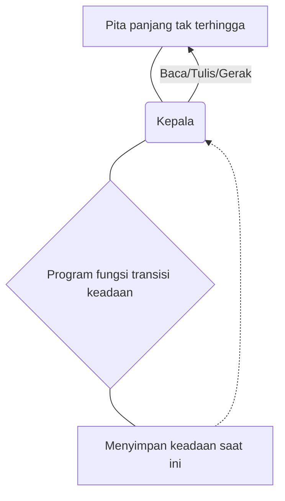
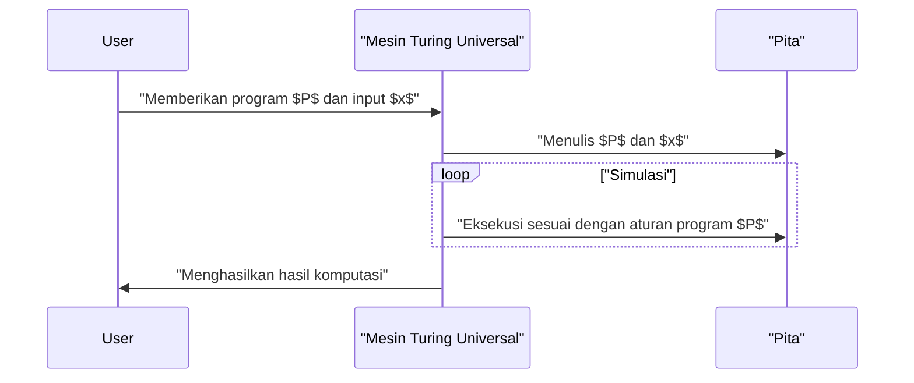

## 1. Pendahuluan: Mengeksplorasi Batas Komputasi

Komputer yang kita gunakan setiap hari, dari ponsel pintar hingga superkomputer, memiliki kekuatan pemrosesan yang menakjubkan. Namun, bagaimana Anda akan menjawab pertanyaan mendasar: **"Apakah ada hal yang tidak bisa dilakukan oleh komputer?"**

Jawaban matematis lengkap untuk pertanyaan ini diberikan oleh ahli matematika Inggris dan bapak ilmu komputer, **Alan Turing**. Dalam makalahnya yang diterbitkan pada tahun 1936, ia mengemukakan model komputasi teoretis yang disebut **Mesin Turing** dan membuktikan bahwa ada "masalah yang pada prinsipnya tidak dapat dipecahkan oleh komputer apa pun" di dunia ini.

Dalam artikel ini, kami akan menjelaskan secara rinci bagaimana Mesin Turing bekerja dan apa itu **"Masalah Penghentian"** (Halting Problem), yang sangat penting dalam teori komputabilitas.

## 2. Apa itu Mesin Turing?

Mesin Turing adalah model matematis yang sangat menyederhanakan prinsip kerja komputer modern. Ini bukanlah mesin fisik, melainkan produk dari **eksperimen pemikiran**, tetapi semua komputer modern (komputer klasik, tidak termasuk komputer kuantum) pada dasarnya memiliki kekuatan komputasi yang setara dengan Mesin Turing ini.

### 2.1 Komponen Mesin Turing

Mesin Turing terdiri dari elemen-elemen berikut:

1.  **Pita tak terhingga** (Infinite tape): Terbagi menjadi sel-sel, setiap sel ditulis dengan simbol (misalnya `0`, `1`, spasi kosong, dll.). Ini setara dengan memori pada komputer modern.
2.  **Kepala** (Head): Perangkat yang dapat membaca dan menulis sel tertentu pada pita dan bergerak ke kiri dan ke kanan.
3.  **Register keadaan** ([State](https://kenji.blog/id/p/iac-infrastructure-as-code-terraform/) register): Menyimpan **keadaan** (State) mesin saat ini.
4.  **Fungsi transisi keadaan** (State transition function): Aturan (program) yang menentukan simbol yang akan ditulis selanjutnya, arah gerakan kepala (kanan atau kiri), dan keadaan selanjutnya berdasarkan "keadaan" saat ini dan "simbol" yang dibaca oleh kepala.

Berikut adalah diagram Mermaid yang menunjukkan konsep operasi Mesin Turing.



### 2.2 Definisi Matematis dari Transisi Keadaan

Mesin Turing $M$ secara matematis didefinisikan sebagai tupel 7 elemen berikut:

$$
M = (Q, \Gamma, b, \Sigma, \delta, q_0, F)
$$

Di sini, setiap simbol melambangkan hal berikut:
- $Q$ : Himpunan berhingga dari keadaan
- $\Gamma$ : Himpunan berhingga dari simbol pita
- $b \in \Gamma$ : Simbol kosong (Blank)
- $\Sigma \subseteq \Gamma \setminus \{b\}$ : Himpunan simbol masukan
- $\delta : Q \times \Gamma \rightarrow Q \times \Gamma \times \{L, R\}$ : Fungsi transisi keadaan
- $q_0 \in Q$ : Keadaan awal
- $F \subseteq Q$ : Himpunan keadaan berhenti (diterima)

Sebagai contoh fungsi transisi $\delta$, jika keadaan saat ini adalah $q_1$, dan simbol yang dibaca adalah `0`, lalu ia menulis simbol `1`, menggerakkan kepala ke kanan (Right), dan mengubah keadaan menjadi $q_2$, ini direpresentasikan sebagai berikut:

$$
\delta(q_1, 0) = (q_2, 1, R)
$$

### 2.3 Simulasi Mesin Turing dengan Python

Untuk memahami konsep ini lebih dalam, mari kita implementasikan Mesin Turing sederhana dengan Python. Kode berikut adalah Mesin Turing sederhana yang membalikkan `0` di akhir string biner masukan menjadi `1`.

```python
class TuringMachine:
    def __init__(self, tape, blank_symbol="B", initial_state="q0"):
        self.tape = list(tape)
        self.blank_symbol = blank_symbol
        self.head_position = 0
        self.current_state = initial_state
        self.transition_function = {}

    def add_transition(self, state, read_symbol, new_state, write_symbol, direction):
        self.transition_function[(state, read_symbol)] = (new_state, write_symbol, direction)

    def step(self):
        if self.head_position < 0:
            self.tape.insert(0, self.blank_symbol)
            self.head_position = 0
        if self.head_position >= len(self.tape):
            self.tape.append(self.blank_symbol)
            
        read_symbol = self.tape[self.head_position]
        action = self.transition_function.get((self.current_state, read_symbol))
        
        if action is None:
            return False # Keadaan berhenti

        new_state, write_symbol, direction = action
        self.tape[self.head_position] = write_symbol
        self.current_state = new_state
        
        if direction == 'R':
            self.head_position += 1
        elif direction == 'L':
            self.head_position -= 1
            
        return True

    def run(self):
        while self.step():
            pass
        return "".join(self.tape).replace(self.blank_symbol, "")

# Persiapan mesin
tm = TuringMachine("1010")
# Keadaan q0: Selalu bergerak ke kanan, jika menemukan kosong, menuju q1
tm.add_transition("q0", "0", "q0", "0", "R")
tm.add_transition("q0", "1", "q0", "1", "R")
tm.add_transition("q0", "B", "q1", "B", "L")
# Keadaan q1: Kembali ke kiri, ubah 0 pertama menjadi 1 lalu berhenti(q_halt)
tm.add_transition("q1", "0", "q_halt", "1", "S") # S adalah arah dummy yang berarti berhenti

print("Pita awal:", "1010")
result = tm.run()
print("Pita akhir:", result)
```

Dengan cara ini, kombinasi aturan yang sangat sederhana dapat memanipulasi dan menghitung string.

## 3. Mesin Turing Universal dan Komputabilitas

Pencapaian terbesar Mesin Turing adalah menciptakan konsep **Mesin Turing Universal** (Universal Turing Machine).

Mesin Turing biasa memiliki fungsi transisi keadaan yang dikodekan secara statis khusus untuk tugas tertentu (seperti penjumlahan, penyortiran string, dll.). Namun, Mesin Turing Universal dapat **"membaca cetak biru (program) mesin Turing lain dan data masukannya ke dalam pitanya sendiri, lalu menyimulasikan mesin tersebut"**.



Ini adalah gagasan dasar di balik **komputer arsitektur tersimpan modern (arsitektur von Neumann)**. Alasan mengapa kita dapat melakukan berbagai proses hanya dengan menginstal perangkat lunak tanpa mengubah perangkat keras secara fisik adalah karena PC modern berfungsi sebagai Mesin Turing Universal.

Yang penting di sini adalah **Komputabilitas** (Computability). Menurut definisi Turing, "fungsi yang dapat dikomputasi adalah fungsi yang dapat dihitung oleh Mesin Turing" (ini disebut **Tesis Church-Turing**).

## 4. Masalah Penghentian (The Halting Problem)

Dengan Mesin Turing Universal, ada harapan bahwa "perhitungan apa pun dapat dilakukan tergantung pada programnya, bukan?". Namun, dengan menggunakan modelnya sendiri, Turing membuktikan secara matematis bahwa ada **"masalah yang tidak dapat dihitung"**. Contoh utamanya adalah **Masalah Penghentian**.

### 4.1 Apa itu Masalah Penghentian?

Masalah Penghentian adalah pertanyaan berikut:

> Mengingat sembarang program $P$ dan input $x$ ke program tersebut, ketika program $P$ dieksekusi dengan input $x$, **apakah ada algoritma (program) yang dapat menentukan sebelum eksekusi apakah program tersebut akan selesai dan berhenti dalam waktu berhingga, atau apakah akan jatuh ke dalam loop tak terbatas dan tidak pernah berhenti?**

Sekilas, sepertinya Anda bisa mengetahuinya dengan melakukan analisis kode statis. Namun, Turing menggunakan bukti melalui kontradiksi (reductio ad absurdum) untuk membuktikan bahwa **"program penentuan universal semacam itu sama sekali tidak ada"**.

### 4.2 Garis Besar Bukti Masalah Penghentian

Misalkan ada fungsi seperti dewa `halts(program, input)` yang dapat sepenuhnya menentukan apakah sebuah program akan berhenti. Fungsi ini akan mengembalikan `True` jika program berhenti, dan `False` jika mengalami loop tak terbatas.

Sekarang, mari kita buat program yang licik `paradox(program)` sebagai berikut.

```python
def halts(program_code, input_data):
    # Asumsikan fungsi ini ada (fungsi ajaib)
    # Mengembalikan True jika berhenti, False jika tidak berhenti
    pass

def paradox(program_code):
    # Menempatkan dirinya sendiri ke dalam penentu
    if halts(program_code, program_code) == True:
        # Jika ditentukan untuk berhenti, sengaja melakukan loop tak terbatas
        while True:
            pass
    else:
        # Jika ditentukan tidak berhenti, segera berhenti
        return
```

Sekarang, apa yang terjadi jika kita menjalankan fungsi `paradox` ini dengan memberikan kodenya sendiri `paradox` sebagai input?

```python
paradox(paradox)
```

1.  Jika `halts(paradox, paradox)` dinilai sebagai `True` (berhenti):
    Fungsi `paradox` memasuki blok `if` dan mengalami **loop tak terbatas**. Artinya tidak berhenti. Ini bertentangan dengan hasil penentuan.
2.  Jika `halts(paradox, paradox)` dinilai sebagai `False` (loop tak terbatas):
    Fungsi `paradox` memasuki blok `else` dan **segera berhenti**. Ini juga bertentangan dengan hasil penentuan.

Karena kontradiksi muncul bagaimanapun caranya, premis awal bahwa **"ada fungsi `halts` yang sempurna" adalah salah**. Oleh karena itu, tidak ada algoritma untuk memecahkan masalah penghentian.

### 4.3 Representasi Matematika

Jika bukti ini dinyatakan dalam notasi matematis, itu adalah sebagai berikut.
Misalkan $h(p, i)$ adalah fungsi yang mengembalikan $1$ jika program $p$ berhenti pada input $i$, dan $0$ jika tidak berhenti.

$$
h(p, i) = \begin{cases}
1 & \text{jika } p(i) \text{ berhenti} \\\\
0 & \text{jika } p(i) \text{ perulangan selamanya}
\end{cases}
$$

Selanjutnya, kita mendefinisikan fungsi $g$ berikut.

$$
g(p) = \begin{cases}
\text{perulangan selamanya} & \text{jika } h(p, p) = 1 \\\\
0 & \text{jika } h(p, p) = 0
\end{cases}
$$

Sekarang pertimbangkan $g(g)$, yang mana $g$ diberikan kepada dirinya sendiri sebagai input.
- Jika $h(g, g) = 1$, maka $g(g)$ menjadi loop tak terbatas (tidak berhenti), yang bertentangan dengan definisi $h$.
- Jika $h(g, g) = 0$, maka $g(g) = 0$ dan berhenti, yang bertentangan dengan definisi $h$.

Ini membuktikan bahwa fungsi $h$ tidak dapat dihitung (Uncomputable).

## 5. Dampak Teori Komputabilitas

Fakta bahwa masalah penghentian "tidak dapat dipecahkan" memiliki dampak langsung pada pengembangan perangkat lunak modern.

Misalnya, kompiler dan alat analisis kode statis memeriksa kode kita untuk mencari bug atau potensi loop tak terbatas, tetapi mereka beroperasi di bawah batasan bahwa **"pada prinsipnya tidak mungkin untuk mendeteksi loop tak terbatas dengan akurasi 100% untuk semua program"**. Oleh karena itu, alat analisis praktis mengadopsi kompromi menggunakan heuristik dan waktu tunggu (timeout).

Itu juga terkait erat dengan **Teorema Ketidaklengkapan Gödel**. Fakta bahwa "ada proposisi yang benar tetapi tidak dapat dibuktikan" dalam sistem aksioma matematika, dan bahwa "ada masalah yang dapat dihitung tetapi tidak dapat ditentukan", adalah dua sisi dari mata uang yang sama yang ditemukan dalam logika dan ilmu komputer.

## 6. Kesimpulan

Mesin Turing adalah model matematika yang indah yang secara sempurna menangkap esensi tindakan komputasi, meskipun memiliki struktur yang sangat sederhana.

-   **Mesin Turing** hanya terdiri dari pita tak terhingga dan aturan transisi keadaan, serta memiliki daya komputasi yang setara dengan komputer modern.
-   **Mesin Turing Universal** melahirkan konsep perangkat lunak (program) dan meletakkan dasar bagi komputer modern.
-   **Masalah Penghentian** membuktikan bahwa "tidak ada algoritma universal yang dapat dengan pasti menganalisis semua program", yang dengan jelas menunjukkan batas komputasi.

Dalam tantangan pemrograman yang kita hadapi setiap hari, dan dalam diskusi tentang seberapa jauh kecerdasan buatan dapat berevolusi, mengetahui **"batas komputasi"** yang ditarik oleh Alan Turing adalah pendidikan yang sangat penting.

(*Artikel ini adalah gambaran umum tentang teori komputabilitas, silakan merujuk ke buku khusus untuk bukti matematis yang ketat.)
