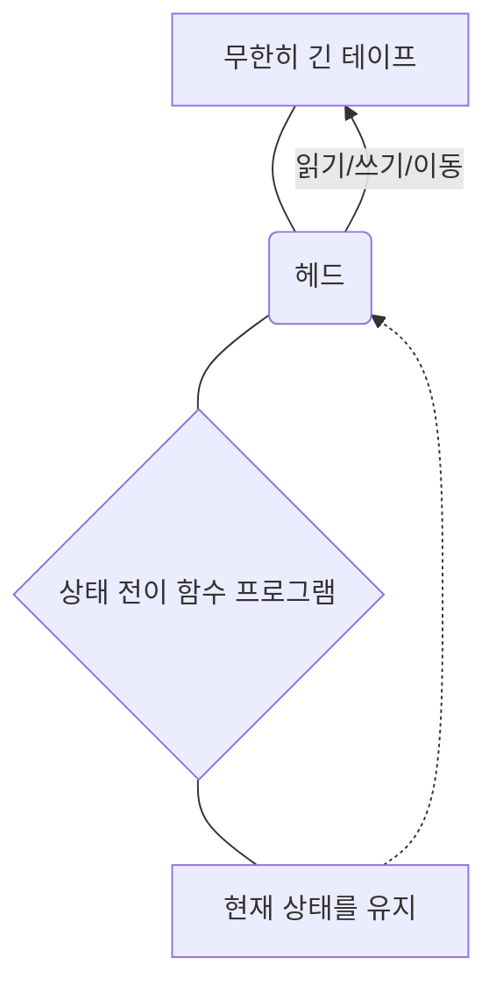
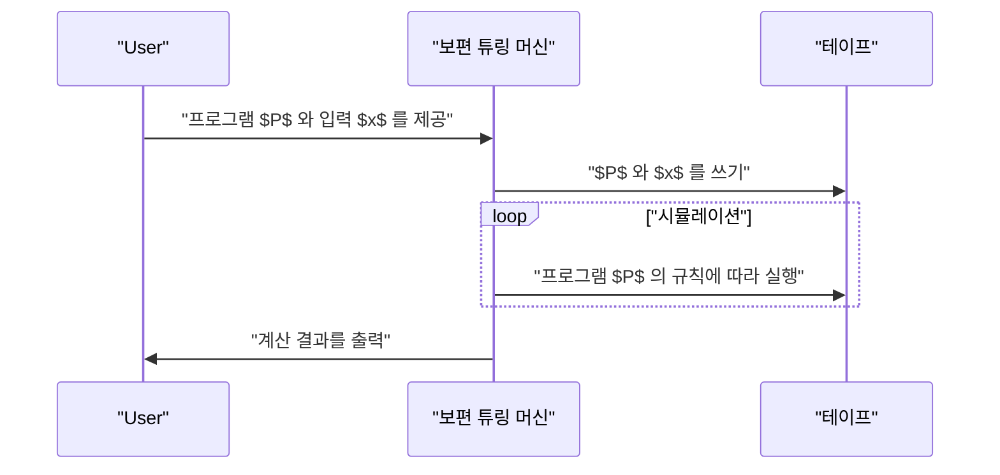

## 1. 서론: 계산의 한계 탐구

우리가 일상적으로 사용하는 컴퓨터는 스마트폰부터 슈퍼컴퓨터에 이르기까지 놀라운 처리 능력을 갖추고 있습니다. 하지만, **"컴퓨터가 할 수 없는 일이 있을까?"** 라는 근본적인 질문에 대해 당신은 어떻게 대답하시겠습니까?

이 질문에 대해 수학적으로 완벽한 해답을 제시한 사람이 바로 영국의 수학자이자 컴퓨터 과학의 아버지라 불리는 **앨런 튜링** (Alan Turing)입니다. 그는 1936년에 발표한 논문에서 **튜링 머신** 이라는 가상의 계산 모델을 고안하여, 이 세상에는 "어떠한 컴퓨터를 사용해도 원리적으로 풀 수 없는 문제"가 존재함을 증명했습니다.

본 기사에서는 튜링 머신이 어떤 원리로 작동하는지, 그리고 계산 가능성 이론에서 극히 중요한 **"정지 문제"** 란 무엇인지에 대해 상세히 해설합니다.

## 2. 튜링 머신이란 무엇인가?

튜링 머신은 현대 컴퓨터의 동작 원리를 극한까지 단순화한 수학적 모델입니다. 물리적인 기계가 아니라 어디까지나 **사고 실험** 의 산물이지만, 현대의 모든 컴퓨터(양자 컴퓨터를 제외한 고전 컴퓨터)는 본질적으로 이 튜링 머신과 등가인 계산 능력을 가지고 있습니다.

### 2.1 튜링 머신의 구성 요소

튜링 머신은 다음 요소들로 구성됩니다.

1.  **무한히 긴 테이프** : 셀로 나뉘어 있으며, 각 셀에는 기호(예: `0`, `1`, 공백 등)가 기록됩니다. 이는 현대 컴퓨터의 메모리에 해당합니다.
2.  **헤드** : 테이프 상의 특정 셀을 읽고 쓰며 좌우로 이동할 수 있는 장치입니다.
3.  **상태 레지스터** : 머신이 현재 어떤 **상태** (State)에 있는지를 기억합니다.
4.  **상태 전이 함수** : 현재의 "상태"와 헤드가 읽어 들인 "기호"를 바탕으로 다음에 쓸 기호, 헤드의 이동 방향(오른쪽 또는 왼쪽), 그리고 다음 상태를 결정하는 규칙(프로그램)입니다.

다음은 튜링 머신의 동작 개념을 나타내는 Mermaid 다이어그램입니다.



### 2.2 상태 전이의 수학적 정의

튜링 머신 $M$ 은 수학적으로 다음과 같은 7-튜플로 정의됩니다.

$$
M = (Q, \Gamma, b, \Sigma, \delta, q_0, F)
$$

여기서 각 기호는 다음을 나타냅니다.
- $Q$ : 상태의 유한 집합
- $\Gamma$ : 테이프 기호의 유한 집합
- $b \in \Gamma$ : 공백 기호 (Blank)
- $\Sigma \subseteq \Gamma \setminus \{b\}$ : 입력 기호의 집합
- $\delta : Q \times \Gamma \rightarrow Q \times \Gamma \times \{L, R\}$ : 상태 전이 함수
- $q_0 \in Q$ : 초기 상태
- $F \subseteq Q$ : 정지(수락) 상태의 집합

전이 함수 $\delta$ 의 예로서, 현재 상태가 $q_1$ 이고 읽어 들인 기호가 `0`일 때, 기호 `1`을 쓰고 헤드를 오른쪽 (Right)으로 이동시키며 상태를 $q_2$ 로 변경하는 경우는 다음과 같이 표현됩니다.

$$
\delta(q_1, 0) = (q_2, 1, R)
$$

### 2.3 Python을 통한 튜링 머신 시뮬레이션

개념을 더 깊이 이해하기 위해, Python으로 간단한 튜링 머신을 구현해 봅시다. 다음 코드는 입력된 이진수 문자열의 끝에 있는 `0`을 `1`로 반전시키는 간단한 튜링 머신입니다.

```python
class TuringMachine:
    def __init__(self, tape, blank_symbol="B", initial_state="q0"):
        self.tape = list(tape)
        self.blank_symbol = blank_symbol
        self.head_position = 0
        self.current_state = initial_state
        self.transition_function = {}

    def add_transition(self, state, read_symbol, new_state, write_symbol, direction):
        self.transition_function[(state, read_symbol)] = (new_state, write_symbol, direction)

    def step(self):
        if self.head_position < 0:
            self.tape.insert(0, self.blank_symbol)
            self.head_position = 0
        if self.head_position >= len(self.tape):
            self.tape.append(self.blank_symbol)
            
        read_symbol = self.tape[self.head_position]
        action = self.transition_function.get((self.current_state, read_symbol))
        
        if action is None:
            return False # 정지 상태

        new_state, write_symbol, direction = action
        self.tape[self.head_position] = write_symbol
        self.current_state = new_state
        
        if direction == 'R':
            self.head_position += 1
        elif direction == 'L':
            self.head_position -= 1
            
        return True

    def run(self):
        while self.step():
            pass
        return "".join(self.tape).replace(self.blank_symbol, "")

# 머신 설정
tm = TuringMachine("1010")
# 상태 q0: 항상 오른쪽으로 이동하며 공백을 찾으면 q1으로
tm.add_transition("q0", "0", "q0", "0", "R")
tm.add_transition("q0", "1", "q0", "1", "R")
tm.add_transition("q0", "B", "q1", "B", "L")
# 상태 q1: 왼쪽으로 돌아가 첫 번째 0을 1로 바꾸고 정지 (q_halt)
tm.add_transition("q1", "0", "q_halt", "1", "S") # S는 정지를 의미하는 더미 방향

print("초기 테이프:", "1010")
result = tm.run()
print("최종 테이프:", result)
```

이처럼, 매우 단순한 규칙의 조합만으로 문자열 조작이나 계산을 수행할 수 있습니다.

## 3. 보편 튜링 머신과 계산 가능성

튜링 머신의 가장 큰 공적은 **보편 튜링 머신** (Universal Turing Machine)의 개념을 탄생시킨 것입니다.

일반적인 튜링 머신은 특정 작업(덧셈을 하거나 문자열을 정렬하는 등)에 특화되어 상태 전이 함수가 하드코딩되어 있습니다. 그러나 보편 튜링 머신은 **"다른 튜링 머신의 설계도(프로그램)와 그 입력 데이터를 자신의 테이프에 읽어 들여 해당 머신을 시뮬레이션"** 할 수 있습니다.



이는 정확히 **현대의 프로그램 내장 방식 컴퓨터(폰 노이만 아키텍처)** 의 기초가 되는 아이디어입니다. 우리가 하드웨어를 물리적으로 변경하지 않고도 소프트웨어를 설치하는 것만으로 다양한 처리를 할 수 있는 것은, 현대의 PC가 보편 튜링 머신으로 기능하고 있기 때문입니다.

여기서 중요한 것이 **계산 가능성** (Computability)입니다. 튜링의 정의에 따르면, "계산 가능한 함수란 어떤 튜링 머신에 의해 계산될 수 있는 함수이다"라고 합니다(이를 **처치-튜링 명제** 라고 부릅니다).

## 4. 정지 문제 (The Halting Problem)

보편 튜링 머신에 의해 "어떤 계산이든 프로그램에 따라 가능해지지 않을까?" 하는 기대가 있었습니다. 하지만 튜링은 자신의 모델을 사용하여 **"계산 불가능한 문제"** 가 존재함을 수학적으로 증명했습니다. 그 대표적인 예가 **정지 문제** 입니다.

### 4.1 정지 문제란?

정지 문제란 다음과 같은 질문입니다.

> 임의의 프로그램 $P$ 와 그 프로그램에 대한 입력 $x$ 가 주어졌을 때, 프로그램 $P$ 에 입력 $x$ 를 주어 실행하면 **유한 시간 내에 계산을 마치고 정지할 것인지, 아니면 무한 루프에 빠져 영원히 정지하지 않을 것인지를 실행 전에 판정하는 알고리즘(프로그램)이 존재하는가?** 

언뜻 보면, 코드를 정적 분석하면 알 수 있을 정도록 보입니다. 하지만 튜링은 **"그런 만능 판정 프로그램은 절대 존재하지 않는다"** 는 것을 귀류법을 사용해 증명했습니다.

### 4.2 정지 문제 증명의 개요

가령, 어떤 프로그램이 정지할지 여부를 완벽하게 판정할 수 있는 신과 같은 함수 `halts(program, input)` 가 존재한다고 가정해 봅시다. 이 함수는 프로그램이 정지하면 `True` 를, 무한 루프에 빠지면 `False` 를 반환한다고 합시다.

여기서 다음과 같은 심술궂은 프로그램 `paradox(program)` 을 만듭니다.

```python
def halts(program_code, input_data):
    # 이 함수는 존재한다고 가정함 (마법의 함수)
    # 정지한다면 True, 정지하지 않는다면 False를 반환
    pass

def paradox(program_code):
    # 자기 자신을 판정기에 넣음
    if halts(program_code, program_code) == True:
        # 정지한다고 판정되면 고의로 무한 루프에 빠짐
        while True:
            pass
    else:
        # 정지하지 않는다고 판정되면 즉시 정지함
        return
```

자, 이 `paradox` 함수에 자기 자신의 코드 `paradox` 를 입력으로 주어 실행하면 어떻게 될까요?

```python
paradox(paradox)
```

1.  만약 `halts(paradox, paradox)` 가 `True` (정지함)라고 판정한 경우:
    `paradox` 함수는 `if` 블록으로 들어가 **무한 루프** 에 빠집니다. 즉 정지하지 않습니다. 이는 판정 결과와 모순됩니다.
2.  만약 `halts(paradox, paradox)` 가 `False` (무한 루프에 빠짐)라고 판정한 경우:
    `paradox` 함수는 `else` 블록으로 들어가 **즉시 정지** 합니다. 이 역시 판정 결과와 모순됩니다.

어느 쪽이든 모순이 발생하기 때문에, 최초의 가정이었던 **"완벽한 `halts` 함수가 존재한다"는 전제가 틀렸던** 것이 됩니다. 따라서 정지 문제를 푸는 알고리즘은 존재하지 않습니다.

### 4.3 수식을 통한 표현

이 증명을 수학적 표기법으로 나타내면 다음과 같습니다.
함수 $h(p, i)$ 를 프로그램 $p$ 가 입력 $i$ 에서 정지하는 경우에는 $1$ , 정지하지 않는 경우에는 $0$ 을 반환하는 함수라고 합시다.

$$
h(p, i) = \begin{cases}
1 & \text{만약 } p(i) \text{가 정지하는 경우} \\\\
0 & \text{만약 } p(i) \text{가 무한 루프에 빠지는 경우}
\end{cases}
$$

다음으로, 다음과 같은 함수 $g$ 를 정의합니다.

$$
g(p) = \begin{cases}
\text{무한 루프에 빠짐} & \text{만약 } h(p, p) = 1 \\\\
0 & \text{만약 } h(p, p) = 0
\end{cases}
$$

여기서 $g$ 에 자기 자신 $g$ 를 입력으로 준 $g(g)$ 를 생각해 봅시다.
- $h(g, g) = 1$ 이라면 $g(g)$ 는 무한 루프(정지하지 않음)가 되어 $h$ 의 정의와 모순.
- $h(g, g) = 0$ 이라면 $g(g) = 0$ 이 되어 정지하므로, $h$ 의 정의와 모순.

이로 인해, 함수 $h$ 는 계산 불가능 (Uncomputable)함이 증명됩니다.

## 5. 계산 가능성 이론이 미친 영향

정지 문제를 "풀 수 없다"는 사실은 현대 소프트웨어 개발에도 직접적인 영향을 미치고 있습니다.

예를 들어, 컴파일러나 정적 코드 분석 도구는 코드에 버그가 없는지, 무한 루프에 빠지지 않는지를 검사해 주지만, 이들은 **"모든 프로그램에 대해 100% 정확하게 무한 루프를 감지하는 것은 원리적으로 불가능하다"** 는 제약 하에 작동하고 있습니다. 때문에 실용적인 분석 도구는 휴리스틱스나 타임아웃을 사용해 타협안을 채택하고 있습니다.

또한, **괴델의 불완전성 정리** 와도 깊은 관계가 있습니다. 수학의 공리계에서 "참이지만 증명할 수 없는 명제가 존재한다"는 것과 "계산 가능하지만 판정할 수 없는 문제가 존재한다"는 것은 논리학과 컴퓨터 과학에서의 표리일체의 발견이었습니다.

## 6. 결론

튜링 머신은 매우 단순한 구조이면서도 계산이라는 행위의 본질을 완벽하게 포착해 낸 아름다운 수학적 모델입니다.

-   **튜링 머신** 은 무한한 테이프와 상태 전이 규칙만으로 구성되며, 현대 컴퓨터와 동등한 계산 능력을 가집니다.
-   **보편 튜링 머신** 은 소프트웨어(프로그램)라는 개념을 탄생시켜 현대 컴퓨터의 초석이 되었습니다.
-   **정지 문제** 는 "어떤 프로그램이라도 반드시 분석할 수 있는 만능 알고리즘은 존재하지 않는다"는 것을 증명하여 계산의 한계를 명확히 보여주었습니다.

우리가 매일 직면하는 프로그래밍의 과제나, AI의 진화가 어디까지 도달할 수 있는지에 대한 논의에서 앨런 튜링이 그은 **"계산의 한계선"** 을 아는 것은 극히 중요한 교양이라고 할 수 있을 것입니다.

(※본 기사는 계산 가능성 이론의 개요를 설명하는 것이며, 엄밀한 수학적 증명에 대해서는 전문 서적을 참조해 주십시오.)
