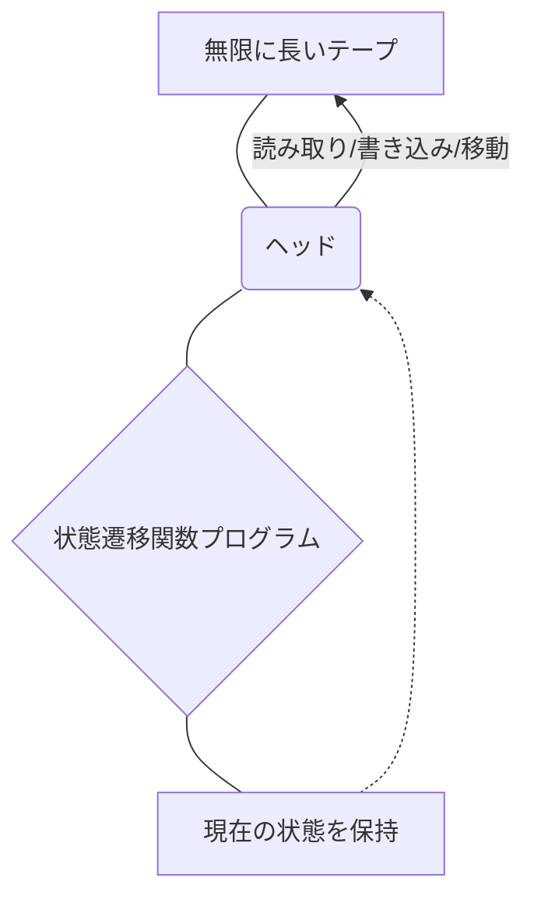
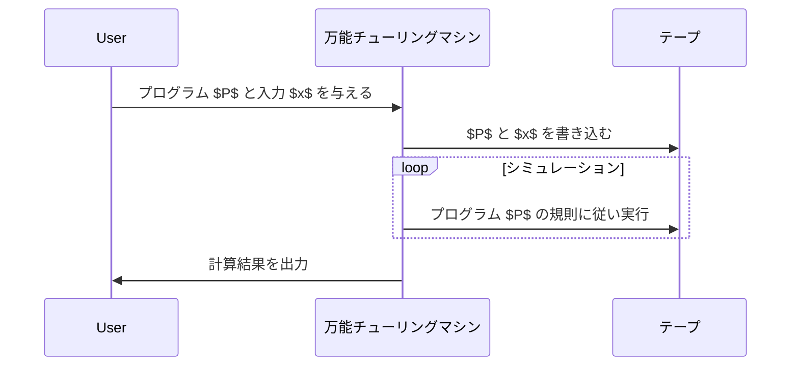

## 1. はじめに：計算の限界を探る

私たちが日常的に使用しているコンピュータは、スマートフォンからスーパーコンピュータに至るまで、驚くべき処理能力を持っています。しかし、 **「コンピュータにできないことはあるのか？」** という根本的な問いに対して、あなたはどのように答えるでしょうか。

この問いに対して数学的に完全な答えを出したのが、イギリスの数学者でありコンピュータ科学の父と呼ばれる **アラン・チューリング** (Alan Turing) です。彼は1936年に発表した論文の中で、 **チューリングマシン** という仮想の計算モデルを考案し、この世には「いかなるコンピュータを使っても原理的に解けない問題」が存在することを証明しました。

本記事では、チューリングマシンがどのような仕組みで動いているのか、そして計算可能性理論において極めて重要な **「[停止性問題](/p/halting-problem/)」** とは何かについて、詳細に解説していきます。

## 2. チューリングマシンとは何か？

チューリングマシンは、現代のコンピュータの動作原理を極限まで単純化した数学的モデルです。物理的な機械ではなく、あくまで **思考実験** の産物ですが、現代のすべてのコンピュータ（[量子コンピュータ](https://kenji.blog/p/quantum-computing-shors-algorithm/)を除く古典コンピュータ）は、本質的にこのチューリングマシンと等価な計算能力を持っています。

### 2.1 チューリングマシンの構成要素

チューリングマシンは、以下の要素から構成されます。

1.  **無限に長いテープ** : セルに区切られており、各セルには記号（例えば `0`, `1`, 空白など）が書き込まれます。これは現代のコンピュータにおけるメモリに相当します。
2.  **ヘッド** : テープ上の特定のセルを読み書きし、左右に移動できる装置です。
3.  **状態レジスタ** : マシンが現在どのような **状態** ([State](https://kenji.blog/p/iac-infrastructure-as-code-terraform/)) にあるかを記憶します。
4.  **状態遷移関数** : 現在の「状態」と、ヘッドが読み取った「記号」に基づいて、次に書き込む記号、ヘッドの移動方向（右か左か）、および次の状態を決定するルール（プログラム）です。

以下は、チューリングマシンの動作概念を示す Mermaid 図です。



### 2.2 状態遷移の数学的定義

チューリングマシン $M$ は、数学的には次のような7項組で定義されます。

$$
M = (Q, \Gamma, b, \Sigma, \delta, q_0, F)
$$

ここで、各記号は以下を表します。
- $Q$ : 状態の有限集合
- $\Gamma$ : テープ記号の有限集合
- $b \in \Gamma$ : 空白記号 (Blank)
- $\Sigma \subseteq \Gamma \setminus \{b\}$ : 入力記号の集合
- $\delta : Q \times \Gamma \rightarrow Q \times \Gamma \times \{L, R\}$ : 状態遷移関数
- $q_0 \in Q$ : 初期状態
- $F \subseteq Q$ : 停止（受理）状態の集合

遷移関数 $\delta$ の例として、現在の状態が $q_1$ で、読み取った記号が `0` のとき、記号 `1` を書き込み、ヘッドを右 (Right) に移動し、状態を $q_2$ に変更する場合は次のように表されます。

$$
\delta(q_1, 0) = (q_2, 1, R)
$$

### 2.3 Python によるチューリングマシンのシミュレーション

概念をより深く理解するために、Python でシンプルなチューリングマシンを実装してみましょう。以下のコードは、入力された2進数の文字列の末尾の `0` を `1` に反転させる簡単なチューリングマシンです。

```python
class TuringMachine:
    def __init__(self, tape, blank_symbol="B", initial_state="q0"):
        self.tape = list(tape)
        self.blank_symbol = blank_symbol
        self.head_position = 0
        self.current_state = initial_state
        self.transition_function = {}

    def add_transition(self, state, read_symbol, new_state, write_symbol, direction):
        self.transition_function[(state, read_symbol)] = (new_state, write_symbol, direction)

    def step(self):
        if self.head_position < 0:
            self.tape.insert(0, self.blank_symbol)
            self.head_position = 0
        if self.head_position >= len(self.tape):
            self.tape.append(self.blank_symbol)
            
        read_symbol = self.tape[self.head_position]
        action = self.transition_function.get((self.current_state, read_symbol))
        
        if action is None:
            return False # 停止状態

        new_state, write_symbol, direction = action
        self.tape[self.head_position] = write_symbol
        self.current_state = new_state
        
        if direction == 'R':
            self.head_position += 1
        elif direction == 'L':
            self.head_position -= 1
            
        return True

    def run(self):
        while self.step():
            pass
        return "".join(self.tape).replace(self.blank_symbol, "")

# マシンのセットアップ
tm = TuringMachine("1010")
# 状態q0: 常に右へ進み、空白を見つけたらq1へ
tm.add_transition("q0", "0", "q0", "0", "R")
tm.add_transition("q0", "1", "q0", "1", "R")
tm.add_transition("q0", "B", "q1", "B", "L")
# 状態q1: 左に戻り、最初の0を1に変えて停止(q_halt)
tm.add_transition("q1", "0", "q_halt", "1", "S") # Sは停止を意味するダミー方向

print("初期テープ:", "1010")
result = tm.run()
print("最終テープ:", result)
```

このように、非常に単純なルールの組み合わせによって、文字列の操作や計算を行うことができます。

## 3. 万能チューリングマシンと計算可能性

チューリングマシンの最大の功績は、 **万能チューリングマシン** (Universal Turing Machine) の概念を生み出したことです。

通常のチューリングマシンは、特定のタスク（足し算をする、文字列をソートするなど）に特化して状態遷移関数がハードコーディングされています。しかし、万能チューリングマシンは、 **「別のチューリングマシンの設計図（プログラム）と、その入力データを、自分自身のテープに読み込み、そのマシンをシミュレートする」** ことができます。



これは正しく **現代のプログラム内蔵方式コンピュータ（ノイマン型アーキテクチャ）** の基礎となるアイデアです。私たちがハードウェアを物理的に変更することなく、ソフトウェアをインストールするだけで様々な処理を行えるのは、現代のPCが万能チューリングマシンとして機能しているからです。

ここで重要なのが **計算可能性** (Computability) です。チューリングの定義によれば、「計算可能な関数とは、あるチューリングマシンによって計算できる関数である」とされます（これを **チャーチ＝チューリングのテーゼ** と呼びます）。

## 4. 停止性問題 (The Halting Problem)

万能チューリングマシンにより、「どんな計算でもプログラム次第で可能になるのではないか？」と期待されました。しかし、チューリングは自らのモデルを用いて、 **「計算不可能な問題」** が存在することを数学的に証明しました。その代表例が **[停止性問題](/p/halting-problem/)** です。

### 4.1 停止性問題とは？

[停止性問題](/p/halting-problem/)とは、次のような問いです。

> 任意のプログラム $P$ と、そのプログラムへの入力 $x$ が与えられたとき、プログラム $P$ に入力 $x$ を与えて実行すると、 **有限時間内に計算を終了して停止するか、それとも無限ループに陥って永遠に停止しないかを、実行前に判定するアルゴリズム（プログラム）は存在するか？** 

一見すると、コードを静的解析すれば分かりそうに思えます。しかし、チューリングは **「そのような万能な判定プログラムは絶対に存在しない」** ことを、背理法を用いて証明しました。

### 4.2 停止性問題の証明の概要

仮に、あるプログラムが停止するかどうかを完全に判定できる神のような関数 `halts(program, input)` が存在すると仮定します。この関数は、プログラムが停止する場合は `True` を、無限ループする場合は `False` を返すとします。

ここで、次のような意地悪なプログラム `paradox(program)` を作成します。

```python
def halts(program_code, input_data):
    # この関数は存在すると仮定する（魔法の関数）
    # 停止するならTrue, 停止しないならFalseを返す
    pass

def paradox(program_code):
    # 自分自身を判定器にかける
    if halts(program_code, program_code) == True:
        # 停止すると判定されたら、わざと無限ループする
        while True:
            pass
    else:
        # 停止しないと判定されたら、すぐに停止する
        return
```

さて、この `paradox` 関数に、自分自身のコード `paradox` を入力として与えて実行するとどうなるでしょうか？

```python
paradox(paradox)
```

1.  もし `halts(paradox, paradox)` が `True`（停止する）と判定した場合：
    `paradox` 関数は `if` ブ[ロック](https://kenji.blog/p/rdbms-transaction-acid-isolation-level-lock/)に入り、 **無限ループ** します。つまり停止しません。これは判定結果と矛盾します。
2.  もし `halts(paradox, paradox)` が `False`（無限ループする）と判定した場合：
    `paradox` 関数は `else` ブ[ロック](https://kenji.blog/p/rdbms-transaction-acid-isolation-level-lock/)に入り、 **すぐに停止** します。これも判定結果と矛盾します。

どちらに転んでも矛盾が生じるため、最初の仮定であった **「完全な `halts` 関数が存在する」という前提が間違っていた** ことになります。したがって、[停止性問題](/p/halting-problem/)を解くアルゴリズムは存在しません。

### 4.3 数式による表現

この証明を数学的な表記で表すと、以下のようになります。
関数 $h(p, i)$ を、プログラム $p$ が入力 $i$ で停止する場合は $1$、停止しない場合は $0$ を返す関数とします。

$$
h(p, i) = \begin{cases}
1 & \text{if } p(i) \text{ halts} \\\\
0 & \text{if } p(i) \text{ loops forever}
\end{cases}
$$

次に、以下のような関数 $g$ を定義します。

$$
g(p) = \begin{cases}
\text{loop forever} & \text{if } h(p, p) = 1 \\\\
0 & \text{if } h(p, p) = 0
\end{cases}
$$

ここで $g$ に自分自身 $g$ を入力として与えた $g(g)$ を考えます。
- $h(g, g) = 1$ ならば $g(g)$ は無限ループ（停止しない）となり、 $h$ の定義に矛盾。
- $h(g, g) = 0$ ならば $g(g) = 0$ となり停止するため、 $h$ の定義に矛盾。

これにより、関数 $h$ は計算不可能 (Uncomputable) であることが証明されます。

## 5. 計算可能性理論がもたらした影響

[停止性問題](/p/halting-problem/)が「解けない」という事実は、現代のソフトウェア開発にも直接的な影響を与えています。

例えば、コンパイラや静的コード解析ツールは、コードにバグがないか、無限ループに陥らないかをチェックしてくれますが、これらは **「すべてのプログラムに対して100%正確に無限ループを検知することは原理的に不可能」** という制約のもとで動いています。そのため、実用的な解析ツールはヒューリスティクスやタイムアウトを用いて妥協案を採用しています。

また、 **[ゲーデルの不完全性定理](/p/godels-incompleteness-theorems/)** とも深い関係があります。数学の公理系において「真であるが証明できない命題が存在する」ことと、「計算可能だが判定できない問題が存在する」ことは、論理学と計算機科学における表裏一体の発見でした。

## 6. まとめ

チューリングマシンは、非常にシンプルな構造でありながら、計算という行為の本質を完璧に捉えた美しい数学的モデルです。

-   **チューリングマシン** は、無限のテープと状態遷移ルールのみで構成され、現代のコンピュータと同等の計算能力を持つ。
-   **万能チューリングマシン** は、ソフトウェア（プログラム）という概念を生み出し、現代のコンピュータの礎となった。
-   **[停止性問題](/p/halting-problem/)** は、「どんなプログラムでも必ず解析できる万能のアルゴリズムは存在しない」ことを証明し、計算の限界を明確に示した。

私たちが日々直面するプログラミングの課題や、AIの進化がどこまで到達できるのかという議論において、アラン・チューリングが引いた **「計算の限界線」** を知ることは、極めて重要な教養と言えるでしょう。

（※本記事は、計算可能性理論の概要を説明するものであり、厳密な数学的証明については専門書をご参照ください。）
