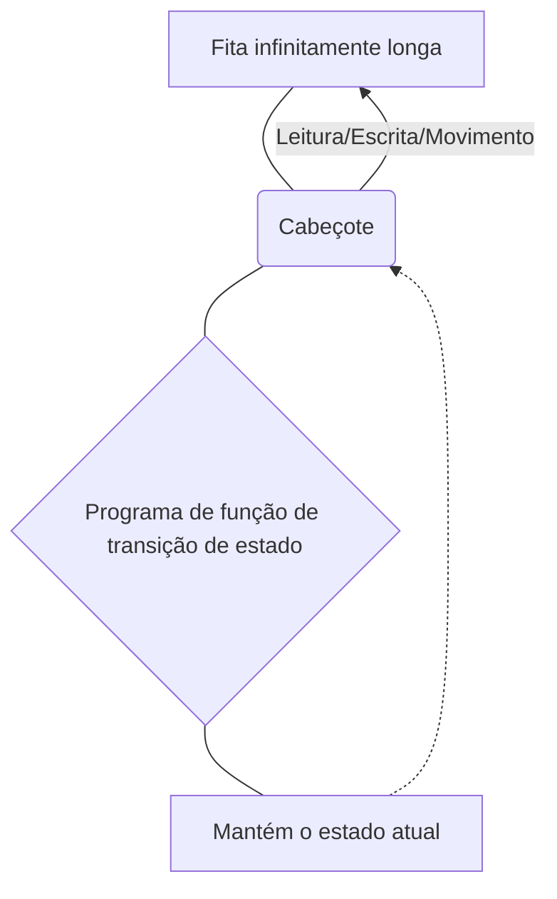
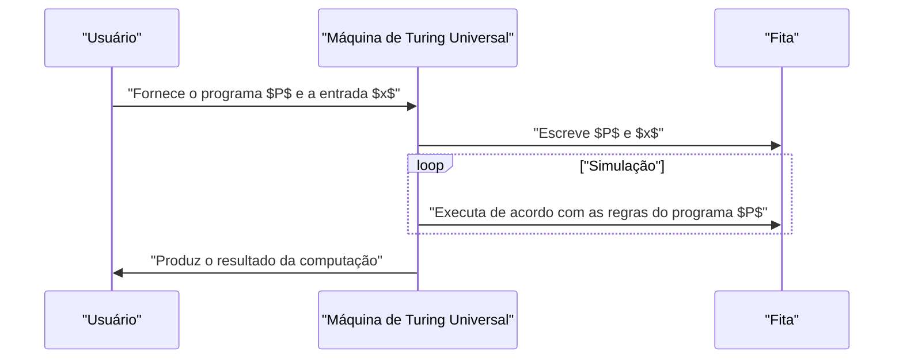

## 1. Introdução: Explorando os Limites da Computação

Os computadores que usamos diariamente, de smartphones a supercomputadores, possuem um poder de processamento surpreendente. No entanto, como você responderia à pergunta fundamental: **"Há algo que um computador não possa fazer?"**

Quem forneceu uma resposta matemática completa para essa pergunta foi **Alan Turing**, o matemático britânico conhecido como o pai da ciência da computação. Em um artigo publicado em 1936, ele concebeu um modelo computacional virtual chamado **Máquina de Turing**, provando que existem problemas neste mundo que "não podem ser resolvidos em princípio, não importa qual computador seja usado".

Neste artigo, explicaremos em detalhes como funciona a Máquina de Turing e o que é o **"Problema da Parada"**, que é de extrema importância na teoria da computabilidade.

## 2. O Que é uma Máquina de Turing?

A Máquina de Turing é um modelo matemático que simplifica ao máximo os princípios de funcionamento dos computadores modernos. Não é uma máquina física, mas o produto de um **experimento mental**, no entanto, todos os computadores modernos (computadores clássicos, excluindo computadores quânticos) têm essencialmente o mesmo poder computacional que esta Máquina de Turing.

### 2.1 Componentes de uma Máquina de Turing

Uma Máquina de Turing é composta pelos seguintes elementos:

1.  **Fita infinitamente longa** : Dividida em células, onde cada célula contém um símbolo (por exemplo, `0`, `1`, em branco, etc.). Isso corresponde à memória em computadores modernos.
2.  **Cabeçote** : Um dispositivo que pode ler e escrever em uma célula específica da fita e mover-se para a esquerda ou direita.
3.  **Registrador de estado** : Memoriza em que **estado** ([State](https://kenji.blog/pt/p/iac-infrastructure-as-code-terraform/)) a máquina se encontra atualmente.
4.  **Função de transição de estado** : Um conjunto de regras (programa) que determina o próximo símbolo a ser escrito, a direção do movimento do cabeçote (direita ou esquerda) e o próximo estado, com base no "estado" atual e no "símbolo" lido pelo cabeçote.

Abaixo está um diagrama Mermaid ilustrando o conceito de operação de uma Máquina de Turing.



### 2.2 Definição Matemática das Transições de Estado

Matematicamente, uma Máquina de Turing $M$ é definida pela seguinte tupla de 7 elementos:

$$
M = (Q, \Gamma, b, \Sigma, \delta, q_0, F)
$$

Aqui, cada símbolo representa o seguinte:
- $Q$ : Conjunto finito de estados
- $\Gamma$ : Conjunto finito de símbolos da fita
- $b \in \Gamma$ : Símbolo em branco (Blank)
- $\Sigma \subseteq \Gamma \setminus \{b\}$ : Conjunto de símbolos de entrada
- $\delta : Q \times \Gamma \rightarrow Q \times \Gamma \times \{L, R\}$ : Função de transição de estado
- $q_0 \in Q$ : Estado inicial
- $F \subseteq Q$ : Conjunto de estados de parada (aceitação)

Como um exemplo da função de transição $\delta$, quando o estado atual é $q_1$ e o símbolo lido é `0`, escrever o símbolo `1`, mover o cabeçote para a direita (Right) e mudar o estado para $q_2$ é expresso da seguinte forma:

$$
\delta(q_1, 0) = (q_2, 1, R)
$$

### 2.3 Simulação de uma Máquina de Turing em Python

Para entender o conceito mais profundamente, vamos implementar uma Máquina de Turing simples em Python. O código a seguir é uma Máquina de Turing simples que inverte o último `0` de uma string binária fornecida para `1`.

```python
class TuringMachine:
    def __init__(self, tape, blank_symbol="B", initial_state="q0"):
        self.tape = list(tape)
        self.blank_symbol = blank_symbol
        self.head_position = 0
        self.current_state = initial_state
        self.transition_function = {}

    def add_transition(self, state, read_symbol, new_state, write_symbol, direction):
        self.transition_function[(state, read_symbol)] = (new_state, write_symbol, direction)

    def step(self):
        if self.head_position < 0:
            self.tape.insert(0, self.blank_symbol)
            self.head_position = 0
        if self.head_position >= len(self.tape):
            self.tape.append(self.blank_symbol)
            
        read_symbol = self.tape[self.head_position]
        action = self.transition_function.get((self.current_state, read_symbol))
        
        if action is None:
            return False # Estado de parada

        new_state, write_symbol, direction = action
        self.tape[self.head_position] = write_symbol
        self.current_state = new_state
        
        if direction == 'R':
            self.head_position += 1
        elif direction == 'L':
            self.head_position -= 1
            
        return True

    def run(self):
        while self.step():
            pass
        return "".join(self.tape).replace(self.blank_symbol, "")

# Configuração da máquina
tm = TuringMachine("1010")
# Estado q0: sempre avança para a direita e vai para q1 quando encontra um espaço em branco
tm.add_transition("q0", "0", "q0", "0", "R")
tm.add_transition("q0", "1", "q0", "1", "R")
tm.add_transition("q0", "B", "q1", "B", "L")
# Estado q1: volta para a esquerda, muda o primeiro 0 para 1 e para (q_halt)
tm.add_transition("q1", "0", "q_halt", "1", "S") # S é uma direção simulada que significa parar

print("Fita inicial:", "1010")
result = tm.run()
print("Fita final:", result)
```

Desta forma, a manipulação e computação de strings podem ser realizadas por meio de uma combinação de regras muito simples.

## 3. A Máquina de Turing Universal e a Computabilidade

A maior conquista da Máquina de Turing foi a criação do conceito da **Máquina de Turing Universal** (Universal Turing Machine).

Uma Máquina de Turing comum tem sua função de transição de estado codificada diretamente para uma tarefa específica (fazer adição, ordenar uma string, etc.). No entanto, uma Máquina de Turing Universal pode **"ler o projeto (programa) de outra Máquina de Turing e seus dados de entrada em sua própria fita, e simular essa máquina"**.



Esta é exatamente a ideia fundamental por trás do **computador de arquitetura de programa armazenado moderno (arquitetura de von Neumann)**. A razão pela qual podemos executar vários processos apenas instalando software, sem alterar fisicamente o hardware, é porque os PCs modernos funcionam como Máquinas de Turing Universais.

O que é importante aqui é a **computabilidade** (Computability). De acordo com a definição de Turing, "uma função computável é uma função que pode ser calculada por alguma Máquina de Turing" (isso é chamado de **Tese de Church-Turing**).

## 4. O Problema da Parada (The Halting Problem)

Com a Máquina de Turing Universal, esperava-se que "qualquer cálculo pudesse ser possível dependendo do programa". No entanto, Turing usou seu próprio modelo para provar matematicamente que existem **"problemas incomputáveis"**. O exemplo mais proeminente disso é o **Problema da Parada**.

### 4.1 O que é o Problema da Parada?

O Problema da Parada é a seguinte questão:

> Dado um programa $P$ arbitrário e uma entrada $x$ para ele, se executarmos o programa $P$ com a entrada $x$, **existe um algoritmo (programa) que determina antes da execução se a computação terminará e parará em um tempo finito ou cairá em um loop infinito e nunca parará?**

À primeira vista, parece que a análise estática do código resolveria isso. No entanto, Turing usou a prova por contradição para mostrar que **"tal programa de determinação universal não pode existir em absoluto"**.

### 4.2 Resumo da Prova do Problema da Parada

Suponha que exista uma função divina `halts(program, input)` que pode determinar perfeitamente se um programa irá parar. Vamos supor que essa função retorne `True` se o programa parar e `False` se entrar em loop infinito.

Agora, criamos um programa malicioso chamado `paradox(program)` da seguinte maneira:

```python
def halts(program_code, input_data):
    # Supõe-se que essa função exista (função mágica)
    # Retorna True se parar, False se não parar
    pass

def paradox(program_code):
    # Coloca a si mesmo no avaliador
    if halts(program_code, program_code) == True:
        # Se for determinado que para, entra propositalmente em loop infinito
        while True:
            pass
    else:
        # Se for determinado que não para, para imediatamente
        return
```

O que acontece se passarmos seu próprio código `paradox` como entrada para essa função `paradox` e a executarmos?

```python
paradox(paradox)
```

1.  Se `halts(paradox, paradox)` determinar que é `True` (para):
    A função `paradox` entra no bloco `if` e entra em **loop infinito**. Em outras palavras, não para. Isso contradiz o resultado da determinação.
2.  Se `halts(paradox, paradox)` determinar que é `False` (entra em loop infinito):
    A função `paradox` entra no bloco `else` e **para imediatamente**. Isso também contradiz o resultado da determinação.

Como ambas as situações resultam em uma contradição, a premissa original de que **"uma função `halts` perfeita existe" estava incorreta**. Portanto, não existe nenhum algoritmo para resolver o Problema da Parada.

### 4.3 Representação Matemática

A expressão matemática para esta prova é a seguinte:
Seja a função $h(p, i)$ uma função que retorna $1$ se o programa $p$ parar na entrada $i$, e $0$ se não parar.

$$
h(p, i) = \begin{cases}
1 & \text{se } p(i) \text{ parar} \\\\
0 & \text{se } p(i) \text{ entrar em loop infinito}
\end{cases}
$$

Em seguida, definimos a função $g$ da seguinte maneira:

$$
g(p) = \begin{cases}
\text{loop infinito} & \text{se } h(p, p) = 1 \\\\
0 & \text{se } h(p, p) = 0
\end{cases}
$$

Aqui consideramos $g(g)$, onde o próprio $g$ é dado como entrada para $g$.
- Se $h(g, g) = 1$, então $g(g)$ entra em loop infinito (não para), o que contradiz a definição de $h$.
- Se $h(g, g) = 0$, então $g(g) = 0$ e, portanto, para, o que contradiz a definição de $h$.

Isso prova que a função $h$ é incomputável (Uncomputable).

## 5. O Impacto da Teoria da Computabilidade

O fato de que o Problema da Parada é "insolúvel" tem um impacto direto no desenvolvimento de software moderno.

Por exemplo, compiladores e ferramentas de análise estática de código verificam bugs e loops infinitos no código, mas operam sob a restrição de que **"é impossível em princípio detectar loops infinitos com 100% de precisão para todos os programas"**. Por esta razão, ferramentas de análise práticas utilizam heurísticas ou timeouts como alternativas.

Além disso, está profundamente relacionado aos **Teoremas da Incompletude de Gödel**. O fato de que "existem proposições que são verdadeiras, mas não podem ser provadas" em sistemas axiomáticos matemáticos, e que "existem problemas que são computáveis, mas não determináveis", foram descobertas complementares na lógica e na ciência da computação.

## 6. Conclusão

A Máquina de Turing, apesar de sua estrutura extremamente simples, é um belo modelo matemático que capturou perfeitamente a essência do que é a computação.

-   A **Máquina de Turing** é composta apenas por uma fita infinita e regras de transição de estado, possuindo um poder computacional equivalente ao dos computadores modernos.
-   A **Máquina de Turing Universal** deu origem ao conceito de software (programa) e tornou-se a pedra angular dos computadores modernos.
-   O **Problema da Parada** provou que "não existe um algoritmo universal capaz de analisar qualquer programa", demonstrando claramente os limites da computação.

Conhecer a **"linha limite da computação"** traçada por Alan Turing é considerado uma alfabetização essencial nas discussões sobre os desafios de programação que enfrentamos todos os dias ou até onde a evolução da IA pode chegar.

(*Nota: Este artigo explica o conceito da teoria da computabilidade e, para a prova matemática rigorosa, consulte livros técnicos especializados.)
