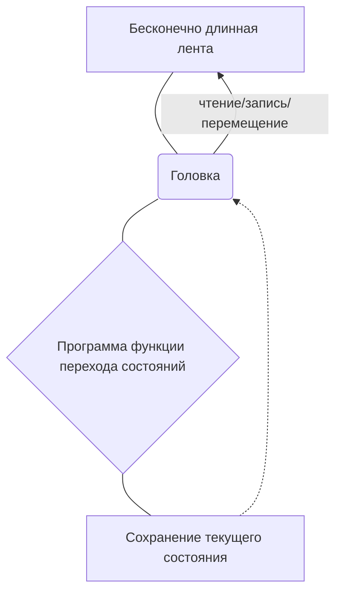
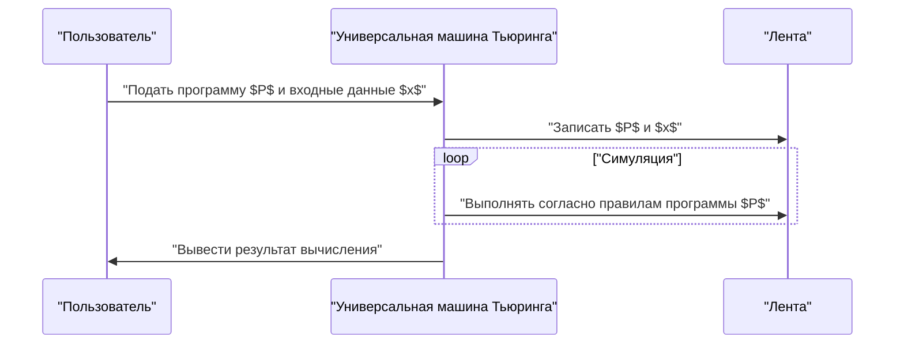

## 1. Введение: Исследование пределов вычислений

Компьютеры, которые мы используем ежедневно, от смартфонов до суперкомпьютеров, обладают невероятной вычислительной мощностью. Однако, как бы вы ответили на фундаментальный вопрос: **«Есть ли что-то, что компьютеры не могут сделать?»**

Полный математический ответ на этот вопрос дал британский математик и отец информатики **Алан Тьюринг** (Alan Turing). В своей статье, опубликованной в 1936 году, он предложил виртуальную вычислительную модель, названную **машиной Тьюринга**, и доказал, что существуют «проблемы, которые в принципе не могут быть решены с использованием любого компьютера» в этом мире.

В этой статье мы подробно объясним, как работает машина Тьюринга и что такое **«проблема остановки»**, которая является чрезвычайно важной в теории вычислимости.

## 2. Что такое машина Тьюринга?

Машина Тьюринга — это математическая модель, которая до предела упрощает принципы работы современных компьютеров. Это не физическая машина, а скорее продукт **мысленного эксперимента**, но все современные компьютеры (классические компьютеры, за исключением квантовых) обладают вычислительной мощностью, которая по сути эквивалентна этой машине Тьюринга.

### 2.1 Компоненты машины Тьюринга

Машина Тьюринга состоит из следующих элементов:

1.  **Бесконечно длинная лента** : Разделена на ячейки, в каждую из которых записывается символ (например, `0`, `1`, пробел и т.д.). Это эквивалентно памяти в современных компьютерах.
2.  **Головка** : Устройство, которое может считывать и записывать в определенную ячейку на ленте, а также перемещаться влево и вправо.
3.  **Регистр состояний** : Запоминает, в каком **состоянии** ([State](https://kenji.blog/ru/p/iac-infrastructure-as-code-terraform/)) находится машина в данный момент.
4.  **Функция перехода состояний** : Правило (программа), которое определяет следующий символ для записи, направление движения головки (вправо или влево) и следующее состояние на основе текущего «состояния» и «символа», прочитанного головкой.

Ниже приведена диаграмма Mermaid, показывающая концепцию работы машины Тьюринга.



### 2.2 Математическое определение переходов состояний

Машина Тьюринга $M$ математически определяется как следующий кортеж из 7 элементов:

$$
M = (Q, \Gamma, b, \Sigma, \delta, q_0, F)
$$

Здесь каждый символ представляет следующее:
- $Q$ : Конечное множество состояний
- $\Gamma$ : Конечное множество символов ленты
- $b \in \Gamma$ : Пустой символ (Blank)
- $\Sigma \subseteq \Gamma \setminus \{b\}$ : Множество входных символов
- $\delta : Q \times \Gamma \rightarrow Q \times \Gamma \times \{L, R\}$ : Функция перехода состояний
- $q_0 \in Q$ : Начальное состояние
- $F \subseteq Q$ : Множество конечных (допускающих) состояний

В качестве примера функции перехода $\delta$, когда текущее состояние $q_1$, а прочитанный символ — `0`, если мы записываем символ `1`, перемещаем головку вправо (Right) и меняем состояние на $q_2$, это выражается следующим образом:

$$
\delta(q_1, 0) = (q_2, 1, R)
$$

### 2.3 Симуляция машины Тьюринга на Python

Чтобы глубже понять эту концепцию, давайте реализуем простую машину Тьюринга на Python. Следующий код представляет собой простую машину Тьюринга, которая инвертирует конечный `0` во введенной строке двоичных чисел на `1`.

```python
class TuringMachine:
    def __init__(self, tape, blank_symbol="B", initial_state="q0"):
        self.tape = list(tape)
        self.blank_symbol = blank_symbol
        self.head_position = 0
        self.current_state = initial_state
        self.transition_function = {}

    def add_transition(self, state, read_symbol, new_state, write_symbol, direction):
        self.transition_function[(state, read_symbol)] = (new_state, write_symbol, direction)

    def step(self):
        if self.head_position < 0:
            self.tape.insert(0, self.blank_symbol)
            self.head_position = 0
        if self.head_position >= len(self.tape):
            self.tape.append(self.blank_symbol)
            
        read_symbol = self.tape[self.head_position]
        action = self.transition_function.get((self.current_state, read_symbol))
        
        if action is None:
            return False # Состояние остановки

        new_state, write_symbol, direction = action
        self.tape[self.head_position] = write_symbol
        self.current_state = new_state
        
        if direction == 'R':
            self.head_position += 1
        elif direction == 'L':
            self.head_position -= 1
            
        return True

    def run(self):
        while self.step():
            pass
        return "".join(self.tape).replace(self.blank_symbol, "")

# Настройка машины
tm = TuringMachine("1010")
# Состояние q0: Всегда двигаться вправо, если найден пробел, перейти в q1
tm.add_transition("q0", "0", "q0", "0", "R")
tm.add_transition("q0", "1", "q0", "1", "R")
tm.add_transition("q0", "B", "q1", "B", "L")
# Состояние q1: Вернуться влево, изменить первый 0 на 1 и остановиться (q_halt)
tm.add_transition("q1", "0", "q_halt", "1", "S") # S означает фиктивное направление, обозначающее остановку

print("Начальная лента:", "1010")
result = tm.run()
print("Конечная лента:", result)
```

Таким образом, манипуляции со строками и вычисления могут выполняться с помощью очень простых комбинаций правил.

## 3. Универсальная машина Тьюринга и вычислимость

Самым большим достижением машины Тьюринга стало создание концепции **универсальной машины Тьюринга** (Universal Turing Machine).

Обычные машины Тьюринга имеют функцию перехода состояний, жестко запрограммированную для выполнения определенной задачи (например, сложения, сортировки строк и т.д.). Однако универсальная машина Тьюринга может **«считать чертеж (программу) другой машины Тьюринга и её входные данные на свою собственную ленту и симулировать эту машину»**.



Это именно та идея, которая лежит в основе **современных компьютеров с хранимой в памяти программой (архитектура фон Неймана)**. Причина, по которой мы можем выполнять различные операции, просто устанавливая программное обеспечение без физического изменения аппаратного обеспечения, заключается в том, что современные ПК функционируют как универсальные машины Тьюринга.

Здесь важна **вычислимость** (Computability). Согласно определению Тьюринга, «вычислимая функция — это функция, которая может быть вычислена некоторой машиной Тьюринга» (это называется **тезисом Чёрча — Тьюринга**).

## 4. Проблема остановки (The Halting Problem)

Благодаря универсальной машине Тьюринга ожидалось: «Разве любое вычисление не станет возможным в зависимости от программы?». Однако Тьюринг, используя свою модель, математически доказал, что существуют **«невычислимые проблемы»**. Ярким примером этого является **проблема остановки**.

### 4.1 Что такое проблема остановки?

Проблема остановки — это следующий вопрос:

> Для любой заданной программы $P$ и входных данных $x$ для этой программы, **существует ли алгоритм (программа), который перед выполнением определяет, завершит ли программа $P$ свои вычисления и остановится ли за конечное время при подаче входных данных $x$, или она попадет в бесконечный цикл и никогда не остановится?**

На первый взгляд кажется, что статический анализ кода может дать ответ. Однако Тьюринг доказал от противного, что **«такая универсальная программа-анализатор абсолютно не существует»**.

### 4.2 Краткое описание доказательства проблемы остановки

Предположим, существует подобная богу функция `halts(program, input)`, которая может точно определить, остановится ли программа. Предположим, что эта функция возвращает `True`, если программа останавливается, и `False`, если она уходит в бесконечный цикл.

Здесь мы создаем такую коварную программу `paradox(program)`.

```python
def halts(program_code, input_data):
    # Предполагается, что эта функция существует (магическая функция)
    # Возвращает True, если останавливается, False, если не останавливается
    pass

def paradox(program_code):
    # Пропустить себя через анализатор
    if halts(program_code, program_code) == True:
        # Если определено, что остановится, намеренно войти в бесконечный цикл
        while True:
            pass
    else:
        # Если определено, что не остановится, немедленно остановиться
        return
```

Теперь, что произойдет, если мы передадим собственный код `paradox` в качестве входных данных этой функции `paradox` и выполним ее?

```python
paradox(paradox)
```

1.  Если `halts(paradox, paradox)` определяет `True` (останавливается):
    Функция `paradox` входит в блок `if` и уходит в **бесконечный цикл**. То есть она не останавливается. Это противоречит результату оценки.
2.  Если `halts(paradox, paradox)` определяет `False` (уходит в бесконечный цикл):
    Функция `paradox` входит в блок `else` и **немедленно останавливается**. Это также противоречит результату оценки.

Поскольку противоречие возникает в любом случае, первоначальное предположение о том, что **«существует идеальная функция `halts`», было неверным**. Таким образом, алгоритма для решения проблемы остановки не существует.

### 4.3 Математическое выражение

Это доказательство можно выразить в математической нотации следующим образом.
Функция $h(p, i)$ будет функцией, которая возвращает $1$, если программа $p$ останавливается при входных данных $i$, и $0$, если она не останавливается.

$$
h(p, i) = \begin{cases}
1 & \text{если } p(i) \text{ останавливается} \\\\
0 & \text{если } p(i) \text{ зацикливается бесконечно}
\end{cases}
$$

Затем мы определяем следующую функцию $g$.

$$
g(p) = \begin{cases}
\text{зацикливается бесконечно} & \text{если } h(p, p) = 1 \\\\
0 & \text{если } h(p, p) = 0
\end{cases}
$$

Здесь рассмотрим $g(g)$, где $g$ передается в качестве входных данных самой себе.
- Если $h(g, g) = 1$, то $g(g)$ становится бесконечным циклом (не останавливается), что противоречит определению $h$.
- Если $h(g, g) = 0$, то $g(g) = 0$ и останавливается, что противоречит определению $h$.

Этим доказывается, что функция $h$ является невычислимой (Uncomputable).

## 5. Влияние теории вычислимости

Тот факт, что проблема остановки «нерешаема», оказывает прямое влияние на современную разработку программного обеспечения.

Например, компиляторы и инструменты статического анализа кода проверяют код на наличие ошибок или бесконечных циклов, но они работают с ограничением: **«принципиально невозможно со 100% точностью обнаружить бесконечные циклы для всех программ»**. Поэтому практические инструменты анализа принимают компромиссные решения с использованием эвристик и таймаутов.

Она также тесно связана с **теоремами Гёделя о неполноте**. Тот факт, что «существуют утверждения, которые истинны, но не могут быть доказаны» в математических системах аксиом, и тот факт, что «существуют проблемы, которые вычислимы, но неразрешимы», были двумя сторонами одной медали в логике и информатике.

## 6. Заключение

Машина Тьюринга — это прекрасная математическая модель, которая, несмотря на свою невероятно простую структуру, идеально уловила суть акта вычислений.

-   **Машина Тьюринга** состоит только из бесконечной ленты и правил перехода состояний, но обладает вычислительной мощностью, эквивалентной современным компьютерам.
-   **Универсальная машина Тьюринга** породила концепцию программного обеспечения (программ) и стала краеугольным камнем современных компьютеров.
-   **Проблема остановки** доказала, что «не существует универсального алгоритма, который мог бы гарантированно проанализировать любую программу», тем самым четко обозначив пределы вычислений.

В дискуссиях о проблемах программирования, с которыми мы сталкиваемся ежедневно, и о том, как далеко может зайти эволюция ИИ, понимание **«линии пределов вычислений»**, проведенной Аланом Тьюрингом, можно назвать чрезвычайно важным уровнем эрудиции.

(※Эта статья представляет собой обзор теории вычислимости. Для строгих математических доказательств, пожалуйста, обратитесь к специализированным книгам.)
