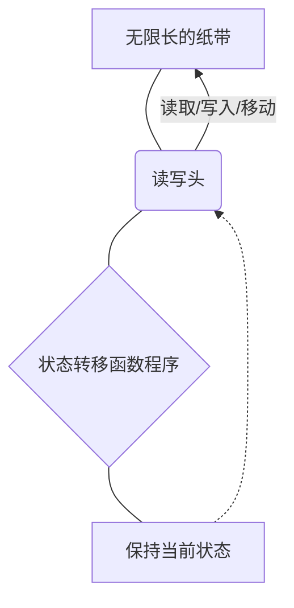
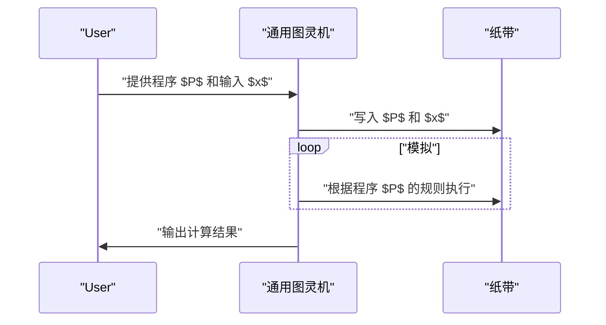

## 1. 引言：探索计算的极限

从智能手机到超级计算机，我们日常使用的计算机拥有惊人的处理能力。然而，对于 **“计算机有做不到的事情吗？”** 这个根本性的问题，你会如何回答呢？

对此给出在数学上完美解答的，是英国数学家、被称为[计算机科学之父](/zh-cn/p/biography-donald-knuth/)的 **艾伦·图灵** (Alan Turing)。他在 1936 年发表的论文中，提出了名为 **图灵机** 的虚拟计算模型，并证明了世界上存在“无论使用什么计算机，在原理上都无法解决的问题”。

本文将详细探讨图灵机是如何运作的，以及在可计算性理论中极其重要的 **“[停机问题](/zh-cn/p/halting-problem/)”** 究竟是什么。

## 2. 图灵机是什么？

图灵机是将现代计算机的运作原理简化到极致的数学模型。它并非物理机器，而纯粹是 **思想实验** 的产物，但现代所有计算机（除量子计算机外的经典计算机）本质上都具备与图灵机等价的计算能力。

### 2.1 图灵机的组成要素

图灵机由以下要素组成：

1.  **无限长的纸带** ：被划分为方格（单元格），每个方格中写入符号（例如 `0`、`1`、空格等）。这相当于现代计算机中的内存。
2.  **读写头** ：可以在纸带上的特定方格进行读写，并能左右移动的装置。
3.  **状态寄存器** ：记录机器当前处于什么 **状态** ([State](https://kenji.blog/zh-cn/p/iac-infrastructure-as-code-terraform/))。
4.  **状态转移函数** ：根据当前的“状态”和读写头读取的“符号”，决定接下来要写入的符号、读写头的移动方向（向右或向左），以及下一个状态的规则（程序）。

下面是展示图灵机运作概念的 Mermaid 图：



### 2.2 状态转移的数学定义

图灵机 $M$ 在数学上定义为如下的七元组：

$$
M = (Q, \Gamma, b, \Sigma, \delta, q_0, F)
$$

这里，各个符号代表如下含义：
- $Q$ : 状态的有限集合
- $\Gamma$ : 纸带符号的有限集合
- $b \in \Gamma$ : 空白符号 (Blank)
- $\Sigma \subseteq \Gamma \setminus \{b\}$ : 输入符号的集合
- $\delta : Q \times \Gamma \rightarrow Q \times \Gamma \times \{L, R\}$ : 状态转移函数
- $q_0 \in Q$ : 初始状态
- $F \subseteq Q$ : 停机（接受）状态的集合

作为转移函数 $\delta$ 的例子，当当前状态为 $q_1$，读取的符号为 `0` 时，写入符号 `1`，读写头向右 (Right) 移动，并将状态改变为 $q_2$ 的情况可表示如下：

$$
\delta(q_1, 0) = (q_2, 1, R)
$$

### 2.3 使用 Python 模拟图灵机

为了更深入地理解概念，让我们用 Python 实现一个简单的图灵机。以下代码是一个简单的图灵机，它将输入的二进制字符串末尾的 `0` 反转为 `1`。

```python
class TuringMachine:
    def __init__(self, tape, blank_symbol="B", initial_state="q0"):
        self.tape = list(tape)
        self.blank_symbol = blank_symbol
        self.head_position = 0
        self.current_state = initial_state
        self.transition_function = {}

    def add_transition(self, state, read_symbol, new_state, write_symbol, direction):
        self.transition_function[(state, read_symbol)] = (new_state, write_symbol, direction)

    def step(self):
        if self.head_position < 0:
            self.tape.insert(0, self.blank_symbol)
            self.head_position = 0
        if self.head_position >= len(self.tape):
            self.tape.append(self.blank_symbol)
            
        read_symbol = self.tape[self.head_position]
        action = self.transition_function.get((self.current_state, read_symbol))
        
        if action is None:
            return False # 停机状态

        new_state, write_symbol, direction = action
        self.tape[self.head_position] = write_symbol
        self.current_state = new_state
        
        if direction == 'R':
            self.head_position += 1
        elif direction == 'L':
            self.head_position -= 1
            
        return True

    def run(self):
        while self.step():
            pass
        return "".join(self.tape).replace(self.blank_symbol, "")

# 机器的设置
tm = TuringMachine("1010")
# 状态q0: 一直向右移动，找到空格后进入q1
tm.add_transition("q0", "0", "q0", "0", "R")
tm.add_transition("q0", "1", "q0", "1", "R")
tm.add_transition("q0", "B", "q1", "B", "L")
# 状态q1: 向左返回，将第一个0变为1后停机(q_halt)
tm.add_transition("q1", "0", "q_halt", "1", "S") # S代表停机的虚拟方向

print("初始纸带:", "1010")
result = tm.run()
print("最终纸带:", result)
```

像这样，通过非常简单的规则组合，就可以进行字符串的操作和计算。

## 3. 通用图灵机与可计算性

图灵机最大的成就是催生了 **通用图灵机** (Universal Turing Machine) 的概念。

普通的图灵机是专门针对特定任务（如加法运算、字符串排序等）将状态转移函数硬编码的。但是，通用图灵机能够 **“将其他图灵机的设计图（程序）及其输入数据，读取到自己的纸带上，并模拟该机器的运行”** 。



这正是 **现代内存储序式计算机（冯·诺伊曼架构）** 基础的理念。我们不需要在物理上改变硬件，只需安装软件就能执行各种处理，正是因为现代 PC 具备了作为通用图灵机的功能。

这里的关键在于 **可计算性** (Computability)。根据图灵的定义，“可计算的函数，是指能被某个图灵机计算出来的函数”（这被称为 **丘奇-图灵论题** ）。

## 4. 停机问题 (The Halting Problem)

通过通用图灵机，人们曾期待“是否只要有程序，任何计算都能实现？”。然而，图灵利用他自己的模型，在数学上证明了存在 **“不可计算的问题”** 。其代表性的例子就是 **[停机问题](/zh-cn/p/halting-problem/)** 。

### 4.1 停机问题是什么？

[停机问题](/zh-cn/p/halting-problem/)是如下的疑问：

> 当给定任意程序 $P$ 及其输入 $x$ 时，是否存在一个算法（程序），**能够在运行前判定程序 $P$ 在给定输入 $x$ 的情况下，是在有限时间内结束计算并停机，还是陷入无限循环永远不停机？** 

乍看之下，似乎通过静态分析代码就能得出结果。但是，图灵使用反证法证明了 **“这样万能的判定程序是绝对不存在的”** 。

### 4.2 停机问题证明的概述

假设存在一个像神一样的函数 `halts(program, input)`，它能完全判定某个程序是否会停机。假设该函数在程序停机时返回 `True`，在无限循环时返回 `False`。

在这里，我们创建一个如下所示刁钻的程序 `paradox(program)`。

```python
def halts(program_code, input_data):
    # 假设这个函数存在（魔法般的函数）
    # 如果停机返回True，如果不停机返回False
    pass

def paradox(program_code):
    # 将自身输入判定器
    if halts(program_code, program_code) == True:
        # 如果判定为停机，则故意进入无限循环
        while True:
            pass
    else:
        # 如果判定为不停机，则立即停机
        return
```

那么，如果将 `paradox` 函数自身的代码 `paradox` 作为输入传递给这个 `paradox` 函数并执行，会发生什么呢？

```python
paradox(paradox)
```

1.  如果 `halts(paradox, paradox)` 判定为 `True`（停机）：
    `paradox` 函数将进入 `if` 块，并 **无限循环** 。也就是说，它不会停机。这与判定结果矛盾。
2.  如果 `halts(paradox, paradox)` 判定为 `False`（无限循环）：
    `paradox` 函数将进入 `else` 块，并 **立即停机** 。这也与判定结果矛盾。

无论怎样都会产生矛盾，因此最初的假设 **“存在完美的 `halts` 函数”这一前提是错误的** 。所以，解决[停机问题](/zh-cn/p/halting-problem/)的算法不存在。

### 4.3 使用数学公式的表达

如果用数学符号来表达这个证明，如下所示。
设函数 $h(p, i)$ 为：当程序 $p$ 在输入 $i$ 下停机时返回 $1$，不停机时返回 $0$ 的函数。

$$
h(p, i) = \begin{cases}
1 & \text{如果 } p(i) \text{ 停机} \\\\
0 & \text{如果 } p(i) \text{ 永远循环}
\end{cases}
$$

接着，我们定义如下函数 $g$：

$$
g(p) = \begin{cases}
\text{永远循环} & \text{如果 } h(p, p) = 1 \\\\
0 & \text{如果 } h(p, p) = 0
\end{cases}
$$

现在考虑将 $g$ 自身作为输入提供给 $g$ 得到的 $g(g)$。
- 如果 $h(g, g) = 1$，那么 $g(g)$ 将无限循环（不停机），与 $h$ 的定义矛盾。
- 如果 $h(g, g) = 0$，那么 $g(g) = 0$ 并停机，与 $h$ 的定义矛盾。

由此证明了函数 $h$ 是不可计算的 (Uncomputable)。

## 5. 可计算性理论带来的影响

[停机问题](/zh-cn/p/halting-problem/)“不可解”这一事实，也直接影响了现代的软件开发。

例如，编译器和静态代码分析工具虽然能帮我们检查代码是否有 bug，是否会陷入无限循环，但它们都是在 **“在原理上不可能对所有程序都 100% 准确地检测出无限循环”** 这一限制下运行的。因此，实用的分析工具通常采用基于启发式或超时的折中方案。

此外，这与 **[哥德尔不完备定理](/zh-cn/p/godels-incompleteness-theorems/)** 也有着很深的关系。在数学公理系统中“存在为真却无法证明的命题”，与“存在可计算但无法判定的问题”，是逻辑学与计算机科学中如出一辙的发现。

## 6. 总结

图灵机虽然结构非常简单，却完美地捕捉了计算行为本质，是一个优美的数学模型。

-   **图灵机** 仅由无限长的纸带和状态转移规则构成，拥有与现代计算机同等的计算能力。
-   **通用图灵机** 孕育了软件（程序）的概念，成为了现代计算机的基石。
-   **[停机问题](/zh-cn/p/halting-problem/)** 证明了“不存在能必定解析任何程序的万能算法”，明确了计算的极限。

在我们面对每天的编程难题，或者探讨 AI 的进化能达到何种程度时，了解艾伦·图灵划下的 **“计算极限之线”** ，可以说是一项极为重要的教养。

（※本文旨在说明可计算性理论的概要，关于严密的数学证明请参阅专业书籍。）
