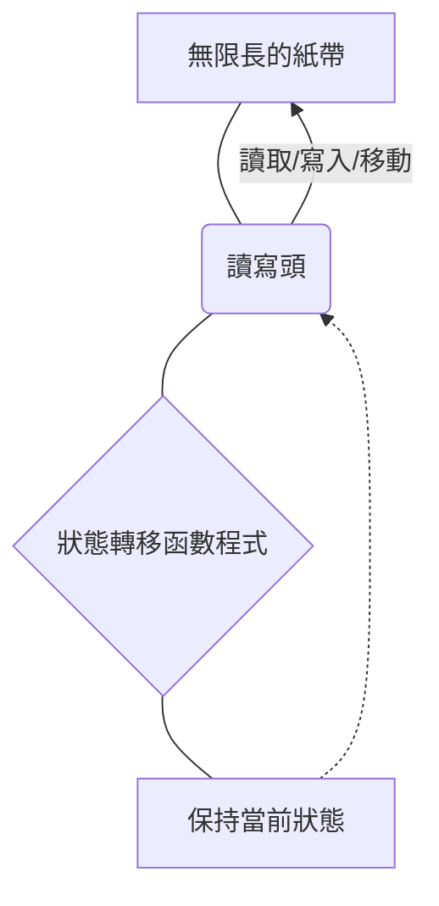
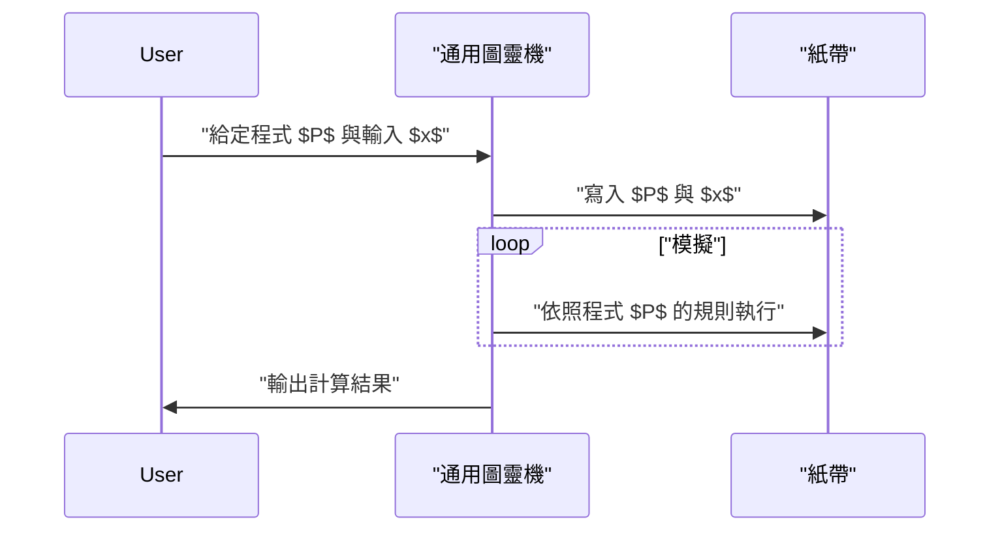

## 1. 簡介：探索計算的極限

我們日常使用的電腦，從智慧型手機到超級電腦，都擁有驚人的處理能力。然而，對於 **「電腦有沒有做不到的事？」** 這個根本性的問題，你會如何回答呢？

對這個問題給出數學上完整解答的，是英國數學家、被譽為電腦科學之父的 **艾倫·圖靈** (Alan Turing)。他在 1936 年發表的論文中，提出了一種名為 **圖靈機** 的虛擬計算模型，並證明了世界上存在著「無論使用任何電腦，在原理上都無法解決的問題」。

本文將詳細解說圖靈機是如何運作的，以及在可計算性理論中極為重要的 **「停機問題」** 到底是什麼。

## 2. 圖靈機是什麼？

圖靈機是將現代電腦運作原理簡化到極致的數學模型。它不是一台實體的機器，而純粹是 **思想實驗** 的產物，但現代所有的電腦（除量子電腦外的古典電腦），本質上都擁有與這台圖靈機等價的計算能力。

### 2.1 圖靈機的構成要素

圖靈機由以下要素組成：

1.  **無限長的紙帶** ：被劃分為一個個格子，每個格子中會寫入符號（例如 `0`、`1`、空白等）。這相當於現代電腦中的記憶體。
2.  **讀寫頭** ：可以在紙帶上的特定格子讀取與寫入，並能左右移動的裝置。
3.  **狀態暫存器** ：記憶機器目前處於什麼樣的 **狀態** ([State](https://kenji.blog/zh-tw/p/iac-infrastructure-as-code-terraform/))。
4.  **狀態轉移函數** ：根據目前的「狀態」以及讀寫頭讀取到的「符號」，來決定接下來要寫入的符號、讀寫頭的移動方向（向右或向左），以及下一個狀態的規則（程式）。

以下是展示圖靈機運作概念的 Mermaid 圖。



### 2.2 狀態轉移的數學定義

圖靈機 $M$ 在數學上被定義為如下的七元組：

$$
M = (Q, \Gamma, b, \Sigma, \delta, q_0, F)
$$

其中，各個符號代表以下意義：
- $Q$ : 狀態的有限集合
- $\Gamma$ : 紙帶符號的有限集合
- $b \in \Gamma$ : 空白符號 (Blank)
- $\Sigma \subseteq \Gamma \setminus \{b\}$ : 輸入符號的集合
- $\delta : Q \times \Gamma \rightarrow Q \times \Gamma \times \{L, R\}$ : 狀態轉移函數
- $q_0 \in Q$ : 初始狀態
- $F \subseteq Q$ : 停止（接受）狀態的集合

作為轉移函數 $\delta$ 的一個例子，當目前狀態為 $q_1$ 且讀取到的符號為 `0` 時，寫入符號 `1`，將讀寫頭向右 (Right) 移動，並將狀態改變為 $q_2$ 的情況可以表示如下：

$$
\delta(q_1, 0) = (q_2, 1, R)
$$

### 2.3 使用 Python 模擬圖靈機

為了更深入理解這個概念，讓我們用 Python 實作一個簡單的圖靈機。以下程式碼是一個簡單的圖靈機，它會將輸入的二進位字串末尾的 `0` 反轉為 `1`。

```python
class TuringMachine:
    def __init__(self, tape, blank_symbol="B", initial_state="q0"):
        self.tape = list(tape)
        self.blank_symbol = blank_symbol
        self.head_position = 0
        self.current_state = initial_state
        self.transition_function = {}

    def add_transition(self, state, read_symbol, new_state, write_symbol, direction):
        self.transition_function[(state, read_symbol)] = (new_state, write_symbol, direction)

    def step(self):
        if self.head_position < 0:
            self.tape.insert(0, self.blank_symbol)
            self.head_position = 0
        if self.head_position >= len(self.tape):
            self.tape.append(self.blank_symbol)
            
        read_symbol = self.tape[self.head_position]
        action = self.transition_function.get((self.current_state, read_symbol))
        
        if action is None:
            return False # 停止狀態

        new_state, write_symbol, direction = action
        self.tape[self.head_position] = write_symbol
        self.current_state = new_state
        
        if direction == 'R':
            self.head_position += 1
        elif direction == 'L':
            self.head_position -= 1
            
        return True

    def run(self):
        while self.step():
            pass
        return "".join(self.tape).replace(self.blank_symbol, "")

# 機器的初始設定
tm = TuringMachine("1010")
# 狀態q0: 始終向右前進，找到空白就進入q1
tm.add_transition("q0", "0", "q0", "0", "R")
tm.add_transition("q0", "1", "q0", "1", "R")
tm.add_transition("q0", "B", "q1", "B", "L")
# 狀態q1: 回到左邊，將第一個0變成1後停止(q_halt)
tm.add_transition("q1", "0", "q_halt", "1", "S") # S代表停止的假方向

print("初始紙帶:", "1010")
result = tm.run()
print("最終紙帶:", result)
```

像這樣，透過非常簡單的規則組合，就能夠進行字串的操作與計算。

## 3. 通用圖靈機與可計算性

圖靈機最大的貢獻在於，它催生了 **通用圖靈機** (Universal Turing Machine) 的概念。

普通的圖靈機是針對特定任務（例如進行加法、字串排序等）硬編碼了狀態轉移函數。然而，通用圖靈機能夠 **「將另一台圖靈機的設計圖（程式）與其輸入資料讀入自己的紙帶中，並模擬那台機器的運作」** 。



這正是 **現代內建程式型電腦（馮·紐曼架構）** 基礎的理念。我們不需要實體更改硬體，只要安裝軟體就能執行各種處理，這正是因為現代 PC 發揮了作為通用圖靈機的功能。

這裡重要的一點是 **可計算性** (Computability)。根據圖靈的定義，「所謂可計算的函數，就是能夠由某台圖靈機計算出來的函數」（這被稱為 **邱奇-圖靈論題** ）。

## 4. 停機問題 (The Halting Problem)

隨著通用圖靈機的出現，人們開始期待「只要透過程式，任何計算不就都能實現了嗎？」。但是，圖靈使用他自己的模型，數學上證明了 **「無法計算的問題」** 是存在的。其代表性的例子就是 **停機問題** 。

### 4.1 停機問題是什麼？

停機問題就是下面這樣的一個提問：

> 給定任意一個程式 $P$ 以及該程式的輸入 $x$，當我們將輸入 $x$ 交給程式 $P$ 執行時， **是否存在一個能在執行前判定它是會在有限時間內結束計算並停止，還是會陷入無限迴圈而永遠不會停止的演算法（程式）呢？** 

乍看之下，似乎只要對程式碼進行靜態分析就能知道答案。然而，圖靈運用反證法證明了 **「那種萬能的判定程式是絕對不存在的」** 。

### 4.2 停機問題證明的概要

假設存在一個像神一樣的函數 `halts(program, input)`，它可以完美判定某個程式是否會停止。假設這個函數在程式會停止時回傳 `True`，在陷入無限迴圈時回傳 `False`。

接著，我們建立一個像下面這樣充滿惡意的程式 `paradox(program)`。

```python
def halts(program_code, input_data):
    # 假設這個函數存在（魔法函數）
    # 停止的話回傳True, 不停止的話回傳False
    pass

def paradox(program_code):
    # 將自己本身交給判定器處理
    if halts(program_code, program_code) == True:
        # 如果被判定為會停止，就刻意進入無限迴圈
        while True:
            pass
    else:
        # 如果被判定為不會停止，就馬上停止
        return
```

那麼，如果我們將 `paradox` 函數本身的程式碼 `paradox` 作為輸入傳給它並執行，會發生什麼事呢？

```python
paradox(paradox)
```

1.  如果 `halts(paradox, paradox)` 判定為 `True`（會停止）：
    `paradox` 函數會進入 `if` 區塊，並陷入 **無限迴圈** 。也就是說它不會停止。這與判定結果產生了矛盾。
2.  如果 `halts(paradox, paradox)` 判定為 `False`（會無限迴圈）：
    `paradox` 函數會進入 `else` 區塊，並 **馬上停止** 。這也與判定結果產生了矛盾。

無論結果倒向哪一邊都會產生矛盾，因此這代表最初的假設 **「存在一個完美的 `halts` 函數」這個前提是錯誤的** 。所以，解決停機問題的演算法並不存在。

### 4.3 透過數學公式表示

如果將這個證明以數學符號表示，則會變成如下形式。
我們將函數 $h(p, i)$ 定義為：當程式 $p$ 在輸入 $i$ 時會停止則回傳 $1$，不停止則回傳 $0$ 的函數。

$$
h(p, i) = \begin{cases}
1 & \text{如果 } p(i) \text{ 停止} \\\\
0 & \text{如果 } p(i) \text{ 無限迴圈}
\end{cases}
$$

接著，我們定義如下的函數 $g$：

$$
g(p) = \begin{cases}
\text{無限迴圈} & \text{如果 } h(p, p) = 1 \\\\
0 & \text{如果 } h(p, p) = 0
\end{cases}
$$

這時我們考慮將 $g$ 自身作為輸入傳給 $g$ 的 $g(g)$。
- 如果 $h(g, g) = 1$，那麼 $g(g)$ 就會陷入無限迴圈（不停止），這與 $h$ 的定義矛盾。
- 如果 $h(g, g) = 0$，那麼 $g(g) = 0$ 並停止，這與 $h$ 的定義矛盾。

由此證明，函數 $h$ 是不可計算的 (Uncomputable)。

## 5. 可計算性理論帶來的影響

停機問題「無法解開」的這個事實，也對現代的軟體開發帶來了直接的影響。

舉例來說，編譯器或靜態程式碼分析工具雖然能幫我們檢查程式碼中是否有 Bug 或是否會陷入無限迴圈，但這些都是在 **「對於所有程式，要在原理上 100% 準確地檢測出無限迴圈是不可能的」** 這個限制下運作的。因此，實用的分析工具都會採用啟發式方法 (Heuristics) 或超時機制 (Timeout) 作為折衷方案。

此外，這也與 **哥德爾不完備定理** 有著深厚的關聯。在數學公理系統中「存在為真卻無法證明的命題」，以及「存在可計算卻無法判定的問題」，這兩者是邏輯學與計算機科學中一體兩面的發現。

## 6. 總結

圖靈機雖然構造極其簡單，卻是完美捕捉了計算行為本質的美麗數學模型。

-   **圖靈機** 僅由無限的紙帶與狀態轉移規則構成，卻擁有與現代電腦同等的計算能力。
-   **通用圖靈機** 催生了軟體（程式）的概念，成為了現代電腦的基石。
-   **停機問題** 證明了「不存在能夠必然分析所有程式的萬能演算法」，明確地指出了計算的極限。

在我們日常面臨的程式設計難題，或是探討 AI 的進化究竟能達到什麼境界的討論中，了解艾倫·圖靈所劃下的 **「計算極限線」** ，可以說是非常重要的素養。

（※本文旨在說明可計算性理論的概要，關於嚴格的數學證明，請參考相關的專業書籍。）
