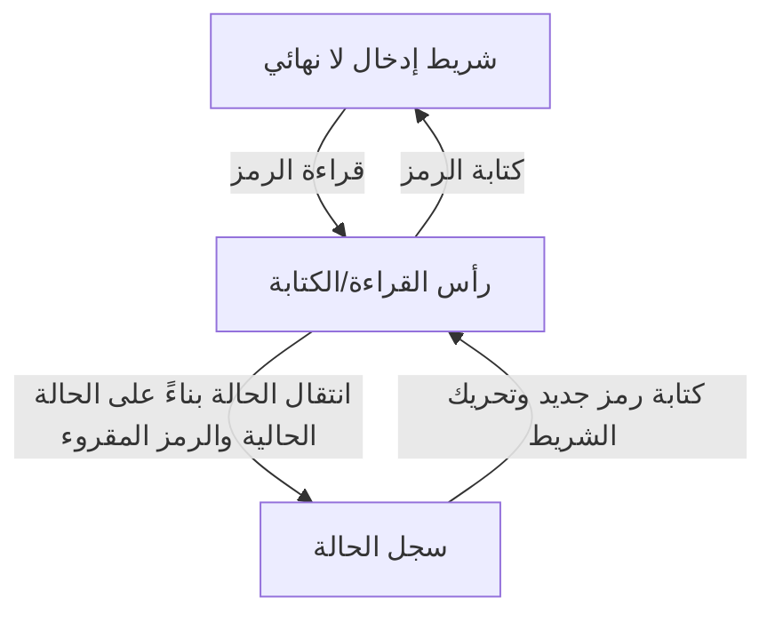
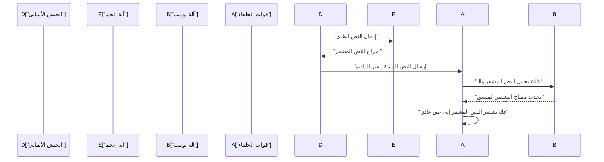
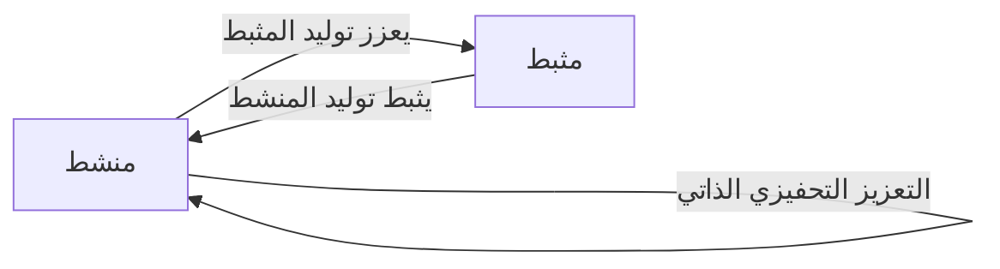

# 1. مقدمة

كان آلان ماتيسون تورينج عالم رياضيات بريطانيًا أرسى أسس علوم الكمبيوتر الحديثة والذكاء الاصطناعي وعلم الأحياء الرياضي. أصبحت **آلة تورينج** التي ابتكرها النموذج النظري لكل جهاز كمبيوتر نستخدمه اليوم. في هذا المقال، سنستكشف بالتفصيل حياة تورينج المضطربة والإنجازات الرياضية والعلمية العظيمة التي تركها وراءه. لولا وجوده، لكان مجتمعنا الرقمي الحديث مختلفًا تمامًا أو لتأخر وصوله لعقود.

# 2. الحياة المبكرة واليقظة تجاه الرياضيات

ولد تورينج في بادينغتون بلندن في 23 يونيو 1912، وتلقى تعليمه في إنجلترا، على الرغم من أن والديه كانا موظفين مدنيين في الهند. أظهر لمحات من الموهبة الرياضية بمستوى العبقرية منذ سن مبكرة، وكان لديه اهتمام قوي بالأنظمة البديهية والمنطق.

خلال أيام دراسته في شيربورن، أظهر بالفعل موهبة غير عادية من خلال فهم نظرية النسبية لأينشتاين بمفرده وحتى التشكيك في قوانين نيوتن للحركة. بعد التحاقه بكلية كينجز كوليدج بكامبريدج، كرس نفسه بالكامل لدراسة المنطق الرياضي. إن الفضول الخالص الذي كان يكنّه خلال تلك الفترة بشأن "حدود المنطق والحساب" قاده إلى اكتشافاته التاريخية اللاحقة.

# 3. آلة تورينج ونظرية قابلية الحساب

كانت إحدى أكبر المشاكل غير المحلولة في عالم الرياضيات في ذلك الوقت هي "مشكلة القرار" (Entscheidungsproblem) التي اقترحها [ديفيد هيلبرت](https://kenji.blog/ar/p/hilbert/) في عام 1928. كان هذا سؤالًا جوهريًا: "بالنظر إلى أي عبارة رياضية، هل يوجد إجراء خوارزمي ميكانيكي لتحديد ما إذا كانت صحيحة أم خاطئة؟"

عالج تورينج هذه المشكلة بنهج جديد تمامًا. في بحثه الرائد عام 1936 بعنوان "عن الأرقام القابلة للحساب، مع تطبيق على مشكلة القرار"، عرّف آلة حوسبة مجردة، وهي **آلة تورينج**.

## 3.1 بنية آلة تورينج

آلة تورينج هي آلة نظرية تتكون من العناصر التالية. يمكن القول إنها تبسيط شديد لأدوار الذاكرة ووحدة المعالجة المركزية في أجهزة الكمبيوتر الحديثة.

أثبت تورينج رياضيًا أن أي دالة قابلة للحساب يمكن حسابها بواسطة **آلة تورينج** هذه. علاوة على ذلك، ابتكر "آلة تورينج العالمية"، والتي يمكنها قراءة البيانات التي تصف بنية أي آلة تورينج ومحاكاة عملها. هذا هو بالضبط المفهوم الأساسي لجهاز كمبيوتر "بنية فون نيومان" الحديث - تخزين البرنامج كبيانات في الذاكرة وتنفيذه.

## 3.2 مشكلة التوقف وعدم الاكتمال

أثبت تورينج أنه لا توجد خوارزمية عامة لتحديد مسبقًا ما إذا كان برنامج معين سيتوقف في النهاية لمدخل معين، مما يعني أن **مشكلة التوقف** غير قابلة للتقرير.

رياضيًا، لنفترض وجود دالة قرار لمشكلة التوقف $H(x, y)$، حيث $x$ هو البرنامج و $y$ هو المدخل:

$$
H(x, y) = \begin{cases} 
1 & (\text{إذا توقف البرنامج } x \text{ عند المدخل } y) \\
0 & (\text{إذا دخل البرنامج } x \text{ في حلقة لا نهائية عند المدخل } y)
\end{cases}
$$

لنفترض وجود آلة تورينج تحسب هذه الدالة $H$. في هذه الحالة، يمكننا بناء برنامج $D(x)$ بناءً على القطرية على النحو التالي:

$$
D(x) = \begin{cases} 
\text{حلقة لا نهائية} & (\text{إذا كان } H(x, x) = 1) \\
\text{توقف} & (\text{إذا كان } H(x, x) = 0)
\end{cases}
$$

ماذا يحدث إذا قمنا بتنفيذ $D(D)$؟ إذا افترضنا أن $D$ يتوقف، فبحكم التعريف يدخل في حلقة لا نهائية؛ وإذا افترضنا أنه يدخل في حلقة لا نهائية، فإنه يتوقف. ينتج عن هذا تناقض منطقي. أدى هذا الإثبات الرائع باستخدام الوسيطة القطرية إلى إجابة سلبية لمشكلة القرار، مما يدل على حدود الرياضيات.

# 4. فك تشفير إنجما والحرب العالمية الثانية

خلال الحرب العالمية الثانية، لعب تورينج دورًا مركزيًا في مدرسة الشفرات والرموز الحكومية البريطانية (GC&CS) في بلتشلي بارك. كانت أعظم مساهماته هي فك تشفير **إنجما**، آلة التشفير الدوارة القوية التي استخدمتها البحرية الألمانية.

## 4.1 تطوير آلة فك التشفير "بومب"

صمم آلة فك تشفير كهروميكانيكية تسمى "بومب" (Bombe). كانت آلة بومب آلة ضخمة تُستخدم للبحث بسرعة عن الإعدادات الأولية لدوارات إنجما وتوصيلات لوحة القابس. لقد كانت طريقة ثورية اكتشفت التناقضات المنطقية على الفور باستخدام الدوائر الكهربائية بناءً على العلاقة بين النص العادي المعروف (cribs) والنص المشفر، وبالتالي القضاء على الإعدادات المستحيلة.

بفضل هذا الإنجاز، تمكن الحلفاء من صد تهديد غواصات يو الألمانية في معركة المحيط الأطلسي ودفع الحرب بشكل إيجابي. يشيد المؤرخون بشدة بأنشطة فك الشفرات في بلتشلي بارك لتقصيرها الحرب العالمية الثانية لمدة عامين على الأقل وإنقاذ ملايين الأرواح.

# 5. تطوير الكمبيوتر بعد الحرب: ACE ومانشستر مارك 1

بعد الحرب، عمل تورينج في المختبر الفيزيائي الوطني (NPL) وتعامل مع تصميم **ACE** (محرك الحوسبة الآلي). حاول هذا التصميم تحقيق آلة تورينج العالمية التي ابتكرها عام 1936 باستخدام دوائر إلكترونية فعلية. كان تصميم ACE طموحًا للغاية، حيث تميز بمجموعة تعليمات سريعة وفعالة يمكن اعتبارها رائدة لبنية RISC (كمبيوتر مجموعة التعليمات المخفضة) الحديثة.

ومع ذلك، وبسبب الإحباط من الإجراءات البيروقراطية وتأخير التطوير في NPL، انتقل تورينج إلى جامعة مانشستر في عام 1948. هناك، شارك بعمق في تطوير البرامج لـ **مانشستر مارك 1**، أحد أوائل أجهزة الكمبيوتر المخزنة للبرامج في العالم. وضع مفاهيم لغات البرمجة المبكرة والروتين الفرعي، وقدم مساهمات هائلة كأحد أوائل المبرمجين في العالم.

# 6. الذكاء الاصطناعي واختبار تورينج

عالج تورينج السؤال الفلسفي عما إذا كانت أجهزة الكمبيوتر قادرة على التفكير مثل البشر وجهاً لوجه. في ورقته البحثية التاريخية لعام 1950 بعنوان "آلات الحوسبة والذكاء"، اقترح تجربة تُعرف اليوم باسم **اختبار تورينج** (والذي أطلق عليه "لعبة التقليد") لاستبدال السؤال الغامض "هل يمكن للآلات أن تفكر؟" بشكل أكثر قابلية للاختبار.

## 6.1 قواعد لعبة التقليد

يتم إجراء اختبار تورينج على النحو التالي: يشارك مقيم بشري في محادثة نصية مع كل من إنسان وآلة، وهما مخفيان عن الأنظار. إذا لم يتمكن المقيم من التمييز بشكل موثوق أي شريك في المحادثة هو الآلة وأيهما هو الإنسان باحتمال كبير، فإن الآلة تعتبر "تمتلك ذكاءً".

كان هذا المعيار العملي مبتكرًا للغاية حيث حاول تحديد الذكاء فقط من خلال "السلوك" الذي يمكن ملاحظته خارجيًا، بغض النظر عن البنية الداخلية للآلة أو وجود الوعي. يظل هذا المفهوم ركيزة فلسفية حيوية في تطوير معالجة اللغات الطبيعية الحديثة وأبحاث الذكاء الاصطناعي (AI)، ولا يزال موضع نقاش اليوم كمقياس لقياس قدرات الذكاء الاصطناعي.

# 7. علم الأحياء الرياضي للتخلق الحيوي

امتد فضول تورينج إلى ما هو أبعد من الرياضيات وعلوم الكمبيوتر إلى علم الأحياء، لغز الحياة. في عام 1952، نشر ورقة بحثية بعنوان "الأساس الكيميائي للتخلق الحيوي"، حيث صمم رياضيًا كيف تتشكل الأنماط البيولوجية (مثل خطوط الحمار الوحشي، وبقع النمر، وأنماط الأسماك).

## 7.1 معادلة التفاعل والانتشار

اقترح نظامًا من المعادلات التفاضلية الجزئية يسمى نظام التفاعل والانتشار (Reaction-Diffusion System). يصف هذا النظام كيف ينتشر نوعان من المواد الكيميائية (منشط ومثبط) مكانيًا أثناء التفاعل مع بعضهما البعض.

$$
\frac{\partial u}{\partial t} = D_u \nabla^2 u + f(u, v)
$$
$$
\frac{\partial v}{\partial t} = D_v \nabla^2 v + g(u, v)
$$

هنا، $u$ و $v$ هما تركيزا المنشط والمثبط، و $D_u$ و $D_v$ هما معاملا الانتشار الخاصان بهما، و $f(u, v)$ و $g(u, v)$ هي دوال تمثل التفاعلات الكيميائية (مصطلحات التفاعل).

أثبت تورينج رياضيًا "عدم استقرار تورينج"، حيث يتم زعزعة استقرار حالة مكانية موحدة ومستقرة بواسطة تقلبات طفيفة (ضوضاء) واختلافات في سرعات الانتشار (عادة $D_v > D_u$)، مما يتسبب في تنظيم الأنماط المكانية ذاتيًا.

أظهر هذا النموذج أن الأنماط البيولوجية التي تبدو معقدة وعشوائية يتم إنشاؤها تلقائيًا من قوانين فيزيائية وكيميائية بسيطة، مما يمثل إنجازًا مهمًا للغاية يشكل أساس علم الأحياء الرياضي والنظري الحالي.

# 8. السنوات اللاحقة والإرث

على الرغم من مساهمات تورينج الهائلة، كانت سنواته الأخيرة مأساوية. في ذلك الوقت، كانت المثلية الجنسية محظورة تمامًا بموجب القانون في المملكة المتحدة، وأدين بارتكاب أفعال مثلية في عام 1952. أُجبر على الخضوع للإخصاء الكيميائي عن طريق حقن الهرمونات الأنثوية كبديل للسجن، وجُرد من تصريحه الأمني ​​للبحث وطُرد من أجزاء من الأبحاث التي كان يحبها.

توفي في 7 يونيو 1954 في سن مبكرة تبلغ 41 عامًا. كان سبب الوفاة هو التسمم بالسيانيد، ومع ترك تفاحة نصف مأكولة بجانب سريره، يُعتبر عمومًا انتحارًا يقلد بياض الثلج.

ومع ذلك، بعد عقود من وفاته، تقدمت عملية إعادة التقييم العالمي لإنجازاته واستعادة شرفه. في عام 2009، اعتذرت الحكومة البريطانية رسميًا عن المعاملة غير العادلة التي تلقاها في ذلك الوقت، وفي عام 2013، منحته الملكة إليزابيث الثانية عفوًا ملكيًا بعد وفاته.

اليوم، تُسمى أعلى جائزة عالمية في علوم الكمبيوتر (غالبًا ما تُسمى "جائزة نوبل للحوسبة") **جائزة تورينج** لتكريم إنجازاته إلى الأبد. امتلك [آلان تورينج](https://kenji.blog/ar/p/turing/) أفكارًا كانت سابقة لعصره بكثير في مجالات متنوعة: الرياضيات، والتشفير، وعلوم الكمبيوتر، والذكاء الاصطناعي، وعلم الأحياء. النظريات والأفكار التي تركها وراءه لا تزال تتنفس بقوة اليوم كأساس لمجتمعنا الرقمي الحديث.
