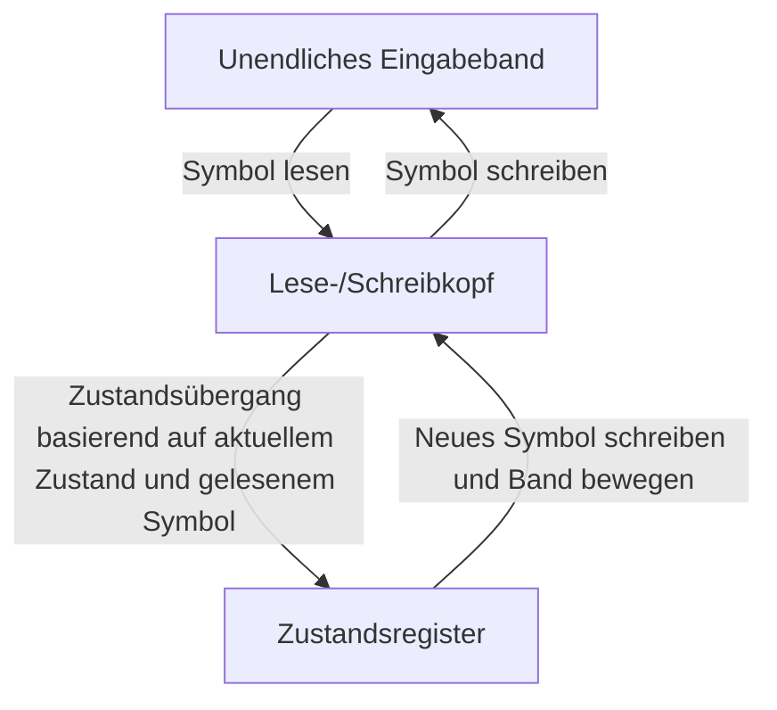
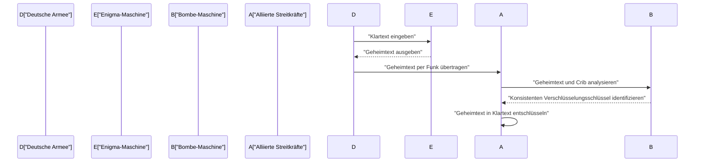
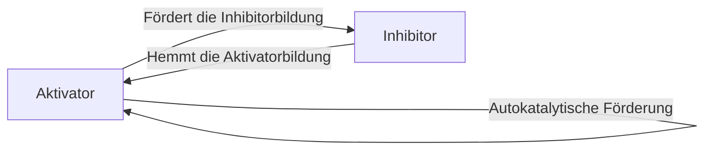

# 1. Einführung

Alan Mathison Turing war ein britischer Mathematiker, der die Grundlagen der modernen Informatik, der künstlichen Intelligenz und der mathematischen Biologie legte. Die von ihm konzipierte **Turingmaschine** wurde zum theoretischen Prototyp für jeden Computer, den wir heute verwenden. In diesem Artikel werden wir Turings turbulentes Leben und die großen mathematischen und wissenschaftlichen Errungenschaften, die er hinterlassen hat, im Detail untersuchen. Ohne seine Existenz wäre unsere moderne digitale Gesellschaft entweder völlig anders oder ihre Ankunft hätte sich um Jahrzehnte verzögert.

# 2. Frühes Leben und das Erwachen zur Mathematik

Turing wurde am 23. Juni 1912 in Paddington, London, geboren und in England erzogen, obwohl seine Eltern Beamte in Indien waren. Schon in jungen Jahren zeigte er Anzeichen eines mathematischen Talents auf Genie-Niveau und hatte ein starkes Interesse an axiomatischen Systemen und Logik.

Während seiner Schulzeit in Sherborne bewies er bereits außergewöhnliches Talent, indem er Einsteins Relativitätstheorie selbstständig verstand und sogar Newtons Bewegungsgesetze in Frage stellte. Nachdem er an das King's College in Cambridge gewechselt war, widmete er sich ganz dem Studium der mathematischen Logik. Die reine Neugierde, die er in dieser Zeit über die "Grenzen von Logik und Berechnung" hegte, führte zu seinen späteren historischen Entdeckungen.

# 3. Die Turingmaschine und die Theorie der Berechenbarkeit

Eines der größten ungelösten Probleme in der mathematischen Welt zu dieser Zeit war das 1928 von David Hilbert vorgeschlagene "Entscheidungsproblem". Dies war eine grundlegende Frage: "Gibt es für eine beliebige mathematische Aussage ein mechanisches algorithmisches Verfahren, um festzustellen, ob sie wahr oder falsch ist?"

Turing ging dieses Problem mit einem völlig neuen Ansatz an. In seiner bahnbrechenden Arbeit von 1936 "On Computable Numbers, with an Application to the Entscheidungsproblem" definierte er eine abstrakte Rechenmaschine, die **Turingmaschine**.

## 3.1 Struktur der Turingmaschine

Eine Turingmaschine ist eine theoretische Maschine, die aus den folgenden Elementen besteht. Man kann sagen, dass sie eine extreme Vereinfachung der Rollen von Speicher und CPU in modernen Computern ist.

Turing zeigte mathematisch, dass jede berechenbare Funktion von dieser **Turingmaschine** berechnet werden konnte. Darüber hinaus entwarf er die "Universelle Turingmaschine", die Daten lesen konnte, welche die Struktur jeder beliebigen Turingmaschine beschrieben, und deren Betrieb simulieren konnte. Genau das ist das Grundkonzept des modernen Computers mit "Von-Neumann-Architektur" – ein Programm als Daten im Speicher abzulegen und auszuführen.

## 3.2 Das Halteproblem und die Unvollständigkeit

Turing bewies, dass es keinen allgemeinen Algorithmus gibt, um im Voraus zu bestimmen, ob ein gegebenes Programm für eine gegebene Eingabe schließlich anhalten wird, was bedeutet, dass das **Halteproblem** unentscheidbar ist.

Mathematisch gesehen, nehmen wir eine Halteproblem-Entscheidungsfunktion $H(x, y)$ an, wobei $x$ das Programm und $y$ die Eingabe ist:

$$
H(x, y) = \begin{cases} 
1 & (\text{Wenn Programm } x \text{ bei Eingabe } y \text{ anhält}) \\
0 & (\text{Wenn Programm } x \text{ bei Eingabe } y \text{ in eine Endlosschleife gerät})
\end{cases}
$$

Angenommen, es gibt eine Turingmaschine, die eine solche Funktion $H$ berechnet. In diesem Fall können wir ein auf Diagonalisierung basierendes Programm $D(x)$ wie folgt konstruieren:

$$
D(x) = \begin{cases} 
\text{Endlosschleife} & (\text{Wenn } H(x, x) = 1) \\
\text{Anhalten} & (\text{Wenn } H(x, x) = 0)
\end{cases}
$$

Was passiert, wenn wir $D(D)$ ausführen? Wenn wir annehmen, dass $D$ anhält, gerät es per Definition in eine Endlosschleife; wenn wir annehmen, dass es in eine Endlosschleife gerät, hält es an. Dies führt zu einem logischen Widerspruch. Dieser brillante Beweis mit dem Diagonalargument führte zu einer negativen Antwort auf das Entscheidungsproblem und zeigte die Grenzen der Mathematik auf.

# 4. Die Entschlüsselung von Enigma und der Zweite Weltkrieg

Während des Zweiten Weltkriegs spielte Turing eine zentrale Rolle in der britischen Government Code and Cypher School (GC&CS) in Bletchley Park. Sein größter Beitrag war die Entschlüsselung von **Enigma**, der leistungsstarken Rotor-Chiffriermaschine der deutschen Marine.

## 4.1 Entwicklung der Entschlüsselungsmaschine "Bombe"

Er entwarf eine elektromechanische Entschlüsselungsmaschine namens "Bombe". Die Bombe war eine massive Maschine, mit der schnell nach den Anfangseinstellungen der Enigma-Rotoren und der Verkabelung des Steckbretts gesucht wurde. Es handelte sich um eine revolutionäre Methode, die logische Widersprüche anhand elektrischer Schaltkreise basierend auf der Beziehung zwischen bekanntem Klartext (Cribs) und Geheimtext sofort erkannte und so unmögliche Einstellungen ausschloss.

Dank dieser Errungenschaft konnten die Alliierten die Bedrohung durch deutsche U-Boote in der Atlantikschlacht abwehren und den Krieg günstig vorantreiben. Historiker loben die Codeknacker-Aktivitäten in Bletchley Park in höchsten Tönen, da sie den Zweiten Weltkrieg um mindestens zwei Jahre verkürzten und Millionen von Menschenleben retteten.

# 5. Nachkriegs-Computerentwicklung: ACE und Manchester Mark 1

Nach dem Krieg arbeitete Turing am National Physical Laboratory (NPL) und befasste sich mit dem Entwurf der **ACE** (Automatic Computing Engine). Dieser Entwurf versuchte, die 1936 von ihm konzipierte Universelle Turingmaschine mit tatsächlichen elektronischen Schaltungen zu realisieren. Der Entwurf der ACE war sehr ehrgeizig und wies einen schnellen und effizienten Befehlssatz auf, der als Vorläufer der modernen RISC-Architektur (Reduced Instruction Set Computer) angesehen werden kann.

Frustriert über bürokratische Verfahren und Entwicklungsverzögerungen am NPL wechselte Turing 1948 jedoch an die University of Manchester. Dort war er tief in die Softwareentwicklung für die **Manchester Mark 1**, einen der ersten Computer der Welt mit gespeichertem Programm, involviert. Er etablierte die Konzepte früher Programmiersprachen und Unterprogramme und leistete als einer der ersten Programmierer der Welt immense Beiträge.

# 6. Künstliche Intelligenz und der Turing-Test

Turing ging die philosophische Frage, ob Computer wie Menschen denken können, frontal an. In seinem wegweisenden Artikel "Computing Machinery and Intelligence" aus dem Jahr 1950 schlug er ein Experiment vor, das heute als **Turing-Test** bekannt ist (er nannte es das "Imitationsspiel"), um die unklare Frage "Können Maschinen denken?" durch eine überprüfbarere Form zu ersetzen.

## 6.1 Regeln des Imitationsspiels

Der Turing-Test wird wie folgt durchgeführt: Ein menschlicher Bewerter führt ein textbasiertes Gespräch sowohl mit einem Menschen als auch mit einer Maschine, die beide nicht sichtbar sind. Wenn der Bewerter nicht zuverlässig mit signifikanter Wahrscheinlichkeit unterscheiden kann, welcher Gesprächspartner die Maschine und welcher der Mensch ist, wird davon ausgegangen, dass die Maschine "Intelligenz besitzt".

Dieser praktische Standard war insofern sehr innovativ, als er versuchte, Intelligenz ausschließlich durch äußerlich beobachtbares "Verhalten" zu definieren, unabhängig von der internen Struktur der Maschine oder dem Vorhandensein von Bewusstsein. Dieses Konzept ist nach wie vor ein wichtiger philosophischer Pfeiler in der Entwicklung der modernen Forschung zur Verarbeitung natürlicher Sprache und der künstlichen Intelligenz (KI) und wird noch heute als Metrik zur Messung von KI-Fähigkeiten diskutiert.

# 7. Mathematische Biologie der Morphogenese

Turings Neugierde ging über Mathematik und Informatik hinaus und erstreckte sich auf die Biologie, das Mysterium des Lebens. 1952 veröffentlichte er eine Arbeit mit dem Titel "The Chemical Basis of Morphogenesis", in der er mathematisch modellierte, wie biologische Muster (wie Zebrastreifen, Leopardenflecken und Fischmuster) entstehen.

## 7.1 Reaktions-Diffusions-Gleichung

Er schlug ein System partieller Differentialgleichungen vor, das Reaktions-Diffusions-System genannt wird. Dies beschreibt, wie zwei Arten von chemischen Substanzen (ein Aktivator und ein Inhibitor) räumlich diffundieren, während sie miteinander interagieren.

$$
\frac{\partial u}{\partial t} = D_u \nabla^2 u + f(u, v)
$$
$$
\frac{\partial v}{\partial t} = D_v \nabla^2 v + g(u, v)
$$

Hierbei sind $u$ und $v$ die Konzentrationen von Aktivator und Inhibitor, $D_u$ und $D_v$ ihre jeweiligen Diffusionskoeffizienten und $f(u, v)$ und $g(u, v)$ sind Funktionen, die chemische Reaktionen (Reaktionsterme) darstellen.

Turing bewies mathematisch die "Turing-Instabilität", bei der ein räumlich einheitlicher und stabiler Zustand durch winzige Schwankungen (Rauschen) und Unterschiede in den Diffusionsgeschwindigkeiten (typischerweise $D_v > D_u$) destabilisiert wird, was dazu führt, dass sich räumliche Muster selbst organisieren.

Dieses Modell zeigte, dass scheinbar komplexe und zufällige biologische Muster tatsächlich spontan aus einfachen physikalischen und chemischen Gesetzen generiert werden, was eine äußerst wichtige Errungenschaft darstellt, die die Grundlage der aktuellen mathematischen und theoretischen Biologie bildet.

# 8. Spätere Jahre und Vermächtnis

Trotz Turings immenser Beiträge waren seine späteren Jahre tragisch. Zu dieser Zeit war Homosexualität im Vereinigten Königreich gesetzlich streng verboten, und er wurde 1952 wegen homosexueller Handlungen verurteilt. Als Alternative zum Gefängnis zu einer chemischen Kastration durch Injektion weiblicher Hormone gezwungen, wurde ihm die Sicherheitsüberprüfung für seine Forschung entzogen, und er wurde aus Teilen der von ihm geliebten Forschung ausgeschlossen.

Am 7. Juni 1954 verstarb er im jungen Alter von 41 Jahren. Die Todesursache war eine Zyanidvergiftung, und da ein angebissener Apfel an seinem Bett lag, wird allgemein von einem Suizid in Anlehnung an Schneewittchen ausgegangen.

Jahrzehnte nach seinem Tod schritten jedoch die weltweite Neubewertung seiner Errungenschaften und die Wiederherstellung seiner Ehre voran. 2009 entschuldigte sich die britische Regierung offiziell für die ungerechte Behandlung, die er damals erfahren hatte, und 2013 wurde ihm von Königin Elisabeth II. posthum eine königliche Begnadigung gewährt.

Heute ist die weltweit höchste Auszeichnung in der Informatik (oft als "Nobelpreis der Informatik" bezeichnet) zu Ehren seiner Leistungen als **Turing Award** benannt. Alan Turing besaß in verschiedenen Bereichen Ideen, die seiner Zeit weit voraus waren: Mathematik, Kryptographie, Informatik, künstliche Intelligenz und Biologie. Die Theorien und Ideen, die er hinterließ, atmen heute als Fundament unserer modernen digitalen Gesellschaft kraftvoll weiter.
