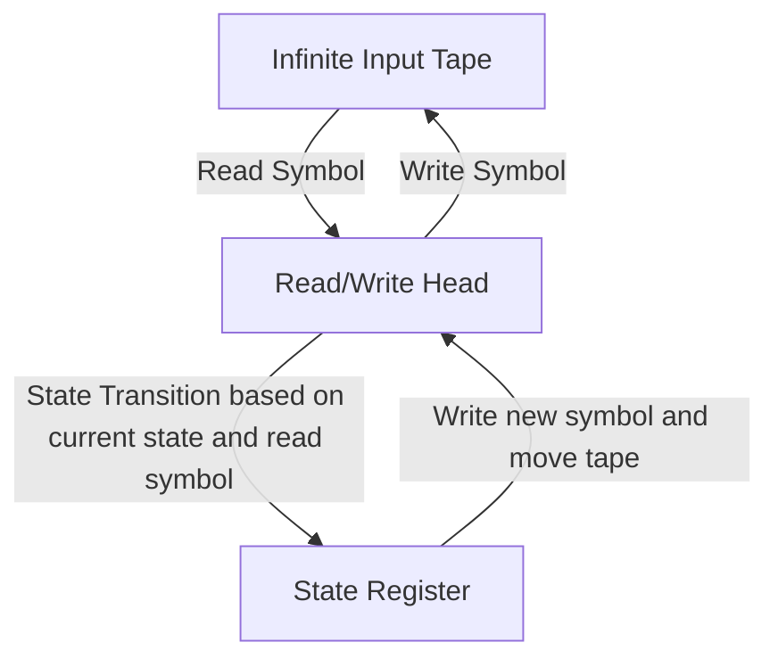
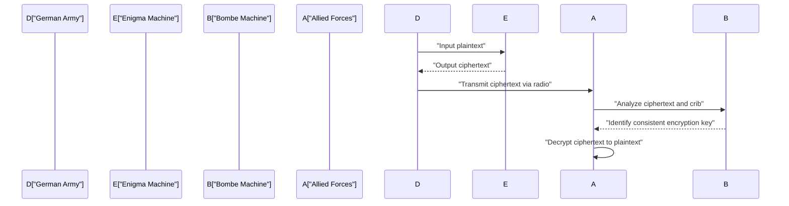
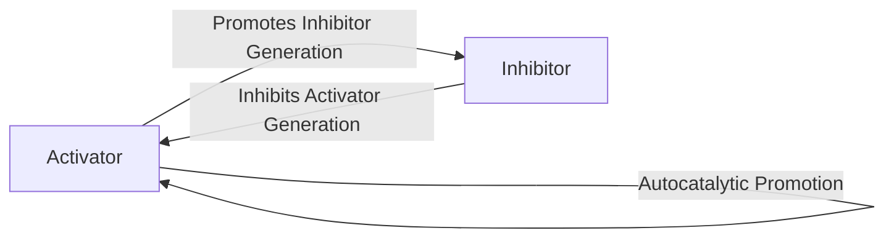

# 1. Introduction

Alan Mathison Turing was a British mathematician who laid the foundations of modern computer science, artificial intelligence, and mathematical biology. The **[Turing Machine](https://kenji.blog/en/p/turing-machine-computability/)** he conceived became the theoretical prototype for every computer we use today. In this article, we will explore in detail Turing's turbulent life and the great mathematical and scientific achievements he left behind. Without his existence, our modern digital society would either be completely different or its arrival would have been delayed by decades.

# 2. Early Life and Awakening to Mathematics

Born in Paddington, London on June 23, 1912, Turing was educated in England, although his parents were civil servants in India. Showing glimpses of genius-level mathematical talent from a young age, he had a strong interest in axiomatic systems and logic.

During his school days at Sherborne, he already demonstrated extraordinary talent by understanding Einstein's theory of relativity on his own and even questioning Newton's laws of motion. After proceeding to King's College, Cambridge, he devoted himself fully to the study of mathematical logic. The pure curiosity he harbored during this period about the "limits of logic and computation" led to his later historic discoveries.

# 3. Turing Machine and the Theory of Computability

One of the greatest unsolved problems in the mathematical world at that time was the "Entscheidungsproblem" (Decision Problem) proposed by [David Hilbert](https://kenji.blog/en/p/hilbert/) in 1928. This was a fundamental question: "Given any mathematical statement, does there exist a mechanical algorithmic procedure to determine whether it is true or false?"

Turing tackled this problem with an entirely new approach. In his groundbreaking 1936 paper "On Computable Numbers, with an Application to the Entscheidungsproblem," he defined an abstract computing machine, the **[Turing Machine](https://kenji.blog/en/p/turing-machine-computability/)**.

## 3.1 Structure of the Turing Machine

A Turing machine is a theoretical machine composed of the following elements. It can be said to be an extreme simplification of the roles of memory and CPU in modern computers.

Turing mathematically showed that any computable function could be computed by this **[Turing Machine](https://kenji.blog/en/p/turing-machine-computability/)**. Furthermore, he devised the "Universal Turing Machine," which could read data describing the structure of any Turing machine and simulate its operation. This is exactly the basic concept of the modern "von Neumann architecture" computer—storing a program as data in memory and executing it.

## 3.2 [The Halting Problem](https://kenji.blog/en/p/halting-problem/) and Incompleteness

Turing proved that there is no general algorithm to determine in advance whether a given program will eventually halt for a given input, meaning the **[Halting Problem](https://kenji.blog/en/p/turing-machine-computability/)** is undecidable.

Mathematically, let's assume a halting problem decision function $H(x, y)$, where $x$ is the program and $y$ is the input:

$$
H(x, y) = \begin{cases} 
1 & (\text{If program } x \text{ halts on input } y) \\
0 & (\text{If program } x \text{ goes into an infinite loop on input } y)
\end{cases}
$$

Suppose there exists a Turing machine that computes such a function $H$. In that case, we can construct a program $D(x)$ based on [diagonalization](/en/p/diagonalization-and-jordan-normal-form/) as follows:

$$
D(x) = \begin{cases} 
\text{Infinite loop} & (\text{If } H(x, x) = 1) \\
\text{Halt} & (\text{If } H(x, x) = 0)
\end{cases}
$$

What happens if we execute $D(D)$? If we assume $D$ halts, by definition it goes into an infinite loop; if we assume it goes into an infinite loop, it halts. This results in a logical contradiction. This brilliant proof using the diagonal argument led to a negative answer to the Decision Problem, demonstrating the limits of mathematics.

# 4. Deciphering Enigma and World War II

During World War II, Turing played a central role at the British Government Code and Cypher School (GC&CS) at Bletchley Park. His greatest contribution was deciphering **Enigma**, the powerful rotor cipher machine used by the German Navy.

## 4.1 Development of the Deciphering Machine "Bombe"

He designed an electromechanical deciphering machine called the "Bombe." The Bombe was a massive machine used to rapidly search for the initial settings of Enigma's rotors and the plugboard wiring. It was a revolutionary method that instantly detected logical contradictions using electrical circuits based on the relationship between known plaintext (cribs) and ciphertext, thereby eliminating impossible settings.

Thanks to this achievement, the Allies were able to repel the threat of German U-boats in the Battle of the Atlantic and advance the war favorably. Historians highly praise the codebreaking activities at Bletchley Park for shortening World War II by at least two years and saving millions of lives.

# 5. Post-War Computer Development: ACE and Manchester Mark 1

After the war, Turing worked at the National Physical Laboratory (NPL) and tackled the design of the **ACE** (Automatic Computing Engine). This design attempted to realize the Universal [Turing Machine](https://kenji.blog/en/p/turing-machine-computability/) he conceived in 1936 with actual electronic circuits. The design of ACE was highly ambitious, featuring a fast and efficient instruction set that could be considered a forerunner of the modern RISC (Reduced Instruction Set Computer) architecture.

However, frustrated by bureaucratic procedures and developmental delays at the NPL, Turing moved to the University of Manchester in 1948. There, he was deeply involved in the software development for the **Manchester Mark 1**, one of the world's first stored-program computers. He established the concepts of early programming languages and subroutines, making immense contributions as one of the world's first programmers.

# 6. Artificial Intelligence and the Turing Test

Turing tackled the philosophical question of whether computers could think like humans head-on. In his landmark 1950 paper "Computing Machinery and Intelligence," he proposed an experiment known today as the **Turing Test** (which he called the "Imitation Game") to replace the ambiguous question "Can machines think?" with a more testable form.

## 6.1 Rules of the Imitation Game

The Turing Test is conducted as follows: A human evaluator engages in a text-based conversation with both a human and a machine, who are hidden from view. If the evaluator cannot reliably distinguish which conversational partner is the machine and which is the human with a significant probability, the machine is considered to "possess intelligence."

This practical standard was highly innovative in that it attempted to define intelligence solely by externally observable "behavior," regardless of the machine's internal structure or the presence of consciousness. This concept remains a vital philosophical pillar in the development of modern natural language processing and artificial intelligence (AI) research, and is still debated today as a metric for measuring AI capabilities.

# 7. Mathematical Biology of Morphogenesis

Turing's curiosity extended beyond mathematics and computer science into biology, the mystery of life. In 1952, he published a paper titled "The Chemical Basis of Morphogenesis," in which he mathematically modeled how biological patterns (such as zebra stripes, leopard spots, and fish patterns) are formed.

## 7.1 Reaction-Diffusion Equation

He proposed a system of partial differential equations called the Reaction-Diffusion System. This describes how two types of chemical substances (an activator and an inhibitor) diffuse spatially while interacting with each other.

$$
\frac{\partial u}{\partial t} = D_u \nabla^2 u + f(u, v)
$$
$$
\frac{\partial v}{\partial t} = D_v \nabla^2 v + g(u, v)
$$

Here, $u$ and $v$ are the concentrations of the activator and inhibitor, $D_u$ and $D_v$ are their respective diffusion coefficients, and $f(u, v)$ and $g(u, v)$ are functions representing chemical reactions (reaction terms).

Turing mathematically proved "Turing instability," where a spatially uniform and stable state is destabilized by minute fluctuations (noise) and differences in diffusion speeds (typically $D_v > D_u$), causing spatial patterns to self-organize.

This model showed that seemingly complex and random biological patterns are actually spontaneously generated from simple physical and chemical laws, representing an extremely important achievement that forms the basis of current mathematical and theoretical biology.

# 8. Later Years and Legacy

Despite Turing's immense contributions, his later years were tragic. At the time, homosexuality was strictly prohibited by law in the United Kingdom, and he was convicted of homosexual acts in 1952. Forced to undergo chemical castration via female hormone injections as an alternative to prison, he was stripped of his security clearance for research and expelled from parts of the research he loved.

On June 7, 1954, he passed away at the young age of 41. The cause of death was cyanide poisoning, and with a half-eaten apple left by his bedside, it is generally considered a suicide mimicking Snow White.

However, decades after his death, global reassessment of his achievements and the restoration of his honor progressed. In 2009, the British government officially apologized for the unjust treatment he received at the time, and in 2013, he was granted a posthumous royal pardon by Queen Elizabeth II.

Today, the world's highest award in computer science (often called the "Nobel Prize of Computing") is named the **Turing Award** to forever honor his achievements. [Alan Turing](https://kenji.blog/en/p/turing/) possessed ideas that were vastly ahead of his time in diverse fields: mathematics, cryptography, computer science, artificial intelligence, and biology. The theories and ideas he left behind continue to breathe powerfully today as the foundation of our modern digital society.
