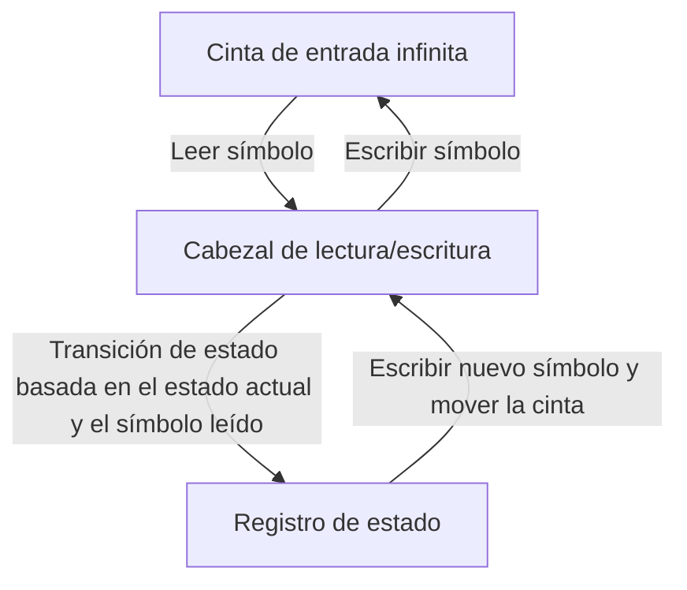
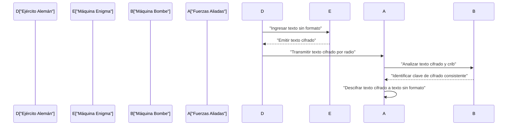
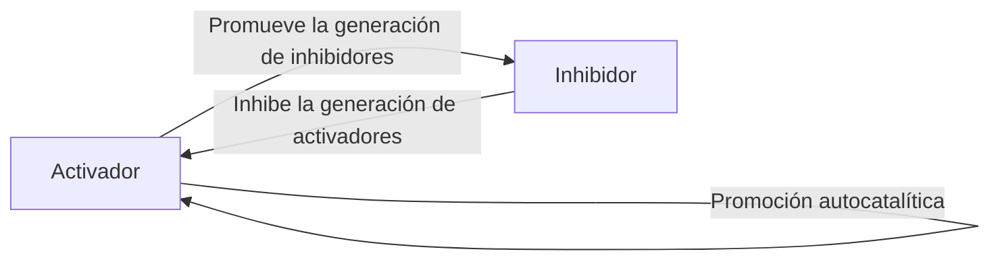

# 1. Introducción

Alan Mathison Turing fue un matemático británico que sentó las bases de la informática moderna, la inteligencia artificial y la biología matemática. La **Máquina de Turing** que concibió se convirtió en el prototipo teórico de todos los ordenadores que utilizamos hoy en día. En este artículo, exploraremos en detalle la turbulenta vida de Turing y los grandes logros matemáticos y científicos que dejó atrás. Sin su existencia, nuestra sociedad digital moderna sería completamente diferente o su llegada se habría retrasado décadas.

# 2. Primeros años y despertar a las matemáticas

Nacido en Paddington, Londres, el 23 de junio de 1912, Turing fue educado en Inglaterra, aunque sus padres eran funcionarios en la India. Mostrando destellos de un talento matemático a nivel de genio desde una edad temprana, tenía un fuerte interés en los sistemas axiomáticos y la lógica.

Durante sus días de escuela en Sherborne, ya demostró un talento extraordinario al comprender la teoría de la relatividad de Einstein por sí mismo e incluso cuestionar las leyes del movimiento de Newton. Después de ingresar al King's College de Cambridge, se dedicó por completo al estudio de la lógica matemática. La pura curiosidad que albergó durante este período sobre los "límites de la lógica y la computación" lo llevó a sus posteriores descubrimientos históricos.

# 3. La máquina de Turing y la teoría de la computabilidad

Uno de los mayores problemas sin resolver en el mundo matemático en ese momento era el "Entscheidungsproblem" (Problema de decisión) propuesto por [David Hilbert](https://kenji.blog/es/p/hilbert/) en 1928. Esta era una pregunta fundamental: "Dada cualquier declaración matemática, ¿existe un procedimiento algorítmico mecánico para determinar si es verdadera o falsa?"

Turing abordó este problema con un enfoque completamente nuevo. En su innovador artículo de 1936 "Sobre los números computables, con una aplicación al Entscheidungsproblem", definió una máquina de computación abstracta, la **Máquina de Turing**.

## 3.1 Estructura de la máquina de Turing

Una máquina de Turing es una máquina teórica compuesta por los siguientes elementos. Se puede decir que es una simplificación extrema de las funciones de la memoria y la CPU en los ordenadores modernos.

Turing demostró matemáticamente que cualquier función computable podría ser calculada por esta **Máquina de Turing**. Además, ideó la "Máquina de Turing Universal", que podía leer datos que describían la estructura de cualquier máquina de Turing y simular su funcionamiento. Este es exactamente el concepto básico del ordenador de "arquitectura de von Neumann" moderno: almacenar un programa como datos en la memoria y ejecutarlo.

## 3.2 El problema de la parada y la incompletitud

Turing demostró que no existe un algoritmo general para determinar de antemano si un programa dado finalmente se detendrá para una entrada dada, lo que significa que el **Problema de la parada** es indecidible.

Matemáticamente, supongamos una función de decisión del problema de la parada $H(x, y)$, donde $x$ es el programa e $y$ es la entrada:

$$
H(x, y) = \begin{cases} 
1 & (\text{Si el programa } x \text{ se detiene en la entrada } y) \\
0 & (\text{Si el programa } x \text{ entra en un bucle infinito en la entrada } y)
\end{cases}
$$

Supongamos que existe una máquina de Turing que calcula dicha función $H$. En ese caso, podemos construir un programa $D(x)$ basado en la diagonalización de la siguiente manera:

$$
D(x) = \begin{cases} 
\text{Bucle infinito} & (\text{Si } H(x, x) = 1) \\
\text{Detenerse} & (\text{Si } H(x, x) = 0)
\end{cases}
$$

¿Qué sucede si ejecutamos $D(D)$? Si suponemos que $D$ se detiene, por definición entra en un bucle infinito; si suponemos que entra en un bucle infinito, se detiene. Esto da como resultado una contradicción lógica. Esta brillante prueba utilizando el argumento diagonal condujo a una respuesta negativa al Problema de decisión, demostrando los límites de las matemáticas.

# 4. Descifrando Enigma y la Segunda Guerra Mundial

Durante la Segunda Guerra Mundial, Turing jugó un papel central en la Escuela Gubernamental de Códigos y Cifras (GC&CS) en Bletchley Park. Su mayor contribución fue descifrar **Enigma**, la poderosa máquina de cifrado de rotores utilizada por la Armada alemana.

## 4.1 Desarrollo de la máquina de descifrado "Bombe"

Diseñó una máquina de descifrado electromecánica llamada "Bombe". La Bombe era una máquina masiva utilizada para buscar rápidamente la configuración inicial de los rotores de Enigma y el cableado del panel de conexiones. Fue un método revolucionario que detectó instantáneamente contradicciones lógicas utilizando circuitos eléctricos basados en la relación entre el texto sin formato conocido (cribs) y el texto cifrado, eliminando así configuraciones imposibles.

Gracias a este logro, los Aliados pudieron repeler la amenaza de los submarinos alemanes (U-boats) en la Batalla del Atlántico y avanzar favorablemente en la guerra. Los historiadores elogian enormemente las actividades de descifrado de códigos en Bletchley Park por acortar la Segunda Guerra Mundial en al menos dos años y salvar millones de vidas.

# 5. Desarrollo de ordenadores de posguerra: ACE y Manchester Mark 1

Después de la guerra, Turing trabajó en el Laboratorio Nacional de Física (NPL) y abordó el diseño del **ACE** (Motor de Computación Automática). Este diseño intentó hacer realidad la Máquina de Turing Universal que concibió en 1936 con circuitos electrónicos reales. El diseño de ACE fue muy ambicioso, con un conjunto de instrucciones rápido y eficiente que podría considerarse un precursor de la moderna arquitectura RISC (Ordenador con Conjunto de Instrucciones Reducido).

Sin embargo, frustrado por los procedimientos burocráticos y los retrasos en el desarrollo en el NPL, Turing se mudó a la Universidad de Manchester en 1948. Allí, estuvo profundamente involucrado en el desarrollo de software para el **Manchester Mark 1**, uno de los primeros ordenadores de programa almacenado del mundo. Estableció los conceptos de los primeros lenguajes de programación y subrutinas, haciendo inmensas contribuciones como uno de los primeros programadores del mundo.

# 6. Inteligencia Artificial y el Test de Turing

Turing abordó frontalmente la cuestión filosófica de si los ordenadores podrían pensar como los humanos. En su histórico artículo de 1950 "Maquinaria Computacional e Inteligencia", propuso un experimento conocido hoy como el **Test de Turing** (que él llamó el "Juego de Imitación") para reemplazar la ambigua pregunta "¿Pueden pensar las máquinas?" con una forma más comprobable.

## 6.1 Reglas del Juego de Imitación

El Test de Turing se lleva a cabo de la siguiente manera: Un evaluador humano participa en una conversación basada en texto tanto con un humano como con una máquina, que están ocultos a la vista. Si el evaluador no puede distinguir de manera confiable qué compañero de conversación es la máquina y cuál es el humano con una probabilidad significativa, se considera que la máquina "posee inteligencia".

Este estándar práctico fue muy innovador ya que intentó definir la inteligencia únicamente por el "comportamiento" observable externamente, independientemente de la estructura interna de la máquina o de la presencia de conciencia. Este concepto sigue siendo un pilar filosófico vital en el desarrollo de la investigación moderna sobre el procesamiento del lenguaje natural y la inteligencia artificial (IA), y todavía se debate hoy en día como una métrica para medir las capacidades de la IA.

# 7. Biología matemática de la morfogénesis

La curiosidad de Turing se extendió más allá de las matemáticas y la informática hasta la biología, el misterio de la vida. En 1952, publicó un artículo titulado "La base química de la morfogénesis", en el que modeló matemáticamente cómo se forman los patrones biológicos (como las rayas de cebra, las manchas de leopardo y los patrones de los peces).

## 7.1 Ecuación de reacción-difusión

Propuso un sistema de ecuaciones diferenciales parciales llamado Sistema de Reacción-Difusión. Esto describe cómo dos tipos de sustancias químicas (un activador y un inhibidor) se difunden espacialmente mientras interactúan entre sí.

$$
\frac{\partial u}{\partial t} = D_u \nabla^2 u + f(u, v)
$$
$$
\frac{\partial v}{\partial t} = D_v \nabla^2 v + g(u, v)
$$

Aquí, $u$ y $v$ son las concentraciones del activador y el inhibidor, $D_u$ y $D_v$ son sus respectivos coeficientes de difusión, y $f(u, v)$ y $g(u, v)$ son funciones que representan reacciones químicas (términos de reacción).

Turing demostró matemáticamente la "inestabilidad de Turing", donde un estado espacialmente uniforme y estable se desestabiliza por pequeñas fluctuaciones (ruido) y diferencias en las velocidades de difusión (típicamente $D_v > D_u$), lo que hace que los patrones espaciales se autoorganicen.

Este modelo demostró que patrones biológicos aparentemente complejos y aleatorios en realidad se generan espontáneamente a partir de leyes físicas y químicas simples, lo que representa un logro extremadamente importante que forma la base de la biología matemática y teórica actual.

# 8. Últimos años y legado

A pesar de las inmensas contribuciones de Turing, sus últimos años fueron trágicos. En ese momento, la homosexualidad estaba estrictamente prohibida por la ley en el Reino Unido, y fue condenado por actos homosexuales en 1952. Obligado a someterse a castración química mediante inyecciones de hormonas femeninas como alternativa a la prisión, fue despojado de su autorización de seguridad para investigaciones y expulsado de partes de la investigación que amaba.

El 7 de junio de 1954, falleció a la temprana edad de 41 años. La causa de la muerte fue envenenamiento por cianuro, y con una manzana a medio comer junto a su cama, generalmente se considera un suicidio imitando a Blancanieves.

Sin embargo, décadas después de su muerte, avanzó la reevaluación mundial de sus logros y la restauración de su honor. En 2009, el gobierno británico se disculpó oficialmente por el trato injusto que recibió en ese momento, y en 2013, la reina Isabel II le concedió un indulto real póstumo.

Hoy en día, el premio más importante del mundo en informática (a menudo llamado el "Premio Nobel de Informática") se llama **Premio Turing** para honrar siempre sus logros. [Alan Turing](https://kenji.blog/es/p/turing/) poseía ideas que se adelantaron enormemente a su tiempo en diversos campos: matemáticas, criptografía, informática, inteligencia artificial y biología. Las teorías e ideas que dejó atrás continúan respirando poderosamente hoy como la base de nuestra sociedad digital moderna.
