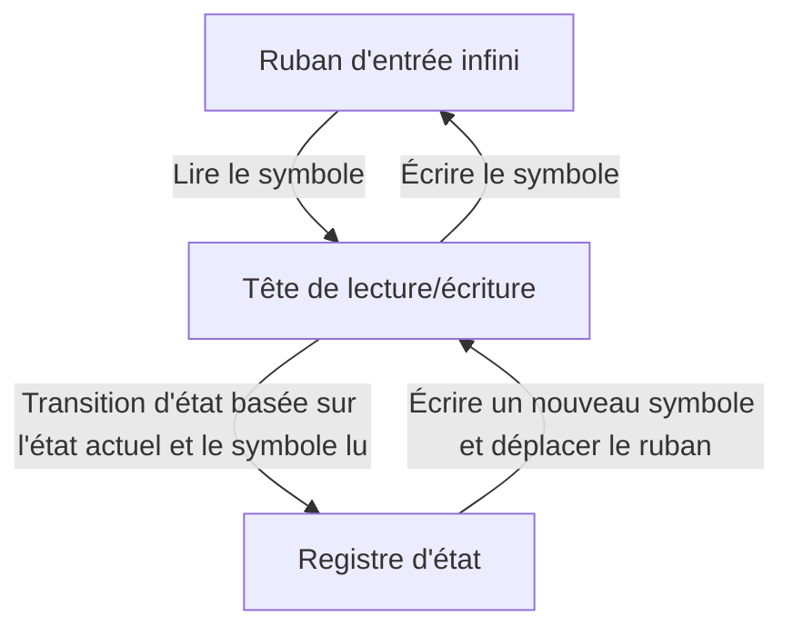
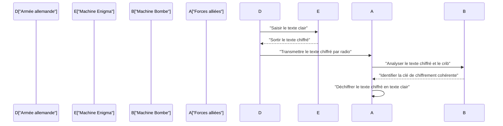
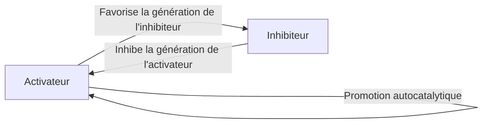

# 1. Introduction

Alan Mathison Turing était un mathématicien britannique qui a jeté les bases de l'informatique moderne, de l'intelligence artificielle et de la biologie mathématique. La **Machine de Turing** qu'il a conçue est devenue le prototype théorique de tous les ordinateurs que nous utilisons aujourd'hui. Dans cet article, nous explorerons en détail la vie turbulente de Turing et les grandes réalisations mathématiques et scientifiques qu'il a laissées derrière lui. Sans son existence, notre société numérique moderne serait soit complètement différente, soit son avènement aurait été retardé de plusieurs décennies.

# 2. Jeunesse et éveil aux mathématiques

Né à Paddington, Londres, le 23 juin 1912, Turing a été éduqué en Angleterre, bien que ses parents fussent fonctionnaires en Inde. Montrant des aperçus d'un talent mathématique de niveau génial dès son plus jeune âge, il portait un vif intérêt aux systèmes axiomatiques et à la logique.

Pendant ses années d'école à Sherborne, il a déjà fait preuve d'un talent extraordinaire en comprenant la théorie de la relativité d'Einstein par lui-même et même en remettant en question les lois du mouvement de Newton. Après être entré au King's College de Cambridge, il s'est consacré entièrement à l'étude de la logique mathématique. La pure curiosité qu'il nourrissait durant cette période concernant les « limites de la logique et du calcul » l'a conduit à ses découvertes historiques ultérieures.

# 3. La machine de Turing et la théorie de la calculabilité

L'un des plus grands problèmes non résolus dans le monde mathématique à l'époque était l'« Entscheidungsproblem » (Problème de la décision) proposé par [David Hilbert](https://kenji.blog/p/hilbert/) en 1928. Il s'agissait d'une question fondamentale : « Étant donné une proposition mathématique quelconque, existe-t-il une procédure algorithmique mécanique pour déterminer si elle est vraie ou fausse ? »

Turing s'est attaqué à ce problème avec une approche entièrement nouvelle. Dans son article novateur de 1936, « Sur les nombres calculables, avec une application à l'Entscheidungsproblem », il a défini une machine à calculer abstraite, la **Machine de Turing**.

## 3.1 Structure de la machine de Turing

Une machine de Turing est une machine théorique composée des éléments suivants. On peut dire que c'est une simplification extrême des rôles de la mémoire et du processeur dans les ordinateurs modernes.

Turing a démontré mathématiquement que toute fonction calculable pouvait être calculée par cette **Machine de Turing**. De plus, il a conçu la « Machine de Turing universelle », qui pouvait lire des données décrivant la structure de n'importe quelle machine de Turing et simuler son fonctionnement. C'est exactement le concept de base de l'ordinateur à « architecture de von Neumann » moderne : stocker un programme en tant que données en mémoire et l'exécuter.

## 3.2 Le problème de l'arrêt et l'incomplétude

Turing a prouvé qu'il n'existe aucun algorithme général pour déterminer à l'avance si un programme donné finira par s'arrêter pour une entrée donnée, ce qui signifie que le **Problème de l'arrêt** est indécidable.

Mathématiquement, supposons une fonction de décision du problème de l'arrêt $H(x, y)$, où $x$ est le programme et $y$ est l'entrée :

$$
H(x, y) = \begin{cases} 
1 & (\text{Si le programme } x \text{ s'arrête sur l'entrée } y) \\
0 & (\text{Si le programme } x \text{ entre dans une boucle infinie sur l'entrée } y)
\end{cases}
$$

Supposons qu'il existe une machine de Turing qui calcule une telle fonction $H$. Dans ce cas, nous pouvons construire un programme $D(x)$ basé sur la diagonalisation comme suit :

$$
D(x) = \begin{cases} 
\text{Boucle infinie} & (\text{Si } H(x, x) = 1) \\
\text{S'arrêter} & (\text{Si } H(x, x) = 0)
\end{cases}
$$

Que se passe-t-il si nous exécutons $D(D)$ ? Si nous supposons que $D$ s'arrête, par définition, il entre dans une boucle infinie ; si nous supposons qu'il entre dans une boucle infinie, il s'arrête. Cela aboutit à une contradiction logique. Cette brillante preuve utilisant l'argument diagonal a conduit à une réponse négative au problème de la décision, démontrant les limites des mathématiques.

# 4. Décryptage d'Enigma et Seconde Guerre mondiale

Pendant la Seconde Guerre mondiale, Turing a joué un rôle central à la Government Code and Cypher School (GC&CS) britannique à Bletchley Park. Sa plus grande contribution a été le décryptage d'**Enigma**, la puissante machine de chiffrement à rotors utilisée par la marine allemande.

## 4.1 Développement de la machine de décryptage « Bombe »

Il a conçu une machine de décryptage électromécanique appelée la « Bombe ». La Bombe était une machine massive utilisée pour rechercher rapidement les paramètres initiaux des rotors d'Enigma et le câblage du tableau de connexions. Ce fut une méthode révolutionnaire qui détectait instantanément les contradictions logiques à l'aide de circuits électriques basés sur la relation entre le texte clair connu (cribs) et le texte chiffré, éliminant ainsi les paramètres impossibles.

Grâce à cette réalisation, les Alliés ont pu repousser la menace des U-boote allemands lors de la bataille de l'Atlantique et faire avancer la guerre de manière favorable. Les historiens louent grandement les activités de décryptage de Bletchley Park pour avoir raccourci la Seconde Guerre mondiale d'au moins deux ans et sauvé des millions de vies.

# 5. Développement des ordinateurs d'après-guerre : ACE et Manchester Mark 1

Après la guerre, Turing a travaillé au National Physical Laboratory (NPL) et s'est attaqué à la conception de l'**ACE** (Automatic Computing Engine). Cette conception visait à réaliser la machine de Turing universelle qu'il avait conçue en 1936 avec de véritables circuits électroniques. La conception de l'ACE était très ambitieuse, dotée d'un jeu d'instructions rapide et efficace qui pourrait être considéré comme un précurseur de l'architecture RISC (Reduced Instruction Set Computer) moderne.

Cependant, frustré par les procédures bureaucratiques et les retards de développement au NPL, Turing a déménagé à l'Université de Manchester en 1948. Là, il s'est profondément impliqué dans le développement de logiciels pour le **Manchester Mark 1**, l'un des premiers ordinateurs à programme enregistré au monde. Il a établi les concepts des premiers langages de programmation et des sous-programmes, apportant d'immenses contributions en tant que l'un des premiers programmeurs au monde.

# 6. Intelligence artificielle et le test de Turing

Turing s'est attaqué de front à la question philosophique de savoir si les ordinateurs pouvaient penser comme des humains. Dans son article de 1950, « Computing Machinery and Intelligence », il a proposé une expérience connue aujourd'hui sous le nom de **Test de Turing** (qu'il appelait le « Jeu de l'imitation ») pour remplacer la question ambiguë « Les machines peuvent-elles penser ? » par une forme plus vérifiable.

## 6.1 Règles du jeu de l'imitation

Le test de Turing se déroule comme suit : un évaluateur humain engage une conversation textuelle à la fois avec un humain et une machine, qui sont cachés de la vue. Si l'évaluateur ne peut pas distinguer de manière fiable quel partenaire de conversation est la machine et lequel est l'humain avec une probabilité significative, la machine est considérée comme « possédant une intelligence ».

Cette norme pratique était très novatrice dans la mesure où elle tentait de définir l'intelligence uniquement par un « comportement » observable de l'extérieur, indépendamment de la structure interne de la machine ou de la présence de conscience. Ce concept reste un pilier philosophique vital dans le développement de la recherche moderne sur le traitement du langage naturel et l'intelligence artificielle (IA), et est toujours débattu aujourd'hui comme une mesure des capacités de l'IA.

# 7. Biologie mathématique de la morphogenèse

La curiosité de Turing s'étendait au-delà des mathématiques et de l'informatique pour englober la biologie, le mystère de la vie. En 1952, il a publié un article intitulé « La base chimique de la morphogenèse », dans lequel il a modélisé mathématiquement comment les motifs biologiques (comme les rayures des zèbres, les taches des léopards et les motifs des poissons) se forment.

## 7.1 Équation de réaction-diffusion

Il a proposé un système d'équations aux dérivées partielles appelé Système de Réaction-Diffusion. Cela décrit comment deux types de substances chimiques (un activateur et un inhibiteur) se diffusent spatialement tout en interagissant l'un avec l'autre.

$$
\frac{\partial u}{\partial t} = D_u \nabla^2 u + f(u, v)
$$
$$
\frac{\partial v}{\partial t} = D_v \nabla^2 v + g(u, v)
$$

Ici, $u$ et $v$ sont les concentrations de l'activateur et de l'inhibiteur, $D_u$ et $D_v$ sont leurs coefficients de diffusion respectifs, et $f(u, v)$ et $g(u, v)$ sont des fonctions représentant des réactions chimiques (termes de réaction).

Turing a prouvé mathématiquement l'« instabilité de Turing », où un état spatialement uniforme et stable est déstabilisé par de minuscules fluctuations (bruit) et des différences dans les vitesses de diffusion (généralement $D_v > D_u$), provoquant l'auto-organisation de motifs spatiaux.

Ce modèle a montré que des motifs biologiques apparemment complexes et aléatoires sont en fait générés spontanément à partir de lois physiques et chimiques simples, représentant une réalisation extrêmement importante qui forme la base de la biologie mathématique et théorique actuelle.

# 8. Dernières années et héritage

Malgré les immenses contributions de Turing, ses dernières années ont été tragiques. À l'époque, l'homosexualité était strictement interdite par la loi au Royaume-Uni, et il a été reconnu coupable d'actes homosexuels en 1952. Forcé de subir une castration chimique via des injections d'hormones féminines comme alternative à la prison, il a été privé de son habilitation de sécurité pour la recherche et expulsé des parties de la recherche qu'il aimait.

Le 7 juin 1954, il est décédé au jeune âge de 41 ans. La cause du décès était un empoisonnement au cyanure, et avec une pomme à moitié mangée laissée à son chevet, on considère généralement qu'il s'agit d'un suicide imitant Blanche-Neige.

Cependant, des décennies après sa mort, la réévaluation mondiale de ses réalisations et la restauration de son honneur ont progressé. En 2009, le gouvernement britannique s'est officiellement excusé pour le traitement injuste qu'il a reçu à l'époque, et en 2013, il a obtenu un pardon royal posthume de la reine Elizabeth II.

Aujourd'hui, la plus haute récompense mondiale en informatique (souvent appelée le « prix Nobel de l'informatique ») est nommée le **Prix Turing** pour honorer à jamais ses réalisations. [Alan Turing](https://kenji.blog/p/turing/) possédait des idées qui étaient largement en avance sur son temps dans divers domaines : mathématiques, cryptographie, informatique, intelligence artificielle et biologie. Les théories et les idées qu'il a laissées derrière lui continuent de respirer puissamment aujourd'hui comme le fondement de notre société numérique moderne.
