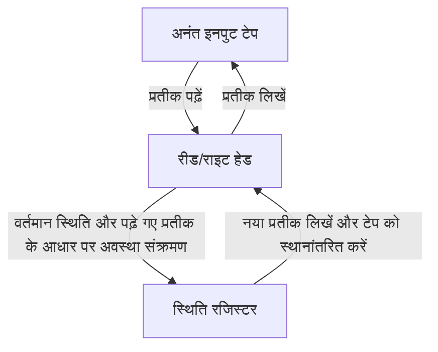
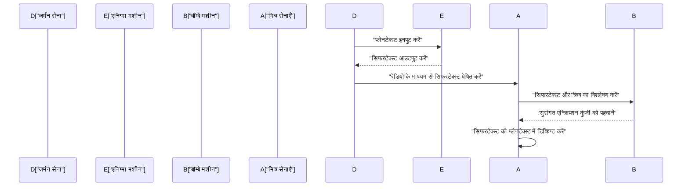
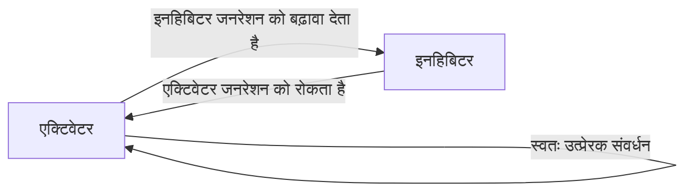

# 1. परिचय

एलन मैथिसन ट्यूरिंग एक ब्रिटिश गणितज्ञ थे जिन्होंने आधुनिक कंप्यूटर विज्ञान, कृत्रिम बुद्धिमत्ता और गणितीय जीव विज्ञान की नींव रखी। उनके द्वारा कल्पित **ट्यूरिंग मशीन** आज हमारे द्वारा उपयोग किए जाने वाले प्रत्येक कंप्यूटर के लिए सैद्धांतिक प्रोटोटाइप बन गई। इस लेख में, हम ट्यूरिंग के अशांत जीवन और उनके द्वारा छोड़े गए महान गणितीय और वैज्ञानिक आकलनों का विस्तार से पता लगाएंगे। यदि उनका अस्तित्व नहीं होता, तो हमारा आधुनिक डिजिटल समाज या तो पूरी तरह से अलग होता या इसका आगमन दशकों पहले ही टल जाता।

# 2. प्रारंभिक जीवन और गणित के प्रति जागरण

23 जून, 1912 को लंदन के पैडिंगटन में जन्मे ट्यूरिंग ने इंग्लैंड में शिक्षा प्राप्त की, हालाँकि उनके माता-पिता भारत में सिविल सेवक थे। कम उम्र से ही जीनियस स्तर की गणितीय प्रतिभा की झलक दिखाते हुए, उनकी स्वयंसिद्ध प्रणालियों और तर्कशास्त्र में गहरी रुचि थी।

शेरबोर्न में अपने स्कूल के दिनों के दौरान, उन्होंने पहले ही असाधारण प्रतिभा का प्रदर्शन किया, आइंस्टीन के सापेक्षता के सिद्धांत को अपने दम पर समझा और यहां तक ​​कि न्यूटन के गति के नियमों पर भी सवाल उठाया। कैम्ब्रिज के किंग्स कॉलेज में जाने के बाद, उन्होंने खुद को पूरी तरह से गणितीय तर्क के अध्ययन के लिए समर्पित कर दिया। इस अवधि के दौरान "तर्क और गणना की सीमाओं" के बारे में उन्होंने जो शुद्ध जिज्ञासा पाली थी, उसी ने बाद में उनकी ऐतिहासिक खोजों को जन्म दिया।

# 3. ट्यूरिंग मशीन और गणनाशीलता का सिद्धांत

उस समय गणितीय दुनिया में सबसे बड़ी अनसुलझी समस्याओं में से एक 1928 में [डेविड हिल्बर्ट](https://kenji.blog/p/hilbert/) द्वारा प्रस्तावित "निर्णय समस्या" (Entscheidungsproblem) थी। यह एक मौलिक प्रश्न था: "किसी भी गणितीय कथन को देखते हुए, क्या यह निर्धारित करने के लिए कोई यांत्रिक एल्गोरिथम प्रक्रिया मौजूद है कि यह सत्य है या असत्य?"

ट्यूरिंग ने पूरी तरह से नए दृष्टिकोण के साथ इस समस्या से निपटा। 1936 के अपने अभूतपूर्व पेपर "ऑन कम्प्यूटेबल नंबर्स, विद एन एप्लिकेशन टू द एंत्शेडुंग्सप्रॉब्लम" में, उन्होंने एक अमूर्त कंप्यूटिंग मशीन, **ट्यूरिंग मशीन** को परिभाषित किया।

## 3.1 ट्यूरिंग मशीन की संरचना

ट्यूरिंग मशीन एक सैद्धांतिक मशीन है जो निम्नलिखित तत्वों से बनी है। इसे आधुनिक कंप्यूटरों में मेमोरी और सीपीयू की भूमिकाओं का अत्यधिक सरलीकरण कहा जा सकता है।

ट्यूरिंग ने गणितीय रूप से दिखाया कि कोई भी गणना योग्य कार्य इस **ट्यूरिंग मशीन** द्वारा गणना की जा सकती है। इसके अलावा, उन्होंने "यूनिवर्सल ट्यूरिंग मशीन" तैयार की, जो किसी भी ट्यूरिंग मशीन की संरचना का वर्णन करने वाले डेटा को पढ़ सकती है और उसके संचालन का अनुकरण कर सकती है। यह आधुनिक "वॉन न्यूमैन आर्किटेक्चर" कंप्यूटर की मूल अवधारणा है - प्रोग्राम को मेमोरी में डेटा के रूप में संग्रहीत करना और उसे निष्पादित करना।

## 3.2 हॉल्टिंग समस्या और अपूर्णता

ट्यूरिंग ने साबित किया कि यह निर्धारित करने के लिए कोई सामान्य एल्गोरिथम नहीं है कि दिया गया प्रोग्राम अंततः दिए गए इनपुट के लिए रुकेगा या नहीं, जिसका अर्थ है कि **हॉल्टिंग समस्या** अनिर्णीत है।

गणितीय रूप से, मान लें कि हॉल्टिंग समस्या का निर्णय फलन $H(x, y)$ है, जहाँ $x$ प्रोग्राम है और $y$ इनपुट है:

$$
H(x, y) = \begin{cases} 
1 & (\text{यदि प्रोग्राम } x \text{ इनपुट } y \text{ पर रुकता है}) \\
0 & (\text{यदि प्रोग्राम } x \text{ इनपुट } y \text{ पर अनंत लूप में चला जाता है})
\end{cases}
$$

मान लीजिए कि एक ट्यूरिंग मशीन मौजूद है जो ऐसे फलन $H$ की गणना करती है। उस स्थिति में, हम इस प्रकार विकर्णन के आधार पर एक प्रोग्राम $D(x)$ का निर्माण कर सकते हैं:

$$
D(x) = \begin{cases} 
\text{अनंत लूप} & (\text{यदि } H(x, x) = 1) \\
\text{रुकें} & (\text{यदि } H(x, x) = 0)
\end{cases}
$$

क्या होता है यदि हम $D(D)$ निष्पादित करते हैं? यदि हम मानते हैं कि $D$ रुक जाता है, तो परिभाषा के अनुसार यह एक अनंत लूप में चला जाता है; यदि हम मानते हैं कि यह एक अनंत लूप में चला जाता है, तो यह रुक जाता है। इसके परिणामस्वरूप तार्किक विरोधाभास होता है। विकर्ण तर्क का उपयोग करते हुए यह शानदार प्रमाण निर्णय समस्या का नकारात्मक उत्तर देता है, जो गणित की सीमाओं को प्रदर्शित करता है।

# 4. एनिग्मा को समझना और द्वितीय विश्व युद्ध

द्वितीय विश्व युद्ध के दौरान, ट्यूरिंग ने बैलेचले पार्क में ब्रिटिश गवर्नमेंट कोड एंड साइफर स्कूल (GC&CS) में केंद्रीय भूमिका निभाई। उनका सबसे बड़ा योगदान जर्मन नौसेना द्वारा उपयोग की जाने वाली शक्तिशाली रोटर सिफर मशीन **एनिग्मा** को डिक्रिप्ट करना था।

## 4.1 डिक्रिफ़रिंग मशीन "बॉम्बे" का विकास

उन्होंने "बॉम्बे" (Bombe) नामक एक इलेक्ट्रोमैकेनिकल डिक्रिप्टिंग मशीन डिज़ाइन की। बॉम्बे एक विशाल मशीन थी जिसका उपयोग एनिग्मा के रोटर्स की प्रारंभिक सेटिंग्स और प्लगबोर्ड वायरिंग की खोज के लिए तेजी से किया जाता था। यह एक क्रांतिकारी तरीका था जिसने ज्ञात सादे पाठ (cribs) और सिफरटेक्स्ट के बीच संबंध के आधार पर विद्युत सर्किट का उपयोग करके तुरंत तार्किक विरोधाभासों का पता लगाया, जिससे असंभव सेटिंग्स समाप्त हो गईं।

इस उपलब्धि के लिए धन्यवाद, मित्र राष्ट्र अटलांटिक की लड़ाई में जर्मन यू-बोट के खतरे को दूर करने में सक्षम हुए और युद्ध को अनुकूल रूप से आगे बढ़ाया। इतिहासकार द्वितीय विश्व युद्ध को कम से कम दो साल तक छोटा करने और लाखों लोगों की जान बचाने के लिए बैलेचले पार्क में कोडब्रेकिंग गतिविधियों की अत्यधिक प्रशंसा करते हैं।

# 5. युद्ध के बाद कंप्यूटर विकास: ACE और मैनचेस्टर मार्क 1

युद्ध के बाद, ट्यूरिंग ने राष्ट्रीय भौतिक प्रयोगशाला (NPL) में काम किया और **ACE** (ऑटोमैटिक कंप्यूटिंग इंजन) के डिजाइन से निपटा। इस डिज़ाइन ने 1936 में वास्तविक इलेक्ट्रॉनिक सर्किट के साथ परिकल्पित यूनिवर्सल ट्यूरिंग मशीन को साकार करने का प्रयास किया। ACE का डिज़ाइन अत्यधिक महत्वाकांक्षी था, जिसमें एक तेज़ और कुशल अनुदेश सेट शामिल था जिसे आधुनिक RISC (कम अनुदेश सेट कंप्यूटर) आर्किटेक्चर का अग्रदूत माना जा सकता है।

हालाँकि, नौकरशाही प्रक्रियाओं और एनपीएल में विकास में देरी से निराश होकर, ट्यूरिंग 1948 में मैनचेस्टर विश्वविद्यालय चले गए। वहां, वह दुनिया के पहले संग्रहीत-प्रोग्राम कंप्यूटरों में से एक, **मैनचेस्टर मार्क 1** के लिए सॉफ्टवेयर विकास में गहराई से शामिल थे। उन्होंने प्रारंभिक प्रोग्रामिंग भाषाओं और सबरूटीन की अवधारणाओं को स्थापित किया, जिससे दुनिया के पहले प्रोग्रामरों में से एक के रूप में बहुत बड़ा योगदान मिला।

# 6. कृत्रिम बुद्धिमत्ता और ट्यूरिंग टेस्ट

ट्यूरिंग ने इस दार्शनिक प्रश्न को सीधे तौर पर संबोधित किया कि क्या कंप्यूटर मनुष्यों की तरह सोच सकते हैं। 1950 के अपने ऐतिहासिक पेपर "कंप्यूटिंग मशीनरी एंड इंटेलिजेंस" में, उन्होंने एक प्रयोग का प्रस्ताव रखा जिसे आज **ट्यूरिंग टेस्ट** (जिसे उन्होंने "इमिटेशन गेम" कहा) के रूप में जाना जाता है, ताकि अस्पष्ट प्रश्न "क्या मशीनें सोच सकती हैं?" को अधिक परीक्षण योग्य रूप से प्रतिस्थापित किया जा सके।

## 6.1 इमिटेशन गेम के नियम

ट्यूरिंग परीक्षण इस प्रकार आयोजित किया जाता है: एक मानव मूल्यांकनकर्ता एक इंसान और एक मशीन दोनों के साथ पाठ-आधारित वार्तालाप में संलग्न होता है, जो दृष्टि से छिपे होते हैं। यदि मूल्यांकनकर्ता मज़बूती से यह नहीं पहचान पाता है कि कौन सा वार्तालाप भागीदार मशीन है और कौन सा इंसान महत्वपूर्ण संभावना के साथ है, तो मशीन को "बुद्धिमत्ता से युक्त" माना जाता है।

यह व्यावहारिक मानक बहुत ही नवीन था क्योंकि इसने मशीन की आंतरिक संरचना या चेतना की उपस्थिति की परवाह किए बिना केवल बाहरी रूप से देखे जाने वाले "व्यवहार" द्वारा बुद्धिमत्ता को परिभाषित करने का प्रयास किया था। यह अवधारणा आधुनिक प्राकृतिक भाषा प्रसंस्करण और कृत्रिम बुद्धिमत्ता (एआई) अनुसंधान के विकास में एक महत्वपूर्ण दार्शनिक स्तंभ बनी हुई है, और आज भी एआई क्षमताओं को मापने के लिए एक मीट्रिक के रूप में बहस की जाती है।

# 7. मॉर्फोजेनेसिस का गणितीय जीव विज्ञान

ट्यूरिंग की जिज्ञासा गणित और कंप्यूटर विज्ञान से परे जीव विज्ञान, जीवन के रहस्य तक फैली हुई थी। 1952 में, उन्होंने "मॉर्फोजेनेसिस का रासायनिक आधार" नामक एक पेपर प्रकाशित किया, जिसमें उन्होंने गणितीय रूप से मॉडल किया कि जैविक पैटर्न (जैसे ज़ेबरा धारियां, तेंदुआ के धब्बे और मछली के पैटर्न) कैसे बनते हैं।

## 7.1 रिएक्शन-डिफ्यूजन समीकरण

उन्होंने रिएक्शन-डिफ्यूजन सिस्टम (प्रतिक्रिया-प्रसार प्रणाली) नामक आंशिक अंतर समीकरणों की एक प्रणाली का प्रस्ताव रखा। यह वर्णन करता है कि दो प्रकार के रासायनिक पदार्थ (एक एक्टिवेटर और एक अवरोधक) एक दूसरे के साथ बातचीत करते हुए स्थानिक रूप से कैसे फैलते हैं।

$$
\frac{\partial u}{\partial t} = D_u \nabla^2 u + f(u, v)
$$
$$
\frac{\partial v}{\partial t} = D_v \nabla^2 v + g(u, v)
$$

यहाँ, $u$ और $v$ एक्टिवेटर और इनहिबिटर की सांद्रता हैं, $D_u$ और $D_v$ उनके संबंधित प्रसार गुणांक हैं, और $f(u, v)$ और $g(u, v)$ रासायनिक प्रतिक्रियाओं को दर्शाने वाले कार्य हैं (प्रतिक्रिया शब्द)।

ट्यूरिंग ने गणितीय रूप से "ट्यूरिंग अस्थिरता" सिद्ध की, जहां एक स्थानिक रूप से एकसमान और स्थिर स्थिति मिनट के उतार-चढ़ाव (शोर) और प्रसार गति में अंतर (आमतौर पर $D_v > D_u$) से अस्थिर हो जाती है, जिससे स्थानिक पैटर्न स्वयं-व्यवस्थित हो जाते हैं।

इस मॉडल ने दिखाया कि प्रतीत होने वाले जटिल और यादृच्छिक जैविक पैटर्न वास्तव में सरल भौतिक और रासायनिक नियमों से अनायास उत्पन्न होते हैं, जो एक अत्यंत महत्वपूर्ण उपलब्धि का प्रतिनिधित्व करते हैं जो वर्तमान गणितीय और सैद्धांतिक जीव विज्ञान का आधार बनता है।

# 8. बाद के वर्ष और विरासत

ट्यूरिंग के अपार योगदान के बावजूद, उनके बाद के वर्ष दुखद थे। उस समय, यूनाइटेड किंगडम में समलैंगिकता को कानून द्वारा कड़ाई से प्रतिबंधित किया गया था, और उन्हें 1952 में समलैंगिक कृत्यों का दोषी ठहराया गया था। जेल के विकल्प के रूप में महिला हार्मोन के इंजेक्शन के माध्यम से रासायनिक बधियाकरण से गुजरने के लिए मजबूर होने के कारण, अनुसंधान के लिए उनकी सुरक्षा मंजूरी छीन ली गई और उन्हें उस शोध के कुछ हिस्सों से निष्कासित कर दिया गया जिसे वह पसंद करते थे।

7 जून, 1954 को, 41 वर्ष की कम उम्र में उनका निधन हो गया। मृत्यु का कारण साइनाइड विषाक्तता थी, और उनके बिस्तर के पास आधा खाया हुआ सेब छोड़ दिया गया था, इसे आम तौर पर स्नो व्हाइट की नकल करते हुए आत्महत्या माना जाता है।

हालाँकि, उनकी मृत्यु के दशकों बाद, उनकी उपलब्धियों का वैश्विक पुनर्मूल्यांकन और उनके सम्मान की बहाली आगे बढ़ी। 2009 में, ब्रिटिश सरकार ने उस समय उनके साथ हुए अन्यायपूर्ण व्यवहार के लिए आधिकारिक तौर पर माफी मांगी, और 2013 में, उन्हें महारानी एलिजाबेथ द्वितीय द्वारा मरणोपरांत शाही क्षमादान दिया गया।

आज, कंप्यूटर विज्ञान में दुनिया का सर्वोच्च पुरस्कार (जिसे अक्सर "कंप्यूटिंग का नोबेल पुरस्कार" कहा जाता है) उनके नाम पर **ट्यूरिंग पुरस्कार** रखा गया है ताकि उनकी उपलब्धियों का हमेशा सम्मान किया जा सके। [एलन ट्यूरिंग](https://kenji.blog/p/turing/) के पास ऐसे विचार थे जो विभिन्न क्षेत्रों: गणित, क्रिप्टोग्राफी, कंप्यूटर विज्ञान, कृत्रिम बुद्धिमत्ता और जीव विज्ञान में अपने समय से बहुत आगे थे। उन्होंने जो सिद्धांत और विचार पीछे छोड़े हैं, वे हमारे आधुनिक डिजिटल समाज की नींव के रूप में आज भी मजबूती से सांस ले रहे हैं।
