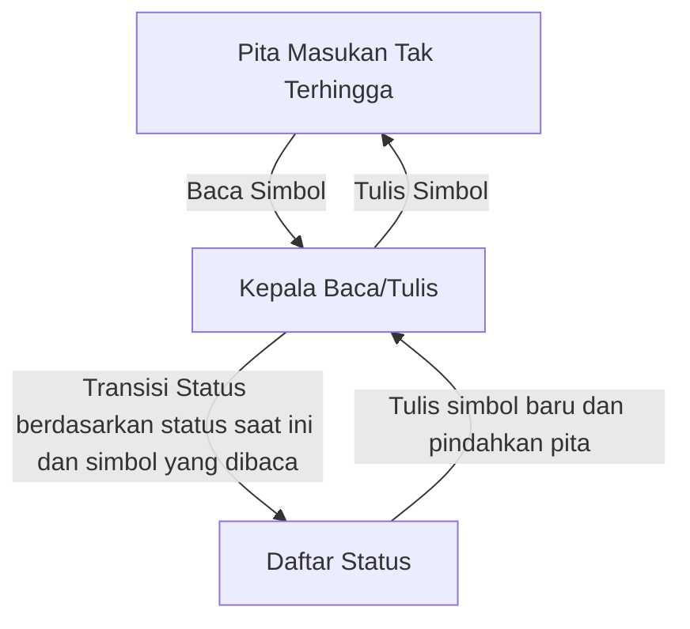
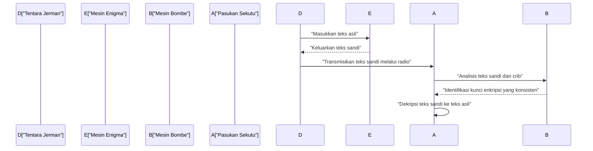
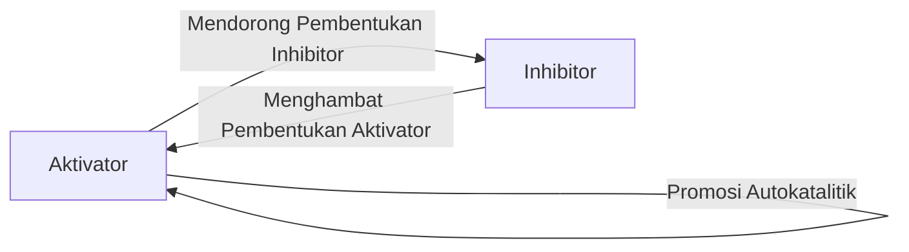

# 1. Pendahuluan

Alan Mathison Turing adalah seorang matematikawan Inggris yang meletakkan dasar bagi ilmu komputer modern, kecerdasan buatan, dan biologi matematika. **Mesin Turing** yang ia gagas menjadi prototipe teoretis untuk setiap komputer yang kita gunakan saat ini. Dalam artikel ini, kita akan menjelajahi secara rinci kehidupan Turing yang penuh gejolak dan pencapaian matematika serta ilmiah besar yang ia tinggalkan. Tanpa keberadaannya, masyarakat digital modern kita akan sepenuhnya berbeda atau kedatangannya akan tertunda selama beberapa dekade.

# 2. Kehidupan Awal dan Kebangkitan pada Matematika

Lahir di Paddington, London pada tanggal 23 Juni 1912, Turing dididik di Inggris, meskipun orang tuanya adalah pegawai negeri sipil di India. Menunjukkan kilasan bakat matematika tingkat jenius sejak usia muda, ia memiliki minat yang kuat pada sistem aksiomatik dan logika.

Selama masa sekolahnya di Sherborne, ia telah menunjukkan bakat luar biasa dengan memahami teori relativitas Einstein sendiri dan bahkan mempertanyakan hukum gerak Newton. Setelah melanjutkan ke King's College, Cambridge, ia mengabdikan dirinya sepenuhnya pada studi logika matematika. Keingintahuan murni yang ia pelihara selama periode ini mengenai "batas-batas logika dan komputasi" membawanya pada penemuan-penemuan bersejarahnya di kemudian hari.

# 3. Mesin Turing dan Teori Komputabilitas

Salah satu masalah terbesar yang belum terpecahkan dalam dunia matematika pada saat itu adalah "Entscheidungsproblem" (Masalah Keputusan) yang diusulkan oleh [David Hilbert](https://kenji.blog/id/p/hilbert/) pada tahun 1928. Ini adalah pertanyaan mendasar: "Diberikan pernyataan matematika apa pun, adakah prosedur algoritmik mekanis untuk menentukan apakah itu benar atau salah?"

Turing menangani masalah ini dengan pendekatan yang sama sekali baru. Dalam makalah inovatifnya tahun 1936 "Tentang Angka-angka yang Dapat Dihitung, dengan Aplikasi pada Entscheidungsproblem", ia mendefinisikan mesin komputasi abstrak, **Mesin Turing**.

## 3.1 Struktur Mesin Turing

Mesin Turing adalah mesin teoretis yang terdiri dari elemen-elemen berikut. Dapat dikatakan bahwa ini adalah penyederhanaan ekstrem dari peran memori dan CPU pada komputer modern.

Turing secara matematis menunjukkan bahwa fungsi apa pun yang dapat dihitung dapat dihitung oleh **Mesin Turing** ini. Selanjutnya, ia merancang "Mesin Turing Universal", yang dapat membaca data yang menggambarkan struktur mesin Turing mana pun dan mensimulasikan operasinya. Inilah tepatnya konsep dasar komputer "arsitektur von Neumann" modern—menyimpan program sebagai data dalam memori dan menjalankannya.

## 3.2 Masalah Penghentian dan Ketidaklengkapan

Turing membuktikan bahwa tidak ada algoritme umum untuk menentukan sebelumnya apakah program yang diberikan pada akhirnya akan berhenti untuk masukan yang diberikan, yang berarti **Masalah Penghentian** tidak dapat diputuskan.

Secara matematis, mari kita asumsikan fungsi keputusan masalah penghentian $H(x, y)$, di mana $x$ adalah program dan $y$ adalah masukan:

$$
H(x, y) = \begin{cases} 
1 & (\text{Jika program } x \text{ berhenti pada masukan } y) \\
0 & (\text{Jika program } x \text{ masuk ke dalam perulangan tak terbatas pada masukan } y)
\end{cases}
$$

Misalkan ada mesin Turing yang menghitung fungsi $H$ seperti itu. Dalam hal itu, kita dapat membangun program $D(x)$ berdasarkan diagonalisasi sebagai berikut:

$$
D(x) = \begin{cases} 
\text{Perulangan tak terbatas} & (\text{Jika } H(x, x) = 1) \\
\text{Berhenti} & (\text{Jika } H(x, x) = 0)
\end{cases}
$$

Apa yang terjadi jika kita menjalankan $D(D)$? Jika kita berasumsi bahwa $D$ berhenti, menurut definisi ia masuk ke perulangan tak terbatas; jika kita berasumsi ia masuk ke perulangan tak terbatas, ia berhenti. Hal ini menghasilkan kontradiksi logis. Bukti cemerlang yang menggunakan argumen diagonal ini mengarah pada jawaban negatif terhadap Masalah Keputusan, yang menunjukkan batas-batas matematika.

# 4. Memecahkan Enigma dan Perang Dunia II

Selama Perang Dunia II, Turing memainkan peran sentral di Sekolah Sandi dan Kode Pemerintah Inggris (GC&CS) di Bletchley Park. Kontribusi terbesarnya adalah menguraikan **Enigma**, mesin sandi rotor canggih yang digunakan oleh Angkatan Laut Jerman.

## 4.1 Pengembangan Mesin Pemecah Sandi "Bombe"

Ia merancang mesin pemecah sandi elektromekanis yang disebut "Bombe". Bombe adalah mesin masif yang digunakan untuk secara cepat mencari pengaturan awal rotor Enigma dan kabel papan colokan. Ini merupakan metode revolusioner yang secara instan mendeteksi kontradiksi logis menggunakan sirkuit listrik berdasarkan hubungan antara teks asli (cribs) yang diketahui dan teks sandi, sehingga mengeliminasi pengaturan yang mustahil.

Berkat pencapaian ini, Sekutu mampu menangkis ancaman U-boat Jerman dalam Pertempuran Atlantik dan memajukan perang secara menguntungkan. Para sejarawan sangat memuji aktivitas pemecahan kode di Bletchley Park karena memperpendek Perang Dunia II setidaknya selama dua tahun dan menyelamatkan jutaan nyawa.

# 5. Pengembangan Komputer Pasca Perang: ACE dan Manchester Mark 1

Setelah perang, Turing bekerja di Laboratorium Fisika Nasional (NPL) dan menangani desain **ACE** (Mesin Komputasi Otomatis). Desain ini mencoba untuk mewujudkan Mesin Turing Universal yang ia gagas pada tahun 1936 dengan sirkuit elektronik aktual. Desain ACE sangat ambisius, menampilkan set instruksi yang cepat dan efisien yang dapat dianggap sebagai pendahulu arsitektur RISC (Komputer Set Instruksi yang Dikurangi) modern.

Namun, karena frustrasi dengan prosedur birokrasi dan penundaan pengembangan di NPL, Turing pindah ke Universitas Manchester pada tahun 1948. Di sana, ia sangat terlibat dalam pengembangan perangkat lunak untuk **Manchester Mark 1**, salah satu komputer program tersimpan pertama di dunia. Ia menetapkan konsep bahasa pemrograman awal dan subrutin, memberikan kontribusi besar sebagai salah satu pemrogram pertama di dunia.

# 6. Kecerdasan Buatan dan Uji Turing

Turing menangani secara langsung pertanyaan filosofis apakah komputer dapat berpikir seperti manusia. Dalam makalah pentingnya pada tahun 1950, "Mesin Komputasi dan Kecerdasan", ia mengusulkan eksperimen yang dikenal saat ini sebagai **Uji Turing** (yang ia sebut "Permainan Imitasi") untuk menggantikan pertanyaan ambigu "Dapatkah mesin berpikir?" dengan bentuk yang lebih dapat diuji.

## 6.1 Aturan Permainan Imitasi

Uji Turing dilakukan sebagai berikut: Seorang penilai manusia terlibat dalam percakapan berbasis teks dengan manusia dan mesin, yang disembunyikan dari pandangan. Jika penilai tidak dapat membedakan secara andal mitra percakapan mana yang mesin dan mana yang manusia dengan probabilitas yang signifikan, mesin tersebut dianggap "memiliki kecerdasan".

Standar praktis ini sangat inovatif karena mencoba mendefinisikan kecerdasan semata-mata oleh "perilaku" yang dapat diamati dari luar, terlepas dari struktur internal mesin atau adanya kesadaran. Konsep ini tetap menjadi pilar filosofis yang vital dalam pengembangan pemrosesan bahasa alami modern dan penelitian kecerdasan buatan (AI), dan masih diperdebatkan saat ini sebagai metrik untuk mengukur kemampuan AI.

# 7. Biologi Matematika Morfogenesis

Keingintahuan Turing melampaui matematika dan ilmu komputer ke biologi, misteri kehidupan. Pada tahun 1952, ia menerbitkan sebuah makalah berjudul "Dasar Kimia Morfogenesis", di mana ia memodelkan secara matematis bagaimana pola biologis (seperti garis-garis zebra, bintik-bintik macan tutul, dan pola ikan) terbentuk.

## 7.1 Persamaan Reaksi-Difusi

Ia mengusulkan sistem persamaan diferensial parsial yang disebut Sistem Reaksi-Difusi. Ini menggambarkan bagaimana dua jenis zat kimia (aktivator dan inhibitor) berdifusi secara spasial saat berinteraksi satu sama lain.

$$
\frac{\partial u}{\partial t} = D_u \nabla^2 u + f(u, v)
$$
$$
\frac{\partial v}{\partial t} = D_v \nabla^2 v + g(u, v)
$$

Di sini, $u$ dan $v$ adalah konsentrasi aktivator dan inhibitor, $D_u$ dan $D_v$ adalah koefisien difusinya masing-masing, dan $f(u, v)$ dan $g(u, v)$ adalah fungsi yang mewakili reaksi kimia (istilah reaksi).

Turing secara matematis membuktikan "ketidakstabilan Turing", di mana keadaan spasial yang seragam dan stabil digoyahkan oleh fluktuasi (kebisingan) kecil dan perbedaan kecepatan difusi (biasanya $D_v > D_u$), menyebabkan pola spasial untuk mengatur diri sendiri.

Model ini menunjukkan bahwa pola biologis yang tampaknya kompleks dan acak sebenarnya dihasilkan secara spontan dari hukum fisika dan kimia sederhana, mewakili pencapaian yang sangat penting yang membentuk dasar biologi matematika dan teoretis saat ini.

# 8. Tahun-tahun Terakhir dan Warisan

Terlepas dari kontribusi Turing yang luar biasa, tahun-tahun terakhirnya sangat tragis. Pada saat itu, homoseksualitas dilarang keras oleh hukum di Inggris, dan ia dihukum karena tindakan homoseksual pada tahun 1952. Dipaksa untuk menjalani pengebirian kimiawi melalui suntikan hormon wanita sebagai alternatif penjara, izin keamanannya untuk penelitian dicabut dan dikeluarkan dari sebagian penelitian yang ia cintai.

Pada tanggal 7 Juni 1954, ia meninggal dunia pada usia muda 41 tahun. Penyebab kematiannya adalah keracunan sianida, dan dengan apel yang setengah dimakan ditinggalkan di samping tempat tidurnya, secara umum hal itu dianggap sebagai bunuh diri yang meniru Putri Salju.

Namun, puluhan tahun setelah kematiannya, penilaian ulang global atas pencapaiannya dan pemulihan kehormatannya mengalami kemajuan. Pada tahun 2009, pemerintah Inggris secara resmi meminta maaf atas perlakuan tidak adil yang diterimanya pada saat itu, dan pada tahun 2013, ia diberikan pengampunan kerajaan secara anumerta oleh Ratu Elizabeth II.

Saat ini, penghargaan tertinggi dunia dalam ilmu komputer (sering disebut "Hadiah Nobel Komputer") dinamai **Penghargaan Turing** untuk selamanya menghormati pencapaiannya. [Alan Turing](https://kenji.blog/id/p/turing/) memiliki gagasan yang sangat maju pada zamannya dalam berbagai bidang: matematika, kriptografi, ilmu komputer, kecerdasan buatan, dan biologi. Teori dan gagasan yang ia tinggalkan terus bernapas kuat saat ini sebagai dasar masyarakat digital modern kita.
