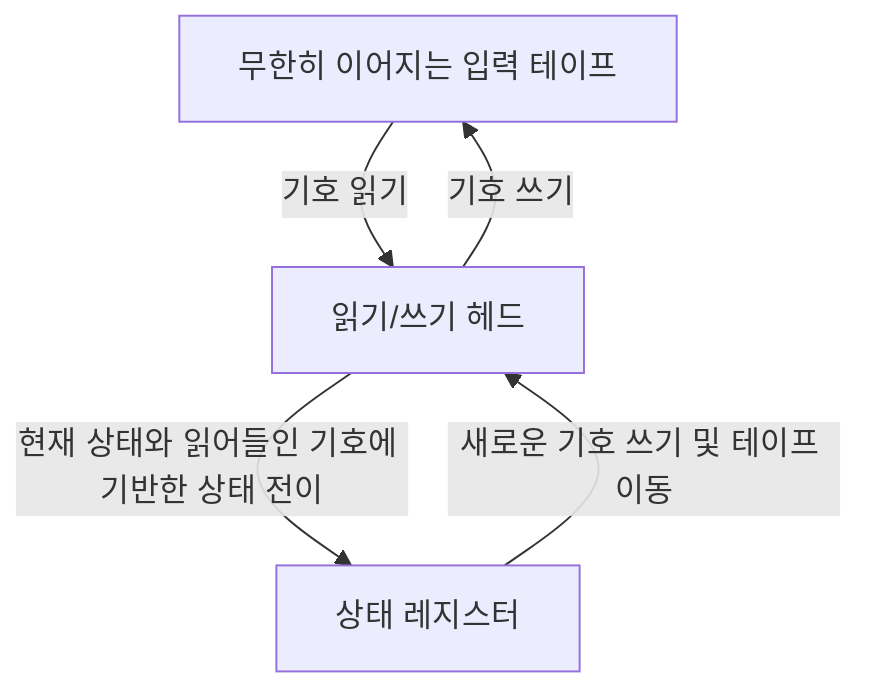
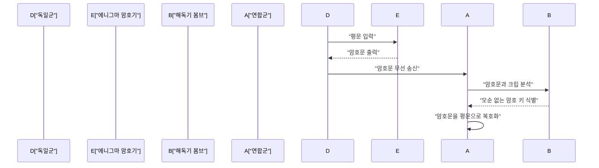
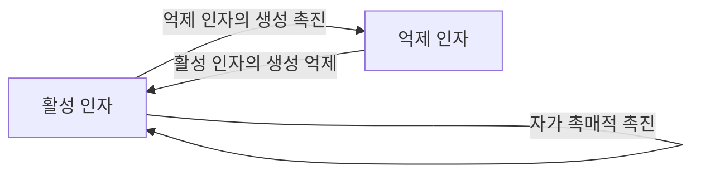

# 1. 서론

앨런 매티슨 튜링은 현대 컴퓨터 과학, 인공지능, 수리 생물학의 기초를 다진 영국의 수학자입니다. 그가 고안한 **튜링 머신** 은 우리가 오늘날 사용하는 모든 컴퓨터의 이론적 원형이 되었습니다. 이 글에서는 튜링의 파란만장한 생애와 그가 남긴 위대한 수학적, 과학적 업적에 대해 자세히 살펴보겠습니다. 그가 없었다면 우리의 현대 디지털 사회는 완전히 다른 모습이거나 그 도래가 수십 년은 지연되었을 것입니다.

# 2. 어린 시절과 수학에 대한 눈뜸

1912년 6월 23일 런던 패딩턴에서 태어난 튜링은 부모님이 인도에서 공무원으로 일했음에도 불구하고 영국에서 교육을 받았습니다. 어려서부터 천재적인 수학적 재능의 번뜩임을 보인 그는 공리계와 논리학에 깊은 관심을 가졌습니다.

셔본 학교 재학 시절, 그는 아인슈타인의 상대성 이론을 스스로 이해하고 심지어 뉴턴의 운동 법칙에 의문을 제기하는 등 이미 비범한 재능을 보여주었습니다. 케임브리지 대학교 킹스 칼리지에 진학한 후, 그는 수리 논리학 연구에 전념하게 됩니다. 이 시기에 그가 품었던 "논리와 계산의 한계"에 대한 순수한 호기심은 훗날의 역사적인 대발견으로 이어졌습니다.

# 3. 튜링 머신과 계산 가능성 이론

당시 수학계에서 가장 큰 미해결 문제 중 하나는 1928년 [다비트 힐베르트](https://kenji.blog/p/hilbert/)가 제안한 "결정 문제(Entscheidungsproblem)"였습니다. 이는 "어떤 수학적 명제가 주어졌을 때, 그것이 참인지 거짓인지를 기계적인 절차로 판정하는 알고리즘이 존재하는가?"라는 근본적인 질문이었습니다.

튜링은 이 문제에 대해 완전히 새로운 접근 방식으로 도전했습니다. 1936년의 획기적인 논문 "계산 가능한 수와 결정 문제에 대한 응용"에서 그는 추상적인 계산 기계인 **튜링 머신** 을 정의했습니다.

## 3.1 튜링 머신의 구조

튜링 머신은 다음 요소들로 구성된 이론상의 기계입니다. 현대 컴퓨터에서 메모리와 CPU의 역할을 극한까지 단순화한 것이라고 할 수 있습니다.

튜링은 계산 가능한 어떤 함수라도 이 **튜링 머신** 에 의해 계산될 수 있음을 수학적으로 증명했습니다. 나아가 그는 어떤 튜링 머신의 구조를 기술한 데이터를 읽어 그 동작을 시뮬레이션할 수 있는 "보편 튜링 머신(Universal Turing Machine)"을 고안했습니다. 이것이 바로 프로그램을 데이터로서 메모리에 저장하고 실행한다는 현대의 "폰 노이만 구조" 컴퓨터의 기본 개념 그 자체입니다.

## 3.2 정지 문제와 불완전성

튜링은 주어진 프로그램이 주어진 입력에 대해 최종적으로 정지할지 여부를 사전에 판정하는 일반적인 알고리즘이 존재하지 않음, 즉 **정지 문제** 가 결정 불가능함을 증명했습니다.

수학적으로, 정지 문제의 판정 함수 $H(x, y)$를 다음과 같이 가정합니다. 여기서 $x$는 프로그램, $y$는 입력입니다.

$$
H(x, y) = \begin{cases} 
1 & (\text{프로그램 } x \text{ 가 입력 } y \text{ 에서 정지하는 경우}) \\
0 & (\text{프로그램 } x \text{ 가 입력 } y \text{ 에서 무한 루프에 빠지는 경우})
\end{cases}
$$

만약 이러한 함수 $H$를 계산하는 튜링 머신이 존재한다고 가정해 봅시다. 이 경우 대각선 논법에 기반한 프로그램 $D(x)$를 다음과 같이 구축할 수 있습니다.

$$
D(x) = \begin{cases} 
\text{무한 루프} & (\text{만약 } H(x, x) = 1 \text{ 인 경우}) \\
\text{정지} & (\text{만약 } H(x, x) = 0 \text{ 인 경우})
\end{cases}
$$

여기서 $D(D)$를 실행하면 어떻게 될까요? 만약 $D$가 정지한다고 가정하면 정의에 의해 무한 루프에 빠지며, 무한 루프에 빠진다고 가정하면 정지하게 됩니다. 이는 논리적인 모순을 낳습니다. 대각선 논법을 사용한 이 명쾌한 증명을 통해 결정 문제에 대한 부정적인 해답이 도출되었고, 수학의 한계가 증명되었습니다.

# 4. 에니그마 해독과 제2차 세계 대전

제2차 세계 대전 중 튜링은 블레츨리 파크에 있는 영국의 암호 학교(GC&CS)에서 중추적인 역할을 수행했습니다. 그의 가장 큰 공헌은 독일 해군이 사용하던 강력한 로터식 암호기 **에니그마** 의 해독입니다.

## 4.1 암호 해독기 "봄브"의 개발

그는 "봄브(Bombe)"라는 전기 기계식 암호 해독기를 설계했습니다. 봄브는 에니그마 로터의 초기 설정과 플러그보드 배선을 고속으로 탐색하기 위한 거대한 기계였습니다. 알려진 평문(크립)과 암호문의 대응 관계로부터 전기 회로를 이용하여 논리적인 모순을 순식간에 검출하고 불가능한 설정을 배제해 나가는 획기적인 방식이었습니다.

이 업적으로 연합군은 대서양 전투에서 독일 유보트의 위협을 물리치고 전황을 유리하게 이끌 수 있었습니다. 역사가들은 블레츨리 파크에서의 암호 해독 활동이 제2차 세계 대전을 최소 2년 단축하고 수백만 명의 목숨을 구했다고 높이 평가합니다.

# 5. 전후의 컴퓨터 개발: ACE와 맨체스터 마크 1

전후 튜링은 국립 물리 연구소(NPL)에서 일하며 **ACE**(Automatic Computing Engine)의 설계에 착수했습니다. 이 설계는 그가 1936년에 고안한 보편 튜링 머신을 실제 전자 회로로 구현하려는 것이었습니다. ACE의 설계는 매우 야심찬 것이었으며, 현대의 RISC(축소 명령 집합 컴퓨터) 아키텍처의 선구자라 할 수 있는 빠르고 효율적인 명령 집합을 갖추고 있었습니다.

그러나 NPL의 관료적인 절차와 개발 지연에 불만을 품은 튜링은 1948년 맨체스터 대학교로 이적했습니다. 그곳에서 그는 세계 최초의 프로그램 내장 방식 컴퓨터 중 하나인 **맨체스터 마크 1**(Manchester Mark 1)의 소프트웨어 개발에 깊이 관여했습니다. 그는 초기 프로그래밍 언어와 서브루틴의 개념을 확립하며 세계 최초의 프로그래머 중 한 사람으로서 큰 공헌을 했습니다.

# 6. 인공지능과 튜링 테스트

튜링은 컴퓨터가 인간처럼 생각할 수 있는가라는 철학적인 질문에 정면으로 맞섰습니다. 1950년의 획기적인 논문 "계산 기계와 지능"에서 그는 "기계는 생각할 수 있는가?"라는 모호한 질문을 보다 검증 가능한 형태로 바꾼, 오늘날 **튜링 테스트** 라고 불리는 실험(그는 이를 "이미테이션 게임"이라 불렀습니다)을 제안했습니다.

## 6.1 이미테이션 게임의 규칙

튜링 테스트는 다음과 같이 진행됩니다. 인간 심사위원이 보이지 않는 곳에 있는 인간 및 기계 모두와 텍스트 기반으로 대화를 나눕니다. 만약 심사위원이 대화 상대 중 어느 쪽이 기계이고 어느 쪽이 인간인지를 유의미한 확률로 확실하게 판별하지 못한다면, 그 기계는 "지능을 가지고 있다"고 간주하는 것입니다.

이 실용적인 기준은 기계의 내부 구조나 의식의 유무를 묻지 않고 오직 외부에서 관찰 가능한 "행동"만으로 지능을 정의하려 했다는 점에서 매우 혁신적이었습니다. 이 개념은 현대 자연어 처리 및 인공지능(AI) 연구 발전에 있어 중요한 철학적 기둥으로 남아 있으며, 오늘날에도 AI의 능력을 측정하는 지표로 논의되고 있습니다.

# 7. 형태 형성의 수리 생물학

튜링의 호기심은 수학이나 컴퓨터 과학에 그치지 않고 생명의 신비인 생물학에까지 미쳤습니다. 1952년 그는 "형태 형성의 화학적 기초"라는 논문을 발표하여 생물의 무늬(예를 들어 얼룩말의 줄무늬, 표범의 반점, 물고기의 무늬 등)가 어떻게 형성되는지를 수학적으로 모델링했습니다.

## 7.1 반응-확산 방정식

그는 반응-확산계(Reaction-Diffusion System)라 불리는 편미분 방정식계를 제안했습니다. 이는 두 종류의 화학 물질(활성 인자와 억제 인자)이 상호 작용하면서 공간적으로 확산되는 모습을 기술합니다.

$$
\frac{\partial u}{\partial t} = D_u \nabla^2 u + f(u, v)
$$
$$
\frac{\partial v}{\partial t} = D_v \nabla^2 v + g(u, v)
$$

여기서 $u$와 $v$는 각각 활성 인자와 억제 인자의 농도, $D_u$와 $D_v$는 각각의 확산 계수, $f(u, v)$와 $g(u, v)$는 화학 반응을 나타내는 함수(반응항)입니다.

튜링은 공간적으로 균일하고 안정적인 상태가 아주 작은 요동(노이즈)과 확산 속도의 차이(일반적으로 $D_v > D_u$)에 의해 불안정해지고, 공간적인 패턴이 자발적으로 형성되는 "튜링 불안정성"을 수학적으로 증명했습니다.

이 모델은 언뜻 보기에 복잡하고 무작위로 보이는 생물의 무늬가 사실은 단순한 물리적, 화학적 법칙으로부터 자발적으로 만들어진다는 것을 보여준 것으로, 현재의 수리 생물학과 이론 생물학의 기초가 되는 매우 중요한 성과입니다.

# 8. 말년과 유산

튜링의 지대한 공헌에도 불구하고 그의 말년은 비극적이었습니다. 당시 영국에서는 동성애가 법으로 엄격히 금지되어 있었고, 그는 1952년 동성애 혐의로 유죄 판결을 받았습니다. 투옥을 면하는 대신 여성 호르몬 투여를 통한 화학적 거세를 강요받은 그는 연구에 필요한 보안 인가를 박탈당하고 자신이 사랑하던 연구의 일부에서 쫓겨났습니다.

1954년 6월 7일, 그는 41세의 젊은 나이에 세상을 떠났습니다. 사인은 청산가리 중독이었으며, 침대 옆에 베어 먹다 남은 사과가 남겨져 있었기 때문에 일반적으로 백설공주를 모방한 자살로 여겨집니다.

그러나 그가 사망한 지 수십 년이 지나면서 그의 업적에 대한 전 세계적인 재평가와 명예 회복이 진행되었습니다. 2009년 영국 정부는 당시 그가 받은 부당한 대우에 대해 공식적으로 사과했고, 2013년에는 엘리자베스 2세 여왕으로부터 사후 사면을 받았습니다.

오늘날 컴퓨터 과학 분야에서 세계 최고 권위의 상(흔히 '컴퓨터계의 노벨상'이라 불림)은 그의 공로를 영원히 기리기 위해 **튜링상** 이라 명명되었습니다. [앨런 튜링](https://kenji.blog/p/turing/)은 수학, 암호학, 컴퓨터 과학, 인공지능, 생물학이라는 다방면에 걸쳐 시대를 훨씬 앞서가는 발상을 가지고 있었습니다. 그가 남긴 이론과 아이디어는 현대 디지털 사회의 기반으로서 오늘날에도 여전히 강력하게 숨 쉬고 있습니다.
