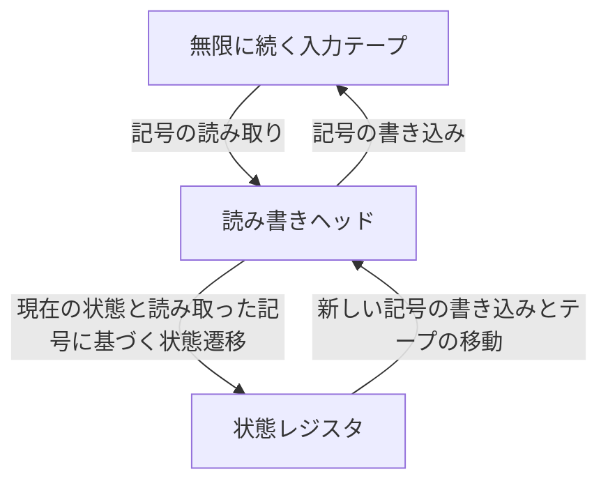
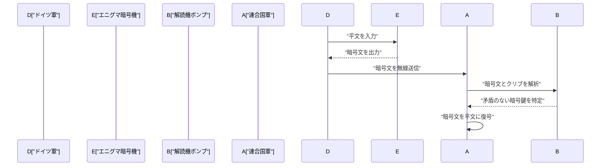
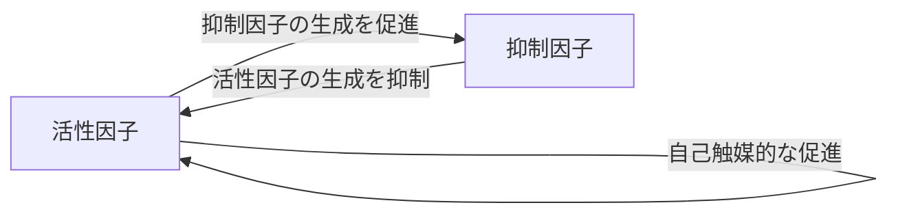

# 1. はじめに

アラン・マシスン・[チューリング](https://kenji.blog/p/turing/)（Alan Mathison Turing）は、現代の計算機科学、人工知能、そして数理生物学の基礎を築いたイギリスの数学者です。彼が構想した **チューリングマシン** は、私たちが今日使用しているあらゆるコンピュータの理論的な原型となりました。この記事では、[チューリング](https://kenji.blog/p/turing/)の波乱に満ちた生涯と、彼が残した偉大な数学的・科学的業績について、詳しく紐解いていきます。彼の存在がなければ、現代のデジタル社会は全く異なるものになっていたか、あるいはその到来が数十年遅れていたことでしょう。

# 2. 若き日の[チューリング](https://kenji.blog/p/turing/)と数学への目覚め

1912年6月23日、[チューリング](https://kenji.blog/p/turing/)はロンドンのパディントンで生まれました。彼の両親はインドの公務員でしたが、彼はイギリスで教育を受けました。幼少期から天才的な数学の才能の片鱗を見せていた彼は、公理系や論理学に対して強い関心を抱いていました。

シェアボーン校での学生時代、彼はアインシュタインの相対性理論を自力で理解し、さらには[ニュートン](https://kenji.blog/p/newton/)の運動法則に対する疑問を抱くなど、その非凡な才能をすでに発揮していました。ケンブリッジ大学キングス・カレッジに進学後、彼は本格的に数理論理学の研究に打ち込むようになります。この時期に彼が抱いた「論理と計算の限界」に対する純粋な好奇心が、後の歴史的な大発見へと繋がっていきます。

# 3. [チューリング](https://kenji.blog/p/turing/)マシンと計算可能性の理論

当時の数学界において最大の未解決問題の一つであったのが、[ダフィット・ヒルベルト](https://kenji.blog/p/hilbert/)が1928年に提唱した「決定問題 (Entscheidungsproblem)」でした。これは、「任意の数学的命題が与えられたとき、それが真であるか偽であるかを機械的な手順で判定するアルゴリズムが存在するか」という根源的な問いです。

[チューリング](https://kenji.blog/p/turing/)はこの問題に対し、全く新しいアプローチで挑みました。1936年の画期的な論文「計算可能数とその決定問題への応用」の中で、彼は抽象的な計算機械である **[チューリング](https://kenji.blog/p/turing/)マシン** を定義しました。

## 3.1 [チューリング](https://kenji.blog/p/turing/)マシンの構造

[チューリング](https://kenji.blog/p/turing/)マシンは、以下の要素から構成される理論上の機械です。これは現代のコンピュータにおけるメモリやCPUの役割を極限まで単純化したものと言えます。

[チューリング](https://kenji.blog/p/turing/)は、いかなる計算可能な関数も、この **チューリングマシン** によって計算可能であることを数学的に示しました。さらに彼は、任意のチューリングマシンの構造を記述したデータを読み込み、その動作をシミュレートできる「万能チューリングマシン (Universal [Turing Machine](https://kenji.blog/p/turing-machine-computability/))」を考案しました。これは、プログラムをデータとしてメモリに格納し実行するという、現代の「ノイマン型コンピュータ」の基本概念そのものです。

## 3.2 停止問題と不完全性

[チューリング](https://kenji.blog/p/turing/)は、あるプログラムが与えられた入力に対して最終的に停止するかどうかを事前に判定する一般的なアルゴリズムが存在しないこと、すなわち **停止問題** が決定不能であることを証明しました。

数学的には、停止問題の判定関数 $H(x, y)$ を以下のように仮定します。ここで $x$ はプログラム、$y$ は入力です。

$$
H(x, y) = \begin{cases} 
1 & (\text{プログラム } x \text{ が入力 } y \text{ で停止する場合}) \\
0 & (\text{プログラム } x \text{ が入力 } y \text{ で無限ループする場合})
\end{cases}
$$

もしこのような関数 $H$ を計算する[チューリング](https://kenji.blog/p/turing/)マシンが存在すると仮定します。その場合、次のような対角化に基づくプログラム $D(x)$ を構築できます。

$$
D(x) = \begin{cases} 
\text{無限ループする} & (\text{もし } H(x, x) = 1 \text{ の場合}) \\
\text{停止する} & (\text{もし } H(x, x) = 0 \text{ の場合})
\end{cases}
$$

ここで $D(D)$ を実行するとどうなるでしょうか。$D$ が停止すると仮定すると定義により無限ループし、無限ループすると仮定すると停止することになり、論理的な矛盾が生じます。この対角線論法を用いた鮮やかな証明により、決定問題に対する否定的な解答が導かれ、数学の限界が示されました。

# 4. エニグマ暗号の解読と第二次世界大戦

第二次世界大戦中、[チューリング](https://kenji.blog/p/turing/)はブレッチリー・パークにあるイギリスの政府暗号学校 (GC&CS) で中心的な役割を果たしました。彼の最大の貢献は、ドイツ海軍が使用していた強力なローター式暗号機 **エニグマ** の解読です。

## 4.1 暗号解読機「ボンブ」の開発

彼は「ボンブ (Bombe)」と呼ばれる電気機械式の暗号解読機を設計しました。ボンブは、エニグマのローターの初期設定とプラグボードの配線を高速で探索するための巨大な機械です。既知の平文（クリブ）と暗号文の対応関係から、論理的な矛盾を電気回路を用いて瞬時に検出し、あり得ない設定を排除していくという画期的な手法でした。

この業績により、連合国側は大西洋の戦いにおいてドイツのUボートの脅威を退け、戦局を有利に進めることができました。歴史家たちは、ブレッチリー・パークでの暗号解読活動が第二次世界大戦の終結を少なくとも2年は早め、数百万人の命を救ったと高く評価しています。

# 5. 戦後のコンピュータ開発：ACEとマンチェスター・マーク1

戦後、[チューリング](https://kenji.blog/p/turing/)は国立物理学研究所 (NPL) で働き、**ACE** (Automatic Computing Engine) の設計に取り組みました。この設計は、彼が1936年に考案した万能[チューリング](https://kenji.blog/p/turing/)マシンを現実の電子回路で具現化しようとするものでした。ACEの設計は非常に野心的であり、現代のRISC（縮小命令セットコンピュータ）アーキテクチャの先駆けとも言える、高速かつ効率的な命令セットを備えていました。

しかし、NPLでの官僚的な手続きや開発の遅れに不満を持った[チューリング](https://kenji.blog/p/turing/)は、1948年にマンチェスター大学に移籍しました。そこで彼は、世界初のプログラム内蔵方式コンピュータの一つである **マンチェスター・マーク1** (Manchester Mark 1) のソフトウェア開発に深く携わりました。彼は初期の[プログラミング言語](https://kenji.blog/p/programming-languages-history-paradigm-evolution/)やサブルーチンの概念を確立し、世界初のプログラマの一人としても多大な貢献をしました。

# 6. 人工知能と[チューリング](https://kenji.blog/p/turing/)テスト

[チューリング](https://kenji.blog/p/turing/)は計算機が人間のように思考できるかという哲学的な問いに真っ向から取り組みました。1950年の画期的な論文「計算機械と知性 (Computing Machinery and Intelligence)」において、彼は「機械は思考できるか？」という曖昧な問いをより検証可能な形に置き換えた、今日 **[チューリング](https://kenji.blog/p/turing/)テスト** と呼ばれる実験（彼はこれを「イミテーション・ゲーム」と呼びました）を提案しました。

## 6.1 イミテーション・ゲームのルール

[チューリング](https://kenji.blog/p/turing/)テストは以下のように行われます。人間の判定者が、見えない場所にいる人間と機械の両方とテキストベースで対話を行います。もし判定者が、対話の相手のどちらが機械でどちらが人間であるかを有意な確率で判別できなければ、その機械は「知能を持っている」と見なすというものです。

この実用的な基準は、機械の内部構造や意識の有無を問わず、外部から観察可能な「振る舞い」のみで知性を定義しようとした点で非常に革新的でした。この概念は、現代の自然言語処理や人工知能 (AI) 研究の発展における重要な哲学的な柱となっており、今でもAIの性能を測る一つの指標として議論され続けています。

# 7. 形態形成の数理生物学

[チューリング](https://kenji.blog/p/turing/)の好奇心は数学や計算機科学にとどまらず、生命の神秘である生物学にも及びました。1952年、彼は「形態形成の化学的基礎 (The Chemical Basis of Morphogenesis)」という論文を発表し、生物の模様（例えばシマウマの縞模様、ヒョウの斑点、魚の模様など）がどのようにして形成されるのかを数学的にモデル化しました。

## 7.1 反応拡散方程式

彼は、反応拡散系 (Reaction-Diffusion System) と呼ばれる偏微分方程式系を提案しました。これは、2種類の化学物質（活性因子と抑制因子）が相互作用しながら空間的に拡散する様子を記述するものです。

$$
\frac{\partial u}{\partial t} = D_u \nabla^2 u + f(u, v)
$$
$$
\frac{\partial v}{\partial t} = D_v \nabla^2 v + g(u, v)
$$

ここで $u$ と $v$ はそれぞれ活性因子と抑制因子の濃度、$D_u$ と $D_v$ はそれぞれの拡散係数、$f(u, v)$ と $g(u, v)$ は化学反応を表す関数（反応項）です。

[チューリング](https://kenji.blog/p/turing/)は、空間的に均一で安定な状態が、わずかなゆらぎ（ノイズ）と拡散の速度の違い（通常、$D_v > D_u$ であること）によって不安定化し、空間的なパターンが自己組織化される「[チューリング](https://kenji.blog/p/turing/)不安定性」を数学的に証明しました。

このモデルは、一見複雑でランダムに見える生物の模様が、実は単純な物理的・化学的法則から自発的に生み出されることを示したものであり、現在の数理生物学や理論生物学の基礎となる極めて重要な成果でした。

# 8. 晩年と遺産

[チューリング](https://kenji.blog/p/turing/)の多大な貢献にもかかわらず、彼の晩年は悲劇的なものでした。当時のイギリスでは同性愛が法律で厳しく禁じられており、1952年に彼は同性愛の罪で有罪判決を受けました。投獄を免れる代わりに女性ホルモンの投与による化学的去勢を強いられた彼は、研究におけるセキュリティ・クリアランスを剥奪され、愛する研究の一部から追放されました。

1954年6月7日、彼は41歳の若さでこの世を去りました。死因は青酸中毒であり、齧りかけのリンゴがベッドの脇に残されていたことから、一般的には白雪姫を模した自殺とされています。

しかし、死後数十年を経て、彼の業績に対する世界的な再評価と名誉回復が進みました。2009年にはイギリス政府が彼に対する当時の不当な扱いについて公式に謝罪し、2013年にはエリザベス2世から没後恩赦が与えられました。

今日、計算機科学における世界最高の賞（いわゆる「コンピュータ界のノーベル賞」）は、彼の功績を永遠に称えて **[チューリング](https://kenji.blog/p/turing/)賞** と名付けられています。[アラン・チューリング](https://kenji.blog/p/turing/)は、数学、暗号学、計算機科学、人工知能、生物学という多岐にわたる分野で、時代を遥かに先取りした発想を持っていました。彼の残した理論とアイデアは、現代のデジタル社会の基盤として、今もなお力強く息づいています。
