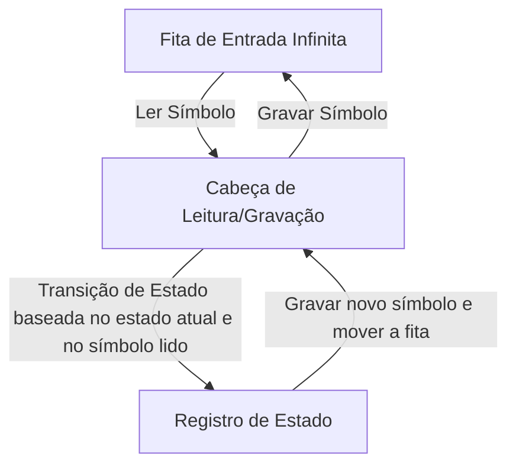
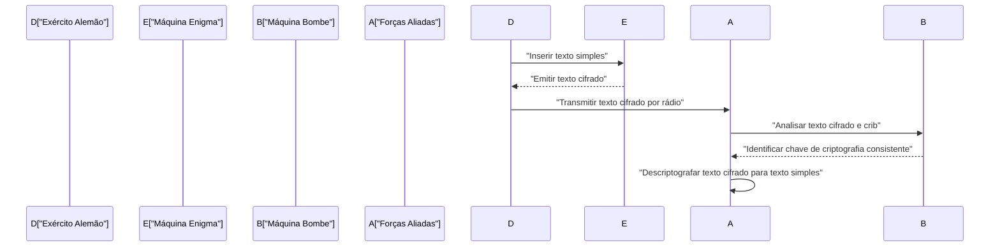
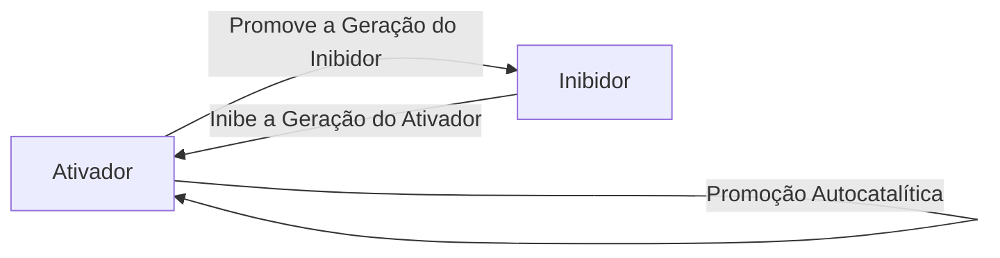

# 1. Introdução

Alan Mathison Turing foi um matemático britânico que lançou as bases da ciência da computação moderna, inteligência artificial e biologia matemática. A **Máquina de Turing** que ele concebeu tornou-se o protótipo teórico para todos os computadores que usamos hoje. Neste artigo, exploraremos em detalhes a vida turbulenta de Turing e as grandes realizações matemáticas e científicas que ele deixou para trás. Sem sua existência, nossa sociedade digital moderna seria completamente diferente ou sua chegada teria sido adiada em décadas.

# 2. Início de Vida e o Despertar para a Matemática

Nascido em Paddington, Londres, em 23 de junho de 1912, Turing foi educado na Inglaterra, embora seus pais fossem funcionários públicos na Índia. Mostrando vislumbres de um talento matemático genial desde muito jovem, ele tinha um forte interesse em sistemas axiomáticos e lógica.

Durante seus dias de escola em Sherborne, ele já demonstrava um talento extraordinário ao entender a teoria da relatividade de Einstein por conta própria e até questionar as leis do movimento de Newton. Depois de ingressar no King's College, Cambridge, dedicou-se inteiramente ao estudo da lógica matemática. A pura curiosidade que ele nutriu durante esse período sobre os "limites da lógica e da computação" o levou às suas descobertas históricas posteriores.

# 3. A Máquina de Turing e a Teoria da Computabilidade

Um dos maiores problemas não resolvidos no mundo matemático na época era o "Entscheidungsproblem" (Problema de Decisão) proposto por [David Hilbert](https://kenji.blog/pt/p/hilbert/) em 1928. Esta era uma questão fundamental: "Dada qualquer afirmação matemática, existe um procedimento algorítmico mecânico para determinar se ela é verdadeira ou falsa?"

Turing abordou esse problema com uma abordagem totalmente nova. Em seu artigo inovador de 1936, "Sobre os Números Computáveis, com uma Aplicação ao Entscheidungsproblem", ele definiu uma máquina de computação abstrata, a **Máquina de Turing**.

## 3.1 Estrutura da Máquina de Turing

Uma máquina de Turing é uma máquina teórica composta pelos seguintes elementos. Pode-se dizer que é uma simplificação extrema dos papéis da memória e da CPU nos computadores modernos.

Turing demonstrou matematicamente que qualquer função computável poderia ser calculada por essa **Máquina de Turing**. Além disso, ele concebeu a "Máquina de Turing Universal", que poderia ler dados descrevendo a estrutura de qualquer máquina de Turing e simular seu funcionamento. Esse é exatamente o conceito básico do computador moderno de "arquitetura de von Neumann" - armazenar um programa como dados na memória e executá-lo.

## 3.2 O Problema da Parada e a Incompletude

Turing provou que não há um algoritmo geral para determinar com antecedência se um determinado programa acabará parando para uma determinada entrada, o que significa que o **Problema da Parada** é indecidível.

Matematicamente, vamos assumir uma função de decisão do problema da parada $H(x, y)$, onde $x$ é o programa e $y$ é a entrada:

$$
H(x, y) = \begin{cases} 
1 & (\text{Se o programa } x \text{ parar na entrada } y) \\
0 & (\text{Se o programa } x \text{ entrar em um loop infinito na entrada } y)
\end{cases}
$$

Suponha que exista uma máquina de Turing que calcule essa função $H$. Nesse caso, podemos construir um programa $D(x)$ baseado na [diagonalização](/pt/p/diagonalization-and-jordan-normal-form/) da seguinte forma:

$$
D(x) = \begin{cases} 
\text{Loop infinito} & (\text{Se } H(x, x) = 1) \\
\text{Parar} & (\text{Se } H(x, x) = 0)
\end{cases}
$$

O que acontece se executarmos $D(D)$? Se assumirmos que $D$ para, por definição, ele entra em um loop infinito; se assumirmos que ele entra em um loop infinito, ele para. Isso resulta em uma contradição lógica. Esta prova brilhante usando o argumento diagonal levou a uma resposta negativa ao Problema de Decisão, demonstrando os limites da matemática.

# 4. Decifrando a Enigma e a Segunda Guerra Mundial

Durante a Segunda Guerra Mundial, Turing desempenhou um papel central na Escola de Códigos e Cifras do Governo Britânico (GC&CS) em Bletchley Park. Sua maior contribuição foi decifrar a **Enigma**, a poderosa máquina de cifra de rotores usada pela Marinha Alemã.

## 4.1 Desenvolvimento da Máquina de Decifrar "Bombe"

Ele projetou uma máquina de decifrar eletromecânica chamada "Bombe". A Bombe era uma máquina gigantesca usada para buscar rapidamente as configurações iniciais dos rotores da Enigma e a fiação do painel de conexões. Foi um método revolucionário que detectou instantaneamente contradições lógicas usando circuitos elétricos com base na relação entre o texto simples conhecido (cribs) e o texto cifrado, eliminando assim as configurações impossíveis.

Graças a esta conquista, os Aliados conseguiram repelir a ameaça dos U-boats alemães na Batalha do Atlântico e avançar a guerra de forma favorável. Historiadores elogiam muito as atividades de quebra de códigos em Bletchley Park por encurtarem a Segunda Guerra Mundial em pelo menos dois anos e salvarem milhões de vidas.

# 5. Desenvolvimento de Computadores no Pós-Guerra: ACE e Manchester Mark 1

Após a guerra, Turing trabalhou no Laboratório Físico Nacional (NPL) e se dedicou ao projeto do **ACE** (Automatic Computing Engine). Este projeto tentou realizar a Máquina de Turing Universal que ele concebeu em 1936 com circuitos eletrônicos reais. O projeto do ACE era altamente ambicioso, apresentando um conjunto de instruções rápido e eficiente que poderia ser considerado um precursor da moderna arquitetura RISC (Reduced Instruction Set Computer).

No entanto, frustrado com os procedimentos burocráticos e atrasos no desenvolvimento do NPL, Turing mudou-se para a Universidade de Manchester em 1948. Lá, ele esteve profundamente envolvido no desenvolvimento de software para o **Manchester Mark 1**, um dos primeiros computadores de programa armazenado do mundo. Ele estabeleceu os conceitos das primeiras linguagens de programação e sub-rotinas, fazendo imensas contribuições como um dos primeiros programadores do mundo.

# 6. Inteligência Artificial e o Teste de Turing

Turing abordou a questão filosófica de saber se os computadores poderiam pensar como humanos de frente. Em seu artigo de 1950, "Computing Machinery and Intelligence", ele propôs um experimento conhecido hoje como o **Teste de Turing** (que ele chamou de "Jogo da Imitação") para substituir a pergunta ambígua "As máquinas podem pensar?" por uma forma mais testável.

## 6.1 Regras do Jogo da Imitação

O Teste de Turing é conduzido da seguinte forma: um avaliador humano se envolve em uma conversa baseada em texto tanto com um humano quanto com uma máquina, que estão escondidos da vista. Se o avaliador não conseguir distinguir de forma confiável qual parceiro de conversa é a máquina e qual é o humano com uma probabilidade significativa, a máquina é considerada como "possuindo inteligência".

Este padrão prático foi altamente inovador, pois tentou definir a inteligência apenas pelo "comportamento" observável externamente, independentemente da estrutura interna da máquina ou da presença de consciência. Este conceito continua a ser um pilar filosófico vital no desenvolvimento da pesquisa moderna em processamento de linguagem natural e inteligência artificial (IA), e ainda hoje é debatido como uma métrica para medir as capacidades da IA.

# 7. Biologia Matemática da Morfogênese

A curiosidade de Turing estendeu-se além da matemática e da ciência da computação para a biologia, o mistério da vida. Em 1952, ele publicou um artigo intitulado "The Chemical Basis of Morphogenesis", no qual ele modelou matematicamente como os padrões biológicos (como as listras da zebra, as manchas do leopardo e os padrões dos peixes) são formados.

## 7.1 Equação de Reação-Difusão

Ele propôs um sistema de equações diferenciais parciais chamado Sistema de Reação-Difusão. Isso descreve como dois tipos de substâncias químicas (um ativador e um inibidor) se difundem espacialmente enquanto interagem entre si.

$$
\frac{\partial u}{\partial t} = D_u \nabla^2 u + f(u, v)
$$
$$
\frac{\partial v}{\partial t} = D_v \nabla^2 v + g(u, v)
$$

Aqui, $u$ e $v$ são as concentrações do ativador e do inibidor, $D_u$ e $D_v$ são seus respectivos coeficientes de difusão, e $f(u, v)$ e $g(u, v)$ são funções que representam reações químicas (termos de reação).

Turing provou matematicamente a "instabilidade de Turing", onde um estado espacialmente uniforme e estável é desestabilizado por pequenas flutuações (ruído) e diferenças nas velocidades de difusão (tipicamente $D_v > D_u$), fazendo com que padrões espaciais se auto-organizem.

Esse modelo mostrou que padrões biológicos aparentemente complexos e aleatórios são na verdade gerados espontaneamente a partir de leis físicas e químicas simples, representando uma conquista extremamente importante que forma a base da biologia matemática e teórica atual.

# 8. Últimos Anos e Legado

Apesar das imensas contribuições de Turing, seus últimos anos foram trágicos. Na época, a homossexualidade era estritamente proibida por lei no Reino Unido, e ele foi condenado por atos homossexuais em 1952. Forçado a se submeter à castração química por meio de injeções de hormônios femininos como alternativa à prisão, ele perdeu sua autorização de segurança para pesquisas e foi expulso de partes das pesquisas que amava.

Em 7 de junho de 1954, ele faleceu na tenra idade de 41 anos. A causa da morte foi envenenamento por cianeto, e com uma maçã comida pela metade deixada ao lado de sua cama, é geralmente considerado um suicídio imitando a Branca de Neve.

No entanto, décadas após sua morte, a reavaliação global de suas conquistas e a restauração de sua honra progrediram. Em 2009, o governo britânico pediu desculpas oficialmente pelo tratamento injusto que ele recebeu na época, e em 2013, ele recebeu um perdão real póstumo da Rainha Elizabeth II.

Hoje, o prêmio mais alto do mundo em ciência da computação (frequentemente chamado de "Prêmio Nobel da Computação") é nomeado o **Prêmio Turing** para honrar sempre suas conquistas. [Alan Turing](https://kenji.blog/pt/p/turing/) possuía ideias que estavam muito à frente de seu tempo em diversos campos: matemática, criptografia, ciência da computação, inteligência artificial e biologia. As teorias e ideias que ele deixou para trás continuam a respirar poderosamente hoje como a base da nossa moderna sociedade digital.
