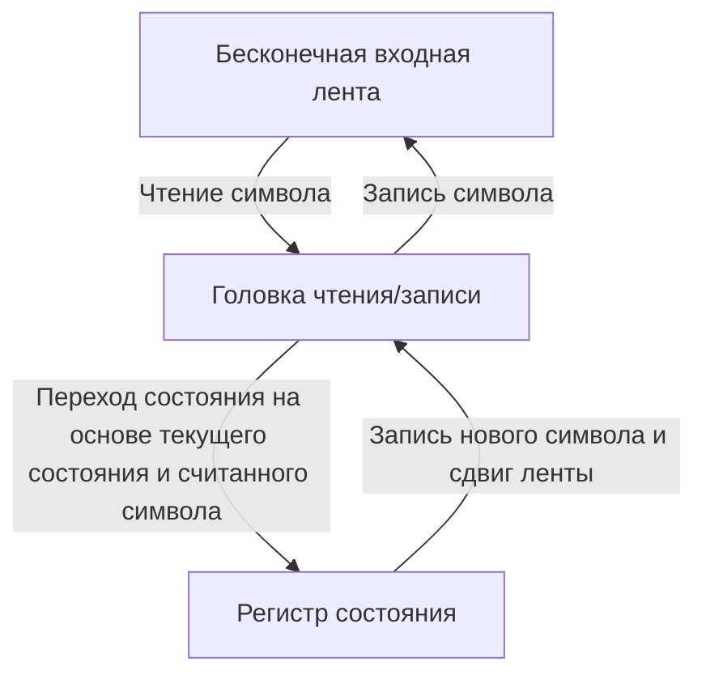
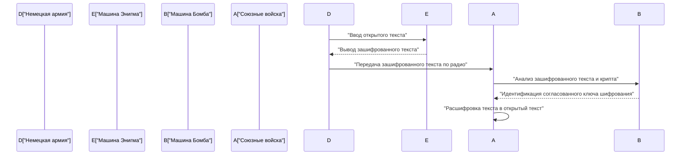
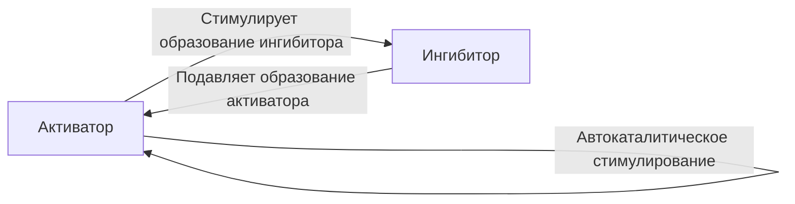

# 1. Введение

Алан Мэтисон Тьюринг был британским математиком, заложившим основы современной информатики, искусственного интеллекта и математической биологии. Задуманная им **Машина Тьюринга** стала теоретическим прототипом для каждого компьютера, который мы используем сегодня. В этой статье мы подробно рассмотрим бурную жизнь Тьюринга и великие математические и научные достижения, которые он оставил после себя. Без его существования наше современное цифровое общество либо было бы совершенно иным, либо его наступление отложилось бы на десятилетия.

# 2. Ранние годы и пробуждение интереса к математике

Тьюринг родился в Паддингтоне, Лондон, 23 июня 1912 года. Он получил образование в Англии, хотя его родители были государственными служащими в Индии. С раннего возраста проявляя проблески математического таланта уровня гения, он живо интересовался аксиоматическими системами и логикой.

Еще в школьные годы в Шерборне он продемонстрировал экстраординарный талант, самостоятельно разобравшись в теории относительности Эйнштейна и даже усомнившись в законах движения Ньютона. Поступив в Королевский колледж Кембриджа, он полностью посвятил себя изучению математической логики. Чистое любопытство к «пределам логики и вычислений», которое он питал в тот период, привело к его последующим историческим открытиям.

# 3. Машина Тьюринга и теория вычислимости

Одной из величайших нерешенных проблем в математическом мире того времени была «Проблема разрешения» (Entscheidungsproblem), предложенная Давидом Гильбертом в 1928 году. Это был фундаментальный вопрос: «Существует ли для любого математического утверждения механическая алгоритмическая процедура, позволяющая определить, истинно оно или ложно?»

Тьюринг подошел к этой проблеме с совершенно новой стороны. В своей новаторской статье 1936 года «О вычислимых числах, с приложением к Entscheidungsproblem» он определил абстрактную вычислительную машину, **Машину Тьюринга**.

## 3.1 Структура Машины Тьюринга

Машина Тьюринга — это теоретическая машина, состоящая из следующих элементов. Можно сказать, что это крайнее упрощение роли памяти и процессора в современных компьютерах.

Тьюринг математически доказал, что любая вычислимая функция может быть вычислена этой **Машиной Тьюринга**. Кроме того, он разработал «Универсальную машину Тьюринга», которая могла считывать данные, описывающие структуру любой машины Тьюринга, и моделировать ее работу. Именно в этом заключается базовая концепция современного компьютера с «архитектурой фон Неймана» — хранение программы как данных в памяти и ее выполнение.

## 3.2 Проблема остановки и неполнота

Тьюринг доказал, что не существует общего алгоритма, позволяющего заранее определить, остановится ли данная программа когда-либо при заданных входных данных. Это означает, что **Проблема остановки** неразрешима.

Математически предположим функцию решения проблемы остановки $H(x, y)$, где $x$ — программа, а $y$ — входные данные:

$$
H(x, y) = \begin{cases} 
1 & (\text{Если программа } x \text{ останавливается на входе } y) \\
0 & (\text{Если программа } x \text{ уходит в бесконечный цикл на входе } y)
\end{cases}
$$

Предположим, что существует машина Тьюринга, вычисляющая такую функцию $H$. В этом случае мы можем построить программу $D(x)$, основанную на диагонализации, следующим образом:

$$
D(x) = \begin{cases} 
\text{Бесконечный цикл} & (\text{Если } H(x, x) = 1) \\
\text{Остановка} & (\text{Если } H(x, x) = 0)
\end{cases}
$$

Что произойдет, если мы выполним $D(D)$? Если мы предположим, что $D$ останавливается, по определению она уходит в бесконечный цикл; если мы предположим, что она уходит в бесконечный цикл, она останавливается. Это приводит к логическому противоречию. Это блестящее доказательство с использованием диагонального аргумента привело к отрицательному ответу на проблему разрешения, продемонстрировав пределы математики.

# 4. Взлом «Энигмы» и Вторая мировая война

Во время Второй мировой войны Тьюринг играл центральную роль в британской Правительственной школе кодов и шифров (GC&CS) в Блетчли-парке. Его величайшим вкладом был взлом **Энигмы**, мощной роторной шифровальной машины, используемой ВМС Германии.

## 4.1 Разработка дешифровальной машины «Бомба»

Он спроектировал электромеханическую дешифровальную машину под названием «Бомба» (Bombe). Это была огромная машина, используемая для быстрого поиска начальных настроек роторов Энигмы и проводки коммутационной панели. Это был революционный метод, который мгновенно обнаруживал логические противоречия с помощью электрических цепей на основе взаимосвязи между известным открытым текстом (криптами) и зашифрованным текстом, тем самым отбрасывая невозможные настройки.

Благодаря этому достижению союзники смогли отразить угрозу немецких подводных лодок в Битве за Атлантику и добиться перелома в войне в свою пользу. Историки высоко оценивают деятельность по взлому кодов в Блетчли-парке: считается, что она сократила Вторую мировую войну по меньшей мере на два года и спасла миллионы жизней.

# 5. Послевоенное развитие компьютеров: ACE и Манчестерский Марк I

После войны Тьюринг работал в Национальной физической лаборатории (NPL) и занимался проектированием **ACE** (Автоматической вычислительной машины). В этом проекте он попытался реализовать Универсальную машину Тьюринга, задуманную им в 1936 году, с помощью реальных электронных схем. Проект ACE был весьма амбициозным и отличался быстрым и эффективным набором команд, который можно считать предвестником современной архитектуры RISC (компьютер с сокращенным набором команд).

Однако, разочарованный бюрократическими процедурами и задержками в разработке в NPL, Тьюринг в 1948 году перешел в Манчестерский университет. Там он принимал активное участие в разработке программного обеспечения для **Манчестерского Марка I**, одного из первых в мире компьютеров с хранимой программой. Он заложил концепции ранних языков программирования и подпрограмм, внеся огромный вклад как один из первых программистов в мире.

# 6. Искусственный интеллект и тест Тьюринга

Тьюринг вплотную занялся философским вопросом о том, могут ли компьютеры мыслить как люди. В своей знаковой статье 1950 года «Вычислительные машины и разум» он предложил эксперимент, известный сегодня как **Тест Тьюринга** (сам он называл его «Игрой в имитацию»), чтобы заменить неоднозначный вопрос «Могут ли машины мыслить?» на более проверяемую форму.

## 6.1 Правила игры в имитацию

Тест Тьюринга проводится следующим образом: человек-оценщик ведет текстовую беседу как с человеком, так и с машиной, которые скрыты от его глаз. Если оценщик не может с высокой долей вероятности достоверно определить, кто из собеседников является машиной, а кто — человеком, считается, что машина «обладает интеллектом».

Этот практический стандарт был весьма новаторским, поскольку пытался определить интеллект исключительно по внешне наблюдаемому «поведению», независимо от внутреннего устройства машины или наличия сознания. Эта концепция остается важнейшей философской основой в развитии современных исследований в области обработки естественного языка и искусственного интеллекта (ИИ), и по сей день обсуждается как метрика для измерения возможностей ИИ.

# 7. Математическая биология морфогенеза

Любопытство Тьюринга выходило за рамки математики и информатики и распространялось на биологию, загадку жизни. В 1952 году он опубликовал статью под названием «Химические основы морфогенеза», в которой математически смоделировал процесс формирования биологических узоров (таких как полосы зебры, пятна леопарда и узоры на рыбах).

## 7.1 Уравнение реакции-диффузии

Он предложил систему дифференциальных уравнений в частных производных, названную системой реакции-диффузии. Она описывает, как два типа химических веществ (активатор и ингибитор) пространственно диффундируют, взаимодействуя друг с другом.

$$
\frac{\partial u}{\partial t} = D_u \nabla^2 u + f(u, v)
$$
$$
\frac{\partial v}{\partial t} = D_v \nabla^2 v + g(u, v)
$$

Здесь $u$ и $v$ — концентрации активатора и ингибитора, $D_u$ и $D_v$ — их соответствующие коэффициенты диффузии, а $f(u, v)$ и $g(u, v)$ — функции, представляющие химические реакции (члены реакции).

Тьюринг математически доказал «неустойчивость Тьюринга», при которой пространственно однородное и стабильное состояние дестабилизируется из-за мельчайших флуктуаций (шума) и разницы в скоростях диффузии (как правило, $D_v > D_u$), что приводит к самоорганизации пространственных узоров.

Эта модель показала, что казалось бы сложные и случайные биологические узоры на самом деле спонтанно генерируются на основе простых физических и химических законов. Это стало чрезвычайно важным достижением, составляющим основу современной математической и теоретической биологии.

# 8. Последние годы и наследие

Несмотря на огромный вклад Тьюринга, последние годы его жизни были трагичными. В то время гомосексуальность была строго запрещена законом в Великобритании, и в 1952 году он был осужден за гомосексуальные действия. Вынужденный подвергнуться химической кастрации путем инъекций женских гормонов в качестве альтернативы тюрьме, он был лишен допуска к секретной работе и отстранен от части исследований, которые любил.

7 июня 1954 года он скончался в молодом возрасте 41 года. Причиной смерти стало отравление цианидом, а надкушенное яблоко, оставленное у его кровати, породило версию о самоубийстве с подражанием Белоснежке, которая является общепринятой.

Однако спустя десятилетия после его смерти начался процесс глобальной переоценки его достижений и восстановления его чести. В 2009 году британское правительство официально извинилось за несправедливое обращение с ним в те годы, а в 2013 году королева Елизавета II даровала ему посмертное королевское помилование.

Сегодня высшая награда в мире информатики (часто называемая «Нобелевской премией по информатике») носит название **Премия Тьюринга**, чтобы навсегда увековечить его достижения. [Алан Тьюринг](https://kenji.blog/p/turing/) обладал идеями, которые значительно опередили свое время в самых разных областях: математике, криптографии, информатике, искусственном интеллекте и биологии. Теории и идеи, которые он оставил после себя, продолжают мощно дышать сегодня, являясь фундаментом нашего современного цифрового общества.
