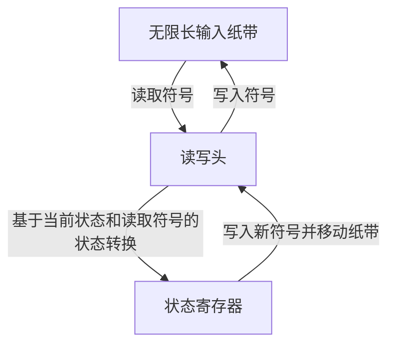
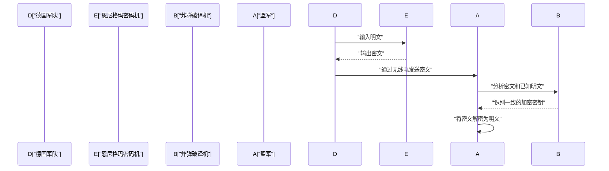
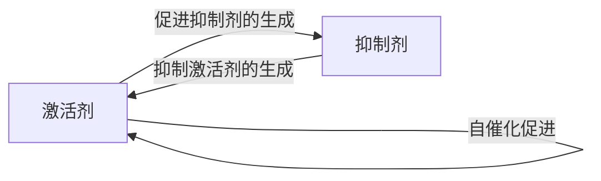

# 1. 简介

艾伦·麦席森·图灵（Alan Mathison Turing）是一位英国数学家，他奠定了现代计算机科学、人工智能和数理生物学的基础。他构想的 **图灵机** 成为我们今天使用的所有计算机的理论原型。在本文中，我们将详细探索图灵波澜壮阔的一生以及他留下的伟大数学和科学成就。如果没有他的存在，我们现代的数字社会要么完全不同，要么其到来会推迟数十年。

# 2. 早年生活与对数学的觉醒

图灵于1912年6月23日出生于伦敦帕丁顿。尽管他的父母是驻印度的公务员，但他是在英国接受教育的。他从小就展现出天才般的数学天赋，对公理系统和逻辑有着浓厚的兴趣。

在谢伯恩中学读书期间，他就已经展现出非凡的才华，例如独自理解了爱因斯坦的相对论，甚至对牛顿的运动定律提出质疑。进入剑桥大学国王学院后，他全身心投入到数理逻辑的研究中。在这一时期，他对“逻辑与计算的极限”所抱有的纯粹好奇心，引导他走向了后来历史性的伟大发现。

# 3. 图灵机与可计算性理论

当时数学界面临的最大未解问题之一，是1928年由[大卫·希尔伯特](https://kenji.blog/zh-cn/p/hilbert/)提出的“判定问题”（Entscheidungsproblem）。这是一个根本性的问题：“给定任何数学命题，是否存在一种机械的算法程序来判定它是真还是假？”

图灵以全新的视角解决了这个问题。在1936年发表的具有里程碑意义的论文《论可计算数及其在判定问题上的应用》中，他定义了一种抽象的计算机器，即 **图灵机** 。

## 3.1 图灵机的结构

图灵机是一种由以下元素组成的理论机器。可以说，它是对现代计算机中内存和CPU作用的极度简化。

图灵在数学上证明了，任何可计算的函数都可以由这台 **图灵机** 计算。此外，他还设计了“通用图灵机”，它可以读取描述任何图灵机结构的数据并模拟其运行。这正是现代“冯·诺依曼架构”计算机的基本概念——将程序作为数据存储在内存中并执行。

## 3.2 停机问题与不完备性

图灵证明了，不存在一种通用算法可以预先判断给定程序在给定输入下是否最终会停止，这意味着 **[停机问题](/zh-cn/p/halting-problem/)** 是不可判定的。

在数学上，我们假设存在一个[停机问题](/zh-cn/p/halting-problem/)判定函数 $H(x, y)$，其中 $x$ 是程序，$y$ 是输入：

$$
H(x, y) = \begin{cases} 
1 & (\text{如果程序 } x \text{ 在输入 } y \text{ 上停止}) \\
0 & (\text{如果程序 } x \text{ 在输入 } y \text{ 上陷入无限循环})
\end{cases}
$$

假设存在一台计算此函数 $H$ 的图灵机。在这种情况下，我们可以构造一个基于[对角化](/zh-cn/p/diagonalization-and-jordan-normal-form/)论证的程序 $D(x)$ 如下：

$$
D(x) = \begin{cases} 
\text{无限循环} & (\text{如果 } H(x, x) = 1) \\
\text{停止} & (\text{如果 } H(x, x) = 0)
\end{cases}
$$

如果我们执行 $D(D)$ 会发生什么？如果我们假设 $D$ 停止，根据定义它会陷入无限循环；如果我们假设它陷入无限循环，它则会停止。这导致了一个逻辑矛盾。这个使用对角线论证法的精彩证明导致了对判定问题的否定答案，从而展示了数学的极限。

# 4. 破解恩尼格玛与第二次世界大战

在第二次世界大战期间，图灵在布莱切利公园的英国政府密码学校（GC&CS）中发挥了核心作用。他最大的贡献是破解了德国海军使用的强大的转子密码机——**恩尼格玛**。

## 4.1 破译机“炸弹”（Bombe）的开发

他设计了一种名为“炸弹”（Bombe）的机电破译机。“炸弹”是一台巨大的机器，用于快速搜索恩尼格玛转子的初始设置和插线板的接线。这是一种革命性的方法，它利用电路根据已知明文（cribs）和密文之间的关系瞬间检测出逻辑矛盾，从而排除不可能的设置。

由于这一成就，盟军得以在大西洋战役中击退德国U型潜艇的威胁，并使战争向有利的方向发展。历史学家高度评价布莱切利公园的密码破译活动，认为它将第二次世界大战缩短了至少两年，并拯救了数百万人的生命。

# 5. 战后计算机的发展：ACE与曼彻斯特马克一号

战后，图灵在国家物理实验室（NPL）工作，致力于 **ACE**（自动计算引擎）的设计。该设计试图用实际的电子电路来实现他在1936年构想的通用图灵机。ACE的设计非常雄心勃勃，具有快速高效的指令集，可以被认为是现代RISC（精简指令集计算机）架构的先驱。

然而，由于对NPL的官僚程序和开发延误感到沮丧，图灵于1948年转至曼彻斯特大学。在那里，他深度参与了 **曼彻斯特马克一号**（Manchester Mark 1）——世界上第一批存储程序计算机之一的软件开发工作。他确立了早期编程语言和子程序的概念，作为世界上最早的程序员之一做出了巨大贡献。

# 6. 人工智能与图灵测试

图灵直面了计算机是否能像人类一样思考的哲学问题。在他1950年发表的具有里程碑意义的论文《计算机器与智能》中，他提出了一个今天被称为 **图灵测试**（他称之为“模仿游戏”）的实验，用一种更具可测试性的形式取代了模糊的问题“机器能思考吗？”。

## 6.1 模仿游戏的规则

图灵测试的进行方式如下：人类评估者与在视线之外的一个人和一台机器进行基于文本的对话。如果评估者无法以显著的概率可靠地区分哪个对话伙伴是机器，哪个是人，那么这台机器就被认为“具有智能”。

这一实用标准非常具有创新性，因为它试图完全通过外部可观察的“行为”来定义智能，而不考虑机器的内部结构或是否存在意识。这一概念在现代自然语言处理和人工智能（AI）研究的发展中仍然是一个至关重要的哲学支柱，至今仍被作为衡量AI能力的指标而受到广泛讨论。

# 7. 形态发生的数理生物学

图灵的好奇心超越了数学和计算机科学，延伸到了生命之谜的生物学领域。1952年，他发表了一篇题为《形态发生的化学基础》的论文，在文中他用数学模型描述了生物图案（如斑马条纹、豹纹和鱼类花纹）是如何形成的。

## 7.1 反应-扩散方程

他提出了一组偏微分方程，称为反应-扩散系统（Reaction-Diffusion System）。这描述了两种化学物质（一种激活剂和一种抑制剂）如何在相互作用的同时在空间中扩散。

$$
\frac{\partial u}{\partial t} = D_u \nabla^2 u + f(u, v)
$$
$$
\frac{\partial v}{\partial t} = D_v \nabla^2 v + g(u, v)
$$

这里，$u$ 和 $v$ 分别是激活剂和抑制剂的浓度，$D_u$ 和 $D_v$ 是它们各自的扩散系数，$f(u, v)$ 和 $g(u, v)$ 是表示化学反应（反应项）的函数。

图灵在数学上证明了“图灵不稳定性”，即一个在空间上均匀且稳定的状态会因为微小的波动（噪声）和扩散速度的差异（通常 $D_v > D_u$）而变得不稳定，从而导致空间图案的自组织。

这个模型表明，看似复杂且随机的生物图案实际上是由简单的物理和化学定律自发生成的。这是一项极其重要的成就，构成了当前数理生物学和理论生物学的基础。

# 8. 晚年与遗产

尽管图灵做出了巨大贡献，但他的晚年却是悲惨的。在当时，同性恋在英国法律中被严格禁止，他于1952年因同性恋行为被定罪。作为免于入狱的替代方案，他被迫通过注射雌性激素接受化学阉割，随后被剥夺了研究的安全许可，并被驱逐出了他热爱的部分研究工作。

1954年6月7日，他英年早逝，享年41岁。死因是氰化物中毒，床边留有一个咬了一半的苹果。人们通常认为这是一次模仿白雪公主的自杀。

然而，在他去世几十年后，全球开始重新评估他的成就并为他恢复名誉。2009年，英国政府就他当时所受的不公正待遇正式道歉；2013年，伊丽莎白二世女王追授他皇家赦免。

今天，世界计算机科学领域的最高奖项（通常被称为“计算机界的诺贝尔奖”）被命名为 **图灵奖**，以永远纪念他的成就。[艾伦·图灵](https://kenji.blog/zh-cn/p/turing/)在数学、密码学、计算机科学、人工智能和生物学等众多领域都拥有远远超越他那个时代的思想。他留下的理论和理念，作为现代数字社会的基石，在今天依然散发着强大的生命力。
