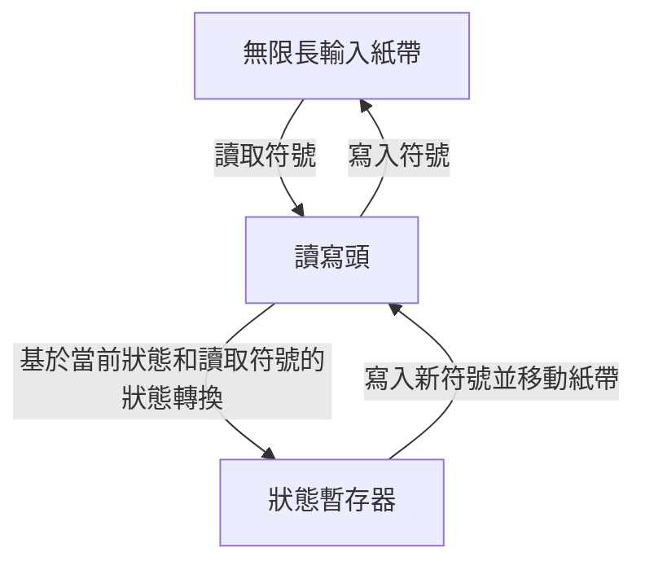
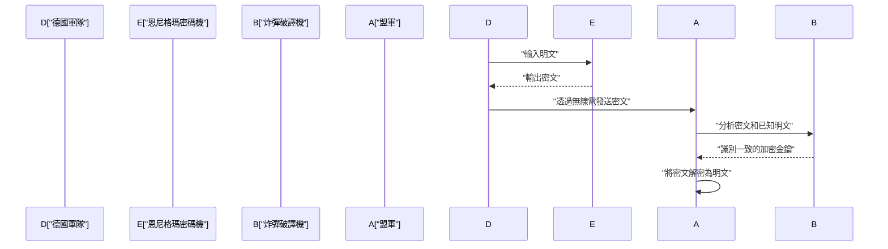
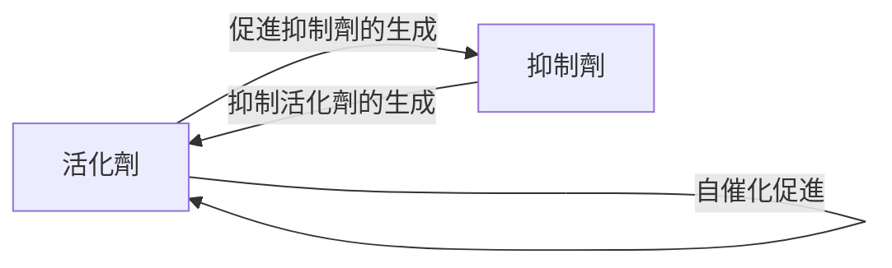

# 1. 簡介

艾倫·麥席森·圖靈（Alan Mathison Turing）是一位英國數學家，他奠定了現代計算機科學、人工智慧和數理生物學的基礎。他構想的 **圖靈機** 成為我們今天使用的所有計算機的理論原型。在本文中，我們將詳細探索圖靈波瀾壯闊的一生以及他留下的偉大數學和科學成就。如果沒有他的存在，我們現代的數位社會要麼完全不同，要麼其到來會推遲數十年。

# 2. 早年生活與對數學的覺醒

圖靈於1912年6月23日出生於倫敦帕丁頓。儘管他的父母是駐印度的公務員，但他是在英國接受教育的。他從小就展現出天才般的數學天賦，對公理系統和邏輯有著濃厚的興趣。

在謝伯恩中學讀書期間，他就已經展現出非凡的才華，例如獨自理解了愛因斯坦的相對論，甚至對牛頓的運動定律提出質疑。進入劍橋大學國王學院後，他全身心投入到數理邏輯的研究中。在這一時期，他對「邏輯與計算的極限」所抱有的純粹好奇心，引導他走向了後來歷史性的偉大發現。

# 3. 圖靈機與可計算性理論

當時數學界面臨的最大未解問題之一，是1928年由[大衛·希爾伯特](https://kenji.blog/zh-tw/p/hilbert/)提出的「判定問題」（Entscheidungsproblem）。這是一個根本性的問題：「給定任何數學命題，是否存在一種機械的演算法程序來判定它是真還是假？」

圖靈以全新的視角解決了這個問題。在1936年發表的具有里程碑意義的論文《論可計算數及其在判定問題上的應用》中，他定義了一種抽象的計算機器，即 **圖靈機** 。

## 3.1 圖靈機的結構

圖靈機是一種由以下元素組成的理論機器。可以說，它是對現代計算機中記憶體和CPU作用的極度簡化。

圖靈在數學上證明了，任何可計算的函數都可以由這台 **圖靈機** 計算。此外，他還設計了「通用圖靈機」，它可以讀取描述任何圖靈機結構的數據並模擬其運行。這正是現代「馮·諾依曼架構」計算機的基本概念——將程式作為數據存儲在記憶體中並執行。

## 3.2 停機問題與不完備性

圖靈證明了，不存在一種通用演算法可以預先判斷給定程式在給定輸入下是否最終會停止，這意味著 **停機問題** 是不可判定的。

在數學上，我們假設存在一個停機問題判定函數 $H(x, y)$，其中 $x$ 是程式，$y$ 是輸入：

$$
H(x, y) = \begin{cases} 
1 & (\text{如果程式 } x \text{ 在輸入 } y \text{ 上停止}) \\
0 & (\text{如果程式 } x \text{ 在輸入 } y \text{ 上陷入無限迴圈})
\end{cases}
$$

假設存在一台計算此函數 $H$ 的圖靈機。在這種情況下，我們可以構造一個基於對角化論證的程式 $D(x)$ 如下：

$$
D(x) = \begin{cases} 
\text{無限迴圈} & (\text{如果 } H(x, x) = 1) \\
\text{停止} & (\text{如果 } H(x, x) = 0)
\end{cases}
$$

如果我們執行 $D(D)$ 會發生什麼？如果我們假設 $D$ 停止，根據定義它會陷入無限迴圈；如果我們假設它陷入無限迴圈，它則會停止。這導致了一個邏輯矛盾。這個使用對角線論證法的精彩證明導致了對判定問題的否定答案，從而展示了數學的極限。

# 4. 破解恩尼格瑪與第二次世界大戰

在第二次世界大戰期間，圖靈在布萊切利公園的英國政府密碼學校（GC&CS）中發揮了核心作用。他最大的貢獻是破解了德國海軍使用的強大的轉子密碼機——**恩尼格瑪**。

## 4.1 破譯機「炸彈」（Bombe）的開發

他設計了一種名為「炸彈」（Bombe）的機電破譯機。「炸彈」是一台巨大的機器，用於快速搜索恩尼格瑪轉子的初始設置和插線板的接線。這是一種革命性的方法，它利用電路根據已知明文（cribs）和密文之間的關係瞬間檢測出邏輯矛盾，從而排除不可能的設置。

由於這一成就，盟軍得以在大西洋戰役中擊退德國U型潛艇的威脅，並使戰爭向有利的方向發展。歷史學家高度評價布萊切利公園的密碼破譯活動，認為它將第二次世界大戰縮短了至少兩年，並拯救了數百萬人的生命。

# 5. 戰後計算機的發展：ACE與曼徹斯特馬克一號

戰後，圖靈在國家物理實驗室（NPL）工作，致力於 **ACE**（自動計算引擎）的設計。該設計試圖用實際的電子電路來實現他在1936年構想的通用圖靈機。ACE的設計非常雄心勃勃，具有快速高效的指令集，可以被認為是現代RISC（精簡指令集計算機）架構的先驅。

然而，由於對NPL的官僚程序和開發延誤感到沮喪，圖靈於1948年轉至曼徹斯特大學。在那裡，他深度參與了 **曼徹斯特馬克一號**（Manchester Mark 1）——世界上第一批存儲程式計算機之一的軟體開發工作。他確立了早期程式語言和子程式的概念，作為世界上最早的程式設計師之一做出了巨大貢獻。

# 6. 人工智慧與圖靈測試

圖靈直面了計算機是否能像人類一樣思考的哲學問題。在他1950年發表的具有里程碑意義的論文《計算機器與智慧》中，他提出了一個今天被稱為 **圖靈測試**（他稱之為「模仿遊戲」）的實驗，用一種更具可測試性的形式取代了模糊的問題「機器能思考嗎？」。

## 6.1 模仿遊戲的規則

圖靈測試的進行方式如下：人類評估者與在視線之外的一個人和一台機器進行基於文本的對話。如果評估者無法以顯著的概率可靠地區分哪個對話夥伴是機器，哪個是人，那麼這台機器就被認為「具有智慧」。

這一實用標準非常具有創新性，因為它試圖完全透過外部可觀察的「行為」來定義智慧，而不考慮機器的內部結構或是否存在意識。這一概念在現代自然語言處理和人工智慧（AI）研究的發展中仍然是一個至關重要的哲學支柱，至今仍被作為衡量AI能力的指標而受到廣泛討論。

# 7. 形態發生的數理生物學

圖靈的好奇心超越了數學和計算機科學，延伸到了生命之謎的生物學領域。1952年，他發表了一篇題為《形態發生的化學基礎》的論文，在文中他用數學模型描述了生物圖案（如斑馬條紋、豹紋和魚類花紋）是如何形成的。

## 7.1 反應-擴散方程式

他提出了一組偏微分方程式，稱為反應-擴散系統（Reaction-Diffusion System）。這描述了兩種化學物質（一種活化劑和一種抑制劑）如何在相互作用的同時在空間中擴散。

$$
\frac{\partial u}{\partial t} = D_u \nabla^2 u + f(u, v)
$$
$$
\frac{\partial v}{\partial t} = D_v \nabla^2 v + g(u, v)
$$

這裡，$u$ 和 $v$ 分別是活化劑和抑制劑的濃度，$D_u$ 和 $D_v$ 是它們各自的擴散係數，$f(u, v)$ 和 $g(u, v)$ 是表示化學反應（反應項）的函數。

圖靈在數學上證明了「圖靈不穩定性」，即一個在空間上均勻且穩定的狀態會因為微小的波動（噪聲）和擴散速度的差異（通常 $D_v > D_u$）而變得不穩定，從而導致空間圖案的自組織。

這個模型表明，看似複雜且隨機的生物圖案實際上是由簡單的物理和化學定律自發生成的。這是一項極其重要的成就，構成了當前數理生物學和理論生物學的基礎。

# 8. 晚年與遺產

儘管圖靈做出了巨大貢獻，但他的晚年卻是悲慘的。在當時，同性戀在英國法律中被嚴格禁止，他於1952年因同性戀行為被定罪。作為免於入獄的替代方案，他被迫透過注射雌性激素接受化學閹割，隨後被剝奪了研究的安全許可，並被驅逐出了他熱愛的部分研究工作。

1954年6月7日，他英年早逝，享年41歲。死因是氰化物中毒，床邊留有一個咬了一半的蘋果。人們通常認為這是一次模仿白雪公主的自殺。

然而，在他去世幾十年後，全球開始重新評估他的成就並為他恢復名譽。2009年，英國政府就他當時所受的不公正待遇正式道歉；2013年，伊莉莎白二世女王追授他皇家赦免。

今天，世界計算機科學領域的最高獎項（通常被稱為「計算機界的諾貝爾獎」）被命名為 **圖靈獎**，以永遠紀念他的成就。[艾倫·圖靈](https://kenji.blog/zh-tw/p/turing/)在數學、密碼學、計算機科學、人工智慧和生物學等眾多領域都擁有了遠遠超越他那個時代的思想。他留下的理論和理念，作為現代數位社會的基石，在今天依然散發著強大的生命力。
