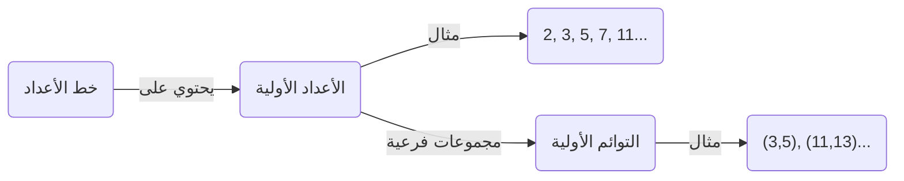
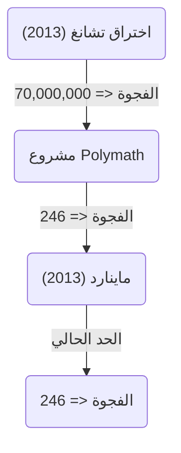

+++
title = "حدسية التوأم الأولي (Twin Prime Conjecture) - هل يوجد عدد لا نهائي من أزواج الأعداد الأولية التي الفرق بينها 2؟"
description = "شرح مفصل حول حدسية التوأم الأولي، وهي مسألة غير محلولة في الرياضيات، وتاريخها، والحلول الجزئية، وأحدث اتجاهات البحث."
slug = "twin-prime-conjecture"
date = "2026-09-24T16:08:36+09:00"
image = "eyecatch.jpg"
categories = ["mathematics"]
tags = ["الأعداد الأولية", "نظرية الأعداد", "مسائل غير محلولة"]
+++

الأعداد الأولية (Prime Numbers) هي الموضوع الأساسي والأكثر غموضاً في الرياضيات، وخاصة في نظرية الأعداد. الأعداد الأولية، وهي أعداد طبيعية لا تقبل القسمة إلا على 1 وعلى نفسها، تُسمى أيضاً "ذرات" الأعداد. من أشهر المسائل وأكثرها صعوبة والتي لا تزال غير محلولة حتى الآن والمتعلقة بهذه الأعداد هي **حدسية التوأم الأولي** (Twin Prime Conjecture).

في هذا المقال، سنتعمق في هذا التوقع الرائع، بدءاً من تعريفه إلى تاريخه، وصولاً إلى التطورات الجذرية الأخيرة.

## 1. ما هو التوأم الأولي؟

التوائم الأولية (Twin Primes) هي أزواج من الأعداد الأولية التي يكون الفرق بينها بالضبط 2. على سبيل المثال، الأزواج التالية تعتبر توائم أولية:

- $(3, 5)$
- $(5, 7)$
- $(11, 13)$
- $(17, 19)$
- $(29, 31)$
- $(41, 43)$

من المعروف من خلال مبرهنة الأعداد الأولية ([Prime Number Theorem](https://kenji.blog/ar/p/prime-number-theorem/)) أنه مع ازدياد حجم الأعداد، يقل تردد ظهور الأعداد الأولية نفسها. وبالتالي، يقل أيضاً تردد ظهور التوائم الأولية. ومع ذلك، مهما كبرت الأعداد، فقد خمن علماء الرياضيات منذ فترة طويلة أن "أزواج الأعداد الأولية التي الفرق بينها 2" ستستمر في الظهور بلا نهاية.

هذه هي **حدسية التوأم الأولي** .

> **حدسية التوأم الأولي**
> يوجد عدد لا نهائي من أزواج الأعداد الأولية $(p, p+2)$ التي يكون الفرق بينها 2.

بالتعبير عنها كمعادلة رياضية، تصبح كما يلي:
$$
\liminf_{n \to \infty} (p_{n+1} - p_n) = 2
$$
هنا، $p_n$ يمثل العدد الأولي رقم $n$.

## 2. توزيع الأعداد الأولية والتوائم الأولية

لفهم توزيع الأعداد الأولية، دعونا أولاً نقوم بتصور كيف تتوزع الأعداد الأولية.

وفقاً لمبرهنة الأعداد الأولية، يقترب عدد الأعداد الأولية الأقل من أو يساوي $x$، والذي يُرمز له $\pi(x)$، إلى $x / \ln(x)$. بالنسبة لعدد التوائم الأولية $\pi_2(x)$، هناك توقع كمي أقوى يُعرف باسم حدسية هاردي-ليتلوود (حدسية هاردي-ليتلوود الأولى).

### حدسية هاردي-ليتلوود

في عام 1923، وضع غودفري هارولد هاردي وجون إيدنسور ليتلوود التوقع التالي حول التوزيع التقريبي للتوائم الأولية:

$$
\pi_2(x) \sim 2 C_2 \int_2^x \frac{dt}{(\ln t)^2}
$$

هنا، يُطلق على $C_2$ اسم **ثابت التوأم الأولي** (Twin Prime Constant)، ويتم تعريفه كما يلي:

$$
C_2 = \prod_{p \ge 3} \left( 1 - \frac{1}{(p-1)^2} \right) \approx 0.6601618158...
$$

لا يدعي هذا التوقع فقط وجود عدد لا نهائي من التوائم الأولية ( $\pi_2(x) \to \infty$ )، بل يتنبأ بدقة شديدة بالكثافة التي تتواجد بها. تتطابق نتائج الحسابات الكبيرة بواسطة أجهزة الكمبيوتر حتى الآن بشكل مذهل مع هذا التوقع.

## 3. مبرهنة برون وثابت برون

في عام 1919، قدم عالم الرياضيات النرويجي فيغو برون نتيجة ثورية، رغم أنه لم يصل إلى إثبات حدسية التوأم الأولي. لقد أثبت أن مجموع مقلوبات جميع التوائم الأولية يتقارب (يتجه نحو قيمة ثابتة).

$$
B_2 = \left( \frac{1}{3} + \frac{1}{5} \right) + \left( \frac{1}{5} + \frac{1}{7} \right) + \left( \frac{1}{11} + \frac{1}{13} \right) + \dots
$$

هذه القيمة المتقاربة $B_2$ تُسمى **ثابت برون** (Brun's Constant). وفقاً للحسابات الحالية، يُقدر أن $B_2 \approx 1.90216058$ .

وقد أثبت ليونهارت أويلر أن مجموع مقلوبات جميع الأعداد الأولية يتباعد (لا يتقارب). إذا كانت حدسية التوأم الأولي خاطئة، وكان هناك عدد محدود فقط من التوائم الأولية، فإن المجموع سيكون متقارباً بالتأكيد لأنه مجموع عدد محدود من الأرقام. ومع ذلك، فإن مبرهنة برون تعني أنه "حتى لو كان هناك عدد لا نهائي من التوائم الأولية، فإنها تتواجد بشكل 'نادر' بحيث يتقارب مجموع مقلوباتها". هذا أحد العوامل التي تجعل حل حدسية التوأم الأولي أمراً صعباً للغاية.

## 4. التطور الدراماتيكي الأخير: اختراق ييتانغ تشانغ (Yitang Zhang)

لفترة طويلة، ظلت النتائج المتعلقة بالفجوات بين الأعداد الأولية في حالة جمود، ولكن في عام 2013، نشر عالم الرياضيات غير المعروف آنذاك، ييتانغ تشانغ (Yitang Zhang)، ورقة بحثية أذهلت العالم.

لقد أثبت النتيجة التالية:

> **مبرهنة تشانغ**
> يوجد عدد لا نهائي من أزواج الأعداد الأولية $(p_n, p_{n+1})$ بحيث أن $p_{n+1} - p_n \le 70,000,000$.

بمعنى آخر، "أزواج الأعداد الأولية التي يكون الفرق بينها 70 مليون أو أقل" موجودة بعدد لا نهائي. الرقم 70 مليون بعيد جداً عن 2، لكنه كان إنجازاً تاريخياً حيث أثبت لأول مرة أن "هناك عدداً لا نهائياً من أزواج الأعداد الأولية التي يكون الفرق بينها أقل من ثابت محدد".

### مشروع Polymath وجيمس ماينارد

بعد نتائج ييتانغ تشانغ، تم إطلاق مشروع التعاون عبر الإنترنت "Polymath8" بقيادة تيرينس تاو وآخرين، وبدأ سباق لمعرفة إلى أي مدى يمكن تقليل هذا الحد الأقصى البالغ 70 مليون.

في نفس الوقت، نجح جيمس ماينارد (James Maynard) بشكل مستقل تماماً وباستخدام طريقة مختلفة (طريقة الغربال متعددة الأبعاد لسلبرغ) في خفض الحد بشكل كبير. من خلال الجمع بين مشروع Polymath وتحسينات ماينارد، تم التوصل إلى النتيجة التالية حتى الآن:

$$
\liminf_{n \to \infty} (p_{n+1} - p_n) \le 246
$$

بعبارة أخرى، من المؤكد أن "أزواج الأعداد الأولية التي يكون الفرق بينها 246 أو أقل" موجودة بعدد لا نهائي. إذا كان من الممكن خفض هذا الحد إلى $2$ ، فسيتم إثبات حدسية التوأم الأولي بالكامل.

## 5. التعميم والتوقعات المستقبلية

يمكن اعتبار حدسية التوأم الأولي كحالة خاصة (عندما $2k = 2$) لـ **حدسية بولينياك** (Polignac's Conjecture) الأكثر عمومية.

> **حدسية بولينياك**
> لأي عدد زوجي موجب $2k$، يوجد عدد لا نهائي من أزواج الأعداد الأولية $(p, p+2k)$ التي يكون الفرق بينها $2k$.

أظهرت طرق ييتانغ تشانغ وماينارد وجود حد أعلى محدود للفجوة، ولكن يُعتقد أن هناك عائقاً جوهرياً يُعرف باسم "مشكلة التكافؤ" (Parity problem) يمنع تقليل الحد إلى 2 (أي إثبات حدسية التوأم الأولي) باستخدام امتداد للطرق الحالية فقط.

لحل حدسية التوأم الأولي بالكامل، ستكون هناك حاجة إلى أفكار رياضية جديدة تماماً تتجاوز جذرياً "طرق الغربال" (Sieve methods) الحالية.

## الخلاصة

حدسية التوأم الأولي بسيطة للغاية لدرجة أن حتى طالب في المدرسة الابتدائية يمكنه فهم معنى المسألة، ومع ذلك فقد تحدت وتصدت لمحاولات علماء الرياضيات العباقرة لعدة قرون. ومع ذلك، في القرن الحادي والعشرين، كانت هناك تطورات مذهلة، بما في ذلك اختراق ييتانغ تشانغ، وتقترب البشرية بالتأكيد من الحقيقة.

هل ستستمر التوائم الأولية إلى ما لا نهاية في الكون اللامتناهي المكون من "ذرات الأعداد"؟ قد يأتي اليوم الذي تتضح فيه الإجابة في حياتنا.
