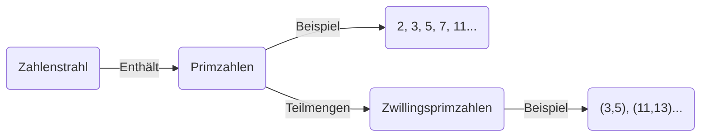
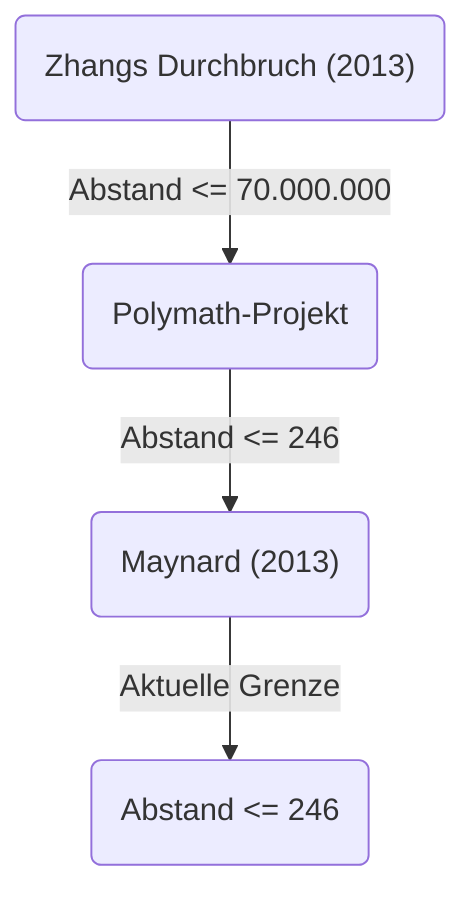

+++
title = "Zwillingsprimzahlvermutung (Twin Prime Conjecture) - Gibt es unendlich viele Primzahlpaare mit einer Differenz von 2?"
description = "Eine ausführliche Erklärung der Zwillingsprimzahlvermutung, eines ungelösten mathematischen Problems, einschließlich ihrer Geschichte, teilweisen Lösungen und neuesten Forschungstrends."
slug = "twin-prime-conjecture"
date = "2026-09-24T16:08:36+09:00"
image = "eyecatch.jpg"
categories = ["mathematics"]
tags = ["Primzahlen", "Zahlentheorie", "Ungelöste Probleme"]
+++

Primzahlen (Prime Numbers) sind die grundlegendsten und mysteriösesten Objekte in der Mathematik, insbesondere in der Zahlentheorie. Als natürliche Zahlen, die keine positiven Teiler außer 1 und sich selbst haben, werden sie auch als die "Atome" der Zahlen bezeichnet. Eines der berühmtesten und immer noch ungelösten schwierigen Probleme im Zusammenhang mit Primzahlen ist die **Zwillingsprimzahlvermutung** (Twin Prime Conjecture).

In diesem Artikel werden wir tief in diese faszinierende Vermutung eintauchen und von ihrer Definition über ihre Geschichte bis hin zu den dramatischen Entwicklungen der letzten Jahre berichten.

## 1. Was sind Zwillingsprimzahlen?

Zwillingsprimzahlen (Twin Primes) sind Paare von Primzahlen, deren Differenz genau 2 beträgt. Zum Beispiel sind die folgenden Paare Zwillingsprimzahlen:

- $(3, 5)$
- $(5, 7)$
- $(11, 13)$
- $(17, 19)$
- $(29, 31)$
- $(41, 43)$

Durch den Primzahlsatz ([Prime Number Theorem](https://kenji.blog/de/p/prime-number-theorem/)) ist bekannt, dass die Häufigkeit des Auftretens von Primzahlen selbst abnimmt, je größer die Zahlen werden. Dementsprechend nimmt auch die Häufigkeit des Auftretens von Zwillingsprimzahlen ab. Mathematiker haben jedoch seit langem vermutet, dass dieses "Primzahlpaar mit einer Differenz von 2" unerschöpflich auftaucht, egal wie groß die Zahlen werden.

Dies ist die **Zwillingsprimzahlvermutung** .

> **Zwillingsprimzahlvermutung**
> Es gibt unendlich viele Primzahlpaare $(p, p+2)$ , deren Differenz 2 beträgt.

Als Formel ausgedrückt sieht dies wie folgt aus:
$$
\liminf_{n \to \infty} (p_{n+1} - p_n) = 2
$$
Hierbei steht $p_n$ für die $n$ -te Primzahl.

## 2. Die Verteilung der Primzahlen und Zwillingsprimzahlen

Um die Verteilung der Primzahlen zu verstehen, lassen Sie uns zunächst visualisieren, wie Primzahlen verteilt sind.

Nach dem Primzahlsatz nähert sich die Anzahl der Primzahlen kleiner oder gleich $x$ , bezeichnet als $\pi(x)$ , asymptotisch $x / \ln(x)$ an. Auch für die Anzahl der Zwillingsprimzahlen $\pi_2(x)$ gibt es eine stärkere quantitative Vermutung, die als Hardy-Littlewood-Vermutung (erste Hardy-Littlewood-Vermutung) bekannt ist.

### Hardy-Littlewood-Vermutung

Im Jahr 1923 stellten Godfrey Harold Hardy und John Edensor Littlewood die folgende Vermutung über die asymptotische Verteilung von Zwillingsprimzahlen auf:

$$
\pi_2(x) \sim 2 C_2 \int_2^x \frac{dt}{(\ln t)^2}
$$

Hierbei wird $C_2$ als **Zwillingsprimzahlkonstante** (Twin Prime Constant) bezeichnet und ist wie folgt definiert:

$$
C_2 = \prod_{p \ge 3} \left( 1 - \frac{1}{(p-1)^2} \right) \approx 0.6601618158...
$$

Diese Vermutung behauptet nicht nur, dass es unendlich viele Zwillingsprimzahlen gibt ( $\pi_2(x) \to \infty$ ), sondern sagt auch extrem genau voraus, in welcher Dichte sie existieren. Die bisherigen groß angelegten Berechnungen per Computer stimmen erstaunlich gut mit dieser Vermutung überein.

## 3. Der Satz von Brun und die Brunsche Konstante

Im Jahr 1919 veröffentlichte der norwegische Mathematiker Viggo Brun ein bahnbrechendes Ergebnis, auch wenn er die Zwillingsprimzahlvermutung nicht beweisen konnte. Er zeigte, dass die Summe der Kehrwerte aller Zwillingsprimzahlen konvergiert.

$$
B_2 = \left( \frac{1}{3} + \frac{1}{5} \right) + \left( \frac{1}{5} + \frac{1}{7} \right) + \left( \frac{1}{11} + \frac{1}{13} \right) + \dots
$$

Dieser Konvergenzwert $B_2$ wird als **Brunsche Konstante** (Brun's Constant) bezeichnet. Nach aktuellen Berechnungen wird sie auf $B_2 \approx 1.90216058$ geschätzt.

Dass die Summe der Kehrwerte aller Primzahlen divergiert, wurde von [Leonhard Euler](https://kenji.blog/de/p/euler/) bewiesen. Wenn die Zwillingsprimzahlvermutung falsch wäre und es nur endlich viele Zwillingsprimzahlen gäbe, würde die Summe natürlich konvergieren, da es sich um die Summe einer endlichen Anzahl von Zahlen handelt. Der Satz von Brun bedeutet jedoch: "Selbst wenn es unendlich viele Zwillingsprimzahlen gibt, existieren sie so 'spärlich', dass die Summe ihrer Kehrwerte konvergiert." Dies ist einer der Faktoren, der die Lösung der Zwillingsprimzahlvermutung so extrem schwierig macht.

## 4. Dramatische Fortschritte der letzten Jahre: Der Durchbruch von Yitang Zhang

Lange Zeit stagnierten die Ergebnisse zu Primzahlabständen, aber im Jahr 2013 veröffentlichte der damals unbekannte Mathematiker Yitang Zhang eine Arbeit, die die Welt überraschte.

Er bewies das folgende Ergebnis:

> **Satz von Zhang**
> Es gibt unendlich viele Primzahlpaare $(p_n, p_{n+1})$ , für die gilt: $p_{n+1} - p_n \le 70,000,000$ .

Das bedeutet, dass es unendlich viele "Primzahlpaare mit einer Differenz von 70 Millionen oder weniger" gibt. Die Zahl 70 Millionen ist zwar weit entfernt von 2, aber es war eine historische Meisterleistung, zum ersten Mal zu beweisen, dass "es unendlich viele Primzahlpaare gibt, deren Differenz kleiner oder gleich einer endlichen Konstante ist".

### Polymath-Projekt und James Maynard

Als Reaktion auf Zhangs Ergebnisse wurde das Online-Kollaborationsprojekt "Polymath8" unter der Leitung von Terence Tao und anderen gestartet, und es begann ein Wettbewerb darum, wie weit diese Obergrenze von 70 Millionen gesenkt werden könnte.

Gleichzeitig gelang es James Maynard völlig unabhängig und mit einer anderen Methode (mehrdimensionale Selberg-Sieb-Methode), die Obergrenze drastisch zu senken. Durch die Kombination des Polymath-Projekts und Maynards Verbesserungen wurde inzwischen das folgende Ergebnis erzielt:

$$
\liminf_{n \to \infty} (p_{n+1} - p_n) \le 246
$$

Das heißt, es steht fest, dass es unendlich viele "Primzahlpaare mit einer Differenz von 246 oder weniger" gibt. Wenn diese Obergrenze auf $2$ gesenkt werden könnte, wäre die Zwillingsprimzahlvermutung vollständig bewiesen.

## 5. Verallgemeinerung und zukünftige Aussichten

Die Zwillingsprimzahlvermutung kann als Spezialfall (für $2k = 2$ ) der allgemeineren **Polignac-Vermutung** (Polignac's Conjecture) betrachtet werden.

> **Polignac-Vermutung**
> Für jede positive gerade Zahl $2k$ gibt es unendlich viele Primzahlpaare $(p, p+2k)$ mit der Differenz $2k$ .

Die Methoden von Zhang und Maynard zeigten die Existenz einer endlichen Obergrenze für den Abstand, aber es wird angenommen, dass es ein prinzipielles Hindernis gibt, das als "Paritätsproblem" bekannt ist, wenn man die Obergrenze allein durch eine Erweiterung der aktuellen Methoden auf 2 senken (und damit die Zwillingsprimzahlvermutung beweisen) möchte.

Um die Zwillingsprimzahlvermutung vollständig zu lösen, werden wahrscheinlich völlig neue mathematische Ideen erforderlich sein, die über die bestehenden "Siebmethoden" (Sieve methods) grundlegend hinausgehen.

## Zusammenfassung

Die Zwillingsprimzahlvermutung ist so einfach, dass selbst ein Grundschüler die Bedeutung des Problems verstehen kann, doch sie hat sich der Herausforderung von genialen Mathematikern über Jahrhunderte hinweg widersetzt. Im 21. Jahrhundert gab es jedoch bahnbrechende Fortschritte, angefangen mit dem Durchbruch von Yitang Zhang, und die Menschheit nähert sich mit Sicherheit der Wahrheit.

Werden die Zwillingsprimzahlen in dem unendlichen Universum, das von diesen "Atomen der Zahlen" gewebt wird, endlos weitergehen? Der Tag, an dem diese Antwort klar wird, könnte noch zu unseren Lebzeiten kommen.
