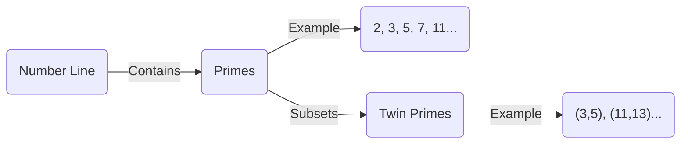
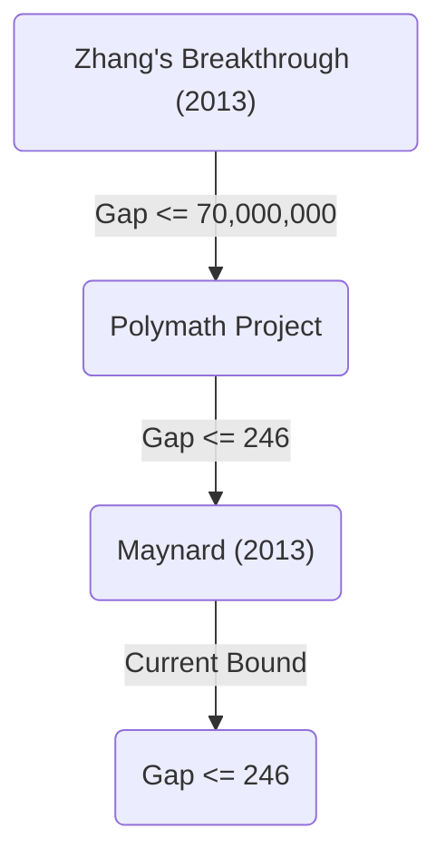

+++
title = "Twin Prime Conjecture - Are There Infinitely Many Pairs of Primes with a Difference of 2?"
description = "A detailed explanation of the Twin Prime Conjecture, an unsolved problem in mathematics, including its history, partial solutions, and the latest research trends."
slug = "twin-prime-conjecture"
date: "2026-09-24T16:08:36+09:00"
image = "eyecatch.jpg"
categories = ["mathematics"]
tags = ["Prime Numbers", "Number Theory", "Unsolved Problems"]
+++

Prime Numbers are the most fundamental and mysterious objects in mathematics, especially in number theory. Being natural numbers that have no positive divisors other than 1 and themselves, primes are also called the "atoms" of numbers. One of the most famous and still unsolved hard problems concerning primes is the **Twin Prime Conjecture**.

In this article, we will delve deeply into this fascinating conjecture, exploring its definition, its history, and the dramatic progress made in recent years.

## 1. What Are Twin Primes?

Twin Primes are pairs of prime numbers that have a difference of exactly 2. For example, the following pairs correspond to twin primes:

- $(3, 5)$
- $(5, 7)$
- $(11, 13)$
- $(17, 19)$
- $(29, 31)$
- $(41, 43)$

It is known from the [Prime Number Theorem](https://kenji.blog/en/p/prime-number-theorem/) that as numbers grow larger, the frequency of appearance of primes themselves decreases. Accordingly, the frequency of appearance of twin primes also decreases. However, mathematicians have long speculated that no matter how large the numbers become, these "pairs of primes with a difference of 2" will continue to appear endlessly.

This is the **Twin Prime Conjecture**.

> **Twin Prime Conjecture**
> There exist infinitely many pairs of primes $(p, p+2)$ that have a difference of 2.

Expressed as a formula, it looks like this:
$$
\liminf_{n \to \infty} (p_{n+1} - p_n) = 2
$$
Here, $p_n$ represents the $n$-th prime number.

## 2. Distribution of Primes and Twin Primes

To understand the distribution of primes, let's first visualize how primes are distributed.

According to the [Prime Number Theorem](https://kenji.blog/en/p/prime-number-theorem/), the number of primes $\pi(x)$ less than or equal to $x$ is asymptotic to approximately $x / \ln(x)$. Regarding the number of twin primes $\pi_2(x)$, there is a more powerful quantitative conjecture known as the Hardy-Littlewood Conjecture (First Hardy-Littlewood Conjecture).

### Hardy-Littlewood Conjecture

In 1923, Godfrey Harold Hardy and John Edensor Littlewood formulated the following conjecture about the asymptotic distribution of twin primes:

$$
\pi_2(x) \sim 2 C_2 \int_2^x \frac{dt}{(\ln t)^2}
$$

Here, $C_2$ is called the **Twin Prime Constant** and is defined as follows:

$$
C_2 = \prod_{p \ge 3} \left( 1 - \frac{1}{(p-1)^2} \right) \approx 0.6601618158...
$$

This conjecture not only claims that twin primes exist infinitely ( $\pi_2(x) \to \infty$ ), but it also predicts extremely accurately the density at which they exist. Large-scale computer calculations to date have matched this conjecture surprisingly well.

## 3. Brun's Theorem and Brun's Constant

In 1919, the Norwegian mathematician Viggo Brun did not manage to prove the twin prime conjecture, but he published a groundbreaking result. He showed that the sum of the reciprocals of all twin primes converges.

$$
B_2 = \left( \frac{1}{3} + \frac{1}{5} \right) + \left( \frac{1}{5} + \frac{1}{7} \right) + \left( \frac{1}{11} + \frac{1}{13} \right) + \dots
$$

This convergent value $B_2$ is called **Brun's Constant**. According to current calculations, it is estimated that $B_2 \approx 1.90216058$.

It was proven by [Leonhard Euler](https://kenji.blog/en/p/euler/) that the sum of the reciprocals of all prime numbers diverges. If the twin prime conjecture were false and there were only finitely many twin primes, it would naturally converge because it would be a sum of a finite number of terms. However, what Brun's Theorem means is that "even if twin primes exist infinitely, they exist so 'sparsely' that the sum of their reciprocals converges." This is one of the factors making the resolution of the twin prime conjecture significantly difficult.

## 4. Dramatic Progress in Recent Years: Yitang Zhang's Breakthrough

For a long time, results regarding the gaps between primes were at a standstill, but in 2013, an obscure mathematician at the time, Yitang Zhang, published a paper that surprised the world.

He proved the following result:

> **Zhang's Theorem**
> There exist infinitely many pairs of primes $(p_n, p_{n+1})$ such that $p_{n+1} - p_n \le 70,000,000$.

In other words, there are infinitely many "pairs of primes with a difference of 70 million or less." Although the number 70 million is far from 2, it was a historic feat to prove for the first time that "there exist infinitely many pairs of primes whose difference is less than or equal to a finite constant."

### The Polymath Project and James Maynard

Following Yitang Zhang's result, an online collaborative project led by Terence Tao and others, "Polymath8," was launched, and a competition began to see how far down this upper bound of 70 million could be lowered.

At the same time, James Maynard succeeded in significantly lowering the upper bound using a completely independent and different method (multi-dimensional Selberg sieve). By combining the improvements of the Polymath project and Maynard, the following result is currently obtained:

$$
\liminf_{n \to \infty} (p_{n+1} - p_n) \le 246
$$

That is, it is established that there are infinitely many "pairs of primes with a difference of 246 or less." If this upper bound can be lowered to $2$, the twin prime conjecture will be completely proven.

## 5. Generalization and Future Outlook

The twin prime conjecture can be positioned as a special case (the case where $2k = 2$) of the more general **Polignac's Conjecture**.

> **Polignac's Conjecture**
> For any positive even number $2k$, there exist infinitely many pairs of primes $(p, p+2k)$ that have a difference of $2k$.

Although the methods of Yitang Zhang, Maynard, and others showed the existence of a finite upper bound for the gaps, it is thought that there is a fundamental barrier called the "parity problem" to lowering the upper bound to 2 (that is, proving the twin prime conjecture) solely as an extension of current methods.

To completely resolve the twin prime conjecture, entirely new mathematical ideas that fundamentally go beyond existing "Sieve methods" will likely be required.

## Conclusion

While the meaning of the twin prime conjecture is simple enough for even an elementary school student to understand, it has repelled the challenges of genius mathematicians for centuries. However, entering the 21st century, there has been groundbreaking progress, beginning with Yitang Zhang's breakthrough, and humanity is steadily approaching the truth.

Will twin primes continue endlessly in the infinite universe woven by the "atoms of numbers"? The day the answer to that is revealed may come within our lifetimes.
