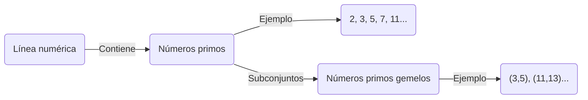
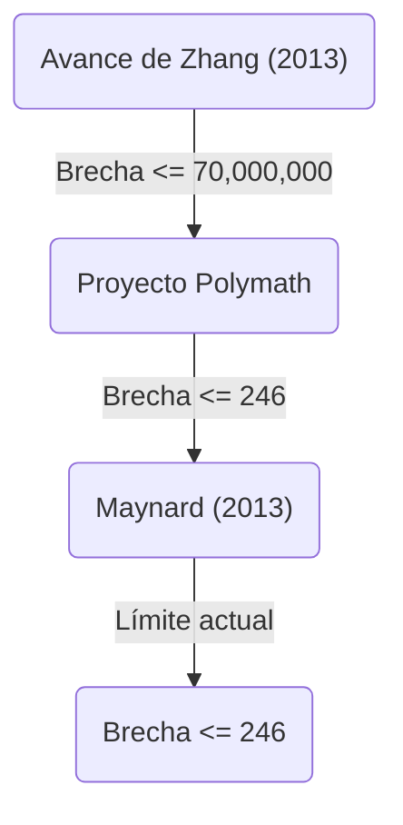

+++
title = "Conjetura de los números primos gemelos (Twin Prime Conjecture) - ¿Existen infinitos pares de números primos con una diferencia de 2?"
description = "Se explica en detalle la conjetura de los números primos gemelos, un problema no resuelto en matemáticas, incluyendo su historia, resoluciones parciales y las últimas tendencias de investigación."
slug = "twin-prime-conjecture"
date = "2026-09-14T13:04:13+09:00"
image = "eyecatch.jpg"
categories = ["Matemáticas"]
tags = ["Números primos", "Teoría de números", "Problemas no resueltos"]
+++

Los números primos (Prime Numbers) son los objetos más fundamentales y misteriosos de las matemáticas, especialmente en la teoría de números. Como números naturales que no tienen divisores positivos aparte de 1 y ellos mismos, a los números primos también se les llama los "átomos" de los números. Uno de los problemas más famosos e insolubles en relación con los números primos es la **conjetura de los números primos gemelos** (Twin Prime Conjecture).

En este artículo, profundizaremos en esta fascinante conjetura, desde su definición e historia hasta los dramáticos avances recientes.

## 1. ¿Qué son los números primos gemelos?

Los números primos gemelos (Twin Primes) son pares de números primos cuya diferencia es exactamente 2. Por ejemplo, los siguientes pares corresponden a números primos gemelos:

- $(3, 5)$
- $(5, 7)$
- $(11, 13)$
- $(17, 19)$
- $(29, 31)$
- $(41, 43)$

A medida que los números aumentan, el Teorema de los números primos (Prime Number Theorem) establece que la frecuencia de aparición de los números primos en sí disminuye. En consecuencia, la frecuencia de los números primos gemelos también disminuye. Sin embargo, los matemáticos han especulado durante mucho tiempo que, sin importar cuán grandes sean los números, estos "pares de números primos con una diferencia de 2" seguirán apareciendo sin fin.

Esta es la **conjetura de los números primos gemelos** .

> **Conjetura de los números primos gemelos**
> Hay infinitos pares de números primos $(p, p+2)$ que tienen una diferencia de 2.

Expresado en una fórmula, es lo siguiente:
$$
\liminf_{n \to \infty} (p_{n+1} - p_n) = 2
$$
Aquí, $p_n$ representa el $n$-ésimo número primo.

## 2. Distribución de los números primos y números primos gemelos

Para entender la distribución de los números primos, primero visualicemos cómo están distribuidos.

Según el Teorema de los números primos, la cantidad de números primos $\pi(x)$ menores o iguales a $x$ es asintótica a aproximadamente $x / \ln(x)$. En cuanto a la cantidad de números primos gemelos $\pi_2(x)$, existe una conjetura cuantitativa más fuerte conocida como la conjetura de Hardy-Littlewood (la Primera conjetura de Hardy-Littlewood).

### Conjetura de Hardy-Littlewood

En 1923, Godfrey Harold Hardy y John Edensor Littlewood formularon la siguiente conjetura sobre la distribución asintótica de los números primos gemelos:

$$
\pi_2(x) \sim 2 C_2 \int_2^x \frac{dt}{(\ln t)^2}
$$

Aquí, $C_2$ se llama la **constante de los números primos gemelos** (Twin Prime Constant) y se define de la siguiente manera:

$$
C_2 = \prod_{p \ge 3} \left( 1 - \frac{1}{(p-1)^2} \right) \approx 0.6601618158...
$$

Esta conjetura no solo afirma que hay infinitos números primos gemelos ($\pi_2(x) \to \infty$), sino que predice con extrema precisión a qué densidad existen. Hasta el momento, los resultados de cálculos masivos por computadora concuerdan sorprendentemente con esta conjetura.

## 3. Teorema de Brun y constante de Brun

En 1919, el matemático noruego Viggo Brun publicó un resultado innovador, aunque no llegó a probar la conjetura de los números primos gemelos. Demostró que la suma de los recíprocos de todos los números primos gemelos converge.

$$
B_2 = \left( \frac{1}{3} + \frac{1}{5} \right) + \left( \frac{1}{5} + \frac{1}{7} \right) + \left( \frac{1}{11} + \frac{1}{13} \right) + \dots
$$

Este valor de convergencia $B_2$ se llama la **constante de Brun** (Brun's Constant). Según los cálculos actuales, se estima que $B_2 \approx 1.90216058$.

Leonhard Euler demostró que la suma de los recíprocos de todos los números primos diverge. Si la conjetura de los números primos gemelos fuera falsa y solo existiera un número finito de números primos gemelos, naturalmente convergería al ser la suma de un número finito de términos. Sin embargo, lo que significa el teorema de Brun es que, "incluso si existen infinitos números primos gemelos, están tan 'esparcidos' que la suma de sus recíprocos converge". Este es uno de los factores que dificultan enormemente la resolución de la conjetura de los números primos gemelos.

## 4. Un avance dramático reciente: El gran avance de Yitang Zhang

Durante mucho tiempo, los resultados relacionados con los intervalos de los números primos estuvieron estancados, pero en 2013, un matemático entonces desconocido, Yitang Zhang, publicó un artículo que sorprendió al mundo.

Demostró el siguiente resultado:

> **Teorema de Zhang**
> Hay infinitos pares de números primos $(p_n, p_{n+1})$ tales que $p_{n+1} - p_n \le 70,000,000$.

En otras palabras, significa que hay un número infinito de "pares de números primos con una diferencia de 70 millones o menos". El número 70 millones está lejos de ser 2, pero fue un logro histórico que demostró por primera vez que "hay infinitos pares de números primos cuya diferencia es menor o igual a una constante finita".

### Proyecto Polymath y James Maynard

Tras el resultado de Yitang Zhang, se lanzó el proyecto colaborativo en línea "Polymath8" liderado por Terence Tao y otros, comenzando una competencia para ver cuánto se podría reducir este límite de 70 millones.

Al mismo tiempo, James Maynard utilizó un enfoque completamente diferente e independiente (criba de Selberg multidimensional) y logró reducir el límite drásticamente. Al combinar las mejoras del proyecto Polymath y de Maynard, actualmente se ha obtenido el siguiente resultado:

$$
\liminf_{n \to \infty} (p_{n+1} - p_n) \le 246
$$

Es decir, está confirmado que hay un número infinito de "pares de números primos con una diferencia de 246 o menos". Si este límite pudiera reducirse a $2$, la conjetura de los números primos gemelos quedaría completamente demostrada.

## 5. Generalización y perspectivas futuras

La conjetura de los números primos gemelos se puede posicionar como un caso especial (el caso de $2k = 2$) de la **conjetura de Polignac** (Polignac's Conjecture) más general.

> **Conjetura de Polignac**
> Para cualquier número par positivo $2k$, existen infinitos pares de números primos $(p, p+2k)$ con una diferencia de $2k$.

Los métodos de Yitang Zhang, Maynard y otros mostraron la existencia de un límite finito para la brecha, pero se cree que existe una barrera fundamental llamada "problema de paridad" para reducir el límite a 2 (es decir, probar la conjetura de los números primos gemelos) usando solo una extensión de los métodos actuales.

Para resolver por completo la conjetura de los números primos gemelos, probablemente se necesitarán ideas matemáticas completamente nuevas que superen fundamentalmente los "métodos de criba" (Sieve methods) existentes.

## Resumen

La conjetura de los números primos gemelos es tan simple que incluso un estudiante de primaria podría entender el significado del problema en sí, pero ha rechazado los desafíos de los matemáticos geniales durante siglos. Sin embargo, en el siglo XXI, ha habido avances innovadores, incluido el gran avance de Yitang Zhang, y la humanidad se está acercando de manera constante a la verdad.

En el universo infinito tejido por los "átomos numéricos", ¿seguirán los números primos gemelos de manera interminable? El día en que se revele esa respuesta puede llegar durante nuestra vida.
