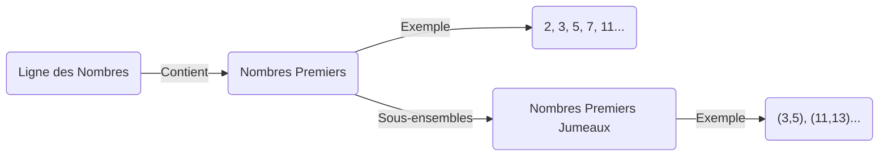
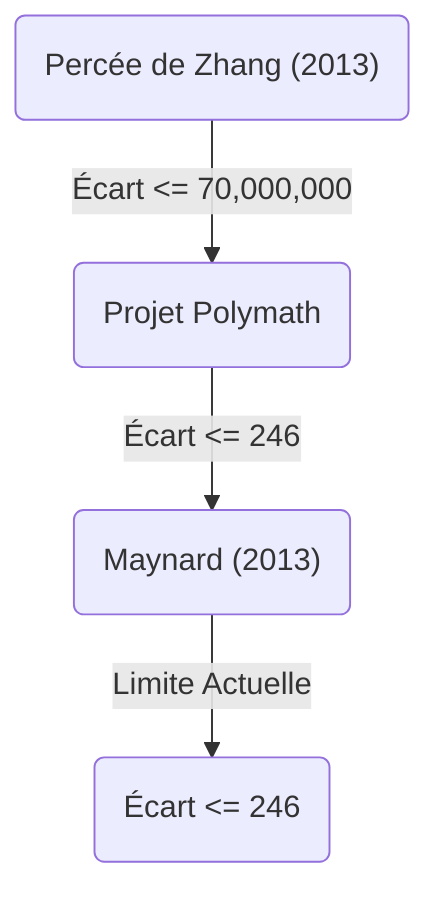

+++
title = "La Conjecture des Nombres Premiers Jumeaux (Twin Prime Conjecture) - Existe-t-il une infinité de paires de nombres premiers dont la différence est de 2 ?"
description = "Nous expliquons en détail l'histoire, les résolutions partielles et les dernières tendances de recherche concernant la conjecture des nombres premiers jumeaux, un problème non résolu en mathématiques."
slug = "twin-prime-conjecture"
date = "2026-09-14T13:04:13+09:00"
image = "eyecatch.jpg"
categories = ["mathematics"]
tags = ["Nombres Premiers", "Théorie des Nombres", "Problèmes Non Résolus"]
+++

Les nombres premiers (Prime Numbers) sont les objets les plus fondamentaux et mystérieux des mathématiques, particulièrement en théorie des nombres. Les nombres premiers, qui sont des entiers naturels n'ayant d'autres diviseurs positifs que 1 et eux-mêmes, sont souvent appelés les "atomes" des nombres. L'un des problèmes les plus célèbres et toujours non résolus concernant ces nombres premiers est la **Conjecture des Nombres Premiers Jumeaux** (Twin Prime Conjecture).

Dans cet article, nous explorerons en profondeur cette conjecture fascinante, de sa définition à son histoire, jusqu'aux avancées spectaculaires de ces dernières années.

## 1. Que sont les nombres premiers jumeaux ?

Les nombres premiers jumeaux (Twin Primes) sont des paires de nombres premiers dont la différence est exactement 2. Par exemple, les paires suivantes sont des nombres premiers jumeaux :

- $(3, 5)$
- $(5, 7)$
- $(11, 13)$
- $(17, 19)$
- $(29, 31)$
- $(41, 43)$

Le Théorème des Nombres Premiers (Prime Number Theorem) indique qu'à mesure que les nombres deviennent plus grands, la fréquence d'apparition des nombres premiers eux-mêmes diminue. Par conséquent, la fréquence d'apparition des nombres premiers jumeaux diminue également. Cependant, les mathématiciens supposent depuis longtemps que, peu importe la grandeur des nombres, ces "paires de nombres premiers avec une différence de 2" continueront d'apparaître indéfiniment.

C'est la **Conjecture des Nombres Premiers Jumeaux** .

> **Conjecture des Nombres Premiers Jumeaux**
> Il existe une infinité de paires de nombres premiers $(p, p+2)$ dont la différence est de 2.

Exprimé sous forme de formule, cela donne :
$$
\liminf_{n \to \infty} (p_{n+1} - p_n) = 2
$$
Où, $p_n$ représente le $n$-ième nombre premier.

## 2. La distribution des nombres premiers et les nombres premiers jumeaux

Pour comprendre la distribution des nombres premiers, visualisons d'abord comment ils sont répartis.

Selon le théorème des nombres premiers, le nombre de nombres premiers inférieurs ou égaux à $x$, $\pi(x)$, est asymptotique à environ $x / \ln(x)$. Concernant le nombre de nombres premiers jumeaux $\pi_2(x)$, il existe une conjecture quantitative plus forte appelée la conjecture de Hardy-Littlewood (première conjecture de Hardy-Littlewood).

### Conjecture de Hardy-Littlewood

En 1923, Godfrey Harold Hardy et John Edensor Littlewood ont formulé la conjecture suivante sur la distribution asymptotique des nombres premiers jumeaux :

$$
\pi_2(x) \sim 2 C_2 \int_2^x \frac{dt}{(\ln t)^2}
$$

Ici, $C_2$ est appelé la **Constante des Nombres Premiers Jumeaux** (Twin Prime Constant), et est définie comme suit :

$$
C_2 = \prod_{p \ge 3} \left( 1 - \frac{1}{(p-1)^2} \right) \approx 0.6601618158...
$$

Cette conjecture ne se contente pas d'affirmer qu'il y a une infinité de nombres premiers jumeaux ( $\pi_2(x) \to \infty$ ), mais prédit aussi de manière extrêmement précise leur densité. Jusqu'à présent, les résultats des calculs à grande échelle effectués par des ordinateurs concordent étonnamment bien avec cette conjecture.

## 3. Le Théorème de Brun et la Constante de Brun

En 1919, le mathématicien norvégien Viggo Brun a publié un résultat révolutionnaire, bien qu'il n'ait pas prouvé la conjecture des nombres premiers jumeaux. Il a démontré que la somme des inverses de tous les nombres premiers jumeaux converge.

$$
B_2 = \left( \frac{1}{3} + \frac{1}{5} \right) + \left( \frac{1}{5} + \frac{1}{7} \right) + \left( \frac{1}{11} + \frac{1}{13} \right) + \dots
$$

Cette valeur de convergence $B_2$ est appelée la **Constante de Brun** (Brun's Constant). Selon les calculs actuels, on estime que $B_2 \approx 1.90216058$.

Leonhard Euler a prouvé que la somme des inverses de tous les nombres premiers diverge. Si la conjecture des nombres premiers jumeaux était fausse et qu'il n'y avait qu'un nombre fini de nombres premiers jumeaux, la somme convergerait naturellement puisqu'il s'agirait de la somme d'un nombre fini d'éléments. Cependant, ce que signifie le théorème de Brun, c'est que "même si les nombres premiers jumeaux existent en quantité infinie, ils sont suffisamment 'rares' pour que la somme de leurs inverses converge". C'est l'un des facteurs qui rend la résolution de la conjecture des nombres premiers jumeaux si difficile.

## 4. Avancées spectaculaires récentes : La percée de Yitang Zhang

Pendant longtemps, les résultats concernant l'écart entre les nombres premiers sont restés dans une impasse. Mais en 2013, un mathématicien alors inconnu, Yitang Zhang, a publié un article qui a surpris le monde entier.

Il a prouvé le résultat suivant :

> **Théorème de Zhang**
> Il existe une infinité de paires de nombres premiers $(p_n, p_{n+1})$ telles que $p_{n+1} - p_n \le 70,000,000$.

En d'autres termes, il existe une infinité de "paires de nombres premiers dont la différence est inférieure ou égale à 70 millions". Bien que le nombre 70 millions soit loin de 2, ce fut un exploit historique car il a été prouvé pour la première fois qu'il existe une infinité de paires de nombres premiers dont l'écart est borné par une constante finie.

### Projet Polymath et James Maynard

Suite aux résultats de Yitang Zhang, le projet collaboratif en ligne "Polymath8", dirigé par Terence Tao et d'autres, a été lancé. Une course a alors commencé pour voir jusqu'où cette limite de 70 millions pouvait être abaissée.

Simultanément, James Maynard a réussi à abaisser considérablement cette limite en utilisant une méthode complètement indépendante et différente (la méthode du crible de Selberg multidimensionnel). En combinant les améliorations du projet Polymath et de Maynard, le résultat suivant est désormais établi :

$$
\liminf_{n \to \infty} (p_{n+1} - p_n) \le 246
$$

C'est-à-dire qu'il est certain qu'il existe une infinité de "paires de nombres premiers dont la différence est inférieure ou égale à 246". Si cette limite peut être réduite à $2$, alors la conjecture des nombres premiers jumeaux sera complètement prouvée.

## 5. Généralisation et perspectives futures

La conjecture des nombres premiers jumeaux peut être positionnée comme un cas particulier (le cas où $2k = 2$) de la **Conjecture de Polignac** (Polignac's Conjecture) plus générale.

> **Conjecture de Polignac**
> Pour tout nombre pair positif $2k$, il existe une infinité de paires de nombres premiers $(p, p+2k)$ dont la différence est de $2k$.

Bien que les méthodes de Yitang Zhang, Maynard et d'autres aient montré l'existence d'une limite finie pour l'écart, on pense qu'une extension des méthodes actuelles ne suffit pas pour abaisser la limite à 2 (c'est-à-dire prouver la conjecture des nombres premiers jumeaux) en raison d'un obstacle théorique fondamental appelé le "problème de parité" (parity problem).

Pour résoudre complètement la conjecture des nombres premiers jumeaux, il sera probablement nécessaire de trouver des idées mathématiques entièrement nouvelles qui dépassent fondamentalement les "méthodes de crible" (Sieve methods) existantes.

## Résumé

Bien que la signification même du problème soit assez simple pour être comprise par un élève de l'école primaire, la conjecture des nombres premiers jumeaux a repoussé les défis de brillants mathématiciens pendant des siècles. Cependant, au 21e siècle, avec des avancées révolutionnaires comme la percée de Yitang Zhang, l'humanité s'approche indéniablement de la vérité.

Dans l'univers infini tissé par les "atomes des nombres", les nombres premiers jumeaux continueront-ils à l'infini ? Le jour où la réponse sera révélée arrivera peut-être de notre vivant.
