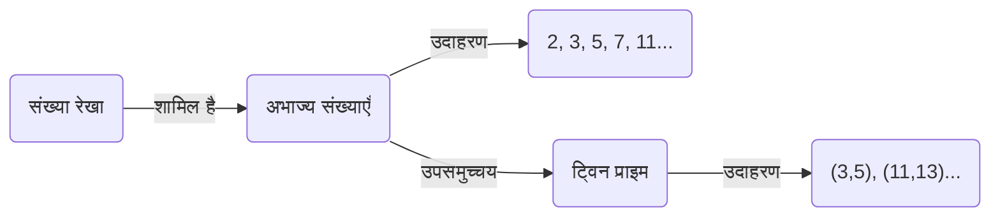
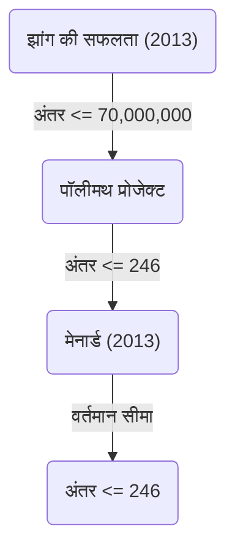

+++
title = "ट्विन प्राइम कंजंक्चर (Twin Prime Conjecture) - क्या 2 के अंतर वाले अभाज्य संख्याओं के जोड़े अनंत हैं?"
description = "गणित की अनसुलझी समस्या, ट्विन प्राइम कंजंक्चर के इतिहास, आंशिक समाधान और नवीनतम शोध प्रवृत्तियों के बारे में विस्तार से जानें।"
slug = "twin-prime-conjecture"
date = "2026-09-14T13:04:13+09:00"
image = "eyecatch.jpg"
categories = ["mathematics"]
tags = ["अभाज्य संख्याएँ", "संख्या सिद्धांत", "अनसुलझी समस्याएँ"]
+++

अभाज्य संख्याएँ (Prime Numbers) गणित में, विशेष रूप से संख्या सिद्धांत में, सबसे बुनियादी और रहस्यमय विषय हैं। अभाज्य संख्याएँ ऐसी प्राकृतिक संख्याएँ हैं जिनका 1 और स्वयं के अलावा कोई धनात्मक भाजक नहीं होता, और इन्हें संख्याओं के "परमाणु" भी कहा जाता है। इन्हीं अभाज्य संख्याओं से जुड़ी सबसे प्रसिद्ध और वर्तमान में अनसुलझी समस्याओं में से एक है **ट्विन प्राइम कंजंक्चर** (Twin Prime Conjecture)।

इस लेख में, हम इस आकर्षक अनुमान के बारे में इसकी परिभाषा से लेकर इसके इतिहास, और हाल के वर्षों में हुई नाटकीय प्रगति तक विस्तार से जानेंगे।

## 1. ट्विन प्राइम (जुड़वां अभाज्य) क्या है?

ट्विन प्राइम (Twin Primes) अभाज्य संख्याओं के ऐसे जोड़े हैं जिनके बीच का अंतर ठीक 2 होता है। उदाहरण के लिए, निम्नलिखित जोड़े ट्विन प्राइम हैं:

- $(3, 5)$
- $(5, 7)$
- $(11, 13)$
- $(17, 19)$
- $(29, 31)$
- $(41, 43)$

[अभाज्य संख्या प्रमेय ([Prime Number Theorem](https://kenji.blog/hi/p/prime-number-theorem/))](https://kenji.blog/p/prime-number-theorem/) से यह ज्ञात है कि जैसे-जैसे संख्याएँ बड़ी होती जाती हैं, अभाज्य संख्याओं के प्रकट होने की आवृत्ति कम होती जाती है। इसके साथ ही, ट्विन प्राइम की आवृत्ति भी कम हो जाती है। हालाँकि, गणितज्ञों ने लंबे समय से यह अनुमान लगाया है कि चाहे संख्याएँ कितनी भी बड़ी क्यों न हो जाएँ, "2 के अंतर वाले अभाज्य संख्याओं के जोड़े" बिना कभी समाप्त हुए हमेशा प्रकट होते रहेंगे।

यही **ट्विन प्राइम कंजंक्चर** है।

> **ट्विन प्राइम कंजंक्चर**
> अभाज्य संख्याओं के ऐसे जोड़े $(p, p+2)$ अनंत रूप से मौजूद हैं जिनका अंतर 2 है।

इसे समीकरण के रूप में इस प्रकार व्यक्त किया जाता है:
$$
\liminf_{n \to \infty} (p_{n+1} - p_n) = 2
$$
यहाँ, $p_n$ $n$-वीं अभाज्य संख्या को दर्शाता है।

## 2. अभाज्य संख्याओं का वितरण और ट्विन प्राइम

अभाज्य संख्याओं के वितरण को समझने के लिए, आइए सबसे पहले यह कल्पना करें कि अभाज्य संख्याएँ कैसे वितरित हैं।

अभाज्य संख्या प्रमेय के अनुसार, $x$ से कम या उसके बराबर अभाज्य संख्याओं की संख्या $\pi(x)$, लगभग $x / \ln(x)$ के अनन्तस्पर्शी (asymptotic) होती है। ट्विन प्राइम की संख्या $\pi_2(x)$ के संबंध में भी एक अधिक शक्तिशाली मात्रात्मक अनुमान मौजूद है जिसे हार्डी-लिटिलवुड अनुमान (प्रथम हार्डी-लिटिलवुड अनुमान) कहा जाता है।

### हार्डी-लिटिलवुड अनुमान

1923 में, गॉडफ्रे हेरोल्ड हार्डी और जॉन एडेंसर लिटिलवुड ने ट्विन प्राइम के अनन्तस्पर्शी वितरण के बारे में निम्नलिखित अनुमान लगाया था:

$$
\pi_2(x) \sim 2 C_2 \int_2^x \frac{dt}{(\ln t)^2}
$$

यहाँ, $C_2$ को **ट्विन प्राइम स्थिरांक** (Twin Prime Constant) कहा जाता है, और इसे इस प्रकार परिभाषित किया गया है:

$$
C_2 = \prod_{p \ge 3} \left( 1 - \frac{1}{(p-1)^2} \right) \approx 0.6601618158...
$$

यह अनुमान न केवल यह दावा करता है कि ट्विन प्राइम अनंत हैं ($\pi_2(x) \to \infty$), बल्कि यह भी बेहद सटीक रूप से भविष्यवाणी करता है कि वे किस घनत्व के साथ मौजूद हैं। अब तक कंप्यूटर द्वारा की गई बड़े पैमाने की गणनाओं के परिणाम इस अनुमान के साथ आश्चर्यजनक रूप से मेल खाते हैं।

## 3. ब्रून की प्रमेय और ब्रून स्थिरांक

1919 में, नॉर्वेजियन गणितज्ञ विगो ब्रून (Viggo Brun) ने ट्विन प्राइम अनुमान को सिद्ध तो नहीं किया, लेकिन उन्होंने एक अभूतपूर्व परिणाम प्रकाशित किया। उन्होंने दिखाया कि सभी ट्विन प्राइम्स के व्युत्क्रमों (reciprocals) का योग अभिसरित (converge) होता है।

$$
B_2 = \left( \frac{1}{3} + \frac{1}{5} \right) + \left( \frac{1}{5} + \frac{1}{7} \right) + \left( \frac{1}{11} + \frac{1}{13} \right) + \dots
$$

इस अभिसरण मान $B_2$ को **ब्रून स्थिरांक** (Brun's Constant) कहा जाता है। वर्तमान गणनाओं के अनुसार, इसका अनुमान $B_2 \approx 1.90216058$ लगाया गया है।

[लियोनहार्ड यूलर](https://kenji.blog/hi/p/euler/) ([Leonhard Euler](https://kenji.blog/hi/p/euler/)) ने यह सिद्ध किया था कि सभी अभाज्य संख्याओं के व्युत्क्रमों का योग अपसरित (diverge) होता है। यदि ट्विन प्राइम अनुमान गलत होता, और ट्विन प्राइम केवल सीमित (finite) संख्या में होते, तो चूँकि यह परिमित संख्याओं का योग होता, इसलिए स्वाभाविक रूप से यह अभिसरित होता। लेकिन ब्रून की प्रमेय का अर्थ यह है कि, "भले ही ट्विन प्राइम अनंत संख्या में मौजूद हों, उनके व्युत्क्रमों का योग अभिसरित होने के लिए वे बहुत 'विरल' (sparse) रूप से मौजूद होते हैं।" यह एक ऐसा कारक है जिसने ट्विन प्राइम अनुमान के समाधान को बहुत कठिन बना दिया है।

## 4. हाल के वर्षों में नाटकीय प्रगति: यितांग झांग (Yitang Zhang) की सफलता

लंबे समय तक, अभाज्य संख्याओं के अंतराल से संबंधित परिणाम एक गतिरोध में फँसे हुए थे, लेकिन 2013 में, उस समय के एक अनजान गणितज्ञ, यितांग झांग (Yitang Zhang) ने एक ऐसा शोध पत्र प्रकाशित किया जिसने दुनिया को चौंका दिया।

उन्होंने निम्नलिखित परिणाम सिद्ध किया:

> **झांग की प्रमेय**
> अभाज्य संख्याओं के ऐसे जोड़े $(p_n, p_{n+1})$ अनंत रूप से मौजूद हैं जहाँ $p_{n+1} - p_n \le 70,000,000$ है।

अर्थात्, "7 करोड़ (70 मिलियन) या उससे कम के अंतर वाले अभाज्य संख्याओं के जोड़े" अनंत रूप से मौजूद हैं। यद्यपि 7 करोड़ की संख्या 2 से बहुत दूर है, लेकिन यह एक ऐतिहासिक उपलब्धि थी जिसने पहली बार यह सिद्ध किया कि "एक सीमित स्थिरांक या उससे कम अंतर वाले अभाज्य संख्याओं के जोड़े अनंत रूप से मौजूद हैं"।

### पॉलीमथ प्रोजेक्ट और जेम्स मेनार्ड

यितांग झांग के परिणामों के बाद, टेरेंस ताओ और अन्य लोगों के नेतृत्व में "पॉलीमथ 8" (Polymath8) नामक एक ऑनलाइन सहयोगी परियोजना शुरू की गई, और इस 7 करोड़ की ऊपरी सीमा को कितना कम किया जा सकता है, इस पर एक प्रतिस्पर्धा शुरू हो गई।

उसी समय, जेम्स मेनार्ड (James Maynard) ने पूरी तरह से स्वतंत्र रूप से एक अलग विधि (बहुआयामी सेलबर्ग की चलनी - multidimensional Selberg sieve) का उपयोग किया, और ऊपरी सीमा को बहुत कम करने में सफल रहे। पॉलीमथ परियोजना और मेनार्ड के सुधारों को मिलाकर, वर्तमान में निम्नलिखित परिणाम प्राप्त हुए हैं:

$$
\liminf_{n \to \infty} (p_{n+1} - p_n) \le 246
$$

यानी, यह निश्चित हो चुका है कि "246 या उससे कम अंतर वाले अभाज्य संख्याओं के जोड़े" अनंत रूप से मौजूद हैं। यदि इस ऊपरी सीमा को $2$ तक कम किया जा सकता है, तो ट्विन प्राइम अनुमान पूरी तरह से सिद्ध हो जाएगा।

## 5. सामान्यीकरण और भविष्य की संभावनाएँ

ट्विन प्राइम अनुमान को अधिक सामान्य **पॉलिग्नैक अनुमान** (Polignac's Conjecture) के एक विशेष मामले ($2k = 2$ के मामले) के रूप में देखा जा सकता है।

> **पॉलिग्नैक अनुमान**
> किसी भी धनात्मक सम संख्या $2k$ के लिए, अभाज्य संख्याओं के ऐसे जोड़े $(p, p+2k)$ अनंत रूप से मौजूद हैं जिनका अंतर $2k$ है।

यितांग झांग, मेनार्ड और अन्य लोगों के तरीकों ने अंतराल के लिए एक परिमित ऊपरी सीमा के अस्तित्व को दर्शाया, लेकिन ऐसा माना जाता है कि वर्तमान तरीकों के विस्तार से ऊपरी सीमा को 2 तक कम करने (यानी ट्विन प्राइम अनुमान को सिद्ध करने) में "पैरिटी समस्या" (Parity problem) नामक एक सैद्धांतिक बाधा है।

ट्विन प्राइम अनुमान को पूरी तरह से हल करने के लिए, पूरी तरह से नए गणितीय विचारों की आवश्यकता होगी जो मौजूदा "चलनी विधियों" (Sieve methods) को मौलिक रूप से पार कर सकें।

## निष्कर्ष

ट्विन प्राइम अनुमान का अर्थ इतना सरल है कि एक प्राथमिक विद्यालय का छात्र भी इसे समझ सकता है, फिर भी इसने सदियों से प्रतिभाशाली गणितज्ञों की चुनौती को विफल किया है। हालाँकि, 21वीं सदी में प्रवेश करने के बाद, यितांग झांग की सफलता सहित अभूतपूर्व प्रगति हुई है, और मानवता निश्चित रूप से सत्य के करीब पहुँच रही है।

क्या "संख्याओं के परमाणुओं" द्वारा बुने गए अनंत ब्रह्मांड में ट्विन प्राइम कभी न खत्म होने वाले तरीके से चलते रहेंगे? इसका उत्तर मिलने का दिन शायद हमारे जीवनकाल में ही आ जाए।
