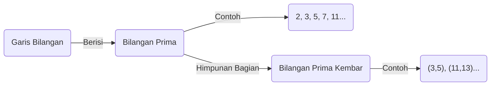
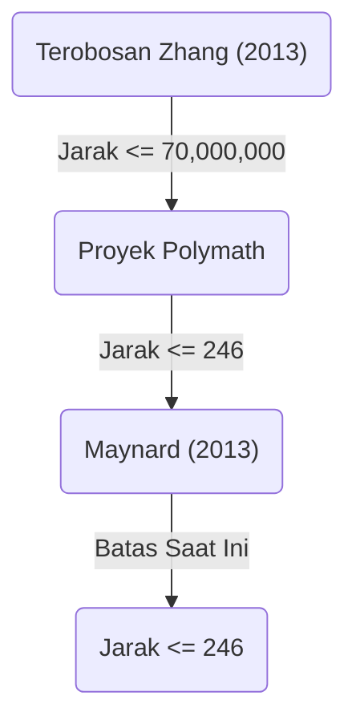

+++
title = "Konjektur Bilangan Prima Kembar (Twin Prime Conjecture) - Apakah Pasangan Bilangan Prima dengan Selisih 2 Ada Tak Terhingga?"
description = "Penjelasan rinci tentang Konjektur Bilangan Prima Kembar, sebuah masalah tak terpecahkan dalam matematika, mencakup sejarah, penyelesaian parsial, dan tren penelitian terbaru."
slug = "twin-prime-conjecture"
date = "2026-09-14T13:04:13+09:00"
image = "eyecatch.jpg"
categories = ["Mathematics"]
tags = ["Prime Numbers", "Number Theory", "Unsolved Problems"]
+++

Bilangan prima (Prime Numbers) adalah subjek yang paling dasar dan misterius dalam matematika, khususnya dalam teori bilangan. Bilangan prima, yang merupakan bilangan asli yang tidak memiliki pembagi positif selain 1 dan dirinya sendiri, juga disebut sebagai "atom" dari bilangan. Salah satu teka-teki yang paling terkenal dan masih belum terpecahkan mengenai bilangan prima ini adalah **Konjektur Bilangan Prima Kembar** (Twin Prime Conjecture).

Dalam artikel ini, kami akan menggali lebih dalam dan menjelaskan konjektur yang menarik ini, mulai dari definisinya hingga sejarahnya, serta perkembangan dramatis dalam beberapa tahun terakhir.

## 1. Apa itu Bilangan Prima Kembar?

Bilangan Prima Kembar (Twin Primes) adalah pasangan bilangan prima yang selisihnya tepat 2. Sebagai contoh, pasangan berikut ini merupakan bilangan prima kembar:

- $(3, 5)$
- $(5, 7)$
- $(11, 13)$
- $(17, 19)$
- $(29, 31)$
- $(41, 43)$

Seiring bertambah besarnya bilangan, frekuensi kemunculan bilangan prima itu sendiri akan menurun, seperti yang diketahui dari Teorema Bilangan Prima (Prime Number Theorem). Seiring dengan itu, frekuensi kemunculan bilangan prima kembar juga menurun. Namun, tidak peduli seberapa besar bilangannya, para matematikawan telah lama menduga bahwa "pasangan bilangan prima dengan selisih 2" ini akan terus muncul tanpa henti.

Inilah **Konjektur Bilangan Prima Kembar**.

> **Konjektur Bilangan Prima Kembar**
> Terdapat tak terhingga banyaknya pasangan bilangan prima $(p, p+2)$ yang memiliki selisih 2.

Jika dinyatakan dalam bentuk rumus, akan terlihat seperti berikut:
$$
\liminf_{n \to \infty} (p_{n+1} - p_n) = 2
$$
Di mana, $p_n$ mewakili bilangan prima ke-$n$.

## 2. Distribusi Bilangan Prima dan Bilangan Prima Kembar

Untuk memahami distribusi bilangan prima, mari kita visualisasikan terlebih dahulu bagaimana bilangan prima didistribusikan.

Menurut Teorema Bilangan Prima, jumlah bilangan prima $\pi(x)$ yang kurang dari atau sama dengan $x$ asimtotik terhadap $x / \ln(x)$. Mengenai jumlah bilangan prima kembar $\pi_2(x)$, ada konjektur kuantitatif yang lebih kuat yang disebut Konjektur Hardy-Littlewood (Konjektur Hardy-Littlewood Pertama).

### Konjektur Hardy-Littlewood

Pada tahun 1923, Godfrey Harold Hardy dan John Edensor Littlewood membuat konjektur berikut mengenai distribusi asimtotik dari bilangan prima kembar:

$$
\pi_2(x) \sim 2 C_2 \int_2^x \frac{dt}{(\ln t)^2}
$$

Di sini, $C_2$ disebut sebagai **Konstanta Bilangan Prima Kembar** (Twin Prime Constant), yang didefinisikan sebagai berikut:

$$
C_2 = \prod_{p \ge 3} \left( 1 - \frac{1}{(p-1)^2} \right) \approx 0.6601618158...
$$

Konjektur ini tidak hanya mengklaim bahwa terdapat tak terhingga banyaknya bilangan prima kembar ( $\pi_2(x) \to \infty$ ), tetapi juga memprediksi dengan sangat akurat seberapa padat mereka ada. Hasil perhitungan skala besar oleh komputer hingga saat ini sangat sesuai dengan konjektur ini.

## 3. Teorema Brun dan Konstanta Brun

Pada tahun 1919, matematikawan Norwegia Viggo Brun menerbitkan hasil yang menjadi terobosan, meskipun ia tidak berhasil membuktikan Konjektur Bilangan Prima Kembar. Ia menunjukkan bahwa jumlah kebalikan dari semua bilangan prima kembar konvergen.

$$
B_2 = \left( \frac{1}{3} + \frac{1}{5} \right) + \left( \frac{1}{5} + \frac{1}{7} \right) + \left( \frac{1}{11} + \frac{1}{13} \right) + \dots
$$

Nilai konvergen $B_2$ ini disebut **Konstanta Brun** (Brun's Constant). Menurut perhitungan saat ini, diperkirakan $B_2 \approx 1.90216058$.

Fakta bahwa jumlah kebalikan dari semua bilangan prima divergen telah dibuktikan oleh Leonhard Euler. Jika Konjektur Bilangan Prima Kembar salah dan bilangan prima kembar hanya berjumlah berhingga, maka wajar saja jika jumlah itu konvergen karena itu adalah jumlah dari angka-angka yang berhingga. Namun, apa yang disiratkan oleh Teorema Brun adalah "Bahkan jika bilangan prima kembar ada tak terhingga banyaknya, jumlah kebalikan mereka konvergen, yang berarti mereka tersebar sangat 'jarang'." Hal ini merupakan salah satu faktor yang membuat pemecahan Konjektur Bilangan Prima Kembar menjadi sangat sulit.

## 4. Kemajuan Dramatis dalam Beberapa Tahun Terakhir: Terobosan Yitang Zhang

Untuk waktu yang lama, hasil mengenai jarak antar bilangan prima mengalami kebuntuan, namun pada tahun 2013, seorang matematikawan tak dikenal pada waktu itu, Yitang Zhang, menerbitkan makalah yang mengejutkan dunia.

Ia membuktikan hasil sebagai berikut:

> **Teorema Zhang**
> Terdapat tak terhingga banyaknya pasangan bilangan prima $(p_n, p_{n+1})$ sehingga $p_{n+1} - p_n \le 70,000,000$.

Dengan kata lain, "pasangan bilangan prima dengan selisih 70 juta atau kurang" ada tak terhingga banyaknya. Angka 70 juta memang jauh dari 2, tetapi ini adalah pencapaian bersejarah karena untuk pertama kalinya membuktikan bahwa "terdapat tak terhingga banyaknya pasangan bilangan prima yang selisihnya berada di bawah suatu konstanta yang berhingga."

### Proyek Polymath dan James Maynard

Menanggapi hasil Yitang Zhang, proyek kolaborasi online "Polymath8" yang dipimpin oleh Terence Tao dan yang lainnya diluncurkan, memulai kompetisi untuk melihat seberapa jauh batas atas 70 juta ini dapat diturunkan.

Pada saat yang sama, James Maynard, secara independen menggunakan metode yang berbeda (saringan Selberg multidimensi), berhasil menurunkan batas atas secara signifikan. Dengan menggabungkan hasil dari Proyek Polymath dan perbaikan Maynard, hasil berikut ini telah diperoleh saat ini:

$$
\liminf_{n \to \infty} (p_{n+1} - p_n) \le 246
$$

Yaitu, telah dikonfirmasi bahwa "pasangan bilangan prima dengan selisih 246 atau kurang" ada tak terhingga banyaknya. Jika batas atas ini dapat diturunkan menjadi $2$, maka Konjektur Bilangan Prima Kembar akan sepenuhnya terbukti.

## 5. Generalisasi dan Prospek ke Depan

Konjektur Bilangan Prima Kembar dapat diposisikan sebagai kasus khusus (saat $2k = 2$) dari **Konjektur Polignac** (Polignac's Conjecture) yang lebih umum.

> **Konjektur Polignac**
> Untuk sembarang bilangan genap positif $2k$, terdapat tak terhingga banyaknya pasangan bilangan prima $(p, p+2k)$ yang memiliki selisih $2k$.

Metode Yitang Zhang dan Maynard menunjukkan keberadaan batas atas yang berhingga untuk jarak, tetapi diyakini bahwa ada hambatan mendasar yang disebut "masalah paritas" (parity problem) dalam menurunkan batas atas menjadi 2 (yaitu, membuktikan Konjektur Bilangan Prima Kembar) dengan hanya menggunakan perluasan dari metode yang ada saat ini.

Untuk memecahkan Konjektur Bilangan Prima Kembar sepenuhnya, akan dibutuhkan gagasan matematika yang sama sekali baru yang secara fundamental melampaui "Metode saringan" (Sieve methods) yang ada.

## Kesimpulan

Meskipun makna dari Konjektur Bilangan Prima Kembar itu sendiri cukup sederhana untuk dipahami bahkan oleh siswa sekolah dasar, masalah ini telah menolak tantangan dari para matematikawan jenius selama berabad-abad. Namun, memasuki abad ke-21, telah terjadi kemajuan terobosan termasuk terobosan Yitang Zhang, dan umat manusia secara pasti semakin mendekati kebenaran.

Apakah bilangan prima kembar akan berlanjut tanpa henti dalam alam semesta tak terbatas yang ditenun oleh "atom bilangan"? Hari ketika jawaban itu terungkap mungkin akan tiba selama kita masih hidup.
