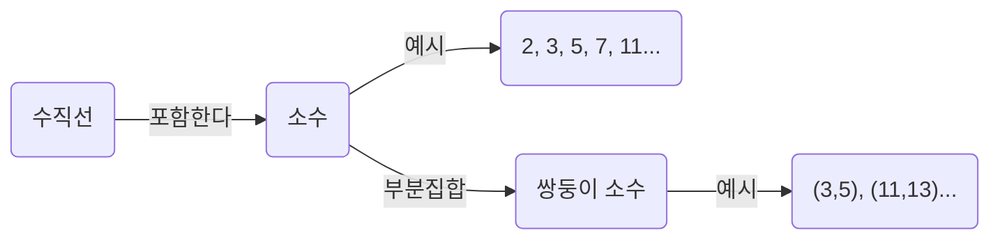
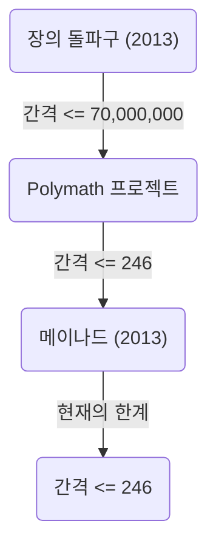

+++
title = "쌍둥이 소수 추측 (Twin Prime Conjecture) - 차이가 2인 소수의 쌍은 무한히 존재하는가"
description = "수학상 미해결 문제인 쌍둥이 소수 추측에 대해, 그 역사, 부분적인 해결, 최신 연구 동향 등을 자세히 해설합니다."
slug = "twin-prime-conjecture"
date = "2026-09-14T13:04:13+09:00"
image = "eyecatch.jpg"
categories = ["수학"]
tags = ["소수", "정수론", "미해결 문제"]
+++

소수(Prime Numbers)는 수학, 특히 정수론에서 가장 기본적이고 신비로운 대상입니다. 1과 자기 자신 이외에 양의 약수를 가지지 않는 자연수인 소수는 수의 '원자'라고도 불립니다. 그 소수에 관한 가장 유명하고 현재도 미해결된 난제 중 하나가 **쌍둥이 소수 추측** (Twin Prime Conjecture)입니다.

본 기사에서는 이 매혹적인 추측에 대해, 그 정의부터 역사, 그리고 최근의 극적인 진전까지 깊이 파고들어 해설합니다.

## 1. 쌍둥이 소수란 무엇인가?

쌍둥이 소수(Twin Primes)란 차이가 정확히 2인 소수의 쌍을 말합니다. 예를 들어, 다음의 쌍이 쌍둥이 소수에 해당합니다.

- $(3, 5)$
- $(5, 7)$
- $(11, 13)$
- $(17, 19)$
- $(29, 31)$
- $(41, 43)$

수가 커짐에 따라 소수 자체의 출현 빈도는 감소해 간다는 것이 소수 정리(Prime Number Theorem)에 의해 알려져 있습니다. 이에 따라 쌍둥이 소수의 출현 빈도 또한 감소해 갑니다. 그러나 아무리 수가 커져도 이 "차이가 2인 소수의 쌍"은 끝없이 나타나는 것이 아닐까 하고 수학자들은 예로부터 추측해 왔습니다.

이것이 **쌍둥이 소수 추측** 입니다.

> **쌍둥이 소수 추측**
> 차이가 2인 소수의 쌍 $(p, p+2)$ 는 무한히 많이 존재한다.

식으로 나타내면 다음과 같습니다.
$$
\liminf_{n \to \infty} (p_{n+1} - p_n) = 2
$$
여기서 $p_n$ 은 $n$ 번째 소수를 나타냅니다.

## 2. 소수의 분포와 쌍둥이 소수

소수의 분포를 이해하기 위해, 우선 소수가 어떻게 분포하고 있는지 시각화해 봅시다.

소수 정리에 의하면, $x$ 이하인 소수의 개수 $\pi(x)$ 는 대략 $x / \ln(x)$ 에 점근합니다. 쌍둥이 소수의 개수 $\pi_2(x)$ 에 대해서도 하디-리틀우드 추측(제1 하디-리틀우드 추측)이라 불리는 더 강력한 정량적 추측이 존재합니다.

### 하디-리틀우드 추측

1923년, 고드프리 해럴드 하디와 존 에든서 리틀우드는 쌍둥이 소수의 점근적인 분포에 대해 다음과 같은 추측을 세웠습니다.

$$
\pi_2(x) \sim 2 C_2 \int_2^x \frac{dt}{(\ln t)^2}
$$

여기서 $C_2$ 는 **쌍둥이 소수 상수** (Twin Prime Constant)라고 불리며, 다음과 같이 정의됩니다.

$$
C_2 = \prod_{p \ge 3} \left( 1 - \frac{1}{(p-1)^2} \right) \approx 0.6601618158...
$$

이 추측은 단순히 쌍둥이 소수가 무한히 존재한다는 것( $\pi_2(x) \to \infty$ )을 주장할 뿐만 아니라, 그것이 어느 정도의 밀도로 존재하는지를 극히 정확하게 예언하고 있습니다. 현재까지의 컴퓨터에 의한 대규모 계산 결과는 이 추측과 놀라울 정도로 일치하고 있습니다.

## 3. 브룬의 정리와 브룬 상수

1919년, 노르웨이의 수학자 비고 브룬은 쌍둥이 소수 추측의 증명에는 이르지 못했지만, 획기적인 결과를 발표했습니다. 그는 모든 쌍둥이 소수의 역수의 합이 수렴한다는 것을 보인 것입니다.

$$
B_2 = \left( \frac{1}{3} + \frac{1}{5} \right) + \left( \frac{1}{5} + \frac{1}{7} \right) + \left( \frac{1}{11} + \frac{1}{13} \right) + \dots
$$

이 수렴값 $B_2$ 는 **브룬 상수** (Brun's Constant)라고 불립니다. 현재의 계산에 의하면, $B_2 \approx 1.90216058$ 로 추정되고 있습니다.

모든 소수의 역수의 합이 발산한다는 것은 레온하르트 오일러에 의해 증명되었습니다. 만약 쌍둥이 소수 추측이 거짓이고 쌍둥이 소수가 유한 개밖에 존재하지 않는다면, 유한 개의 수의 합이므로 당연히 수렴합니다. 그러나 브룬의 정리가 의미하는 것은 "설령 쌍둥이 소수가 무한히 존재한다고 하더라도, 그 역수의 합은 수렴할 정도로 '드물게' 밖에는 존재하지 않는다"는 것입니다. 이것은 쌍둥이 소수 추측의 해결을 현저히 어렵게 만드는 요인 중 하나입니다.

## 4. 최근의 극적인 진전: 장이탕(Yitang Zhang)의 돌파구

오랜 기간 동안 소수의 간격에 관한 결과는 교착 상태에 있었으나, 2013년 당시 무명이었던 수학자 장이탕(Yitang Zhang)이 세계를 놀라게 한 논문을 발표했습니다.

그는 다음과 같은 결과를 증명했습니다.

> **장의 정리**
> $p_{n+1} - p_n \le 70,000,000$ 이 되는 소수의 쌍 $(p_n, p_{n+1})$ 이 무한히 존재한다.

즉, "차이가 7000만 이하인 소수의 쌍"은 무한히 존재한다는 것입니다. 7000만이라는 숫자는 2와는 거리가 멀지만, "차이가 유한한 상수 이하가 되는 소수의 쌍이 무한히 존재한다"는 것을 처음으로 증명한 역사적인 쾌거였습니다.

### Polymath 프로젝트와 제임스 메이나드

장이탕의 결과를 바탕으로, 테렌스 타오 등이 주도하는 온라인 협업 프로젝트 'Polymath8'이 발족하여, 이 7000만이라는 상한을 어디까지 낮출 수 있는지에 대한 경쟁이 시작되었습니다.

동시에 제임스 메이나드(James Maynard)는 완전히 독립적으로 다른 수법(다차원 셀버그 체)을 사용하여 상한을 대폭 낮추는 데 성공했습니다. Polymath 프로젝트와 메이나드의 개량을 합침으로써 현재는 다음과 같은 결과를 얻었습니다.

$$
\liminf_{n \to \infty} (p_{n+1} - p_n) \le 246
$$

즉, "차이가 246 이하인 소수의 쌍"은 무한히 존재한다는 것이 확정되어 있습니다. 만약 이 상한을 $2$ 까지 낮출 수 있다면, 쌍둥이 소수 추측은 완전히 증명된 것이 됩니다.

## 5. 일반화와 향후 전망

쌍둥이 소수 추측은 더 일반적인 **폴리냑 추측** (Polignac's Conjecture)의 특수한 경우( $2k = 2$ 인 경우)로 위치지을 수 있습니다.

> **폴리냑 추측**
> 임의의 양의 짝수 $2k$ 에 대해, 차이가 $2k$ 인 소수의 쌍 $(p, p+2k)$ 는 무한히 많이 존재한다.

장이탕이나 메이나드 등의 수법은 간격의 유한한 상한의 존재를 보였지만, 현재의 수법의 연장선상만으로는 상한을 2까지 낮추는(즉 쌍둥이 소수 추측을 증명하는) 것에는 "패리티 문제(Parity Problem)"라고 불리는 원리적인 장벽이 있다고 여겨집니다.

쌍둥이 소수 추측을 완전히 해결하기 위해서는 기존의 "체론(Sieve methods)"을 근본적으로 뛰어넘는 전혀 새로운 수학적 아이디어가 필요할 것입니다.

## 요약

쌍둥이 소수 추측은 문제의 의미 자체는 초등학생도 이해할 수 있을 정도로 단순하면서도, 수 세기에 걸쳐 천재 수학자들의 도전을 물리쳐 왔습니다. 그러나 21세기에 들어 장이탕의 돌파구를 비롯한 획기적인 진전이 있어, 인류는 확실하게 진리에 다가가고 있습니다.

"수의 원자"들이 엮어내는 무한한 우주에서 쌍둥이 소수가 끝없이 이어질 것인가. 그 해답이 밝혀질 날은 우리가 살아있는 동안에 찾아올지도 모릅니다.
