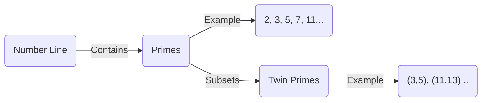
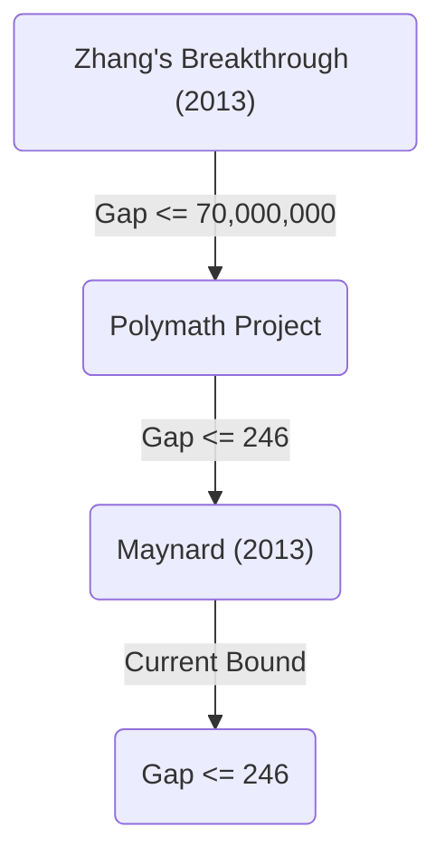

+++
title = "双子素数予想（Twin Prime Conjecture） - 差が2の素数のペアは無限に存在するのか"
description = "数学上の未解決問題である双子素数予想について、その歴史、部分的な解決、最新の研究動向などを詳しく解説します。"
slug = "twin-prime-conjecture"
date = "2026-09-24T16:08:36+09:00"
image = "eyecatch.jpg"
categories = ["mathematics"]
tags = ["Prime Numbers", "Number Theory", "Unsolved Problems"]
+++

素数（Prime Numbers）は、数学、とりわけ数論において最も基本的かつ神秘的な対象です。1と自分自身以外に正の約数を持たない自然数である素数は、数の「原子」とも呼ばれます。その素数に関する最も有名で、かつ現在も未解決の難問の一つが **双子素数予想** （Twin Prime Conjecture）です。

本記事では、この魅惑的な予想について、その定義から歴史、そして近年の劇的な進展までを深く掘り下げて解説します。

## 1. 双子素数とは何か？

双子素数（Twin Primes）とは、差がちょうど2であるような素数のペアのことです。例えば、以下のペアが双子素数に該当します。

- $(3, 5)$
- $(5, 7)$
- $(11, 13)$
- $(17, 19)$
- $(29, 31)$
- $(41, 43)$

数が大きくなるにつれて、素数自体の出現頻度は減少していくことが[素数定理（Prime Number Theorem）](https://kenji.blog/p/prime-number-theorem/)によって知られています。それに伴い、双子素数の出現頻度もまた減少していきます。しかし、どれほど数が大きくなっても、この「差が2の素数のペア」は尽きることなく現れるのではないか、と数学者たちは古くから推測してきました。

これが **双子素数予想** です。

> **双子素数予想**
> 差が2である素数の組 $(p, p+2)$ は無限に多く存在する。

式で表すと、以下のようになります。
$$
\liminf_{n \to \infty} (p_{n+1} - p_n) = 2
$$
ここで、$p_n$ は $n$ 番目の素数を表します。

## 2. 素数の分布と双子素数

素数の分布を理解するために、まずは素数がどのように分布しているかを可視化してみましょう。

素数定理によれば、$x$ 以下の素数の個数 $\pi(x)$ は、およそ $x / \ln(x)$ に漸近します。双子素数の個数 $\pi_2(x)$ についても、ハーディ・リトルウッド予想（第一ハーディ・リトルウッド予想）と呼ばれる、より強力な定量的予想が存在します。

### ハーディ・リトルウッド予想

1923年、ゴッドフレイ・ハロルド・ハーディとジョン・エデンサー・リトルウッドは、双子素数の漸近的な分布について次のような予想を立てました。

$$
\pi_2(x) \sim 2 C_2 \int_2^x \frac{dt}{(\ln t)^2}
$$

ここで、$C_2$ は **双子素数定数** （Twin Prime Constant）と呼ばれ、次のように定義されます。

$$
C_2 = \prod_{p \ge 3} \left( 1 - \frac{1}{(p-1)^2} \right) \approx 0.6601618158...
$$

この予想は、単に双子素数が無限に存在すること（ $\pi_2(x) \to \infty$ ）を主張するだけでなく、それがどの程度の密度で存在するのかを極めて正確に予言しています。現在までのコンピュータによる大規模な計算結果は、この予想と驚くほど一致しています。

## 3. ブルンの定理とブルン定数

1919年、ノルウェーの数学者ヴィーゴ・ブルンは、双子素数予想の証明には至りませんでしたが、画期的な結果を発表しました。彼は、すべての双子素数の逆数の和が収束することを示したのです。

$$
B_2 = \left( \frac{1}{3} + \frac{1}{5} \right) + \left( \frac{1}{5} + \frac{1}{7} \right) + \left( \frac{1}{11} + \frac{1}{13} \right) + \dots
$$

この収束値 $B_2$ は **ブルン定数** （Brun's Constant）と呼ばれています。現在の計算によれば、 $B_2 \approx 1.90216058$ と推定されています。

すべての素数の逆数の和が発散することは、レオンハルト・[オイラー](https://kenji.blog/p/euler/)によって証明されています。もし双子素数予想が偽であり、双子素数が有限個しか存在しないのであれば、有限個の数の和であるため当然収束します。しかし、ブルンの定理が意味するのは、「たとえ双子素数が無限に存在したとしても、その逆数の和は収束するほど『まばら』にしか存在しない」ということです。これは双子素数予想の解決を著しく困難にしている要因の一つです。

## 4. 近年の劇的な進展：張益唐（Yitang Zhang）のブレイクスルー

長い間、素数の間隔に関する結果は膠着状態にありましたが、2013年、当時無名だった数学者、張益唐（Yitang Zhang）が世界を驚かせる論文を発表しました。

彼は、次のような結果を証明しました。

> **張の定理**
> $p_{n+1} - p_n \le 70,000,000$ となるような素数の組 $(p_n, p_{n+1})$ が無限に存在する。

つまり、「差が7000万以下の素数のペア」は無限に存在するということです。7000万という数字は2とは程遠いですが、「差が有限の定数以下となる素数のペアが無限に存在する」ことを初めて証明した、歴史的な快挙でした。

### Polymath プロジェクトとジェームズ・メイナード

張益唐の結果を受けて、テレンス・タオらが主導するオンライン協働プロジェクト「Polymath8」が発足し、この7000万という上限をどこまで下げられるかという競争が始まりました。

同時に、ジェームズ・メイナード（James Maynard）は全く独立に異なる手法（多次元セルバーグの篩）を用い、上限を大幅に下げることに成功しました。Polymathプロジェクトとメイナードの改良を合わせることで、現在では次のような結果が得られています。

$$
\liminf_{n \to \infty} (p_{n+1} - p_n) \le 246
$$

すなわち、「差が246以下の素数のペア」は無限に存在することが確定しています。もしこの上限を $2$ まで下げることができれば、双子素数予想は完全に証明されたことになります。

## 5. 一般化と今後の展望

双子素数予想は、より一般的な **ポリニャック予想** （Polignac's Conjecture）の特殊なケース（ $2k = 2$ の場合）として位置づけることができます。

> **ポリニャック予想**
> 任意の正の偶数 $2k$ に対して、差が $2k$ である素数の組 $(p, p+2k)$ は無限に多く存在する。

張益唐やメイナードらの手法は、間隔の有限な上限の存在を示しましたが、現在の手法の延長線上だけでは、上限を2まで下げる（つまり双子素数予想を証明する）ことには「パリティ問題」と呼ばれる原理的な障壁があると考えられています。

双子素数予想を完全に解決するためには、既存の「篩法（Sieve methods）」を根本的に超えるような、全く新しい数学的アイデアが必要とされるでしょう。

## まとめ

双子素数予想は、問題の意味自体は小学生でも理解できるほどシンプルでありながら、数世紀にわたって天才数学者たちの挑戦を退けてきました。しかし、21世紀に入り、張益唐のブレイクスルーをはじめとする画期的な進展があり、人類は確実に真理へと近づいています。

「数の原子」たちが織りなす無限の宇宙において、双子素数が果てしなく続くのか。その答えが明らかになる日は、私たちが生きている間に訪れるかもしれません。
