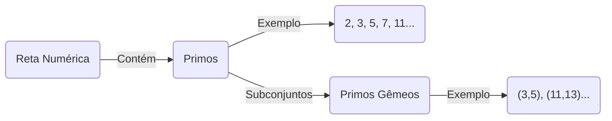
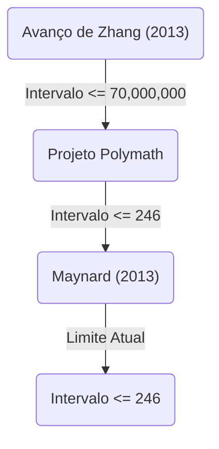

+++
title = "Conjectura dos Primos Gêmeos (Twin Prime Conjecture) - Existem infinitos pares de primos com diferença de 2?"
description = "Explicação detalhada sobre a Conjectura dos Primos Gêmeos, um problema não resolvido na matemática, incluindo sua história, resoluções parciais e tendências recentes de pesquisa."
slug = "twin-prime-conjecture"
date = "2026-09-14T13:04:13+09:00"
image = "eyecatch.jpg"
categories = ["mathematics"]
tags = ["Prime Numbers", "Number Theory", "Unsolved Problems"]
+++

Os números primos (Prime Numbers) são os objetos mais básicos e misteriosos da matemática, especialmente na teoria dos números. Sendo números naturais que não têm divisores positivos além de 1 e de si mesmos, os primos também são chamados de "átomos" dos números. Um dos problemas mais famosos e ainda não resolvidos sobre os números primos é a **Conjectura dos Primos Gêmeos** (Twin Prime Conjecture).

Neste artigo, aprofundaremos essa conjectura fascinante, desde sua definição até sua história e os drásticos avanços recentes.

## 1. O que são Primos Gêmeos?

Primos Gêmeos (Twin Primes) são pares de números primos cuja diferença é exatamente 2. Por exemplo, os seguintes pares são primos gêmeos:

- $(3, 5)$
- $(5, 7)$
- $(11, 13)$
- $(17, 19)$
- $(29, 31)$
- $(41, 43)$

Sabe-se pelo Teorema do Número Primo ([Prime Number Theorem](https://kenji.blog/p/prime-number-theorem/)) que, à medida que os números aumentam, a frequência de aparecimento dos próprios números primos diminui. Consequentemente, a frequência de aparecimento de primos gêmeos também diminui. No entanto, por maior que seja o número, os matemáticos têm especulado há muito tempo que esses "pares de primos com diferença de 2" aparecerão infinitamente sem se esgotarem.

Esta é a **Conjectura dos Primos Gêmeos** .

> **Conjectura dos Primos Gêmeos**
> Existem infinitos pares de primos $(p, p+2)$ com diferença de 2.

Expressa como uma equação, é a seguinte:
$$
\liminf_{n \to \infty} (p_{n+1} - p_n) = 2
$$
Aqui, $p_n$ representa o $n$-ésimo número primo.

## 2. Distribuição dos Primos e Primos Gêmeos

Para entender a distribuição dos números primos, vamos primeiro visualizar como eles estão distribuídos.

De acordo com o Teorema do Número Primo, a quantidade de primos menores ou iguais a $x$, $\pi(x)$, é assintótica a aproximadamente $x / \ln(x)$. Para a quantidade de primos gêmeos $\pi_2(x)$, existe uma conjectura quantitativa mais forte chamada Conjectura de Hardy-Littlewood (Primeira Conjectura de Hardy-Littlewood).

### Conjectura de Hardy-Littlewood

Em 1923, Godfrey Harold Hardy e John Edensor Littlewood fizeram a seguinte conjectura sobre a distribuição assintótica dos primos gêmeos:

$$
\pi_2(x) \sim 2 C_2 \int_2^x \frac{dt}{(\ln t)^2}
$$

Aqui, $C_2$ é chamado de **Constante dos Primos Gêmeos** (Twin Prime Constant) e é definido da seguinte forma:

$$
C_2 = \prod_{p \ge 3} \left( 1 - \frac{1}{(p-1)^2} \right) \approx 0.6601618158...
$$

Esta conjectura não apenas afirma que existem infinitos primos gêmeos ( $\pi_2(x) \to \infty$ ), mas também prevê com extrema precisão com que densidade eles existem. Os resultados de cálculos em grande escala feitos por computadores até o momento concordam surpreendentemente com esta conjectura.

## 3. Teorema de Brun e Constante de Brun

Em 1919, o matemático norueguês Viggo Brun não conseguiu provar a conjectura dos primos gêmeos, mas publicou um resultado inovador. Ele demonstrou que a soma dos inversos de todos os primos gêmeos converge.

$$
B_2 = \left( \frac{1}{3} + \frac{1}{5} \right) + \left( \frac{1}{5} + \frac{1}{7} \right) + \left( \frac{1}{11} + \frac{1}{13} \right) + \dots
$$

Esse valor de convergência $B_2$ é chamado de **Constante de Brun** (Brun's Constant). De acordo com os cálculos atuais, estima-se que $B_2 \approx 1.90216058$.

Foi provado por [Leonhard Euler](https://kenji.blog/p/euler/) que a soma dos inversos de todos os números primos diverge. Se a conjectura dos primos gêmeos for falsa e existirem apenas um número finito de primos gêmeos, a soma naturalmente convergirá, por ser a soma de uma quantidade finita de números. No entanto, o significado do teorema de Brun é que "mesmo se existirem infinitos primos gêmeos, eles são tão 'esparsos' que a soma de seus inversos converge". Este é um dos fatores que torna a resolução da conjectura dos primos gêmeos extremamente difícil.

## 4. Avanços Dramáticos Recentes: O Avanço de Yitang Zhang

Por muito tempo, os resultados sobre os intervalos entre primos estiveram estagnados, mas em 2013, o então desconhecido matemático Yitang Zhang publicou um artigo que surpreendeu o mundo.

Ele provou o seguinte resultado:

> **Teorema de Zhang**
> Existem infinitos pares de primos $(p_n, p_{n+1})$ tais que $p_{n+1} - p_n \le 70,000,000$.

Ou seja, "pares de primos com diferença de 70 milhões ou menos" existem infinitamente. O número 70 milhões está muito distante de 2, mas foi uma conquista histórica provar pela primeira vez que "existem infinitos pares de primos cuja diferença é menor ou igual a uma constante finita".

### Projeto Polymath e James Maynard

Após o resultado de Yitang Zhang, o projeto colaborativo online "Polymath8", liderado por Terence Tao e outros, foi lançado, iniciando uma corrida para ver o quão baixo esse limite de 70 milhões poderia ser reduzido.

Ao mesmo tempo, James Maynard, usando uma abordagem completamente diferente e de forma independente (o crivo de Selberg multidimensional), conseguiu reduzir significativamente o limite superior. Combinando o projeto Polymath com as melhorias de Maynard, o seguinte resultado é conhecido atualmente:

$$
\liminf_{n \to \infty} (p_{n+1} - p_n) \le 246
$$

Ou seja, está confirmado que "existem infinitos pares de primos com diferença menor ou igual a 246". Se esse limite superior puder ser reduzido para $2$, a conjectura dos primos gêmeos estará completamente provada.

## 5. Generalização e Perspectivas Futuras

A conjectura dos primos gêmeos pode ser posicionada como um caso especial (o caso de $2k = 2$ ) da mais geral **Conjectura de Polignac** (Polignac's Conjecture).

> **Conjectura de Polignac**
> Para qualquer número par positivo $2k$, existem infinitos pares de primos $(p, p+2k)$ cuja diferença é $2k$.

As abordagens de Yitang Zhang, Maynard e outros mostraram a existência de um limite superior finito para o intervalo, mas acredita-se que haja uma barreira fundamental conhecida como "problema da paridade" que impede que o limite superior seja reduzido para 2 (ou seja, provar a conjectura dos primos gêmeos) apenas como uma extensão dos métodos atuais.

Para resolver completamente a conjectura dos primos gêmeos, serão necessárias ideias matemáticas completamente novas que vão fundamentalmente além dos "métodos de crivo" (Sieve methods) existentes.

## Conclusão

A conjectura dos primos gêmeos rejeitou o desafio de matemáticos geniais por séculos, embora o próprio significado do problema seja simples o suficiente para ser entendido por um estudante do ensino fundamental. No entanto, no século XXI, tem havido avanços revolucionários, incluindo o avanço de Yitang Zhang, e a humanidade está se aproximando cada vez mais da verdade.

Os primos gêmeos continuam infinitamente no universo infinito tecido pelos "átomos dos números"? O dia em que a resposta será revelada pode chegar em nosso tempo de vida.
