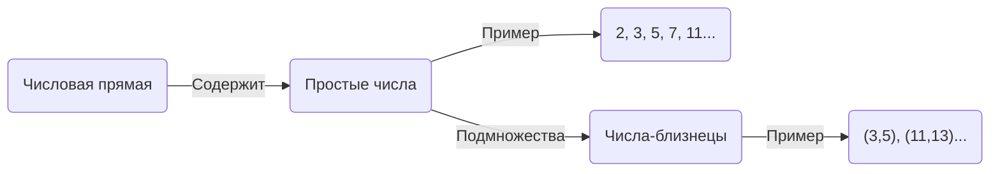
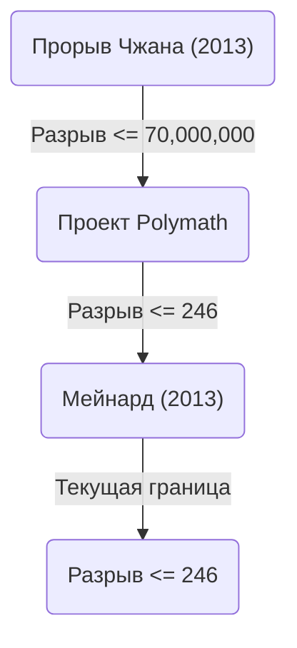

+++
title = "Гипотеза о числах-близнецах (Twin Prime Conjecture) - Существует ли бесконечное множество пар простых чисел с разностью 2"
description = "Подробное объяснение гипотезы о числах-близнецах, нерешенной математической проблемы: ее история, частичные решения и последние тенденции в исследованиях."
slug = "twin-prime-conjecture"
date: "2026-09-24T16:08:36+09:00"
image = "eyecatch.jpg"
categories = ["mathematics"]
tags = ["Простые числа", "Теория чисел", "Нерешенные проблемы"]
+++

Простые числа (Prime Numbers) — это самые базовые и таинственные объекты в математике, особенно в теории чисел. Простые числа, являющиеся натуральными числами, не имеющими положительных делителей, кроме 1 и самих себя, также называются «атомами» чисел. Одной из самых известных и до сих пор нерешенных задач, связанных с простыми числами, является **гипотеза о числах-близнецах** (Twin Prime Conjecture).

В этой статье мы подробно рассмотрим эту увлекательную гипотезу, от ее определения до истории и недавнего драматического прогресса.

## 1. Что такое числа-близнецы?

Числа-близнецы (Twin Primes) — это пара простых чисел, разность между которыми равна ровно 2. Например, следующие пары являются числами-близнецами:

- $(3, 5)$
- $(5, 7)$
- $(11, 13)$
- $(17, 19)$
- $(29, 31)$
- $(41, 43)$

Согласно теореме о распределении простых чисел ([Prime Number Theorem](https://kenji.blog/ru/p/prime-number-theorem/)), известно, что по мере увеличения чисел частота появления самих простых чисел уменьшается. Соответственно, частота появления чисел-близнецов также снижается. Однако математики давно предполагали, что независимо от того, насколько большими становятся числа, эти «пары простых чисел с разностью 2» будут появляться бесконечно.

Это и есть **гипотеза о числах-близнецах** .

> **Гипотеза о числах-близнецах**
> Существует бесконечно много пар простых чисел $(p, p+2)$, разность которых равна 2.

Выраженная в виде формулы, она выглядит следующим образом:
$$
\liminf_{n \to \infty} (p_{n+1} - p_n) = 2
$$
Здесь $p_n$ обозначает $n$-е простое число.

## 2. Распределение простых чисел и числа-близнецы

Чтобы понять распределение простых чисел, давайте сначала визуализируем, как они распределены.

Согласно теореме о распределении простых чисел, количество простых чисел $\pi(x)$, меньших или равных $x$, асимптотически приближается к $x / \ln(x)$. Для количества чисел-близнецов $\pi_2(x)$ существует более сильная количественная гипотеза, называемая гипотезой Харди-Литтлвуда (Первая гипотеза Харди-Литтлвуда).

### Гипотеза Харди-Литтлвуда

В 1923 году Годфри Гарольд Харди и Джон Эдензор Литтлвуд выдвинули следующую гипотезу об асимптотическом распределении чисел-близнецов:

$$
\pi_2(x) \sim 2 C_2 \int_2^x \frac{dt}{(\ln t)^2}
$$

Здесь $C_2$ называется **константой чисел-близнецов** (Twin Prime Constant) и определяется следующим образом:

$$
C_2 = \prod_{p \ge 3} \left( 1 - \frac{1}{(p-1)^2} \right) \approx 0.6601618158...
$$

Эта гипотеза не только утверждает, что существует бесконечно много чисел-близнецов ( $\pi_2(x) \to \infty$ ), но и чрезвычайно точно предсказывает плотность их распределения. Результаты масштабных вычислений с помощью компьютеров на сегодняшний день поразительно точно совпадают с этой гипотезой.

## 3. Теорема Бруна и константа Бруна

В 1919 году норвежский математик Вигго Брун, хотя и не смог доказать гипотезу о числах-близнецах, опубликовал эпохальный результат. Он показал, что сумма обратных величин всех чисел-близнецов сходится.

$$
B_2 = \left( \frac{1}{3} + \frac{1}{5} \right) + \left( \frac{1}{5} + \frac{1}{7} \right) + \left( \frac{1}{11} + \frac{1}{13} \right) + \dots
$$

Это сходящееся значение $B_2$ называется **константой Бруна** (Brun's Constant). По текущим вычислениям, предполагается, что $B_2 \approx 1.90216058$.

[Леонард Эйлер](https://kenji.blog/ru/p/euler/) доказал, что сумма обратных величин всех простых чисел расходится. Если бы гипотеза о числах-близнецах была ложной, и существовало бы лишь конечное число чисел-близнецов, то сумма, будучи суммой конечного числа слагаемых, естественно, сходилась бы. Однако теорема Бруна означает, что «даже если чисел-близнецов бесконечно много, они распределены настолько 'редко', что сумма их обратных величин сходится». Это один из факторов, который делает решение гипотезы о числах-близнецах чрезвычайно сложным.

## 4. Недавний драматический прогресс: прорыв Чжана Итана (Yitang Zhang)

Долгое время результаты, касающиеся интервалов между простыми числами, находились в тупике, но в 2013 году тогда еще неизвестный математик Чжан Итан (Yitang Zhang) опубликовал статью, которая поразила весь мир.

Он доказал следующий результат:

> **Теорема Чжана**
> Существует бесконечно много пар простых чисел $(p_n, p_{n+1})$, таких что $p_{n+1} - p_n \le 70,000,000$.

То есть, существует бесконечно много «пар простых чисел с разностью не более 70 миллионов». Число 70 миллионов далеко от 2, но это был исторический прорыв, впервые доказавший, что «существует бесконечно много пар простых чисел, разность между которыми меньше или равна конечной константе».

### Проект Polymath и Джеймс Мейнард

После результатов Чжана Итана был запущен онлайн-проект сотрудничества «Polymath8» под руководством Теренса Тао и других, и началась гонка за тем, насколько можно снизить этот предел в 70 миллионов.

В то же время Джеймс Мейнард (James Maynard), используя совершенно независимый метод (многомерное решето Сельберга), сумел значительно снизить этот предел. Объединив улучшения проекта Polymath и Мейнарда, в настоящее время получен следующий результат:

$$
\liminf_{n \to \infty} (p_{n+1} - p_n) \le 246
$$

То есть, точно установлено, что существует бесконечно много «пар простых чисел с разностью 246 или меньше». Если этот предел удастся снизить до $2$, гипотеза о числах-близнецах будет полностью доказана.

## 5. Обобщение и будущие перспективы

Гипотезу о числах-близнецах можно рассматривать как частный случай (при $2k = 2$) более общей **гипотезы де Полиньяка** (Polignac's Conjecture).

> **Гипотеза де Полиньяка**
> Для любого положительного четного числа $2k$ существует бесконечно много пар простых чисел $(p, p+2k)$, разность которых равна $2k$.

Методы Чжана Итана, Мейнарда и других показали существование конечной верхней границы интервала, но считается, что снижение границы до 2 (то есть доказательство гипотезы о числах-близнецах) исключительно с использованием развития современных методов сталкивается с фундаментальным барьером, известным как «проблема четности» (Parity problem).

Для полного решения гипотезы о числах-близнецах, вероятно, потребуются совершенно новые математические идеи, которые фундаментально превзойдут существующие «методы решета» (Sieve methods).

## Заключение

Гипотеза о числах-близнецах настолько проста, что ее смысл может понять даже младшеклассник, но при этом она веками отвергала попытки гениальных математиков ее решить. Однако в XXI веке произошли эпохальные достижения, в первую очередь прорыв Чжана Итана, и человечество уверенно приближается к истине.

Продолжаются ли бесконечно числа-близнецы в бескрайней вселенной, сотканной «атомами чисел»? День, когда этот ответ станет ясным, возможно, наступит еще при нашей жизни.
