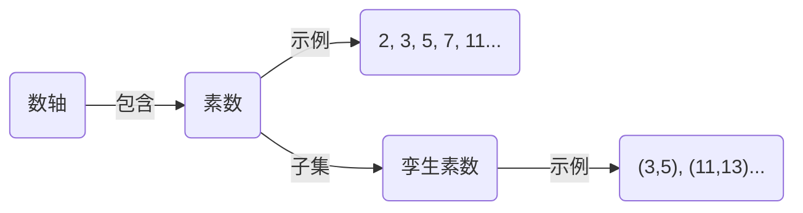
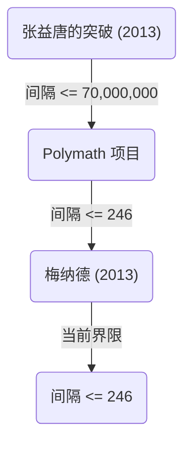

+++
title = "孪生素数猜想（Twin Prime Conjecture） - 差为2的素数对是否无限存在？"
description = "详细解说数学上的未解之谜——孪生素数猜想的历史、部分解答以及最新研究动向。"
slug = "twin-prime-conjecture"
date = "2026-09-24T16:08:36+09:00"
image = "eyecatch.jpg"
categories = ["mathematics"]
tags = ["素数", "数论", "未解之谜"]
+++

素数（Prime Numbers）是数学，特别是数论中最基本且最神秘的对象。除了1和自身之外没有正因数的自然数被称为素数，它们也被称为数的“原子”。关于素数最著名且至今仍未解决的难题之一就是 **孪生素数猜想** （Twin Prime Conjecture）。

本文将深入探讨这个迷人的猜想，从其定义、历史到近年来的突破性进展。

## 1. 什么是孪生素数？

孪生素数（Twin Primes）是指差刚好为2的素数对。例如，以下的素数对属于孪生素数。

- $(3, 5)$
- $(5, 7)$
- $(11, 13)$
- $(17, 19)$
- $(29, 31)$
- $(41, 43)$

根据[素数定理（Prime Number Theorem）](https://kenji.blog/p/prime-number-theorem/)我们知道，随着数字变大，素数本身出现的频率会逐渐降低。随之而来，孪生素数的出现频率也会降低。然而，数学家们自古以来就推测，无论数字变得多大，这种“差为2的素数对”会不会无穷无尽地出现呢？

这就是 **孪生素数猜想** 。

> **孪生素数猜想**
> 差为2的素数对 $(p, p+2)$ 存在无限多对。

用公式表示如下：
$$
\liminf_{n \to \infty} (p_{n+1} - p_n) = 2
$$
这里，$p_n$ 表示第 $n$ 个素数。

## 2. 素数的分布与孪生素数

为了理解素数的分布，我们首先将素数是如何分布的可视化一下。

根据素数定理，小于或等于 $x$ 的素数个数 $\pi(x)$ ，渐近于 $x / \ln(x)$ 。关于孪生素数的个数 $\pi_2(x)$ ，也存在一个被称为哈代-李特尔伍德猜想（第一哈代-李特尔伍德猜想）的更强力的定量猜想。

### 哈代-李特尔伍德猜想

1923年，戈弗雷·哈罗德·哈代和约翰·伊登斯尔·李特尔伍德对孪生素数的渐近分布提出了如下猜想。

$$
\pi_2(x) \sim 2 C_2 \int_2^x \frac{dt}{(\ln t)^2}
$$

这里，$C_2$ 被称为 **孪生素数常数** （Twin Prime Constant），其定义如下：

$$
C_2 = \prod_{p \ge 3} \left( 1 - \frac{1}{(p-1)^2} \right) \approx 0.6601618158...
$$

这个猜想不仅主张孪生素数有无限多个（ $\pi_2(x) \to \infty$ ），还极其准确地预言了它们存在的密度。直到现在的大规模计算机计算结果，都与这个猜想惊人地一致。

## 3. 布伦定理与布伦常数

1919年，挪威数学家维戈·布伦（Viggo Brun）虽然没能证明孪生素数猜想，但他发表了一项突破性的结果。他证明了所有孪生素数的倒数之和是收敛的。

$$
B_2 = \left( \frac{1}{3} + \frac{1}{5} \right) + \left( \frac{1}{5} + \frac{1}{7} \right) + \left( \frac{1}{11} + \frac{1}{13} \right) + \dots
$$

这个收敛值 $B_2$ 被称为 **布伦常数** （Brun's Constant）。根据目前的计算，估计 $B_2 \approx 1.90216058$ 。

所有素数的倒数之和是发散的，这一点已经被[莱昂哈德·欧拉](https://kenji.blog/zh-cn/p/euler/)（[Leonhard Euler](https://kenji.blog/zh-cn/p/euler/)）证明。如果孪生素数猜想是假的，即孪生素数只有有限个，那么作为有限个数字的和自然是收敛的。但是，布伦定理的意义在于：“即使孪生素数有无限多个，它们倒数的和也会收敛，说明它们存在得非常『稀疏』”。这也是使得孪生素数猜想难以解决的因素之一。

## 4. 近年来的突破性进展：张益唐（Yitang Zhang）的突破

长期以来，关于素数间隔的结果一直处于僵局，但在2013年，当时默默无闻的数学家张益唐（Yitang Zhang）发表了一篇震惊世界的论文。

他证明了以下结果：

> **张益唐定理**
> 使得 $p_{n+1} - p_n \le 70,000,000$ 的素数对 $(p_n, p_{n+1})$ 存在无限多对。

也就是说，“差小于或等于7000万的素数对”存在无限多对。虽然7000万这个数字离2还差得很远，但这首次证明了“差小于有限常数的素数对有无限多个”，是一项历史性的壮举。

### Polymath 项目与詹姆斯·梅纳德

在张益唐的结果发表之后，由陶哲轩（Terence Tao）等人主导的在线协作项目“Polymath8”随即启动，开始了一场关于能将这个7000万的上限降低到多少的竞赛。

与此同时，詹姆斯·梅纳德（James Maynard）完全独立地使用了不同的方法（多维塞尔伯格筛法），成功地将上限大幅降低。结合Polymath项目和梅纳德的改进，目前得到了如下结果：

$$
\liminf_{n \to \infty} (p_{n+1} - p_n) \le 246
$$

也就是说，目前已经确定“差小于或等于246的素数对”有无限多个。如果能将这个上限降低到 $2$ ，那么孪生素数猜想将被完全证明。

## 5. 推广与未来展望

孪生素数猜想可以被定位为更一般的 **波利尼亚克猜想** （Polignac's Conjecture）的一个特例（当 $2k = 2$ 时）。

> **波利尼亚克猜想**
> 对于任意正偶数 $2k$ ，差为 $2k$ 的素数对 $(p, p+2k)$ 存在无限多对。

张益唐和梅纳德等人的方法证明了间隔存在有限的上限，但如果仅仅沿着当前方法的方向继续，想要将上限降低到2（即证明孪生素数猜想）被认为存在着被称为“奇偶性问题”（Parity Problem）的原理性障碍。

为了完全解决孪生素数猜想，也许需要一种能够根本上超越现有“筛法（Sieve methods）”的全新数学思想。

## 总结

孪生素数猜想虽然问题本身简单到连小学生都能理解，但却在几个世纪里让无数天才数学家铩羽而归。然而，进入21世纪后，以张益唐的突破为代表，取得了划时代的进展，人类正切实地接近真理。

在由“数的原子”编织的无限宇宙中，孪生素数是否会无尽地延续下去？揭晓这个答案的日子，也许就在我们的有生之年。
