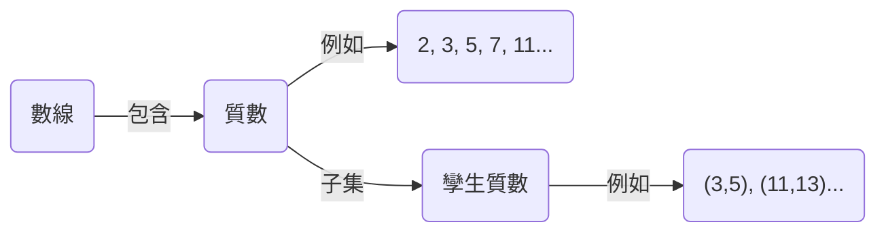
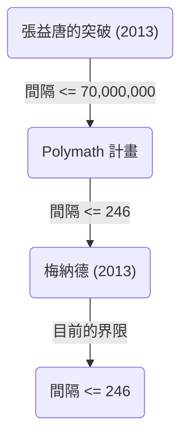

+++
title = "孿生質數猜想（Twin Prime Conjecture） - 差為2的質數對是否無限存在？"
description = "關於數學上未解決的問題——孿生質數猜想，我們將詳細解說其歷史、部分解決方案以及最新研究動向等。"
slug = "twin-prime-conjecture"
date = "2026-09-14T13:04:13+09:00"
image = "eyecatch.jpg"
categories = ["數學"]
tags = ["質數", "數論", "未解決問題"]
+++

質數（Prime Numbers）是數學，尤其是數論中最基本且神祕的對象。除了1和本身以外沒有其他正因數的自然數，質數也被稱為數的「原子」。關於質數最著名、且至今仍未解決的難題之一，就是 **孿生質數猜想** （Twin Prime Conjecture）。

本文將深入探討這個迷人的猜想，從其定義、歷史，到近年來的戲劇性進展進行詳細解說。

## 1. 什麼是孿生質數？

孿生質數（Twin Primes）是指差剛好為2的質數對。例如，以下數對皆屬於孿生質數：

- $(3, 5)$
- $(5, 7)$
- $(11, 13)$
- $(17, 19)$
- $(29, 31)$
- $(41, 43)$

根據質數定理（Prime Number Theorem），我們知道隨著數字變大，質數本身的出現頻率會逐漸降低。隨之而來的是，孿生質數的出現頻率也會減少。然而，無論數字變得多大，這些「差為2的質數對」是否會無窮無盡地出現呢？數學家們自古以來便如此推測。

這就是 **孿生質數猜想** 。

> **孿生質數猜想**
> 差為2的質數對 $(p, p+2)$ 有無限多組。

用公式表示的話，如下所示：
$$
\liminf_{n \to \infty} (p_{n+1} - p_n) = 2
$$
這裡， $p_n$ 表示第 $n$ 個質數。

## 2. 質數的分布與孿生質數

為了解質數的分布，首先讓我們將質數的分布方式視覺化。

根據質數定理，小於或等於 $x$ 的質數個數 $\pi(x)$ ，大約會漸近於 $x / \ln(x)$ 。關於孿生質數的個數 $\pi_2(x)$ ，也存在一個被稱為哈代-李特爾伍德猜想（第一哈代-李特爾伍德猜想）的更強定量猜想。

### 哈代-李特爾伍德猜想

1923年，戈弗雷·哈羅德·哈代與約翰·伊登斯爾·李特爾伍德，對孿生質數的漸近分布提出了以下猜想：

$$
\pi_2(x) \sim 2 C_2 \int_2^x \frac{dt}{(\ln t)^2}
$$

這裡， $C_2$ 被稱為 **孿生質數常數** （Twin Prime Constant），定義如下：

$$
C_2 = \prod_{p \ge 3} \left( 1 - \frac{1}{(p-1)^2} \right) \approx 0.6601618158...
$$

這個猜想不僅僅主張孿生質數無限存在（ $\pi_2(x) \to \infty$ ），更是極其精準地預言了它們存在的密度。至今為止，透過電腦進行的大規模計算結果，與這個猜想驚人地一致。

## 3. 布倫定理與布倫常數

1919年，挪威數學家維戈·布倫雖然未能證明孿生質數猜想，但他發表了劃時代的結果。他證明了所有孿生質數的倒數和是收斂的。

$$
B_2 = \left( \frac{1}{3} + \frac{1}{5} \right) + \left( \frac{1}{5} + \frac{1}{7} \right) + \left( \frac{1}{11} + \frac{1}{13} \right) + \dots
$$

這個收斂值 $B_2$ 被稱為 **布倫常數** （Brun's Constant）。根據目前的計算，推測 $B_2 \approx 1.90216058$ 。

所有質數的倒數和是發散的，這點已被李昂哈德·歐拉所證明。如果孿生質數猜想為假，且孿生質數只有有限個，那麼因為是有限個數的和，自然會收斂。然而，布倫定理的意義在於，「即使孿生質數有無限多個，其倒數和仍然會收斂，這表示它們分布得非常『稀疏』」。這也是使得孿生質數猜想的解決變得極為困難的因素之一。

## 4. 近年的戲劇性進展：張益唐（Yitang Zhang）的重大突破

長久以來，關於質數間隔的結果一直處於膠著狀態。直到2013年，當時默默無聞的數學家張益唐發表了一篇震驚世界的論文。

他證明了以下結果：

> **張氏定理**
> 存在無限多組質數對 $(p_n, p_{n+1})$ ，使得 $p_{n+1} - p_n \le 70,000,000$ 。

也就是說，「差在7000萬以下的質數對」有無限多組。雖然7000萬這個數字距離2還很遙遠，但這是首次證明了「差小於某個有限常數的質數對有無限多個」，這是一項歷史性的壯舉。

### Polymath 計畫與詹姆斯·梅納德

受到張益唐結果的啟發，由陶哲軒等人主導的線上協作計畫「Polymath8」隨之啟動，一場關於能將這個7000萬的上限降低到何種程度的競爭就此展開。

與此同時，詹姆斯·梅納德（James Maynard）完全獨立地使用了不同的方法（多維塞爾伯格篩法），成功將上限大幅降低。結合Polymath計畫與梅納德的改良，目前我們得到了以下結果：

$$
\liminf_{n \to \infty} (p_{n+1} - p_n) \le 246
$$

也就是說，我們已經確定「差在246以下的質數對」有無限多組。如果能將這個上限降至 $2$ ，那麼孿生質數猜想就能被完全證明。

## 5. 推廣與未來展望

孿生質數猜想可以被視為更普遍的 **波利尼亞克猜想** （Polignac's Conjecture）中的一個特例（當 $2k = 2$ 時）。

> **波利尼亞克猜想**
> 對於任意正偶數 $2k$ ，差為 $2k$ 的質數對 $(p, p+2k)$ 有無限多組。

張益唐與梅納德等人的方法雖然證明了間隔有有限的上限，但人們認為，僅靠現有方法的延伸，要將上限降至2（即證明孿生質數猜想），會面臨被稱為「奇偶性問題」（Parity Problem）的原理性障礙。

為了解決孿生質數猜想，我們需要超越現有「篩法」（Sieve methods）的根本性全新數學思想。

## 總結

孿生質數猜想的問題本身簡單到連小學生都能理解，但卻在幾個世紀以來擊退了無數天才數學家的挑戰。然而，進入21世紀後，以張益唐的突破為首的劃時代進展，證明了人類確實正在逼近真理。

在「數的原子」所交織成的無限宇宙中，孿生質數是否會無盡地延續下去？這個答案或許會在我們有生之年揭曉。
