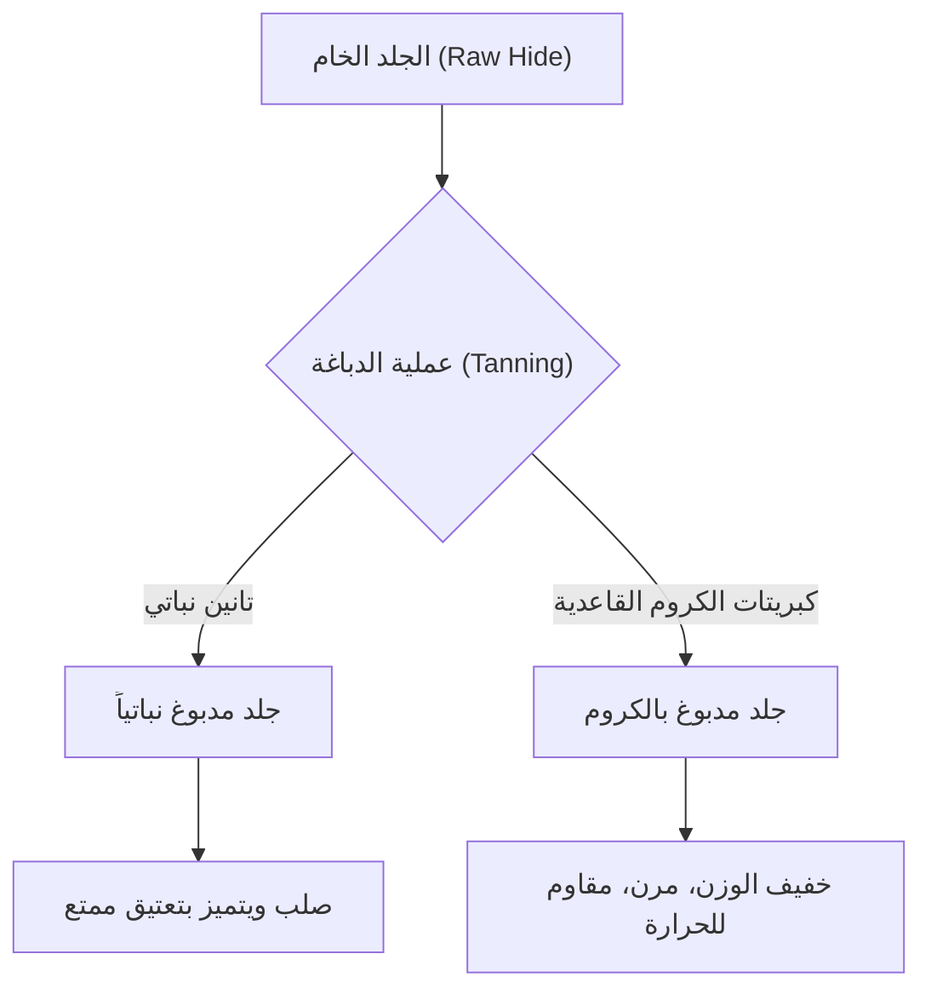

## 1. مقدمة: العلاقة بين تاريخ البشرية والجلود

الجلد هو أحد أقدم المواد التي حصلت عليها البشرية. منذ العصر الحجري القديم، تم تقديره كملابس شتوية وأدوات، ومع تطور الحضارة، أصبحت تقنيات معالجته متطورة للغاية. يمكن القول إن عملية تحويل جلد الحيوان المجرد (Skin/Hide) إلى "جلد" (Leather) لا يتعفن ويتمتع بالمرونة هي فن يتقاطع فيه الكيمياء والفيزياء. في هذا المقال، سنتعمق في أنواع الجلود، وعلم الدباغة، وآليات التعتيق.

## 2. علم الدباغة (Tanning): تحويل الجلد الخام إلى جلد مصنع

تُعرف عملية تحويل "الجلد الخام" إلى "جلد مصنع" باسم "الدباغة". إنها تفاعل كيميائي يثبت بنية ألياف الكولاجين، المكون الرئيسي للجلد، ويمنحه مقاومة للحرارة، ومقاومة للتعفن، ومرونة.

### 2.1 الدباغة النباتية (Vegetable Tanning)

إنها طريقة تصنيع تقليدية تستخدم مركبات البوليفينول (التانين) المستخلصة من النباتات. تشكل جزيئات التانين روابط ببتيدية وهيدروجينية مع الكولاجين لبناء شبكة قوية.
- **المميزات**: تأثيره على البيئة منخفض نسبياً، والتغير مع مرور الزمن (التعتيق) يكون ملحوظاً.
- **الخصائص الفيزيائية**: الألياف تكون مشدودة، والمرونة منخفضة، وقابلية التشكيل ممتازة.

### 2.2 دباغة الكروم (Chrome Tanning)

إنها طريقة تصنيع حديثة تستخدم معقدات معدنية مثل كبريتات الكروم القاعدية. تشكل أيونات الكروم روابط تناسقية (روابط تشابكية) مع مجموعات الكربوكسيل في الكولاجين.
- **المميزات**: وقت الدباغة قصير ومناسب للإنتاج الضخم.
- **الخصائص الفيزيائية**: مقاومة عالية للحرارة (درجة حرارة انكماش الغليان عالية)، وخفيف الوزن ومرن.

## 3. أنواع الجلود وخصائصها

تختلف كثافة ألياف الكولاجين وبنية المسام باختلاف نوع الحيوان، ولكل منها خصائصها الفريدة.

### 3.1 جلد البقر (Bovine Leather)

هو الجلد الأكثر تداولاً وتنوعاً في الاستخدامات. يتم تصنيفه بناءً على العمر والجنس.
- **جلد العجل (Calfskin)**: عجل لا يتجاوز عمره 6 أشهر. الألياف دقيقة للغاية ويعتبر من أعلى المستويات.
- **جلد كيب (Kipskin)**: عجل متوسط العمر يتراوح عمره من 6 أشهر إلى حوالي عامين. أكثر سمكاً ومتانة من جلد العجل.
- **جلد ستيرهيد (Steerhide)**: ثور تم إخصاؤه بين 3 إلى 6 أشهر وتجاوز عمره العامين. يتميز بسمك موحد وتنوع عالٍ في الاستخدام.

### 3.2 جلد الخنزير (Porcine Leather/Pigskin)

هو واحد من المواد الجلدية القليلة التي يمكن الاكتفاء الذاتي منها في اليابان.
- **المميزات**: المسام تخترق من البشرة إلى الجانب الخلفي، مما يجعل التهوية عالية جداً.
- **الاستخدامات**: البطانة الداخلية للأحذية (Lining)، والحقائب الخفيفة، والملابس. مقاوم للاحتكاك ويحافظ على قوته حتى لو كان رقيقاً.

### 3.3 جلد الحصان (Equine Leather)

بالمقارنة مع جلد البقر، تميل كثافة الألياف إلى أن تكون أقل قليلاً، لكن أجزاء معينة تُقدر قيمتها بشكل كبير.
- **كوردوفان (Cordovan)**: يتم استخراجه من طبقة ألياف كولاجين عالية الكثافة تسمى "طبقة كوردوفان" الموجودة داخل جلد ردف الحصان. يُطلق عليه "ماسة الجلود"، ويتميز بلمعان عميق فريد وصلابة عالية (أقوى بعدة مرات من جلد البقر).

### 3.4 الجلود الغريبة (Exotic Leather)

جلود خاصة من الزواحف والطيور وغيرها.
- **جلد التمساح (Crocodile)**: نمط الحراشف المميز (البقع) جميل ويُعتبر رمزاً للمكانة. متين للغاية.
- **جلد النعام (Ostrich)**: جلد النعامة. يتميز بآثار نتف الريش (علامات الريش)، ويجمع بين المرونة والمتانة.

## 4. آليات التعتيق (التغير مع مرور الزمن)

أكبر جاذبية للمنتجات الجلدية تكمن في "التعتيق"، حيث يتغير اللون والملمس مع الاستخدام. ويرجع ذلك أساساً إلى العوامل الكيميائية والفيزيائية التالية:

1. **التفاعلات الكيميائية الضوئية (الأشعة فوق البنفسجية)**: تتسبب الأشعة فوق البنفسجية في ضوء الشمس في أكسدة وبلمرة التانينات الموجودة في الجلد، وتتولد الأصباغ (أساساً الكينونات)، مما يؤدي إلى تركيز اللون.
2. **انتقال الزيوت والأكسدة**: تتغلغل الدهون الموجودة في اليدين وزيوت العناية داخل الجلد، مما يقلل الاحتكاك بين الألياف، وتتأكسد على السطح لتنتج لمعاناً فريداً (باتينا).
3. **الاحتكاك الفيزيائي والتنعيم**: بسبب الاحتكاك اليومي، يتم سحق التعرجات الدقيقة على سطح الجلد ليصبح أملساً، مما يحسن من معدل انعكاس الضوء ويمنحه "بريقاً".

## 5. الخلفية الاقتصادية والاستدامة

تعتبر صناعة الجلود الحديثة أيضاً صناعة إعادة التدوير المطلقة التي تستفيد بشكل فعال من المنتجات الثانوية (By-product) لصناعة اللحوم. في السنوات الأخيرة، تقدمت التحولات التي تراعي الأثر البيئي، مثل تقليل تلوث المياه في عمليات التصنيع (مثل شهادة مجموعة عمل الجلود LWG) وتطوير الجلود النباتية (Vegan leather) المشتقة من النباتات.

المنتجات الجلدية هي ممثل رئيسي لـ "المواد المستدامة" التي يمكن استخدامها لعقود إذا تمت صيانتها بشكل صحيح. من خلال فهم العلم والتاريخ وراءها، ستصبح علاقتنا مع المنتجات الجلدية في الحياة اليومية أكثر ثراءً.
