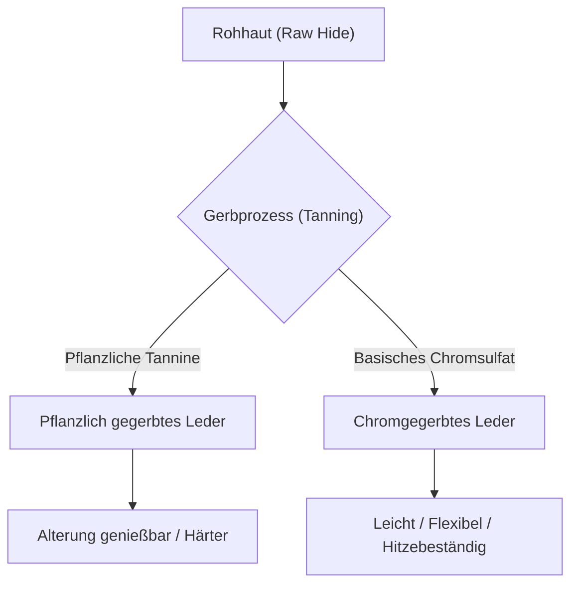

## 1. Einleitung: Die Beziehung zwischen Menschheitsgeschichte und Leder

Leder ist eines der ältesten Materialien, das die Menschheit erworben hat. Seit der Altsteinzeit wurde es als Winterkleidung und Werkzeug geschätzt, und mit der Entwicklung der Zivilisation hat sich auch seine Verarbeitungstechnik weiterentwickelt. Der Prozess, bei dem sich einfache Tierhaut (Skin/Hide) in „Leder (Leather)“ verwandelt, das nicht verrottet und flexibel bleibt, kann als eine Kunst bezeichnet werden, in der sich Chemie und Physik kreuzen. In diesem Artikel werden wir uns eingehend mit den Lederarten, der Wissenschaft des Gerbens und den Mechanismen der Alterung befassen.

## 2. Die Wissenschaft des Gerbens: Die Umwandlung von Haut zu Leder

Der Prozess der Umwandlung von „Haut“ zu „Leder“ wird als „Gerben (Tanning)“ bezeichnet. Es handelt sich um eine chemische Reaktion, die die Struktur der Kollagenfasern, dem Hauptbestandteil der Haut, stabilisiert und ihr Hitzebeständigkeit, Fäulnisbeständigkeit und Flexibilität verleiht.

### 2.1 Pflanzliche Gerbung (Vegetable Tanning)

Ein traditionelles Herstellungsverfahren, bei dem pflanzliche Polyphenolverbindungen (Tannine) verwendet werden. Tanninmoleküle bilden Peptidbindungen und Wasserstoffbrückenbindungen mit dem Kollagen und bauen so ein starkes Netzwerk auf.
- **Eigenschaften**: Die Umweltbelastung ist relativ gering, und die Veränderung im Laufe der Zeit (Alterung/Patina) ist deutlich sichtbar.
- **Physikalische Eigenschaften**: Die Fasern sind dicht, die Elastizität ist gering und es lässt sich hervorragend formen.

### 2.2 Chromgerbung (Chrome Tanning)

Ein modernes Herstellungsverfahren, bei dem Metallkomplexe wie basisches Chromsulfat verwendet werden. Chromionen bilden mit den Carboxylgruppen des Kollagens koordinative Bindungen (Quervernetzungen).
- **Eigenschaften**: Die Gerbzeit ist kurz und eignet sich für die Massenproduktion.
- **Physikalische Eigenschaften**: Hohe Hitzebeständigkeit (hohe Kochschrumpfungstemperatur), flexibel und leicht.

## 3. Lederarten und ihre Eigenschaften

Je nach Tierart unterscheiden sich die Dichte der Kollagenfasern und die Struktur der Poren, was zu jeweils einzigartigen Eigenschaften führt.

### 3.1 Rindsleder (Bovine Leather)

Das am weitesten verbreitete und vielseitigste Leder. Es wird nach Alter und Geschlecht klassifiziert.
- **Kalbsleder (Calfskin)**: Kälber bis zu 6 Monaten. Die Fasern sind extrem fein und es gilt als die höchste Qualität.
- **Kip-Leder (Kipskin)**: Jungrinder von etwa 6 Monaten bis 2 Jahren. Dicker und strapazierfähiger als Kalbsleder.
- **Ochsenleder (Steerhide)**: Männliche Rinder, die zwischen 3 und 6 Monaten kastriert wurden und über 2 Jahre alt sind. Die Dicke ist gleichmäßig und es ist sehr vielseitig.

### 3.2 Schweinsleder (Porcine Leather / Pigskin)

Eines der wenigen Ledermaterialien, das in Japan selbst versorgt werden kann.
- **Eigenschaften**: Da die Poren von der Epidermis bis zur Rückseite durchdringen, ist es sehr atmungsaktiv.
- **Verwendung**: Schuhfutter (Lining), leichte Taschen und Kleidung. Es ist abriebfest und behält auch im dünnen Zustand seine Festigkeit.

### 3.3 Pferdeder (Equine Leather)

Obwohl die Faserdichte tendenziell etwas geringer ist als bei Rindsleder, werden bestimmte Teile sehr geschätzt.
- **Cordovan**: Eine hochdichte Kollagenfaserschicht, die „Cordovan-Schicht“ genannt wird und aus dem Inneren der Haut des Pferdehinterns herausgeschnitten wird. Es wird als „Diamant des Leders“ bezeichnet und hat einen einzigartigen, tiefen Glanz sowie eine hohe Härte (ein Vielfaches der Festigkeit von Rindsleder).

### 3.4 Exotisches Leder (Exotic Leather)

Spezielle Leder von Reptilien, Vögeln usw.
- **Krokodilleder (Crocodile)**: Das einzigartige Schuppenmuster ist wunderschön und gilt als Statussymbol. Es ist extrem langlebig.
- **Straußenleder (Ostrich)**: Leder vom Strauß. Charakteristisch sind die Spuren der gezupften Federn (Quill Marks), und es vereint Flexibilität mit Zähigkeit.

## 4. Mechanismen der Alterung (Patina)

Der größte Reiz von Lederprodukten liegt in der „Alterung“, bei der sich Farbe und Textur durch Gebrauch verändern. Dies ist hauptsächlich auf die folgenden chemischen und physikalischen Faktoren zurückzuführen.

1. **Photochemische Reaktion (UV-Strahlen)**: Durch die UV-Strahlen des Sonnenlichts oxidieren und polymerisieren die im Leder enthaltenen Tannine, wodurch Pigmente (hauptsächlich Chinone) entstehen, die die Farbe intensivieren.
2. **Migration und Oxidation von Ölen**: Talg von den Händen oder Pflegeöl dringt in das Innere des Leders ein, verringert die Reibung zwischen den Fasern und oxidiert an der Oberfläche, wodurch ein einzigartiger Glanz (Patina) entsteht.
3. **Physikalische Reibung und Glättung**: Durch tägliche Reibung werden die feinen Unebenheiten auf der Lederoberfläche zerdrückt und geglättet, was den Lichtreflexionsgrad verbessert und einen „Glanz“ erzeugt.

## 5. Wirtschaftlicher Hintergrund und Nachhaltigkeit

Die moderne Lederindustrie ist auch die ultimative Recyclingindustrie, die tierische Nebenprodukte (By-products) aus der Fleischindustrie effektiv nutzt. In den letzten Jahren gab es umweltbewusste Veränderungen, wie die Verringerung der Wasserverschmutzung im Herstellungsprozess (z. B. LWG-Zertifizierung) und die Entwicklung von veganem Leder auf pflanzlicher Basis.

Lederprodukte sind das Paradebeispiel für „nachhaltige Materialien“, die bei richtiger Pflege über Jahrzehnte hinweg verwendet werden können. Durch das Verständnis der Wissenschaft und Geschichte dahinter wird unser Umgang mit Lederprodukten im täglichen Leben noch reicher werden.
