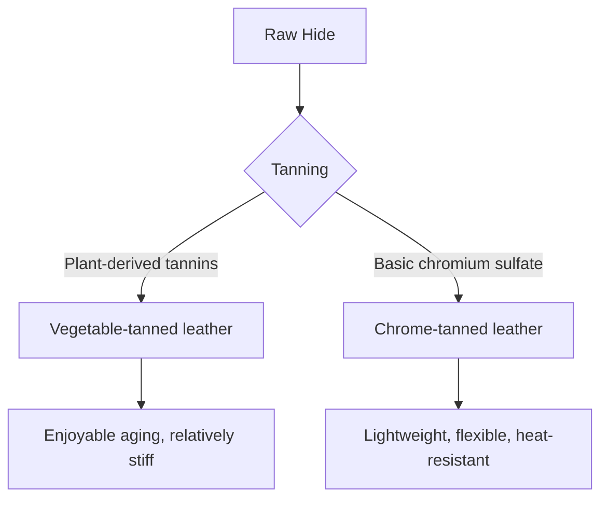

## 1. Introduction: The Relationship Between Human History and Leather

Leather is one of the oldest materials acquired by humanity. Highly valued since the Paleolithic era for cold-weather clothing and tools, its processing techniques have become highly advanced along with the development of civilization. The process of transforming a mere animal skin/hide into "Leather," which does not rot and has flexibility, can be called an art where chemistry and physics intersect. In this article, we will delve deeply into the types of leather, the science of tanning, and the mechanisms of aging.

## 2. The Science of Tanning: Converting Hide to Leather

The process of turning "hide" into "leather" is called "Tanning." It is a chemical reaction that stabilizes the structure of collagen fibers, which are the main component of the hide, imparting heat resistance, preservation, and flexibility.

### 2.1 Vegetable Tanning

A traditional manufacturing method that uses plant-derived polyphenol compounds (tannins). Tannin molecules form hydrogen bonds with the peptide bonds of collagen, building a strong network.
- **Characteristics**: Relatively low environmental impact, noticeable aging over time.
- **Physical Properties**: The fibers are tight, elasticity is low, and moldability is excellent.

### 2.2 Chrome Tanning

A modern manufacturing method that uses metal complexes such as basic chromium sulfate. Chromium ions form coordinate bonds (cross-links) with the carboxyl groups of collagen.
- **Characteristics**: Short tanning time, suitable for mass production.
- **Physical Properties**: High heat resistance (high boiling water shrinkage temperature), flexible, and lightweight.

## 3. Types and Characteristics of Leather

Depending on the animal species, the density of collagen fibers and the pore structure differ, each having unique properties.

### 3.1 Bovine Leather

The most commonly distributed and versatile leather. It is classified by age and sex.
- **Calfskin**: Calves up to 6 months old. The fibers are extremely fine, and it is considered the highest quality.
- **Kipskin**: Medium-sized cattle from 6 months to about 2 years old. Thicker and more durable than calfskin.
- **Steerhide**: Male cattle castrated between 3 and 6 months and raised for over 2 years. Uniform thickness and highly versatile.

### 3.2 Porcine Leather (Pigskin)

One of the few leather materials that can be self-supplied domestically in Japan.
- **Characteristics**: Because the pores penetrate from the epidermis to the back, it is highly breathable.
- **Uses**: Shoe linings, lightweight bags, and clothing. Resistant to friction and maintains strength even when thin.

### 3.3 Equine Leather

While the fiber density tends to be slightly lower compared to bovine leather, specific parts are highly prized.
- **Cordovan**: Carved out from a high-density collagen fiber layer called the "cordovan layer" inside the hide of a horse's buttocks. Known as the "diamond of leather," it has a unique deep luster and high hardness (several times the strength of cowhide).

### 3.4 Exotic Leather

Special leathers such as those from reptiles and birds.
- **Crocodile**: The unique scale pattern is beautiful and considered a status symbol. Highly durable.
- **Ostrich**: Ostrich leather. Characterized by the marks left after feathers are plucked (quill marks), combining flexibility and toughness.

## 4. Mechanisms of Aging

The greatest appeal of leather products lies in "aging," where the color and texture change with use. This is primarily due to the following chemical and physical factors.

1. **Photochemical Reactions (UV rays)**: Ultraviolet rays from sunlight cause the tannins in the leather to oxidize and polymerize, generating pigments (mainly quinones) and concentrating the color.
2. **Oil Migration and Oxidation**: Sebum from hands and care oils penetrate into the leather, reducing friction between fibers and oxidizing on the surface to create a unique luster (patina).
3. **Physical Friction and Smoothing**: Daily friction crushes the fine unevenness on the leather surface, making it smooth. The increased light reflectance produces a "shine".

## 5. Economic Background and Sustainability

The modern leather industry is also an ultimate recycling industry that effectively utilizes by-products from the meat industry. In recent years, transformations mindful of environmental impact have been progressing, such as reducing water pollution in the manufacturing process (LWG certification, etc.) and developing plant-derived vegan leathers.

Leather products are a prime example of "sustainable materials" that can be used for decades with proper maintenance. Understanding the science and history behind them will likely enrich how you interact with leather products in your daily life.
