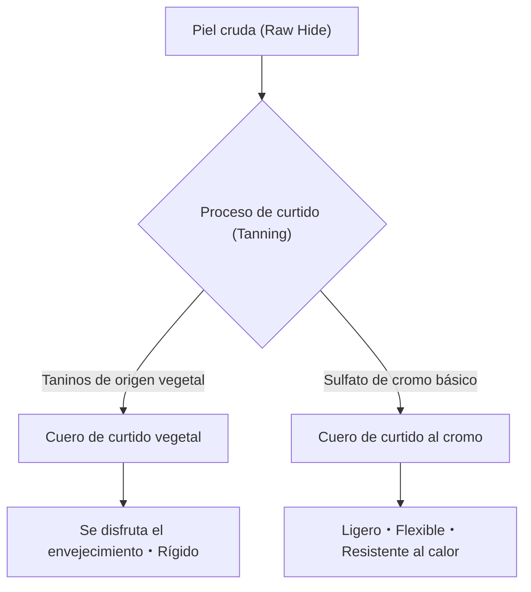

## 1. Introducción: La relación entre la historia de la humanidad y el cuero

El cuero es uno de los materiales más antiguos obtenidos por la humanidad. Desde el Paleolítico, ha sido valorado como ropa de abrigo y herramienta, y con el desarrollo de la civilización, su tecnología de procesamiento se ha sofisticado. El proceso por el cual una simple piel de animal (Skin/Hide) se transforma en "cuero (Leather)", que no se pudre y posee flexibilidad, puede considerarse un arte donde se cruzan la química y la física. En este artículo, profundizaremos en los tipos de cuero, la ciencia del curtido y el mecanismo de envejecimiento.

## 2. La ciencia del curtido: la transformación de piel a cuero

El proceso de convertir "piel" en "cuero" se llama "curtido (Tanning)". Es una reacción química que estabiliza la estructura de las fibras de colágeno, el componente principal de la piel, y le confiere resistencia al calor, propiedades anticorrosivas y flexibilidad.

### 2.1 Curtido vegetal (Vegetable Tanning)

Es un método de producción tradicional que utiliza compuestos polifenólicos de origen vegetal (taninos). Las moléculas de tanino forman puentes de hidrógeno con los enlaces peptídicos del colágeno, construyendo una red robusta.
- **Características**: El impacto ambiental es relativamente bajo y el cambio a lo largo del tiempo (envejecimiento) es notable.
- **Propiedades físicas**: Las fibras son apretadas, de baja elasticidad y excelente moldeabilidad.

### 2.2 Curtido al cromo (Chrome Tanning)

Es un método de producción moderno que utiliza complejos metálicos como el sulfato de cromo básico. Los iones de cromo forman enlaces de coordinación (enlaces cruzados) con los grupos carboxilo del colágeno.
- **Características**: El tiempo de curtido es corto y es adecuado para la producción en masa.
- **Propiedades físicas**: Alta resistencia al calor (alta temperatura de contracción en agua hirviendo), flexible y ligero.

## 3. Tipos y características del cuero

Dependiendo de la especie animal, la densidad de las fibras de colágeno y la estructura de los poros varían, teniendo cada una sus propias características.

### 3.1 Cuero bovino (Bovine Leather)

Es el cuero más distribuido comúnmente y tiene una amplia gama de usos. Se clasifica según la edad y el sexo.
- **Becerro (Calfskin)**: Ternero de menos de 6 meses de edad. Las fibras son extremadamente finas y se considera de la más alta calidad.
- **Kip (Kipskin)**: Bovino joven de aproximadamente 6 meses a 2 años de edad. Es más grueso y resistente que el becerro.
- **Novillo (Steerhide)**: Toro castrado entre los 3 y 6 meses de edad y con más de 2 años. El grosor es uniforme y altamente versátil.

### 3.2 Cuero porcino (Porcine Leather/Pigskin)

Es uno de los pocos materiales de cuero que pueden autoabastecerse dentro de Japón.
- **Características**: Como los poros penetran desde la epidermis hasta el reverso, la transpirabilidad es muy alta.
- **Usos**: Forros de zapatos (lining), bolsos ligeros y ropa. Es resistente a la fricción y mantiene su fuerza incluso siendo delgado.

### 3.3 Cuero equino (Equine Leather)

En comparación con el cuero bovino, la densidad de la fibra tiende a ser un poco más baja, pero ciertas partes son muy valoradas.
- **Cordobán (Cordovan)**: Es la capa de fibras de colágeno de alta densidad llamada "capa de cordobán" que se encuentra en el interior de la piel de las nalgas (grupa) del caballo. Conocido como el "diamante del cuero", tiene un brillo profundo único y alta dureza (varias veces la fuerza del cuero bovino).

### 3.4 Cueros exóticos (Exotic Leather)

Son cueros especiales de reptiles, aves, etc.
- **Cocodrilo (Crocodile)**: El patrón de escamas único (marcas) es hermoso y se considera un símbolo de estatus. Altamente duradero.
- **Avestruz (Ostrich)**: Piel de avestruz. Se caracteriza por las marcas de donde se han arrancado las plumas (quill marks) y combina flexibilidad con dureza.

## 4. El mecanismo del envejecimiento (pátina)

El mayor atractivo de los productos de cuero reside en el "envejecimiento", donde el color y la textura cambian con el uso. Esto se debe principalmente a los siguientes factores químicos y físicos:

1. **Reacción fotoquímica (rayos ultravioleta)**: Debido a los rayos ultravioleta de la luz solar, los taninos contenidos en el cuero se oxidan y polimerizan, concentrando el color mediante la generación de pigmentos (principalmente quinonas).
2. **Transferencia de aceites y oxidación**: El sebo de las manos y los aceites de cuidado penetran en el interior del cuero, reduciendo la fricción entre las fibras, al tiempo que se oxidan en la superficie para crear un brillo único (pátina).
3. **Fricción física y alisado**: Por la fricción diaria, las micro-irregularidades de la superficie del cuero se aplastan y alisan, mejorando la reflectancia de la luz y produciendo un "brillo".

## 5. Antecedentes económicos y sostenibilidad

La industria del cuero moderna es también la industria del reciclaje definitiva, haciendo un uso efectivo de los subproductos (by-products) de la industria cárnica. En los últimos años, ha habido una transformación consciente del impacto ambiental, como la reducción de la contaminación del agua en el proceso de fabricación (certificación LWG, etc.) y el desarrollo de cuero vegano de origen vegetal.

Los productos de cuero son representativos de un "material sostenible" que puede utilizarse durante décadas si se les da el mantenimiento adecuado. Al comprender la ciencia y la historia detrás de ellos, la forma en que interactuamos con los productos de cuero en nuestra vida diaria será aún más enriquecedora.
