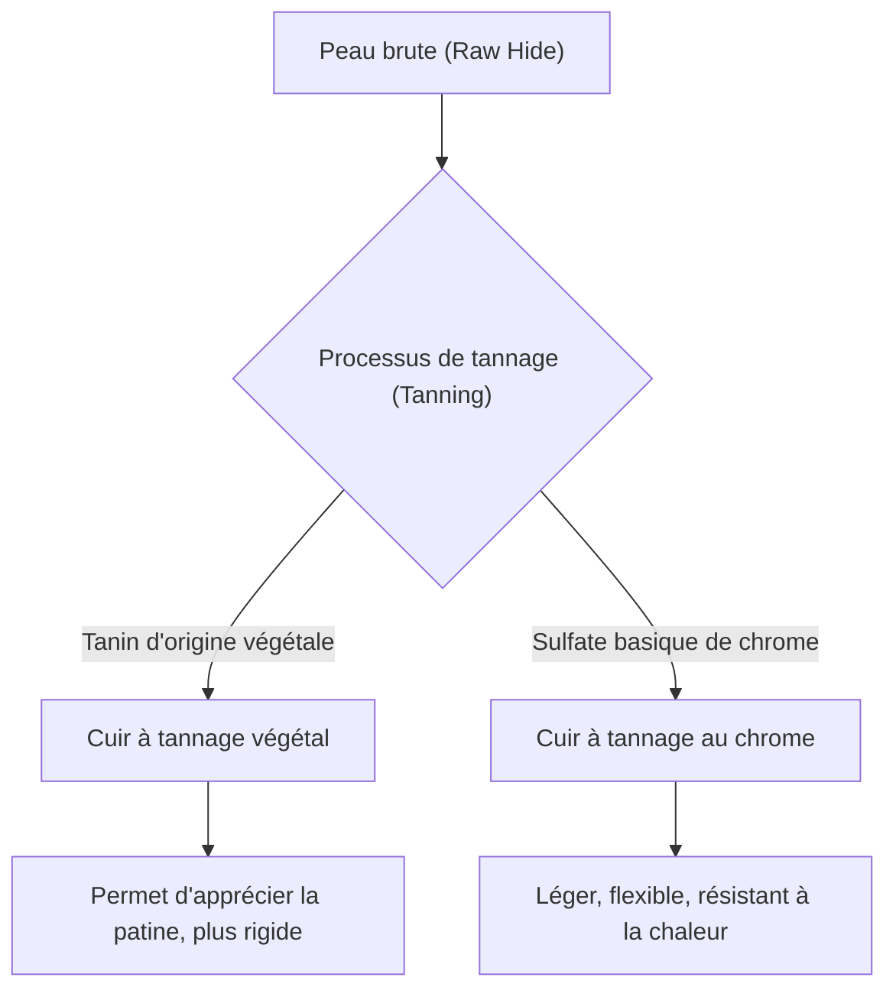

## 1. Introduction : L'histoire humaine et la relation avec le cuir

Le cuir est l'un des plus anciens matériaux obtenus par l'humanité. Depuis le Paléolithique, il est apprécié comme vêtement d'hiver et outil, et avec le développement de la civilisation, ses techniques de traitement se sont perfectionnées. Le processus par lequel une simple peau d'animal (Skin/Hide) se transforme en "cuir (Leather)" flexible et imputrescible peut être considéré comme un art où la chimie croise la physique. Cet article explore en profondeur les types de cuir, la science du tannage et les mécanismes du vieillissement (patine).

## 2. La science du tannage : La transformation de la peau en cuir

Le processus de transformation de la "peau" en "cuir" est appelé "tannage (Tanning)". Il s'agit d'une réaction chimique qui stabilise la structure des fibres de collagène, principal composant de la peau, et lui confère résistance à la chaleur, propriétés antiseptiques et flexibilité.

### 2.1 Tannage végétal (Vegetable Tanning)

C'est une méthode de fabrication traditionnelle utilisant des composés polyphénoliques (tanins) d'origine végétale. Les molécules de tanin forment des liaisons hydrogène et peptidiques avec le collagène, construisant un réseau solide.
- **Caractéristiques** : Impact environnemental relativement faible, vieillissement (patine) remarquable.
- **Propriétés physiques** : Fibres serrées, faible élasticité, excellente malléabilité.

### 2.2 Tannage au chrome (Chrome Tanning)

C'est une méthode de fabrication moderne utilisant des complexes métalliques tels que le sulfate basique de chrome. Les ions chrome forment des liaisons de coordination (réticulations) avec les groupes carboxyle du collagène.
- **Caractéristiques** : Temps de tannage court, adapté à la production de masse.
- **Propriétés physiques** : Haute résistance à la chaleur (température de rétrécissement dans l'eau bouillante élevée), flexible et léger.

## 3. Types de cuirs et caractéristiques

Selon l'espèce animale, la densité des fibres de collagène et la structure des pores varient, conférant à chacun des caractéristiques uniques.

### 3.1 Cuir de vache (Bovine Leather)

C'est le cuir le plus couramment distribué et le plus polyvalent. Il est classé selon l'âge et le sexe.
- **Veau (Calfskin)** : Veau de moins de 6 mois. Les fibres sont extrêmement fines, considéré comme la plus haute qualité.
- **Kip (Kipskin)** : Bovin moyen de 6 mois à environ 2 ans. Plus épais et plus résistant que le veau.
- **Bouvillons (Steerhide)** : Bœuf castré entre 3 et 6 mois et âgé de plus de 2 ans. Épaisseur uniforme et grande polyvalence.

### 3.2 Cuir de porc (Porcine Leather/Pigskin)

C'est l'un des rares matériaux en cuir pouvant être auto-approvisionné au Japon.
- **Caractéristiques** : Les pores traversant l'épiderme jusqu'à l'envers, il est très respirant.
- **Utilisations** : Doublure de chaussures (lining), sacs légers et vêtements. Très résistant au frottement, il conserve sa solidité même en étant fin.

### 3.3 Cuir de cheval (Equine Leather)

La densité des fibres a tendance à être légèrement inférieure à celle du cuir de vache, mais certaines parties sont très appréciées.
- **Cordovan (Cordovan)** : Obtenu par l'extraction de la couche de fibres de collagène à haute densité appelée "couche de cordovan", située à l'intérieur de la peau de la croupe du cheval. Surnommé le "diamant du cuir", il possède un éclat profond unique et une grande dureté (plusieurs fois la résistance du cuir de vache).

### 3.4 Cuirs exotiques (Exotic Leather)

Il s'agit de cuirs spéciaux tels que les reptiles et les oiseaux.
- **Crocodile (Crocodile)** : Ses magnifiques motifs d'écailles uniques en font un symbole de statut. Très durable.
- **Autruche (Ostrich)** : Cuir d'autruche. Caractérisé par les marques laissées par les plumes arrachées (quill marks), il allie flexibilité et robustesse.

## 4. Mécanismes du vieillissement (patine)

Le plus grand attrait des produits en cuir réside dans le "vieillissement", où la couleur et la texture changent à l'usage. Cela est principalement dû aux facteurs chimiques et physiques suivants.

1. **Réactions photochimiques (Rayons UV)** : Sous l'effet des rayons ultraviolets du soleil, les tanins contenus dans le cuir s'oxydent et se polymérisent, produisant des pigments (principalement des quinones) qui assombrissent la couleur.
2. **Transfert et oxydation des graisses** : Le sébum des mains et l'huile de soin pénètrent à l'intérieur du cuir, réduisant la friction entre les fibres tout en s'oxydant en surface pour créer un éclat unique (patine).
3. **Frottement physique et lissage** : Les frottements quotidiens écrasent les minuscules irrégularités de la surface du cuir, la rendant lisse et améliorant le taux de réflexion de la lumière pour donner un aspect "lustré".

## 5. Contexte économique et durabilité

L'industrie moderne du cuir est également l'industrie du recyclage par excellence, qui utilise efficacement les sous-produits (By-products) de l'industrie de la viande. Ces dernières années, des changements ont été initiés en tenant compte de l'impact environnemental, comme la réduction de la pollution de l'eau dans le processus de fabrication (certification LWG, etc.) et le développement de cuirs vegan d'origine végétale.

Les articles en cuir sont des exemples représentatifs de "matériaux durables" qui, avec un entretien approprié, peuvent être utilisés pendant des décennies. Comprendre la science et l'histoire qui les sous-tendent enrichira sans aucun doute notre relation quotidienne avec les produits en cuir.
