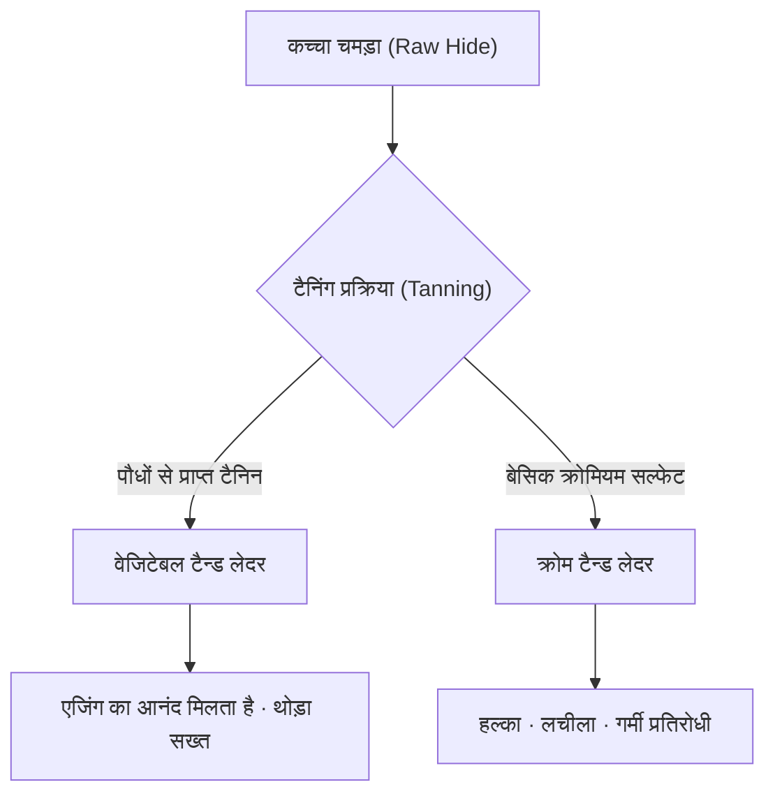

## 1. परिचय: मानव इतिहास और चमड़े का संबंध

चमड़ा (Leather) मानव द्वारा प्राप्त की गई सबसे पुरानी सामग्रियों में से एक है। पुरापाषाण काल से ही इसे सर्दियों के कपड़ों और औजारों के रूप में महत्वपूर्ण माना गया है, और सभ्यता के विकास के साथ इसकी प्रसंस्करण तकनीक अत्यधिक उन्नत हो गई है। मात्र जानवरों की त्वचा (Skin/Hide) का, बिना सड़े लचीलापन रखने वाले "चमड़े (Leather)" में बदलने की यह प्रक्रिया रसायन विज्ञान और भौतिकी के मिलन से बनी एक कला कही जा सकती है। इस लेख में, हम चमड़े के प्रकारों, टैनिंग के विज्ञान और एजिंग (उम्र बढ़ने के साथ बदलाव) के तंत्र की गहराई से पड़ताल करेंगे।

## 2. टैनिंग (Tanning) का विज्ञान: त्वचा से चमड़े में परिवर्तन

"त्वचा" को "चमड़े" में बदलने की प्रक्रिया को "टैनिंग (Tanning)" कहा जाता है। यह एक रासायनिक प्रतिक्रिया है जो त्वचा के मुख्य घटक, कोलेजन फाइबर की संरचना को स्थिर करती है, और गर्मी प्रतिरोधक क्षमता, सड़न प्रतिरोधक क्षमता और लचीलापन प्रदान करती है।

### 2.1 वेजिटेबल टैनिंग (Vegetable Tanning)

यह पौधों से प्राप्त पॉलीफेनोल यौगिकों (टैनिन) का उपयोग करने वाली एक पारंपरिक निर्माण विधि है। टैनिन अणु कोलेजन के पेप्टाइड बॉन्ड के साथ हाइड्रोजन बॉन्ड बनाते हैं, जिससे एक मजबूत नेटवर्क तैयार होता है।
- **विशेषताएं**: पर्यावरण पर इसका प्रभाव अपेक्षाकृत कम होता है, और समय के साथ बदलाव (एजिंग) स्पष्ट रूप से दिखाई देता है।
- **भौतिक गुण**: इसके फाइबर कड़े होते हैं, लचीलापन (खिंचाव) कम होता है, और यह आकार देने (Molding) के लिए उत्कृष्ट होता है।

### 2.2 क्रोम टैनिंग (Chrome Tanning)

यह बेसिक क्रोमियम सल्फेट जैसे मेटल कॉम्प्लेक्स (धातु परिसरों) का उपयोग करने वाली एक आधुनिक निर्माण विधि है। क्रोमियम आयन कोलेजन के कार्बोक्सिल समूहों के साथ कोऑर्डिनेट बॉन्ड (क्रॉसलिंकिंग) बनाते हैं।
- **विशेषताएं**: टैनिंग का समय कम होता है, जो इसे बड़े पैमाने पर उत्पादन के लिए उपयुक्त बनाता है।
- **भौतिक गुण**: उच्च ताप प्रतिरोध (उबलते पानी में सिकुड़ने का तापमान अधिक होता है), हल्का और लचीला।

## 3. चमड़े के प्रकार और विशेषताएं

जानवर की प्रजाति के आधार पर कोलेजन फाइबर का घनत्व और रोमछिद्रों (pores) की संरचना भिन्न होती है, जिससे हर एक की अपनी अनूठी विशेषताएं होती हैं।

### 3.1 गाय का चमड़ा (Bovine Leather)

यह सबसे आम और व्यापक रूप से इस्तेमाल किया जाने वाला चमड़ा है। इसे उम्र और लिंग के आधार पर वर्गीकृत किया जाता है।
- **काफ (Calfskin)**: 6 महीने से कम उम्र के बछड़े का चमड़ा। इसके फाइबर बेहद महीन होते हैं और इसे उच्चतम गुणवत्ता का माना जाता है।
- **किप (Kipskin)**: 6 महीने से 2 साल तक की उम्र के युवा जानवर का चमड़ा। काफ की तुलना में मोटा और अधिक मजबूत होता है।
- **स्टीयरहाइड (Steerhide)**: 3 से 6 महीने की उम्र में बधिया किए गए और 2 साल से अधिक उम्र के नर जानवर का चमड़ा। इसकी मोटाई समान होती है और यह अत्यधिक बहुमुखी है।

### 3.2 सुअर का चमड़ा (Porcine Leather/Pigskin)

यह जापान में घरेलू रूप से आत्मनिर्भर चमड़े की कुछ सामग्रियों में से एक है।
- **विशेषताएं**: रोमछिद्र बाहरी सतह (epidermis) से लेकर भीतरी सतह तक आर-पार होते हैं, जिसके कारण इसकी वायु पारगम्यता (सांस लेने की क्षमता) बहुत अधिक होती है।
- **उपयोग**: जूतों की अंदरूनी परत (lining), हल्के बैग और कपड़े। यह घर्षण के प्रति प्रतिरोधी है और पतला होने पर भी मजबूती बनाए रखता है।

### 3.3 घोड़े का चमड़ा (Equine Leather)

गाय के चमड़े की तुलना में इसके फाइबर का घनत्व थोड़ा कम होता है, लेकिन इसके विशिष्ट हिस्सों को अत्यधिक मूल्यवान माना जाता है।
- **कॉर्डोवन (Cordovan)**: घोड़े के पिछले हिस्से (rump) की त्वचा के अंदर मौजूद उच्च घनत्व वाले कोलेजन फाइबर की परत को खुरच कर निकाला जाता है, जिसे "कॉर्डोवन परत" कहा जाता है। इसे "चमड़े का हीरा" भी कहा जाता है, और इसमें एक अनूठी गहरी चमक और उच्च कठोरता (गाय के चमड़े से कई गुना अधिक मजबूत) होती है।

### 3.4 एक्सोटिक लेदर (Exotic Leather)

यह सरीसृप (reptiles) और पक्षियों जैसे विशेष जानवरों का चमड़ा है।
- **मगरमच्छ (Crocodile)**: इसके अद्वितीय शल्क पैटर्न (scales) सुंदर होते हैं और इसे स्टेटस सिंबल माना जाता है। यह अत्यधिक टिकाऊ होता है।
- **शुतुरमुर्ग (Ostrich)**: शुतुरमुर्ग का चमड़ा। पंख उखाड़े जाने के निशान (quill marks) इसकी विशेषता हैं, और यह लचीलापन और मजबूती दोनों को जोड़ता है।

## 4. एजिंग (समय के साथ बदलाव) का तंत्र

चमड़े के उत्पादों का सबसे बड़ा आकर्षण "एजिंग" है, जहां उपयोग के साथ उनका रंग और बनावट बदल जाती है। यह मुख्य रूप से निम्नलिखित रासायनिक और भौतिक कारकों के कारण होता है।

1. **फोटोकैमिकल रिएक्शन (पराबैंगनी किरणें)**: सूरज की यूवी किरणों के कारण चमड़े में मौजूद टैनिन ऑक्सीकृत और पॉलीमराइज़ हो जाते हैं, जिससे पिगमेंट (मुख्य रूप से क्विनोन) बनते हैं जो रंग को गहरा करते हैं।
2. **तेल का स्थानांतरण और ऑक्सीकरण**: हाथों से प्राकृतिक तेल (sebum) और देखभाल करने वाले तेल चमड़े के अंदर प्रवेश करते हैं, जिससे फाइबर के बीच घर्षण कम होता है, और साथ ही सतह पर ऑक्सीकृत होकर एक अनूठी चमक (पैटिना) पैदा करते हैं।
3. **भौतिक घर्षण और स्मूथनिंग**: रोज़मर्रा के उपयोग से घर्षण के कारण चमड़े की सतह के सूक्ष्म उभार दबकर चिकने हो जाते हैं, जिससे प्रकाश का परावर्तन बढ़ जाता है और "चमक" दिखाई देती है।

## 5. आर्थिक पृष्ठभूमि और सस्टेनेबिलिटी (स्थिरता)

आधुनिक चमड़ा उद्योग एक बेहतरीन रीसाइक्लिंग उद्योग भी है जो मांस उद्योग के उपोत्पादों (By-products) का प्रभावी ढंग से उपयोग करता है। हाल के वर्षों में, पर्यावरण पर पड़ने वाले प्रभाव को ध्यान में रखते हुए बदलाव किए जा रहे हैं, जैसे कि निर्माण प्रक्रिया के दौरान जल प्रदूषण को कम करना (जैसे LWG प्रमाणीकरण) और पौधों पर आधारित वीगन लेदर (vegan leather) का विकास।

चमड़े के उत्पाद "टिकाऊ सामग्रियों (sustainable materials)" के प्रमुख उदाहरण हैं, जिनका उचित रखरखाव किए जाने पर दशकों तक उपयोग किया जा सकता है। इसके पीछे के विज्ञान और इतिहास को समझने से, हमारे रोज़मर्रा के जीवन में चमड़े के उत्पादों के साथ हमारा संबंध और भी अधिक समृद्ध होगा।
