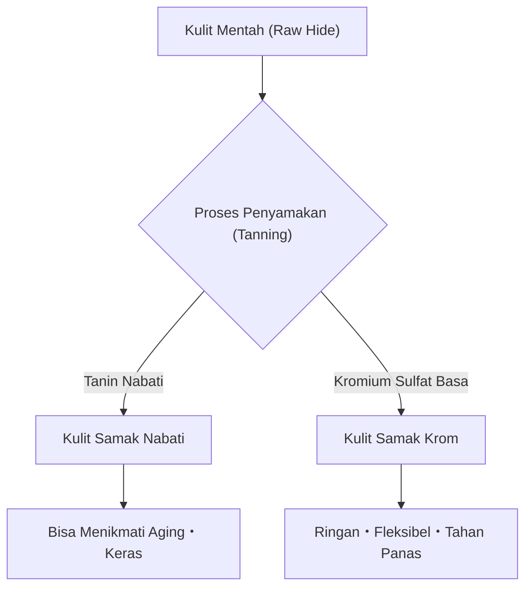

## 1. Pendahuluan: Hubungan antara Sejarah Manusia dan Kulit

Kulit (leather) adalah salah satu bahan tertua yang diperoleh umat manusia. Sejak zaman Paleolitikum, kulit telah dihargai sebagai pakaian pelindung dari cuaca dingin dan sebagai alat, dan seiring dengan perkembangan peradaban, teknologi pemrosesannya menjadi semakin canggih. Proses di mana kulit hewan biasa (Skin/Hide) yang dapat membusuk berubah menjadi "Kulit (Leather)" yang tidak membusuk dan fleksibel dapat dikatakan sebagai seni di mana kimia dan fisika bersilangan. Artikel ini akan membahas secara mendalam tentang jenis-jenis kulit, ilmu penyamakan, dan mekanisme penuaan (aging).

## 2. Ilmu Penyamakan (Tanning): Mengubah Kulit Hewan Menjadi Kulit (Leather)

Proses mengubah "kulit hewan (hide/skin)" menjadi "kulit (leather)" disebut "penyamakan (tanning)". Ini adalah reaksi kimia yang menstabilkan struktur serat kolagen, yang merupakan komponen utama kulit, dan memberikan ketahanan terhadap panas, ketahanan terhadap pembusukan, serta fleksibilitas.

### 2.1 Penyamakan Nabati (Vegetable Tanning)

Ini adalah metode produksi tradisional yang menggunakan senyawa polifenol (tanin) yang berasal dari tumbuhan. Molekul tanin membentuk ikatan hidrogen dengan ikatan peptida kolagen, membangun jaringan yang kuat.
- **Karakteristik**: Dampak lingkungannya relatif rendah, dan perubahan seiring berjalannya waktu (aging) sangat terlihat jelas.
- **Sifat Fisik**: Seratnya kencang, elastisitasnya rendah, dan kemampuan cetaknya sangat baik.

### 2.2 Penyamakan Krom (Chrome Tanning)

Ini adalah metode produksi modern yang menggunakan kompleks logam seperti kromium sulfat basa. Ion kromium membentuk ikatan koordinasi (ikatan silang) dengan gugus karboksil kolagen.
- **Karakteristik**: Waktu penyamakannya singkat dan cocok untuk produksi massal.
- **Sifat Fisik**: Ketahanan panas tinggi (suhu penyusutan air mendidih tinggi), fleksibel, dan ringan.

## 3. Jenis dan Karakteristik Kulit

Tergantung pada jenis hewannya, kepadatan serat kolagen dan struktur pori-porinya berbeda, dan masing-masing memiliki karakteristik uniknya sendiri.

### 3.1 Kulit Sapi (Bovine Leather)

Ini adalah kulit yang paling umum didistribusikan dan memiliki berbagai kegunaan. Diklasifikasikan berdasarkan usia (dalam bulan) dan jenis kelamin.
- **Calfskin**: Anak sapi berusia di bawah 6 bulan. Seratnya sangat halus dan dianggap sebagai kualitas tertinggi.
- **Kipskin**: Sapi muda yang berusia antara 6 bulan hingga 2 tahun. Lebih tebal dan lebih kuat dari calfskin.
- **Steerhide**: Sapi jantan yang dikebiri pada usia 3 hingga 6 bulan, dan berusia lebih dari 2 tahun. Ketebalannya merata dan sangat serbaguna.

### 3.2 Kulit Babi (Porcine Leather/Pigskin)

Ini adalah salah satu dari sedikit bahan kulit yang dapat dipasok sendiri di dalam negeri Jepang.
- **Karakteristik**: Karena pori-porinya menembus dari epidermis ke permukaan belakang, sirkulasi udaranya sangat tinggi.
- **Penggunaan**: Bagian dalam sepatu (lining), tas ringan, dan pakaian. Tahan terhadap gesekan dan tetap kuat meskipun tipis.

### 3.3 Kulit Kuda (Equine Leather)

Kepadatan seratnya cenderung sedikit lebih rendah dibandingkan dengan kulit sapi, namun bagian-bagian tertentu sangat dihargai.
- **Cordovan**: Lapisan serat kolagen dengan kepadatan tinggi yang disebut "lapisan cordovan" di dalam kulit pantat kuda yang telah dikikis. Dikenal sebagai "Berlian Kulit", ia memiliki kilau dalam yang unik dan kekerasan tinggi (beberapa kali lebih kuat dari kulit sapi).

### 3.4 Kulit Eksotis (Exotic Leather)

Ini adalah kulit khusus dari reptil, burung, dll.
- **Buaya (Crocodile)**: Pola sisiknya yang unik indah dan dianggap sebagai simbol status. Sangat tahan lama.
- **Burung Unta (Ostrich)**: Kulit burung unta. Memiliki ciri khas bekas cabutan bulu (quill mark) dan menggabungkan fleksibilitas serta ketangguhan.

## 4. Mekanisme Penuaan (Aging)

Daya tarik terbesar dari produk kulit adalah "penuaan (aging)", di mana warna dan teksturnya berubah seiring berjalannya waktu dan penggunaan. Hal ini terutama disebabkan oleh faktor kimia dan fisik berikut:

1. **Reaksi Fotokimia (Sinar Ultraviolet)**: Sinar ultraviolet dari sinar matahari mengoksidasi dan mempolimerisasi tanin yang terkandung dalam kulit, dan warna menjadi pekat dengan dihasilkannya pigmen (terutama kuinon).
2. **Migrasi dan Oksidasi Minyak/Lemak**: Sebum dari tangan atau minyak perawatan menembus ke dalam kulit, mengurangi gesekan antar serat, dan mengoksidasi di permukaan untuk menghasilkan kilau yang unik (patina).
3. **Gesekan Fisik dan Penghalusan**: Gesekan harian meratakan ketidakteraturan mikroskopis pada permukaan kulit, membuatnya halus dan memunculkan "kilau (teri)" karena peningkatan reflektivitas cahaya.

## 5. Latar Belakang Ekonomi dan Keberlanjutan

Industri kulit modern juga merupakan industri daur ulang utama yang memanfaatkan produk sampingan (by-product) dari industri daging secara efektif. Dalam beberapa tahun terakhir, transformasi yang sadar lingkungan telah berkembang, seperti pengurangan polusi air dalam proses manufaktur (sertifikasi LWG, dll.) dan pengembangan kulit vegan yang berasal dari tumbuhan.

Produk kulit adalah perwakilan utama dari "bahan berkelanjutan" yang dapat digunakan selama puluhan tahun jika dirawat dengan benar. Memahami ilmu dan sejarah di baliknya akan memperkaya cara kita berinteraksi dengan produk kulit dalam kehidupan sehari-hari.
