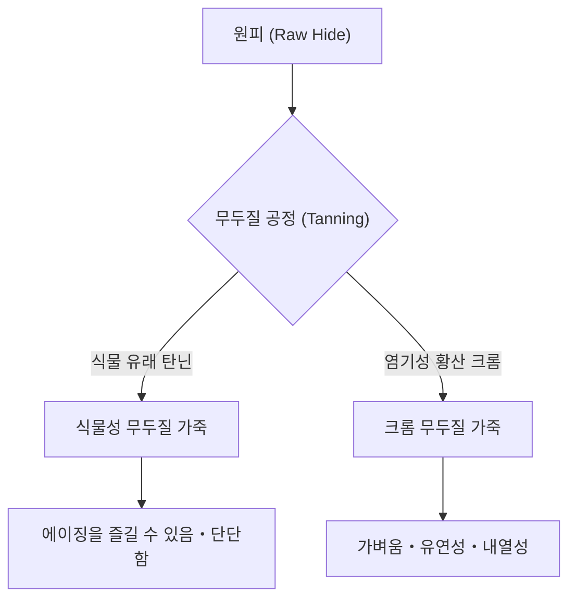

## 1. 서론: 인류 역사와 가죽의 관계

가죽(레더)은 인류가 획득한 가장 오래된 소재 중 하나입니다. 구석기 시대부터 방한복이나 도구로 유용하게 쓰였으며, 문명의 발전과 함께 그 가공 기술도 고도화되었습니다. 단순한 동물의 가죽(Skin/Hide)이 썩지 않고 유연성을 가진 '가죽(Leather)'으로 변하는 과정은 화학과 물리학이 교차하는 예술이라고도 할 수 있습니다. 본 기사에서는 가죽의 종류, 무두질의 과학, 그리고 에이징의 메커니즘에 대해 깊이 파헤쳐 봅니다.

## 2. 무두질(Tanning)의 과학: 원피에서 가죽으로의 변환

'원피(皮)'를 '가죽(革)'으로 만드는 공정을 '무두질(Tanning)'이라고 부릅니다. 가죽의 주성분인 콜라겐 섬유의 구조를 안정화시켜 내열성, 방부성, 유연성을 부여하는 화학 반응입니다.

### 2.1 식물성 무두질 (Vegetable Tanning)

식물 유래 폴리페놀 화합물(탄닌)을 사용하는 전통적인 제법입니다. 탄닌 분자가 콜라겐의 펩타이드 결합 및 수소 결합과 반응하여 견고한 네트워크를 구축합니다.
- **특징**: 환경 부하가 비교적 낮고, 경년 변화(에이징)가 뚜렷함.
- **물리적 특성**: 섬유가 단단하게 조여져 있어 신축성이 낮고 성형성이 뛰어남.

### 2.2 크롬 무두질 (Chrome Tanning)

염기성 황산 크롬 등의 금속 착체를 사용하는 현대적인 제법입니다. 크롬 이온이 콜라겐의 카르복실기와 배위 결합(가교 결합)을 형성합니다.
- **특징**: 무두질 시간이 짧아 대량 생산에 적합함.
- **물리적 특성**: 내열성이 높고(비등수 수축 온도가 높음), 유연하며 가벼움.

## 3. 가죽의 종류와 특징

동물의 종류에 따라 콜라겐 섬유의 밀도와 모공 구조가 다르며, 각각 독자적인 특성을 갖습니다.

### 3.1 소가죽 (Bovine Leather)

가장 일반적으로 유통되며 용도가 넓은 가죽입니다. 월령이나 성별에 따라 분류됩니다.
- **카프 (Calfskin)**: 생후 6개월 이내의 송아지. 섬유가 극히 미세하여 최고급으로 꼽힘.
- **킵 (Kipskin)**: 생후 6개월에서 2년 정도의 중소. 카프보다 두께가 있어 튼튼함.
- **스티어하이드 (Steerhide)**: 생후 3~6개월에 거세되어 2년 이상 자란 수소. 두께가 균일하여 범용성이 높음.

### 3.2 돼지가죽 (Porcine Leather/Pigskin)

일본 국내에서 자급 가능한 몇 안 되는 가죽 소재입니다.
- **특징**: 모공이 표피에서 이면까지 관통하고 있어 통기성이 매우 뛰어남.
- **용도**: 신발의 내피(라이닝)나 가벼운 가방, 의류. 마찰에 강하고 얇아도 강도를 유지함.

### 3.3 말가죽 (Equine Leather)

소가죽에 비해 섬유 밀도는 다소 낮은 경향이 있지만, 특정 부위는 매우 귀하게 여겨집니다.
- **코도반 (Cordovan)**: 말의 둔부(엉덩이) 가죽 내부에 있는 '코도반 층'이라 불리는 고밀도 콜라겐 섬유층을 깎아낸 것. '가죽의 다이아몬드'라 불리며, 특유의 깊은 광택과 높은 경도(소가죽의 수배 강도)를 가짐.

### 3.4 특수 가죽 (Exotic Leather)

파충류나 조류 등의 특수한 피혁입니다.
- **크로커다일 (Crocodile)**: 독특한 비늘 무늬(반점)가 아름다워 부의 상징으로 여겨짐. 내구성이 매우 뛰어남.
- **오스트리치 (Ostrich)**: 타조 가죽. 깃털을 뽑은 자국(크윌 마크)이 특징적이며, 유연성과 강인함을 겸비함.

## 4. 에이징(경년 변화)의 메커니즘

가죽 제품의 가장 큰 매력은 사용할수록 색이나 질감이 변하는 '에이징'에 있습니다. 이는 주로 다음과 같은 화학적・물리적 요인에 의한 것입니다.

1. **광화학 반응(자외선)**: 태양광의 자외선에 의해 가죽에 포함된 탄닌이 산화・중합되어 색소(주로 퀴논류)가 생성됨으로써 색이 짙어집니다.
2. **유지의 이행과 산화**: 손의 피지나 케어용 오일이 가죽 내부로 침투하여 섬유 간의 마찰을 줄임과 동시에 표면에서 산화되어 독특한 광택(파티나)을 만들어냅니다.
3. **물리적 마찰과 평활화**: 일상적인 마찰에 의해 가죽 표면의 미세한 요철이 짓눌려 평활해지고, 빛의 반사율이 향상됨으로써 '윤기'가 납니다.

## 5. 경제적 배경과 지속 가능성

현대 가죽 산업은 식육 산업의 부산물(By-product)을 유용하게 활용하는 궁극적인 재활용 산업이기도 합니다. 최근에는 제조 공정에서의 수질 오염 저감(LWG 인증 등)이나 식물 유래 비건 가죽의 개발 등 환경 부하를 고려한 변화가 진행되고 있습니다.

가죽 제품은 적절한 관리를 하면 수십 년 단위로 사용할 수 있는 '지속 가능한 소재'의 대표격입니다. 그 배경에 있는 과학과 역사를 이해함으로써 일상 생활에서 가죽 제품과 함께하는 방법이 더욱 풍요로워질 것입니다.
