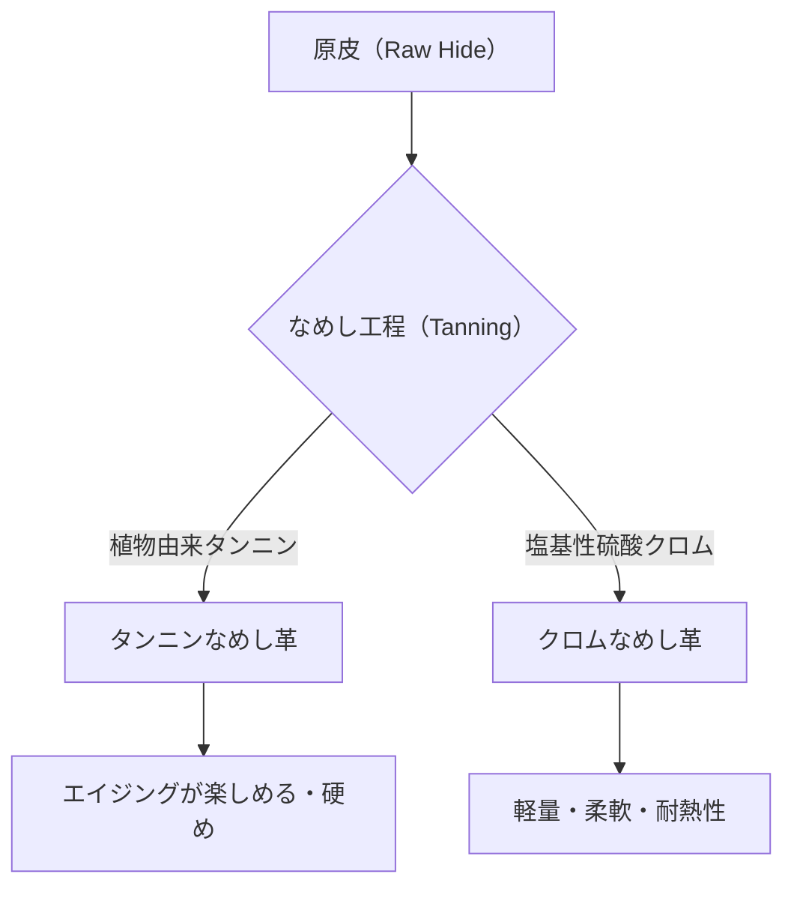

## 1. はじめに：人類史と皮革の関係

革（レザー）は、人類が獲得した最古の素材の一つです。旧石器時代から防寒着や道具として重宝され、文明の発展とともにその加工技術は高度化してきました。単なる動物の皮（Skin/Hide）が、腐敗せず柔軟性を持つ「革（Leather）」へと変わるプロセスは、化学と物理学が交差する芸術とも言えます。本記事では、革の種類、なめしの科学、そしてエイジングのメカニズムについて深く掘り下げます。

## 2. なめし（鞣し）の科学：皮から革への変換

「皮」を「革」にする工程を「なめし（Tanning）」と呼びます。皮の主成分であるコラーゲン繊維の構造を安定化させ、耐熱性、防腐性、柔軟性を付与する化学反応です。

### 2.1 タンニンなめし（Vegetable Tanning）

植物由来のポリフェノール化合物（タンニン）を使用する伝統的な製法です。タンニン分子がコラーゲンのペプチド結合と水素結合を形成し、強固なネットワークを構築します。
- **特徴**: 環境負荷が比較的低く、経年変化（エイジング）が顕著。
- **物理的特性**: 繊維が締まっており、伸縮性が低く、成形性に優れる。

### 2.2 クロムなめし（Chrome Tanning）

塩基性硫酸クロムなどの金属錯体を使用する近代的な製法です。クロムイオンがコラーゲンのカルボキシル基と配位結合（架橋結合）を形成します。
- **特徴**: なめし時間が短く、大量生産に適している。
- **物理的特性**: 耐熱性が高く（沸水収縮温度が高い）、柔軟で軽量。

## 3. 革の種類と特徴

動物の種別によって、コラーゲン繊維の密度や毛穴の構造が異なり、それぞれ独自の特性を持ちます。

### 3.1 牛革（Bovine Leather）

最も一般的に流通しており、用途が広い革です。月齢や性別によって分類されます。
- **カーフ（Calfskin）**: 生後6ヶ月以内の仔牛。繊維が極めて細かく、最高級とされる。
- **キップ（Kipskin）**: 生後6ヶ月から2年程度の中牛。カーフより厚みがあり丈夫。
- **ステアハイド（Steerhide）**: 生後3〜6ヶ月に去勢され、2年以上経過した雄牛。厚みが均一で汎用性が高い。

### 3.2 豚革（Porcine Leather/Pigskin）

日本国内で自給可能な数少ない革素材です。
- **特徴**: 毛穴が表皮から裏面まで貫通しているため、通気性が非常に高い。
- **用途**: 靴の内装（ライニング）や軽量なバッグ、衣服。摩擦に強く、薄くても強度を保ちます。

### 3.3 馬革（Equine Leather）

牛革に比べると繊維密度はやや低い傾向がありますが、特定の部位は非常に重宝されます。
- **コードバン（Cordovan）**: 馬の臀部（お尻）の皮の内部にある「コードバン層」と呼ばれる高密度のコラーゲン繊維層を削り出したもの。「革のダイヤモンド」と称され、独特の深い光沢と高い硬度（牛革の数倍の強度）を持ちます。

### 3.4 エキゾチックレザー（Exotic Leather）

爬虫類や鳥類などの特殊な皮革です。
- **クロコダイル（Crocodile）**: 独特の鱗模様（斑）が美しく、ステータスシンボルとされる。非常に耐久性が高い。
- **オーストリッチ（Ostrich）**: ダチョウの革。羽を抜いた跡（クイルマーク）が特徴的で、柔軟性と強靭さを兼ね備える。

## 4. エイジング（経年変化）のメカニズム

革製品の最大の魅力は、使い込むことで色や質感が変化する「エイジング」にあります。これは主に以下の化学的・物理的要因によるものです。

1. **光化学反応（紫外線）**: 太陽光の紫外線により、革に含まれるタンニンが酸化・重合し、色素（主にキノン類）が生成されることで色が濃縮されます。
2. **油脂の移行と酸化**: 手の皮脂やケア用のオイルが革の内部に浸透し、繊維間の摩擦を減らすとともに、表面で酸化して独特の艶（パティーナ）を生み出します。
3. **物理的摩擦と平滑化**: 日常的な摩擦により、革表面の微細な凹凸が押し潰されて平滑になり、光の反射率が向上することで「テリ」が出ます。

## 5. 経済的背景とサステナビリティ

現代の皮革産業は、食肉産業の副産物（By-product）を有効活用する究極のリサイクル産業でもあります。近年では、製造プロセスにおける水質汚染の低減（LWG認証など）や、植物由来のヴィーガンレザーの開発など、環境負荷を意識した変革が進んでいます。

革製品は、適切なメンテナンスを行えば数十年単位で使用できる「持続可能な素材」の代表格です。その背景にある科学と歴史を理解することで、日々の生活における革製品との付き合い方はより豊かなものになるでしょう。
